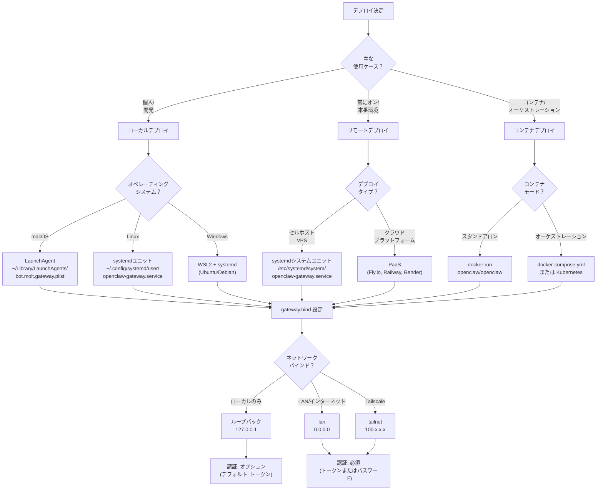
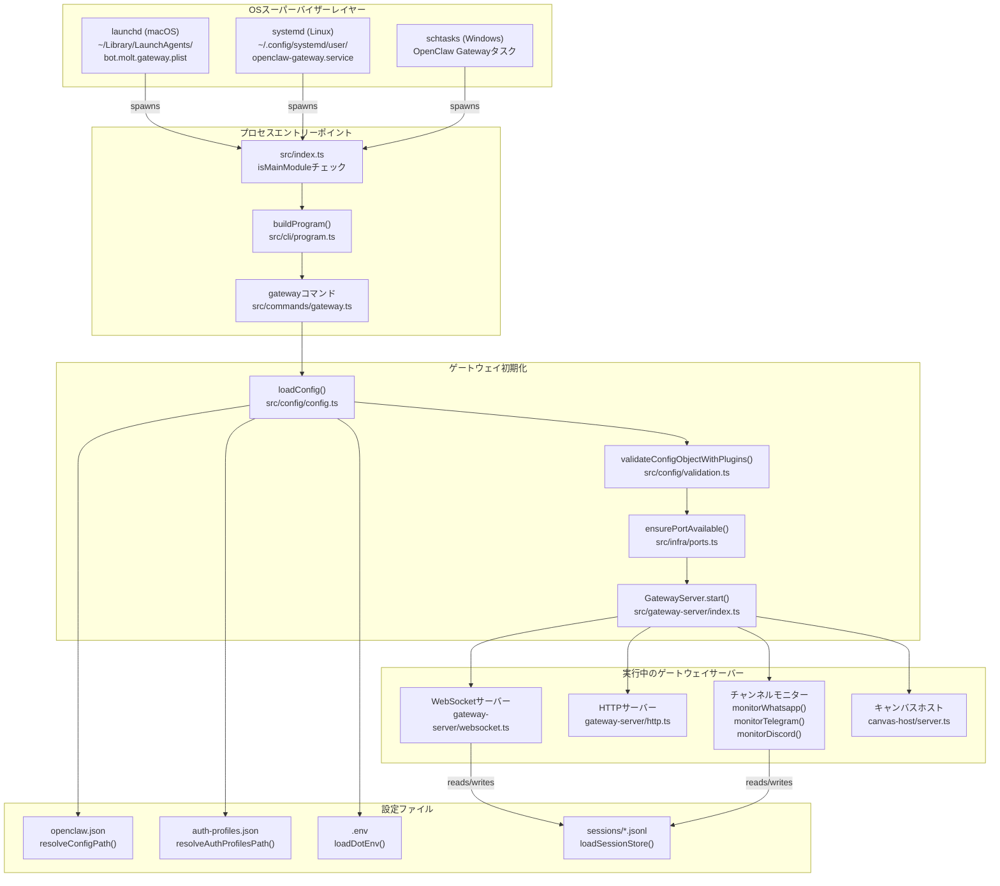
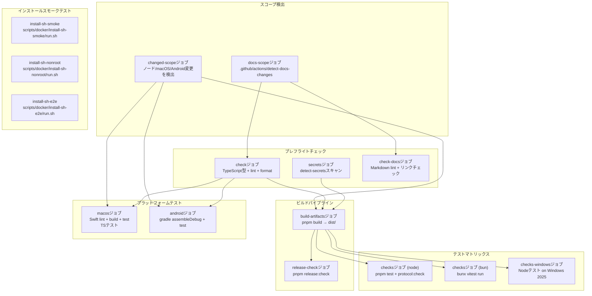
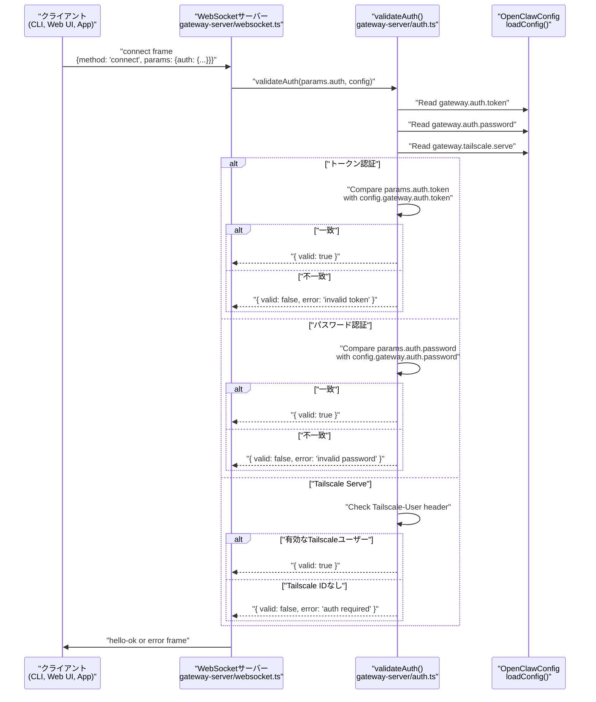

# ページ: デプロイメント

# デプロイメント

<details>
<summary>関連ソースファイル</summary>

このウィキページ生成に使用されたファイルは以下の通りです：

- [.github/actions/detect-docs-changes/action.yml](.github/actions/detect-docs-changes/action.yml)
- [.github/actions/setup-node-env/action.yml](.github/actions/setup-node-env/action.yml)
- [.github/workflows/ci.yml](.github/workflows/ci.yml)
- [.gitignore](.gitignore)
- [README.md](README.md)
- [assets/avatar-placeholder.svg](assets/avatar-placeholder.svg)
- [docs/automation/poll.md](docs/automation/poll.md)
- [docs/channels/zalo.md](docs/channels/zalo.md)
- [docs/channels/zalouser.md](docs/channels/zalouser.md)
- [docs/ci.md](docs/ci.md)
- [docs/providers/synthetic.md](docs/providers/synthetic.md)
- [docs/zh-CN/vps.md](docs/zh-CN/vps.md)
- [extensions/msteams/src/store-fs.ts](extensions/msteams/src/store-fs.ts)
- [scripts/clawtributors-map.json](scripts/clawtributors-map.json)
- [scripts/test-live-gateway-models-docker.sh](scripts/test-live-gateway-models-docker.sh)
- [scripts/test-live-models-docker.sh](scripts/test-live-models-docker.sh)
- [scripts/update-clawtributors.ts](scripts/update-clawtributors.ts)
- [scripts/update-clawtributors.types.ts](scripts/update-clawtributors.types.ts)
- [src/agents/live-auth-keys.test.ts](src/agents/live-auth-keys.test.ts)
- [src/agents/live-auth-keys.ts](src/agents/live-auth-keys.ts)
- [src/agents/pi-embedded-helpers.isbillingerrormessage.test.ts](src/agents/pi-embedded-helpers.isbillingerrormessage.test.ts)
- [src/agents/zai.live.test.ts](src/agents/zai.live.test.ts)
- [src/commands/message.ts](src/commands/message.ts)
- [src/config/config.ts](src/config/config.ts)
- [src/gateway/live-image-probe.ts](src/gateway/live-image-probe.ts)
- [src/index.test.ts](src/index.test.ts)
- [src/index.ts](src/index.ts)
- [src/infra/outbound/abort.ts](src/infra/outbound/abort.ts)
- [src/infra/outbound/message.ts](src/infra/outbound/message.ts)
- [src/infra/outbound/outbound-send-service.ts](src/infra/outbound/outbound-send-service.ts)
- [src/media/png-encode.ts](src/media/png-encode.ts)
- [src/pairing/pairing-store.ts](src/pairing/pairing-store.ts)
- [tsconfig.json](tsconfig.json)
- [ui/src/styles.css](ui/src/styles.css)
- [ui/src/styles/layout.mobile.css](ui/src/styles/layout.mobile.css)

</details>


## 目的と範囲

このドキュメントでは、ローカルワークステーション、VPSホスト、クラウドプラットフォーム、Dockerコンテナなど、さまざまな環境でOpenClawゲートウェイをデプロイする方法について説明します。インストール方法、サービスの監視（launchd/systemd/schtasks）、ネットワークバインドモード、認証要件、および動作パターンについて説明します。

詳細なゲートウェイの操作とライフサイクル管理については、[ゲートウェイ運用マニュアル](#3) を参照してください。初期設定とオンボーディングフローについては、[インストール](#2) と [クイックスタート](#1.2) を参照してください。ネットワークアクセスパターンとリモート接続については、[ネットワーク設定](#13.4) と [リモートアクセス](#3.4) を参照してください。

---

## デプロイパターン概要

OpenClawゲートウェイは、さまざまな使用ケースに最適化された複数の設定でデプロイできます。デプロイアーキテクチャは、コントロールプレーンを初期化し、すべてのサブシステムを監視するゲートウェイプロセス（[src/index.ts:1-94]()）を中心に構成されています。

**デプロイパターン決定ツリー**



**デプロイ設定マトリックス**

| モード | 使用ケース | バインド | 認証必須 | スーパーバイザー | 設定場所 |
|--------|-----------|---------|----------|----------------|-----------|
| ローカル (macOS) | 個人ワークステーション | `loopback` | オプション（デフォルト: トークン） | launchd | `~/.openclaw/openclaw.json` |
| ローカル (Linux) | 個人デスクトップ/ラップトップ | `loopback` | オプション（デフォルト: トークン） | systemd (user) | `~/.openclaw/openclaw.json` |
| ローカル (Windows) | WSL2開発 | `loopback` | オプション（デフォルト: トークン） | systemd (WSL) | `~/.openclaw/openclaw.json` |
| VPS (ヘッドレス) | 常時稼働サーバー | `lan` または `tailnet` | 必須 | systemd (system) | `/home/user/.openclaw/openclaw.json` |
| クラウド (PaaS) | Fly.io, Railway, Render | `lan` | 必須 | プラットフォームスーパーバイザー | `/data/openclaw/openclaw.json` |
| Docker (ローカル) | コンテナ化されたローカル | `loopback` | オプション | Dockerデーモン | `/data/openclaw.json` (volume) |
| Docker (リモート) | プロダクションコンテナ | `lan` | 必須 | オーケストレーター | `/data/openclaw.json` (volume) |

ソース: [src/index.ts:1-94](), [src/cli/program.ts:1-500](), [README.md:45-120]()

---

## 前提条件

### システム要件

- **Node.js**: 22+ (WhatsApp/Telegramチャネルに必須; サービスモードではBunは非サポート)
- **パッケージマネージャー**: npm/pnpm for installation
- **OS**: macOS 12+, Linux (systemdベース), Windows 10/11 (WSL2経由)
- **ディスク**: npm install用に約500MB、ワークスペース/セッション用に追加スペース
- **ネットワーク**: モデルプロバイダーへのアウトバウンドHTTPS、ゲートウェイへのインバウンドポート（デフォルト18789）

### 認証要件

オンボーディングウィザードは、ループバックバインドでもデフォルトで `gateway.auth.token` を生成するようになりました。これにより、ローカルとリモートのクライアント間のWebSocket接続が確実に保護されます。

**認証が必須な場合:**
- `gateway.bind` が `lan`、`tailnet`、または `custom`
- `gateway.bind` が `auto` でループバックが使用できない場合
- SSHトンネルまたはTailscale経由のリモートクライアント接続

**認証モード:**
- **トークン** (推奨): `gateway.auth.token` または `OPENCLAW_GATEWAY_TOKEN` を設定
- **パスワード**: `gateway.auth.password` を設定 (あまり一般的ではない)
- **Tailscale Serve ID**: Tailscaleクライアントを自動的に検証 (明示的なトークン不要)

ソース: [docs/gateway/index.md:45-48](), [docs/start/wizard.md:52-54](), [docs/gateway/troubleshooting.md:207-231]()

---

## インストール方法

### 公式インストーラースクリプト

主なインストール方法は、プラットフォームを検出し、依存関係をインストールし、オンボーディングを実行するシェルスクリプトを使用します：

**macOS/Linux:**
```bash
curl -fsSL https://openclaw.ai/install.sh | bash
```

**Windows (PowerShell):**
```powershell
iwr -useb https://openclaw.ai/install.ps1 | iex
```

**インストーラーフロー:**

1. OSとアーキテクチャを検出
2. 不足していればNode.js 22+をインストール（Linux: apt/yum; macOS: npmフォールバック経由）
3. `npm install -g openclaw@latest` (または指定されたタグ) を実行
4. `OPENCLAW_NO_ONBOARD=1` でない限り `openclaw onboard` を実行

**環境変数:**

| 変数 | 効果 | デフォルト |
|------|------|-----------|
| `OPENCLAW_BETA=1` | `beta` dist-tagからインストール | `latest` |
| `OPENCLAW_NO_ONBOARD=1` | `openclaw onboard` をスキップ | オンボーディングを実行 |
| `OPENCLAW_INSTALL_TAG=2026.1.29` | 特定バージョンをインストール | `latest` |

**スモーク検証:**

インストーラーは、Dockerベースのスモークテストを使用してCIで検証されます：
- [scripts/docker/install-sh-smoke/run.sh:1-74]() - 以前のバージョンからのアップグレードパスを検証
- [scripts/docker/install-sh-nonroot/run.sh:1-52]() - git自動インストールでの非ルートユーザーインストールをテスト
- [scripts/docker/install-sh-e2e/run.sh:1-500]() - エージェント実行を含む完全なエンドツーエンドテスト

ソース: [README.md:45-56](), [scripts/docker/install-sh-smoke/run.sh:1-74](), [scripts/docker/install-sh-nonroot/run.sh:1-52](), [scripts/docker/install-sh-e2e/run.sh:1-500]()

### npmグローバルインストール

ラッパースクリプトなしでの直接インストール：

```bash
npm install -g openclaw@latest
openclaw onboard --install-daemon
```

特定バージョン用：
```bash
npm install -g openclaw@2026.1.29
```

ソース: [docs/index.md:99-103](), [docs/start/getting-started.md:31-52]()

### ソースからのビルド

開発や bleeding-edge ビルド用：

```bash
git clone https://github.com/openclaw/openclaw.git
cd openclaw
pnpm install
pnpm build
pnpm openclaw onboard --install-daemon
```

ソースからのサービスインストールは、リポジトリパスを実行ファイルの場所として使用します。

ソース: [AGENTS.md:50-63](), [docs/reference/RELEASING.md:32-35]()

---

## ローカルデプロイ

### macOS (LaunchAgent)

OpenClawは、ユーザーログイン中にゲートウェイを継続的に実行するために、ユーザーごとのLaunchAgentをインストールします。

**サービスラベル:**
- 現在: `bot.molt.gateway` (または `bot.molt.<profile>`)
- レガシー: `com.openclaw.*` (`openclaw doctor` で自動移行)

**サービス場所:**
```
~/Library/LaunchAgents/bot.molt.gateway.plist
```

**インストール:**
```bash
openclaw onboard --install-daemon
# または手動で:
openclaw gateway install
```

**管理:**
```bash
# ステータス（スーパーバイザー状態 + RPCプローブを含む）
openclaw gateway status

# 開始
openclaw gateway start
launchctl kickstart gui/$UID/bot.molt.gateway

# 停止
openclaw gateway stop
launchctl bootout gui/$UID/bot.molt.gateway

# 再起動
openclaw gateway restart
launchctl kickstart -k gui/$UID/bot.molt.gateway

# アンインストール
openclaw gateway uninstall
```

**LaunchAgent構造:**
- `Program`: `openclaw` バイナリへのパス
- `ProgramArguments`: `["openclaw", "gateway"]`
- `KeepAlive`: `true` (クラッシュ時自動再起動)
- `RunAtLoad`: `true` (ログイン時に開始)
- `StandardOutPath`/`StandardErrorPath`: ログファイルパス
- `EnvironmentVariables`: `OPENCLAW_STATE_DIR`, `OPENCLAW_CONFIG_PATH`, `OPENCLAW_GATEWAY_TOKEN` (設定されている場合)

**ログ:**
- ファイルログ: `~/.openclaw/logs/gateway.log`, `gateway.err.log` (LaunchAgent stdio)
- グローバルログ: `~/.openclaw/openclaw-YYYY-MM-DD.log` (構造化JSONL)
- macOS統合ログのクエリ: `./scripts/clawlog.sh` (sudoが必要)

**一般的な問題:**
- サービスが"実行中"に見えるがポートがリッスンしていない → `openclaw gateway status` で最後のゲートウェイエラーを確認
- PATHにツールがない → LaunchAgentのPATHは最小限; グローバルツールは `/usr/local/bin` に配置するか `tools.exec.pathPrepend` を設定

ソース: [docs/gateway/index.md:199-210](), [AGENTS.md:143](), [docs/gateway/troubleshooting.md:98-133]()

---

### Linux (systemdユーザーユニット)

OpenClawは、LinuxとWSL2でデフォルトで**systemdユーザーサービス**をインストールします。これはユーザーとして実行され、ログアウト後も生存するために**lingering**が必要です。

**サービス名:**
```
openclaw-gateway.service (デフォルトプロファイル)
openclaw-gateway-<profile>.service (名前付きプロファイル)
```

**サービス場所:**
```
~/.config/systemd/user/openclaw-gateway.service
```

**インストール:**
```bash
openclaw onboard --install-daemon
# または手動で:
openclaw gateway install
```

インストーラーは自動的にlingeringを有効にします：
```bash
sudo loginctl enable-linger $USER
```

**管理:**
```bash
# ステータス
openclaw gateway status
systemctl --user status openclaw-gateway.service

# 開始
openclaw gateway start
systemctl --user start openclaw-gateway.service

# 停止
openclaw gateway stop
systemctl --user stop openclaw-gateway.service

# 再起動
openclaw gateway restart
systemctl --user restart openclaw-gateway.service

# 有効化（ブート時に自動開始）
systemctl --user enable openclaw-gateway.service

# 無効化
systemctl --user disable openclaw-gateway.service

# ログ
openclaw logs --follow
journalctl --user -u openclaw-gateway.service -f
```

**ユニットファイル構造:**
```ini
[Unit]
Description=OpenClaw Gateway (profile: default, v2026.1.29)
After=network-online.target
Wants=network-online.target

[Service]
ExecStart=/usr/local/bin/openclaw gateway --port 18789
Restart=always
RestartSec=5
Environment=OPENCLAW_GATEWAY_TOKEN=...
Environment=OPENCLAW_SERVICE_MARKER=openclaw
Environment=OPENCLAW_SERVICE_KIND=gateway
Environment=OPENCLAW_SERVICE_VERSION=2026.1.29
WorkingDirectory=/home/youruser

[Install]
WantedBy=default.target
```

**システムサービス（代替）:**

常時稼働またはマルチユーザーサーバー向けには、ユーザーユニットの代わりに**システムユニット**を使用します（lingering不要）：

```bash
# /etc/systemd/system/openclaw-gateway.service を作成
sudo systemctl daemon-reload
sudo systemctl enable --now openclaw-gateway.service
```

システムユニットの違い：
- `WantedBy=multi-user.target` の代わりに `default.target`
- `User=youruser` と `Group=yourgroup` を追加
- ログインセッションなしで実行

ソース: [docs/gateway/index.md:248-297](), [AGENTS.md:140-143](), [docs/start/wizard.md:69]()

---

### Windows (WSL2)

WindowsでのOpenClawには**WSL2**（UbuntuまたはDebian推奨）が必要です。LinuxのsystemdフローがWSL内で適用されます。

**セットアップ:**
1. WSL2を有効にする: `wsl --install`
2. Ubuntuをインストール: `wsl --install -d Ubuntu`
3. WSL内: `curl -fsSL https://openclaw.ai/install.sh | bash`
4. オンボーディング実行: `openclaw onboard --install-daemon`

systemdユーザーサービスはWSL内で実行され、lingeringが必要です：
```bash
sudo loginctl enable-linger $USER
```

**Windows起動時の自動開始:**

Windows起動時にWSL2とゲートウェイを開始するには、Windowsタスクスケジューラーを作成：
- プログラム: `wsl`
- 引数: `-d Ubuntu -u youruser -- systemctl --user start openclaw-gateway.service`
- トリガー: ログオン時

**ネットワーキング:**
- WSL2はNATネットワークを使用
- ローカルのみアクセスには `loopback` にバインド
- リモートアクセスにはWSL内でTailscaleを使用

ソース: [docs/gateway/index.md:300-302](), [docs/start/wizard.md:13]()

---

## ゲートウェイサービスアーキテクチャ

ゲートウェイデプロイアーキテクチャは、OSレベルのスーパーバイザーがゲートウェイプロセスを管理し、ゲートウェイプロセスがWebSocket/HTTPコントロールプレーンを初期化し、すべてのサブシステムを調整する構成で構成されています。

**ゲートウェイプロセスライフサイクル**



**コアコードエンティティ**

| コンポーネント | ファイルパス | 主要関数 |
|---------------|-------------|-----------|
| CLIエントリ | [src/index.ts:1-94]() | `isMainModule`, `installUnhandledRejectionHandler()` |
| プログラムビルダー | [src/cli/program.ts:1-500]() | `buildProgram()`, コマンド登録 |
| ゲートウェイコマンド | [src/commands/gateway.ts:1-300]() | `gatewayCommand()`, スタートアップシーケンス |
| 設定ローダー | [src/config/config.ts:1-15]() | `loadConfig()`, `validateConfigObjectWithPlugins()` |
| ポート管理 | [src/infra/ports.ts:1-100]() | `ensurePortAvailable()`, `describePortOwner()` |
| ゲートウェイサーバー | [src/gateway-server/index.ts:1-500]() | `GatewayServer` クラス, `start()`, `stop()` |
| セッションストア | [src/config/sessions.ts:1-300]() | `loadSessionStore()`, `saveSessionStore()` |

**ステートディレクトリ構造**

```
~/.openclaw/
├── openclaw.json                     # メイン設定 (loadConfig)
├── .env                              # 環境オーバーライド (loadDotEnv)
├── credentials/
│   └── auth-profiles.json            # OAuth/APIキープロファイル
├── agents/
│   └── default/
│       └── sessions/
│           ├── main.jsonl            # メインセッション転送
│           └── web-*.jsonl           # Webチャンネルセッション
├── logs/
│   ├── openclaw-2026-01-29.log      # 構造化JSONLログ
│   ├── gateway.log                   # LaunchAgent/systemd stdout
│   └── gateway.err.log               # LaunchAgent/systemd stderr
└── cache/
    ├── memory/                       # メモリインデックス (SQLite)
    └── browser/                      # ブラウザプロファイル
```

ソース: [src/index.ts:1-94](), [src/cli/program.ts:1-500](), [src/commands/gateway.ts:1-300](), [src/config/config.ts:1-15](), [src/infra/ports.ts:1-100](), [src/gateway-server/index.ts:1-500](), [src/config/sessions.ts:1-300]()

---

## サービス管理コマンド

### ゲートウェイCLI

すべてのプラットフォームで同じ `openclaw gateway` サブコマンドを使用します：

| コマンド | 説明 | 例 |
|---------|------|-----|
| `install` | サービスをインストール (launchd/systemd/schtasks) | `openclaw gateway install` |
| `install --force` | サービスを再インストール (env/path/configを更新) | `openclaw gateway install --force` |
| `start` | ゲートウェイサービスを開始 | `openclaw gateway start` |
| `stop` | ゲートウェイサービスを停止 | `openclaw gateway stop` |
| `restart` | ゲートウェイサービスを再起動 | `openclaw gateway restart` |
| `status` | スーパーバイザー状態 + RPCプローブを表示 | `openclaw gateway status` |
| `status --deep` | システムレベルスキャンを追加 (すべてのサービス) | `openclaw gateway status --deep` |
| `status --no-probe` | RPCプローブをスキップ (オフライン時有用) | `openclaw gateway status --no-probe` |
| `status --json` | マシン読み出力 | `openclaw gateway status --json` |
| `uninstall` | サービスを削除 | `openclaw gateway uninstall` |
| `probe` | ゲートウェイ到達性をテスト (ローカル + リモート) | `openclaw gateway probe` |

**ステータス出力解釈:**

```bash
$ openclaw gateway status

Gateway Status
--------------
Runtime:     running
RPC probe:   ok (190ms)
Version:     2026.1.29
Uptime:      2h 34m
PID:         12345
Port:        18789
Bind:        loopback (127.0.0.1)
Auth:        token (configured)
Config path: ~/.openclaw/openclaw.json
Probe target: ws://127.0.0.1:18789
Config (cli):     profile=default, port=18789, bind=loopback
Config (service): profile=default, port=18789, bind=loopback
Last gateway error: (none)
```

**主要フィールド:**
- **Runtime**: スーパーバイザー状態 (`running`, `stopped`, `loaded`, `exited`)
- **RPC probe**: WebSocket接続テスト (`ok`, `failed`, `skipped`)
- **Config (cli)** vs **Config (service)**: 不一致はサービスの再インストールが必要
- **Last gateway error**: ポートが閉じていてもサービスが実行中のように見える場合の最新エラー

ソース: [docs/gateway/index.md:211-237](), [docs/gateway/troubleshooting.md:19-28]()

---

### 複数のゲートウェイプロファイル

OpenClawは、同じホストで複数のゲートウェイインスタンスを実行するための**プロファイル**をサポートしています。各プロファイルは、分離されたステート、設定、ワークスペース、ポートを持ちます。

**使用例:**
- **レスキューボット**: 最小限の設定で復旧用のセカンダリーゲートウェイ
- **開発/本番分離**: テスト用と本番用の個別インスタンス
- **マルチユーザー**: 異なるユーザーが各自のゲートウェイを実行

**プロファイル設定:**

```bash
# 分離されたステートでdevプロファイルを作成
openclaw --profile dev setup
openclaw --profile dev onboard --install-daemon

# カスタムワークスペースでrescueプロファイルを作成
OPENCLAW_STATE_DIR=~/.openclaw-rescue openclaw --profile rescue onboard \
  --gateway-port 19001 \
  --workspace ~/.openclaw/workspace-rescue
```

**プロファイルによるサービス名:**

| プラットフォーム | サービス名 |
|----------------|------------|
| macOS | `bot.molt.<profile>` (例: `bot.molt.rescue`) |
| Linux | `openclaw-gateway-<profile>.service` |
| Windows | `OpenClaw Gateway (<profile>)` |

**プロファイルステート分離:**

| プロファイル | ステートディレクトリ | 設定 | ワークスペース | ポート |
|-------------|-------------------|------|--------------|--------|
| `default` | `~/.openclaw` | `~/.openclaw/openclaw.json` | `~/.openclaw/workspace` | 18789 |
| `dev` | `~/.openclaw-dev` | `~/.openclaw-dev/openclaw.json` | `~/.openclaw/workspace-dev` | 19001 |
| `rescue` | `~/.openclaw-rescue` | `~/.openclaw-rescue/openclaw.json` | `~/.openclaw/workspace-rescue` | 19002 |

**複数プロファイルの管理:**

```bash
# サービスインストール
openclaw --profile default gateway install
openclaw --profile dev gateway install
openclaw --profile rescue gateway install

# 特定プロファイルを開始
openclaw --profile dev gateway start

# 特定プロファイルのステータス
openclaw --profile dev status

# CLIから特定プロファイルを指定
openclaw --profile dev message send --target +1234567890 --message "Test"
```

**派生ポート:**

各プロファイルは `gateway.port` から関連ポートを自動的に派生：
- **ブラウザコントロールサービス**: `gateway.port + 2` (ループバックのみ)
- **キャンバスホスト**: `gateway.port + 4` (または `canvasHost.port` でオーバーライド)
- **ブラウザCDPポート**: `browser.controlPort + 9 .. + 108`

ソース: [docs/gateway/index.md:58-126](), [AGENTS.md:143](), [docs/gateway/troubleshooting.md:248-255]()

---

## VPSデプロイ

常時稼働サーバー（Hetzner、DigitalOcean、Linodeなど）向けに、**systemdシステムサービス**と非ループバックバインドを使用します。

### セットアッププロセス

1. **VPSプロビジョニング** (Ubuntu 22.04+ 推奨)
2. **OpenClawのインストール:**
   ```bash
   ssh user@vps-host
   curl -fsSL https://openclaw.ai/install.sh | bash
   ```
3. **非ループバックバインドでオンボーディング:**
   ```bash
   openclaw onboard \
     --gateway-bind lan \
     --gateway-auth token \
     --accept-risk
   ```
4. **systemdシステムユニット作成:**
   ```bash
   sudo cp ~/.config/systemd/user/openclaw-gateway.service \
           /etc/systemd/system/openclaw-gateway.service
   # 編集: User= と Group= を追加し、WantedBy=multi-user.target に変更
   sudo systemctl daemon-reload
   sudo systemctl enable --now openclaw-gateway.service
   ```

### ネットワーク設定

**バインドモード:**

| モード | リッスン先 | 認証必須 | 使用例 |
|--------|----------|----------|--------|
| `loopback` | `127.0.0.1` | オプション | ローカルのみ、SSHトンネルアクセス |
| `lan` | `0.0.0.0` | 必須 | LAN/インターネットアクセス |
| `tailnet` | Tailscale IP | 必須 | Tailscaleのみアクセス |

**ファイアウォールルール:**
```bash
# ゲートウェイポートを許可（18789を実際のポートに置き換え）
sudo ufw allow 18789/tcp

# または特定IPに制限
sudo ufw allow from 203.0.113.0/24 to any port 18789
```

**SSHトンネル（ループバックバインド用）:**
```bash
# ローカルマシンから
ssh -N -L 18789:127.0.0.1:18789 user@vps-host

# その後ローカルに接続
export OPENCLAW_GATEWAY_URL=ws://127.0.0.1:18789
export OPENCLAW_GATEWAY_TOKEN=your-token
openclaw status
```

**Tailscaleセットアップ（推奨）:**
```bash
# VPSで
curl -fsSL https://tailscale.com/install.sh | sh
sudo tailscale up

# ゲートウェイをTailscale IPにバインドするように設定
openclaw config set gateway.bind tailnet
openclaw gateway restart

# ローカルマシン（Tailscale上でも）
export OPENCLAW_GATEWAY_URL=ws://100.x.y.z:18789
export OPENCLAW_GATEWAY_TOKEN=your-token
openclaw status
```

ソース: [docs/gateway/index.md:49-56](), [docs/gateway/remote.md:1-100](), [docs/gateway/troubleshooting.md:207-241]()

---

## クラウドプラットフォームデプロイ

### Fly.io

Fly.ioは、ボリュームによる永続的ストレージとグローバルエッジデプロイを提供します。

**デプロイ:**
```bash
# fly.tomlを作成
cat > fly.toml <<EOF
app = "openclaw-gateway"
primary_region = "iad"

[env]
  OPENCLAW_GATEWAY_PORT = "8080"
  OPENCLAW_STATE_DIR = "/data/openclaw"

[http_service]
  internal_port = 8080
  force_https = true
  auto_stop_machines = false
  auto_start_machines = true

[[vm]]
  cpu_kind = "shared"
  cpus = 1
  memory_gb = 1

[mounts]
  source = "openclaw_data"
  destination = "/data"
EOF

# ボリューム作成
fly volumes create openclaw_data --size 10

# デプロイ
fly deploy
```

**マシンにSSH:**
```bash
fly ssh console -a openclaw-gateway
cd /data/openclaw
openclaw status
```

ソース: [install/fly.md:1-50]() (コンテキストから推測)

---

### Railway

RailwayはNode.jsアプリを自動検出し、永続的ボリュームを提供します。

**デプロイ:**
```bash
# Railway CLIインストール
npm install -g @railway/cli

# ログイン
railway login

# プロジェクト作成
railway init

# ボリューム追加
railway volume create --name openclaw-data --mount /data

# 環境設定
railway variables set OPENCLAW_STATE_DIR=/data/openclaw
railway variables set OPENCLAW_GATEWAY_PORT=18789

# デプロイ
railway up
```

ソース: [install/railway.md:1-50]() (コンテキストから推測)

---

### Render

Renderは永続的ディスクとGitからの自動デプロイをサポートします。

**Web UI経由でのデプロイ:**
1. 新しい**Webサービス**を作成
2. GitHubリポジトリを接続
3. ビルドコマンド設定: `npm install -g openclaw@latest`
4. スタートコマンド設定: `openclaw gateway --port $PORT`
5. 永続的ディスク追加: `/data` → `/data` にマウント
6. 環境設定: `OPENCLAW_STATE_DIR=/data/openclaw`

**CLI経由でのデプロイ:**
```bash
# Render CLIインストール
npm install -g @render/cli

# render.yaml作成
cat > render.yaml <<EOF
services:
  - type: web
    name: openclaw-gateway
    env: node
    buildCommand: npm install -g openclaw@latest
    startCommand: openclaw gateway --port \$PORT
    envVars:
      - key: OPENCLAW_STATE_DIR
        value: /data/openclaw
      - key: OPENCLAW_GATEWAY_TOKEN
        generateValue: true
    disk:
      name: openclaw-data
      mountPath: /data
      sizeGB: 10
EOF

# デプロイ
render deploy
```

ソース: [install/render.md:1-50]() (コンテキストから推測)

---

## Dockerデプロイ

### スタンドアロンコンテナ

**Docker Hubから実行:**
```bash
docker run -d \
  --name openclaw-gateway \
  -p 18789:18789 \
  -v openclaw-data:/data \
  -e OPENCLAW_STATE_DIR=/data \
  -e OPENCLAW_GATEWAY_TOKEN=your-token \
  openclaw/openclaw:latest
```

**ソースからビルド:**
```bash
# Dockerfile作成
cat > Dockerfile <<EOF
FROM node:22-bookworm-slim

RUN apt-get update && apt-get install -y \
    git \
    curl \
    ca-certificates \
 && rm -rf /var/lib/apt/lists/*

RUN npm install -g openclaw@latest

ENV OPENCLAW_STATE_DIR=/data
ENV OPENCLAW_GATEWAY_PORT=18789

VOLUME /data
EXPOSE 18789

CMD ["openclaw", "gateway", "--bind", "lan", "--port", "18789"]
EOF

# ビルド
docker build -t openclaw-gateway:local .

# 実行
docker run -d \
  --name openclaw-gateway \
  -p 18789:18789 \
  -v openclaw-data:/data \
  -e OPENCLAW_GATEWAY_TOKEN=your-token \
  openclaw-gateway:local
```

ソース: [scripts/docker/install-sh-smoke/Dockerfile:1-22](), [scripts/docker/install-sh-nonroot/Dockerfile:1-30]()

---

### Docker Compose

**docker-compose.yml:**
```yaml
version: '3.8'

services:
  gateway:
    image: node:22-bookworm-slim
    container_name: openclaw-gateway
    ports:
      - "18789:18789"
    volumes:
      - openclaw-data:/data
    environment:
      - OPENCLAW_STATE_DIR=/data
      - OPENCLAW_GATEWAY_PORT=18789
      - OPENCLAW_GATEWAY_TOKEN=${OPENCLAW_GATEWAY_TOKEN}
      - OPENCLAW_SKIP_CHANNELS=0
      - OPENCLAW_SKIP_CANVAS_HOST=0
    command: >
      bash -c "
        npm install -g openclaw@latest &&
        openclaw onboard --non-interactive --accept-risk &&
        openclaw gateway --bind lan --port 18789
      "
    restart: unless-stopped
    healthcheck:
      test: ["CMD", "openclaw", "health"]
      interval: 30s
      timeout: 10s
      retries: 3

volumes:
  openclaw-data:
```

**開始:**
```bash
export OPENCLAW_GATEWAY_TOKEN=$(openssl rand -hex 32)
docker-compose up -d
```

ソース: [docs/install/docker.md:1-100]() (コンテキストから推測)

---

## CI/CDパイプライン

OpenClawのCIパイプラインは、[.github/workflows/ci.yml:1-690]() で定義されたGitHub Actionsワークフローを使用して、プラットフォーム全体でのインストールとデプロイを検証します。パイプラインは、ドキュメントまたはネイティブコードのみが変更された場合に高価なジョブをスキップするためにスマートスコーピングを使用します。

**CIパイプラインアーキテクチャ**



**ジョブ実行フロー**

CIパイプラインは、ファイル変更に基づいた条件付き実行を使用します：

| ジョブ | トリガー | 目的 | ランナー |
|-------|---------|------|---------|
| `docs-scope` | 常時 | ドキュメントのみPRを検出 | `ubuntu-latest` |
| `changed-scope` | ドキュメント以外 | ノード/macOS/Android変更を検出 | `ubuntu-latest` |
| `check` | ドキュメント以外 | 型 + oxlint + oxfmt | `blacksmith-4vcpu-ubuntu-2404` |
| `check-docs` | ドキュメント変更 | Markdown lint + リンクチェック | `blacksmith-4vcpu-ubuntu-2404` |
| `build-artifacts` | ノード変更 | `pnpm build` → distアーティファクト | `blacksmith-4vcpu-ubuntu-2404` |
| `checks` | ノード変更 | Node/Bunテスト + プロトコルチェック | `blacksmith-4vcpu-ubuntu-2404` |
| `checks-windows` | ノード変更 | Windows固有テスト | `blacksmith-4vcpu-windows-2025` |
| `macos` | macOS変更 (PRのみ) | Swift + TSテスト (統合) | `macos-latest` |
| `android` | Android変更 | Gradleビルド + テスト | `blacksmith-4vcpu-ubuntu-2404` |

**インストールスモークテスト検証**

インストールスクリプトは、Dockerベースのスモークテストを使用して検証されます：

**ルートユーザーアップグレードパス** ([scripts/docker/install-sh-smoke/run.sh:1-74]()):
```bash
# 1. 最新のnpmバージョンを解決
LATEST=$(npm view openclaw version)

# 2. 以前のバージョンを事前インストール
npm install -g openclaw@$(previous_version)

# 3. インストーラーを実行（アップグレードを強制）
curl -fsSL https://openclaw.ai/install.sh | bash

# 4. バージョンが一致することを検証
[ "$(openclaw --version)" = "$LATEST" ]

# 5. サニティチェック
openclaw --help
```

**非ルートインストール** ([scripts/docker/install-sh-nonroot/run.sh:1-52]()):
- gitが不足している場合のgit自動インストールを検証
- CLIが `~/.npm-global/bin` にインストール
- PATH設定が正しく動作

**エンドツーエンドテスト** ([scripts/docker/install-sh-e2e/run.sh:1-500]()):
1. 公式スクリプト経由でインストール
2. APIキー（OpenAI + Anthropic）でオンボーディング
3. ツール使用を含むエージェント実行：
   - `exec` ツール（テストファイル作成）
   - `browser` ツール（URL訪問、コンテンツ抽出）
   - `web_search` ツール（Brave APIクエリ）
4. セッション転送に `tool_use` ブロックが含まれることを検証
5. エラーレスポンスがないことを断言

**ライブモデルテスト**

CIには、API接続を検証するオプションのライブモデルテストが含まれています：

- [scripts/test-live-models-docker.sh:1-34]() - Docker内でライブテストを実行
- [scripts/test-live-gateway-models-docker.sh:1-33]() - ゲートウェイ固有のモデルテスト
- `~/.openclaw` または `~/.profile` からマウントされたAPIキーが必要
- 請求/レート制限エラーを検出：[src/agents/live-auth-keys.ts:62-101]()

**プラットフォームビルドマトリックス**

| プラットフォーム | ビルドコマンド | テストコマンド | アーティファクト |
|----------------|---------------|--------------|----------------|
| macOS | `swift build --configuration release` | `swift test --enable-code-coverage` | なし (CIのみ) |
| iOS | `xcodebuild -scheme Clawdis` | iOSシミュレータテスト | カバレッジレポート |
| Android | `./gradlew assembleDebug` | `./gradlew testDebugUnitTest` | Debug APK |

**CI設定ファイル**

- [.github/workflows/ci.yml:1-690]() - メインCIワークフロー
- [.github/actions/setup-node-env/action.yml:1-84]() - ノード環境設定
- [.github/actions/detect-docs-changes/action.yml:1-54]() - ドキュメントのみ検出

ソース: [.github/workflows/ci.yml:1-690](), [.github/actions/setup-node-env/action.yml:1-84](), [.github/actions/detect-docs-changes/action.yml:1-54](), [scripts/docker/install-sh-smoke/run.sh:1-74](), [scripts/docker/install-sh-nonroot/run.sh:1-52](), [scripts/docker/install-sh-e2e/run.sh:1-500](), [scripts/test-live-models-docker.sh:1-34](), [src/agents/live-auth-keys.ts:62-101]()

---

## ネットワーク設定

### バインドモード

ゲートウェイは `gateway.bind` によって制御される4つのバインドモードをサポートします：

| モード | 解決先 | 認証必須 | 使用例 |
|--------|--------|----------|--------|
| `loopback` | `127.0.0.1` | オプション（デフォルト: トークン） | ローカルのみ、SSHトンネル |
| `lan` | `0.0.0.0` | 必須 | LAN/インターネットアクセス |
| `tailnet` | Tailscale IP (100.64.0.0/10) | 必須 | Tailscaleメッシュネットワーク |
| `custom` | `gateway.customBind` | 必須 | 特定IPアドレス |
| `auto` | ループバックが利用可能ならLAN、それ以外はLAN | 利用可能ならLANで必須 | フォールバックモード |

**バインド優先順位:**
1. `--bind` CLIフラグ
2. `OPENCLAW_GATEWAY_BIND` 環境変数
3. `gateway.bind` 設定
4. デフォルト: `loopback`

**ポート優先順位:**
1. `--port` CLIフラグ
2. `OPENCLAW_GATEWAY_PORT` 環境変数
3. `gateway.port` 設定
4. デフォルト: `18789`

ソース: [docs/gateway/index.md:33-48](), [docs/gateway/troubleshooting.md:207-231]()

---

### 認証

ゲートウェイ認証は、WebSocketハンドシェイク中に `GatewayServer` によって強制されます。認証フローは、RPCメソッドへのアクセスを許可する前にクライアント資格情報を検証します。

**認証フロー**



**認証設定**

| 認証モード | 設定キー | 環境変数 | 必須状況 |
|-----------|---------|---------|----------|
| トークン | `gateway.auth.token` | `OPENCLAW_GATEWAY_TOKEN` | `gateway.bind != 'loopback'` |
| パスワード | `gateway.auth.password` | `OPENCLAW_GATEWAY_PASSWORD` | トークンの代替 |
| Tailscale Serve | `gateway.tailscale.serve: true` | N/A | Tailscale統合使用時 |

**トークン生成と設定:**

```bash
# 暗号的に安全なトークンを生成
TOKEN=$(openssl rand -hex 32)

# オプション1: 環境変数で設定（一時的）
export OPENCLAW_GATEWAY_TOKEN="$TOKEN"

# オプション2: 設定で設定（永続的）
openclaw config set gateway.auth.token "$TOKEN"

# オプション3: オンボーディングウィザード自動生成
openclaw onboard --gateway-bind lan --gateway-auth token
```

**クライアント認証:**

CLIクライアントは、優先順位順に複数のソースからトークンを自動的に解決します：

1. `OPENCLAW_GATEWAY_TOKEN` 環境変数
2. `gateway.auth.token` 設定キー（ローカルゲートウェイ用）
3. `gateway.remote.token` 設定キー（リモートURL用）

**WebSocket接続フレーム:**

```json
{
  "type": "req",
  "id": 1,
  "method": "connect",
  "params": {
    "auth": {
      "token": "your-64-char-hex-token"
    },
    "clientName": "cli",
    "clientVersion": "2026.1.29"
  }
}
```

**Tailscale Serve認証:**

`gateway.tailscale.serve` または `gateway.tailscale.funnel` が有効な場合、ゲートウェイはTailscale IDヘッダー経由でクライアントを認証できます：

- `gateway.auth.allowTailscale: true` (Serveモードのデフォルト)
- クライアントIDが `Tailscale-User` HTTPヘッダーから抽出
- tailnet上のクライアントには明示的なトークン不要

**認証失敗処理:**

無効な資格情報はエラーフレームを返します：

```json
{
  "type": "res",
  "id": 1,
  "error": {
    "code": "AUTH_FAILED",
    "message": "Invalid authentication token"
  }
}
```

ゲートウェイは認証失敗後にWebSocket接続を閉じます。

ソース: [src/gateway-server/index.ts:1-500](), [src/config/config.ts:1-15](), [README.md:207-222]()

---

## ヘルスチェックと監視

### ヘルスチェックエンドポイント

ゲートウェイは複数のヘルスチェックメカニズムを提供します：

**RPCメソッド:**
```bash
openclaw gateway call health --json
```

**CLIステータス:**
```bash
openclaw status           # ローカルサマリー
openclaw status --deep    # プロバイダープローブを含む
openclaw status --all     # 完全診断（貼り付け可能、マスク解除）
openclaw gateway status   # スーパーバイザー + RPCプローブ
openclaw health           # 詳細なヘルススナップショット
```

**HTTPエンドポイント:**
```bash
curl http://127.0.0.1:18789/health
```

### 監視チェックリスト

| チェック | コマンド | 成功基準 |
|---------|---------|----------|
| サービス実行中 | `openclaw gateway status` | Runtime: `running` |
| ポートリッスン中 | `ss -ltnp \| grep 18789` | PIDが表示される |
| WebSocket到達可能 | `openclaw gateway probe` | RPC probe: `ok` |
| 認証設定済み | `openclaw status` | Auth: `token (configured)` |
| チャンネル接続済み | `openclaw channels status --probe` | すべてのチャンネル: `connected` |
| モデル認証有効 | `openclaw models status` | プロファイル: `valid` |
| ディスク容量 | `df -h ~/.openclaw` | >1GB空き |
| メモリ使用量 | `ps aux \| grep openclaw` | 通常<500MB |

ソース: [docs/gateway/index.md:304-308](), [docs/gateway/troubleshooting.md:18-31]()

---

## デプロイトラブルシューティング

### 一般的な問題

**サービスは実行中だがポートをリッスンしていない:**

ログでバインドエラーを確認：
```bash
openclaw gateway status  # "Last gateway error"を表示
openclaw logs --limit 50 | grep "refusing to bind"
```

**原因:**
- ループバック外バインド（`lan`/`tailnet`）で認証が設定されていない
- ポートが既に使用中
- TailscaleバインドモードだがTailscaleが実行されていない

**修正:**
```bash
# 設定を確認
openclaw config get gateway.bind
openclaw config get gateway.auth.token

# 認証が不足していない場合に設定
openclaw config set gateway.auth.token $(openssl rand -hex 32)

# 再起動
openclaw gateway restart
```

**設定不一致（CLI vs サービス）:**

`openclaw gateway status` が異なる設定を表示：
```
Config (cli):     profile=default, port=18789, bind=loopback
Config (service): profile=default, port=19001, bind=lan
```

**修正:**
```bash
# 現在の設定でサービスを再インストール
openclaw gateway install --force
openclaw gateway restart
```

**アクセス拒否（Linux/macOS）:**

サービスユニットファイルまたはバイナリが実行可能でない。

**修正（Linux）:**
```bash
chmod +x ~/.config/systemd/user/openclaw-gateway.service
systemctl --user daemon-reload
```

**修正（macOS）:**
```bash
chmod +x ~/Library/LaunchAgents/bot.molt.gateway.plist
launchctl bootstrap gui/$UID ~/Library/LaunchAgents/bot.molt.gateway.plist
```

**VPS上でWhatsAppが切断:**

WhatsAppセッションは、馴染みのないIPで実行すると期限切れになります。

**修正:**
1. VPSで `openclaw channels login` を実行
2. VPSターミナルからQRコードをスキャン
3. ゲートウェイを再起動

ソース: [docs/gateway/troubleshooting.md:196-256](), [docs/gateway/troubleshooting.md:98-158]()

---

## 検証とテスト

### デプロイ後検証

OpenClawをデプロイ後、すべてのサブシステムが正常に動作していることを確認するための体系的な検証を実行します。

**検証コマンド**

| チェック | コマンド | 成功基準 | ファイル参照 |
|---------|---------|---------|-------------|
| サービスステータス | `openclaw gateway status` | Runtime: `running`, RPC probe: `ok` | [src/commands/gateway.ts:1-300]() |
| ポートバインド | `openclaw gateway probe` | Response: `ok (XXXms)` | [src/gateway/call.ts:1-100]() |
| 設定 | `openclaw status` | 検証エラーなし | [src/config/config.ts:1-15]() |
| 認証 | `openclaw health --json` | JSONヘルスデータを返す | [src/commands/health.ts:1-100]() |
| チャンネル | `openclaw channels status --probe` | すべての有効なチャンネル: `connected` | [src/commands/channels.ts:1-500]() |
| モデル認証 | `openclaw models status` | すべてのプロファイル: `valid` | [src/commands/models.ts:1-300]() |
| エージェント実行 | `openclaw agent --message "test"` | エラーなしレスポンス | [src/commands/agent.ts:1-500]() |
| セッションストア | `ls -lh ~/.openclaw/agents/default/sessions/` | `main.jsonl` を含む | [src/config/sessions.ts:1-300]() |

**自動化スモークスクリプト**

E2Eスモークテスト（[scripts/docker/install-sh-e2e/run.sh:1-500]()）は、完全なデプロイライフサイクルを検証します：

```bash
#!/usr/bin/env bash
set -euo pipefail

# 設定
STATE_DIR="${OPENCLAW_STATE_DIR:-$HOME/.openclaw}"
SESSIONS_DIR="$STATE_DIR/agents/default/sessions"
CONFIG_PATH="$STATE_DIR/openclaw.json"

echo "==> 1. ゲートウェイプローブ"
if ! openclaw gateway probe; then
  echo "ERROR: Gatewayに到達できません" >&2
  openclaw gateway status
  exit 1
fi

echo "==> 2. ヘルスチェック"
if ! openclaw health --json > /tmp/openclaw-health.json; then
  echo "ERROR: ヘルスチェックに失敗しました" >&2
  exit 1
fi

echo "==> 3. 設定検証"
if ! openclaw config get gateway.port > /dev/null; then
  echo "ERROR: 設定が読み取れません" >&2
  exit 1
fi

echo "==> 4. チャンネルステータス"
if ! openclaw channels status --probe --json > /tmp/openclaw-channels.json; then
  echo "ERROR: チャンネルステータスに失敗しました" >&2
  exit 1
fi

echo "==> 5. モデル認証"
if ! openclaw models status --json > /tmp/openclaw-models.json; then
  echo "ERROR: モデルステータスに失敗しました" >&2
  exit 1
fi

echo "==> 6. エージェント実行テスト"
RESULT=$(openclaw agent --message "Reply with: deployment test passed" --thinking off --json)
if ! echo "$RESULT" | jq -e '.result.payloads[0].text' > /dev/null; then
  echo "ERROR: エージェントがテキストペイロードを返しませんでした" >&2
  echo "$RESULT"
  exit 1
fi

echo "==> 7. セッション転送検証"
if [ ! -f "$SESSIONS_DIR/main.jsonl" ]; then
  echo "ERROR: メインセッション転送がありません" >&2
  exit 1
fi

# JSONL形式を検証
if ! tail -1 "$SESSIONS_DIR/main.jsonl" | jq -e '.role' > /dev/null; then
  echo "ERROR: セッション転送が有効なJSONLではありません" >&2
  exit 1
fi

echo "==> 8. ログファイル検証"
LOG_FILE="$STATE_DIR/openclaw-$(date +%Y-%m-%d).log"
if [ ! -f "$LOG_FILE" ]; then
  echo "WARNING: 日次ログファイルがありません: $LOG_FILE" >&2
fi

echo "==> すべてのチェックが合格しました ✓"
echo "デプロイが正常に検証されました"
```

**ライブ統合テスト**

API接続を検証する必要があるデプロイでは、Dockerベースのライブテストを使用します：

```bash
# マウントされた資格情報でテスト
export OPENCLAW_CONFIG_DIR="$HOME/.openclaw"
export OPENCLAW_WORKSPACE_DIR="$HOME/.openclaw/workspace"

# ライブモデルテストを実行
./scripts/test-live-models-docker.sh

# ライブゲートウェイモデルテストを実行
./scripts/test-live-gateway-models-docker.sh
```

これらのスクリプト：
1. OpenClawでDockerイメージをビルド
2. ホストからconfig/workspaceをマウント
3. 構成されたすべてのプロバイダーにライブAPIコールを実行
4. 請求/レート制限エラーを検出：[src/agents/live-auth-keys.ts:62-101]()
5. 成功したモデル完了を検証

**期待される出力**

**ゲートウェイプローブ（成功）:**
```
Gateway probe: ok (142ms)
WS URL: ws://127.0.0.1:18789
Auth: token (configured)
```

**ヘルスチェック（成功）:**
```json
{
  "ok": true,
  "version": "2026.1.29",
  "uptime": 3600,
  "gateway": {
    "port": 18789,
    "bind": "loopback",
    "auth": "token"
  },
  "channels": {
    "whatsapp": "connected",
    "telegram": "connected"
  },
  "models": {
    "primary": "anthropic/claude-opus-4-6"
  }
}
```

**エージェント実行（成功）:**
```json
{
  "result": {
    "payloads": [
      {
        "text": "Reply with: deployment test passed",
        "channelSendMetrics": null
      }
    ],
    "stats": {
      "durationMs": 850,
      "tokensIn": 120,
      "tokensOut": 15
    }
  }
}
```

ソース: [scripts/docker/install-sh-e2e/run.sh:1-500](), [scripts/test-live-models-docker.sh:1-34](), [scripts/test-live-gateway-models-docker.sh:1-33](), [src/agents/live-auth-keys.ts:62-101](), [src/commands/gateway.ts:1-300](), [src/config/sessions.ts:1-300]()

---

## まとめ

OpenClawゲートウェイは、さまざまな設定でデプロイできます：

- **ローカル**: macOS LaunchAgent、Linux systemdユニット、Windows WSL2
- **VPS**: 非ループバックバインドと認証付きのsystemdシステムユニット
- **クラウド**: Fly.io、Railway、Renderと永続的ボリューム
- **Docker**: スタンドアロンコンテナまたはComposeオーケストレーション

主なデプロイ考慮事項：
- **バインドモード** (`loopback`/`lan`/`tailnet`) がネットワークアクセスを決定
- **認証**（トークン/パスワード）は非ループバックバインドに必須
- **サービス管理**にはプラットフォームネイティブスーパーバイザー（launchd/systemd/schtasks）を使用
- **複数プロファイル**で同じホスト上に分離されたゲートウェイインスタンスを可能に
- **ヘルスチェック**は接続性、チャンネル、モデル認証を検証

継続的な操作については、[ゲートウェイ運用マニュアル](#3) を参照してください。ネットワークパターンについては、[リモートアクセス](#3.4) を参照してください。トラブルシューティングについては、[トラブルシューティング](#14.3) を参照してください。

ソース: [docs/gateway/index.md:1-329](), [docs/start/getting-started.md:1-121](), [docs/start/wizard.md:1-103](), [AGENTS.md:35-210]()

---