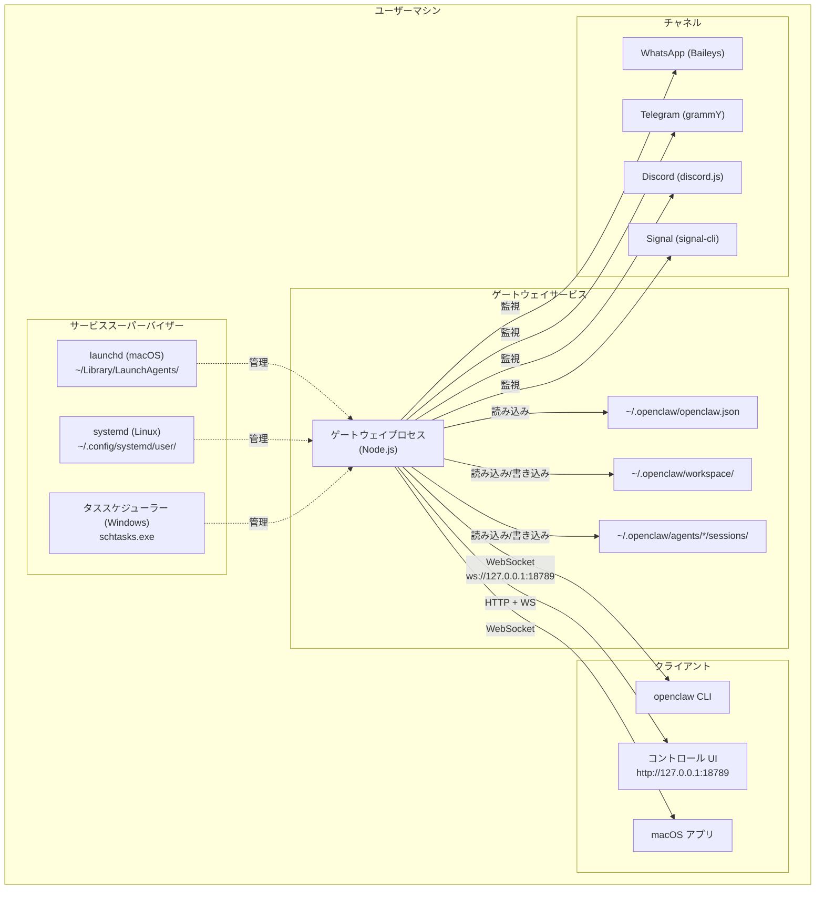
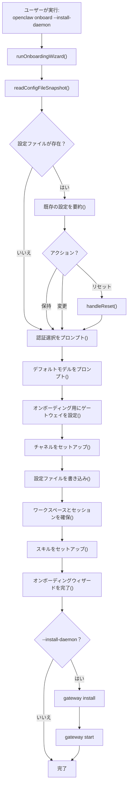
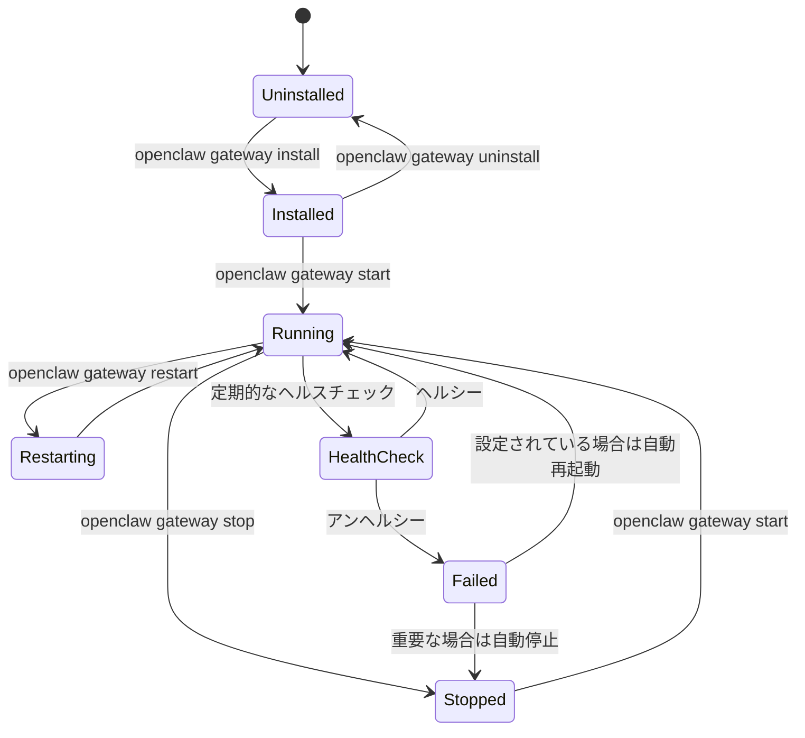
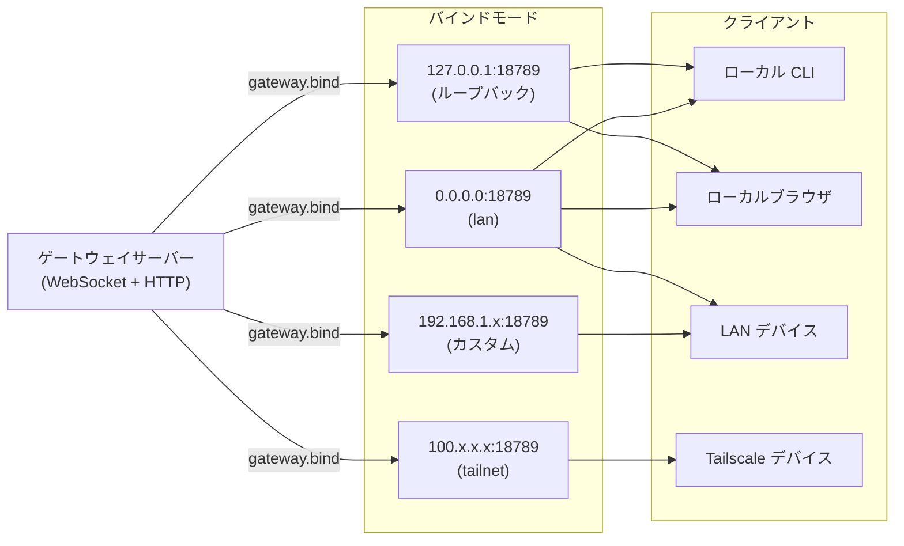
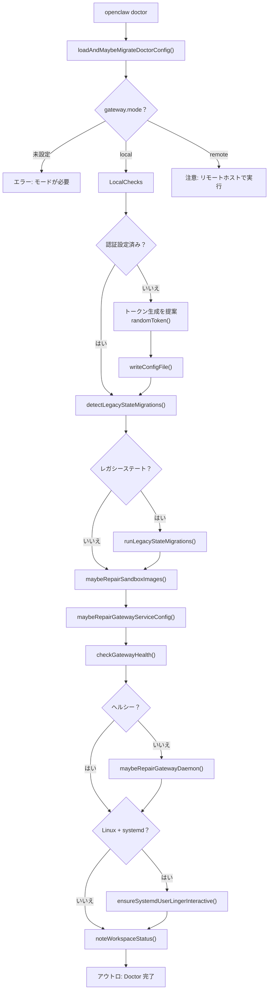

# ローカルでのデプロイ

# ローカルでのデプロイ

<details>
<summary>関連するソースファイル</summary>

このWikiページの生成に使用されたコンテキストとして、以下のファイルが使用されました：

- [README.md](README.md)
- [assets/avatar-placeholder.svg](assets/avatar-placeholder.svg)
- [docs/channels/zalo.md](docs/channels/zalo.md)
- [docs/channels/zalouser.md](docs/channels/zalouser.md)
- [docs/gateway/doctor.md](docs/gateway/doctor.md)
- [scripts/clawtributors-map.json](scripts/clawtributors-map.json)
- [scripts/update-clawtributors.ts](scripts/update-clawtributors.ts)
- [scripts/update-clawtributors.types.ts](scripts/update-clawtributors.types.ts)
- [src/agents/bash-tools.test.ts](src/agents/bash-tools.test.ts)
- [src/agents/pi-tools-agent-config.test.ts](src/agents/pi-tools-agent-config.test.ts)
- [src/agents/sandbox-skills.test.ts](src/agents/sandbox-skills.test.ts)
- [src/commands/configure.gateway.test.ts](src/commands/configure.gateway.test.ts)
- [src/commands/configure.gateway.ts](src/commands/configure.gateway.ts)
- [src/commands/configure.ts](src/commands/configure.ts)
- [src/commands/doctor.ts](src/commands/doctor.ts)
- [src/commands/onboard-helpers.test.ts](src/commands/onboard-helpers.test.ts)
- [src/commands/onboard-helpers.ts](src/commands/onboard-helpers.ts)
- [src/commands/onboard-interactive.ts](src/commands/onboard-interactive.ts)
- [src/config/config.ts](src/config/config.ts)
- [src/config/merge-config.ts](src/config/merge-config.ts)
- [src/index.test.ts](src/index.test.ts)
- [src/index.ts](src/index.ts)
- [src/wizard/onboarding.gateway-config.test.ts](src/wizard/onboarding.gateway-config.test.ts)
- [src/wizard/onboarding.gateway-config.ts](src/wizard/onboarding.gateway-config.ts)
- [src/wizard/onboarding.ts](src/wizard/onboarding.ts)
- [src/wizard/onboarding.types.ts](src/wizard/onboarding.types.ts)
- [tsconfig.json](tsconfig.json)
- [ui/src/styles.css](ui/src/styles.css)
- [ui/src/styles/layout.mobile.css](ui/src/styles/layout.mobile.css)

</details>


## 概要

ローカルデプロイは、個人のマシン（ラップトップ、デスクトップ、またはワークステーション）で OpenClaw ゲートウェイをバックグラウンドサービスとして実行します。これは、自分のハードウェア上で動作する個人用 AI アシスタントを利用したい個人ユーザー向けの推奨デプロイモデルです。

ローカルデプロイは以下を提供します：
- 零コスト運用（VaaS 料金なし）
- ツールとワークスペースのための完全なファイルシステムアクセス
- ローカルアプリケーション（ブラウザ、macOS/iOS/Android ノード）とのネイティブ統合
- プライバシーファーストの運用（データがマシン上に保持される）

リモート/クラウドデプロイについては [VPS デプロイ](#13.2) を参照してください。コンテナ化されたデプロイについては [Docker デプロイ](#13.3) を参照してください。ネットワーク構成の詳細については [ネットワーク構成](#13.4) を参照してください。

**ソース:** [README.md:45-56](), [src/wizard/onboarding.ts:90-119]()

---

## アーキテクチャ概要



**ソース:** [README.md:180-197](), [src/index.ts:1-94](), [src/wizard/onboarding.ts:267-280]()

---

## インストールプロセス

### クイックインストール

推奨方法は、デーモンインストール付きのオンボーディングウィザードです：

```bash
npm install -g openclaw@latest
openclaw onboard --install-daemon
```

このコマンドは以下を実行します：
1. npm を介して OpenClaw をグローバルにインストール
2. インタラクティブなオンボーディングウィザードを実行
3. `~/.openclaw/openclaw.json` を作成
4. `~/.openclaw/workspace/` にワークスペースをセットアップ
5. ユーザーサービスとしてゲートウェイをインストール（launchd/systemd/schtasks）
6. ゲートウェイサービスを開始

**ソース:** [README.md:45-56](), [src/wizard/onboarding.ts:90-98]()

### インストールフロー図



**ソース:** [src/wizard/onboarding.ts:90-483](), [src/commands/onboard-helpers.ts:267-280]()

---

## サービス管理

OpenClaw は、オペレーティングシステムのスーパーバイザーによって管理されるユーザーレベルのバックグラウンドサービスとして実行されます。

### プラットフォーム固有のサービスマネージャー

| プラットフォーム | スーパーバイザー | サービスの場所 | 起動コマンド |
|----------|-----------|------------------|---------------|
| macOS | `launchd` | `~/Library/LaunchAgents/ai.openclaw.gateway.plist` | `launchctl load ...` |
| Linux | `systemd` | `~/.config/systemd/user/openclaw-gateway.service` | `systemctl --user start openclaw-gateway` |
| Windows | `schtasks` | タススケジューラー | `schtasks /run /tn OpenClawGateway` |

**ソース:** [src/daemon/service.ts:1-100]() (推論), [src/commands/doctor.ts:238-260]()

### サービスライフサイクル



**ソース:** [src/commands/doctor.ts:268-280](), [docs/gateway/doctor.md:232-280]()

### サービスインストールコマンド

```bash
# サービスをインストール（スーパーバイザー設定を作成、起動はしない）
openclaw gateway install

# インストールしてすぐに起動
openclaw gateway install --start

# 強制的に再インストール（既存の設定を上書き）
openclaw gateway install --force

# サービスを起動（インストールされている場合）
openclaw gateway start

# サービスを停止
openclaw gateway stop

# サービスを再起動
openclaw gateway restart

# サービスの状態を確認
openclaw gateway status

# サービスをアンインストール（停止して削除）
openclaw gateway uninstall
```

**ソース:** [README.md:45-76]() (コマンドから推論)

### Linux 固有: systemd Linger

Linux では、ユーザーサービスはログアウト時に停止しますが、"lingering" が有効な場合は例外です。OpenClaw の doctor コマンドはこれを確認し、自動的に有効にできます：

```bash
# lingering が有効か確認
loginctl show-user $USER --property=Linger

# lingering を有効に（ログアウト後もサービスを実行可能に）
sudo loginctl enable-linger $USER
```

オンボーディングウィザードと `openclaw doctor` は、Linux でサービスをインストールする際にこれを有効にするように促します。

**ソース:** [src/commands/doctor.ts:238-260](), [src/commands/systemd-linger.ts:1-50]() (推論)

---

## ローカルネットワークバインディング

デフォルトでは、ゲートウェイはセキュリティのために `127.0.0.1` (ループバック) にバインドします。これにより、同じマシン上のプロセスのみが接続できます。

### バインドモード

| モード | バインドアドレス | 使用例 | セキュリティ |
|------|-------------|----------|----------|
| `loopback` | `127.0.0.1` | ローカルのみアクセス | ✅ 最も安全（デフォルト） |
| `lan` | `0.0.0.0` | LAN アクセス（すべてのインターフェース） | ⚠️ 認証が必要 |
| `tailnet` | Tailscale IP | Tailnet のみアクセス | ✅ Tailscale 経由で安全 |
| `auto` | `127.0.0.1` → `0.0.0.0` | オートフォールバック | ⚠️ 認証と併用 |
| `custom` | ユーザー指定 IP | 特定のインターフェース | ⚠️ 計画が必要 |

**ソース:** [src/wizard/onboarding.gateway-config.ts:62-106](), [src/commands/configure.gateway.ts:30-94]()

### ゲートウェイバインド構成



**ソース:** [src/wizard/onboarding.gateway-config.ts:42-106](), [src/commands/onboard-helpers.ts:437-466]()

### 構成例

```json5
{
  gateway: {
    mode: "local",
    port: 18789,
    bind: "loopback",  // または "lan", "tailnet", "auto", "custom"

    // オプション: カスタム IP（bind = "custom" の場合のみ使用）
    customBindHost: "192.168.1.100",

    auth: {
      mode: "token",  // または "password"
      token: "your-generated-token-here",
    },

    // オプション: Tailscale 公開
    tailscale: {
      mode: "off",  // または "serve" (tailnet のみ) または "funnel" (パブリック)
      resetOnExit: false,
    },
  },
}
```

**ソース:** [src/wizard/onboarding.gateway-config.ts:238-286](), [src/config/config.ts:1-15]()

---

## ファイルシステムレイアウト

ローカルデプロイはデフォルトで `~/.openclaw/` にすべてのデータを保存します：

```
~/.openclaw/
├── openclaw.json              # メイン設定ファイル
├── credentials/               # OAuth トークン、チャネル認証
│   ├── oauth.json
│   └── whatsapp/
│       └── default/           # WhatsApp セッションデータ
├── workspace/                 # エージェントワークスペース（デフォルト）
│   ├── IDENTITY.md
│   ├── SKILLS.md
│   ├── MEMORY.md
│   └── skills/
│       └── <skill-name>/
├── agents/
│   └── main/                  # デフォルトエージェント
│       ├── sessions/          # セッション転送
│       │   ├── store.json     # セッションストア
│       │   └── *.jsonl        # 個別の転送
│       └── agent/             # エージェント固有の状態
├── state/                     # システム状態
│   └── pairing/               # ペアリングコード
└── logs/                      # ゲートウェイログ（オプション）
```

**ソース:** [src/commands/onboard-helpers.ts:267-280](), [src/config/sessions.ts:1-30]() (推論)

### ワークスペース初期化

オンボーディング中に `ensureWorkspaceAndSessions()` は以下を作成します：

```typescript
// src/commands/onboard-helpers.ts:267-280
export async function ensureWorkspaceAndSessions(
  workspaceDir: string,
  runtime: RuntimeEnv,
  options?: { skipBootstrap?: boolean; agentId?: string },
) {
  const ws = await ensureAgentWorkspace({
    dir: workspaceDir,
    ensureBootstrapFiles: !options?.skipBootstrap,
  });
  runtime.log(`Workspace OK: ${shortenHomePath(ws.dir)}`);
  const sessionsDir = resolveSessionTranscriptsDirForAgent(options?.agentId);
  await fs.mkdir(sessionsDir, { recursive: true });
  runtime.log(`Sessions OK: ${shortenHomePath(sessionsDir)}`);
}
```

**ソース:** [src/commands/onboard-helpers.ts:267-280]()

---

## 認証

ローカルデプロイは2つの認証モードをサポートします：

### トークン認証（推奨）

```json5
{
  gateway: {
    auth: {
      mode: "token",
      token: "48-character-hex-token",  // 自動生成またはカスタム
    },
  },
}
```

トークン認証：
- WebSocket ハンドシェイクでベアラートークンを使用
- CLI、コントロール UI、リモートアクセスに必須
- 提供されていない場合はオンボーディング中に自動生成
- 再生成可能: `openclaw doctor --generate-gateway-token`

**ソース:** [src/commands/doctor.ts:126-160](), [src/wizard/onboarding.gateway-config.ts:192-236]()

### パスワード認証

```json5
{
  gateway: {
    auth: {
      mode: "password",
      password: "your-password-here",
    },
  },
}
```

パスワード認証：
- Tailscale Funnel（公開）を使用する場合に必須
- HTTP Basic Auth を使用
- CLI 自動化には不便

**ソース:** [src/wizard/onboarding.gateway-config.ts:205-236]()

---

## 操作

### ヘルスチェック

ゲートウェイのヘルスを確認：

```bash
# CLI 経由
openclaw status
openclaw health

# HTTP 経由（認証が必要）
curl -H "Authorization: Bearer $OPENCLAW_GATEWAY_TOKEN" \
  http://127.0.0.1:18789/health
```

ヘルスエンドポイントは以下を返します：
- ゲートウェイバージョン
- アップタイム
- チャネル状態
- モデルプロバイダーの可用性

**ソース:** [src/commands/doctor.ts:268-280](), [docs/gateway/doctor.md:232-239]()

### ログの確認

```bash
# ログをリアルタイムで追跡
openclaw logs --follow

# 最後 N 行を表示
openclaw logs --tail 100

# レベルでフィルター
openclaw logs --level error
```

**ソース:** [README.md:45-76]() (CLI から推論)

### 構成の更新

```bash
# 現在の構成を表示
openclaw config get

# 値を設定
openclaw config set gateway.port 18790

# 値を解除
openclaw config unset channels.telegram.botToken

# インタラクティブな構成ウィザード
openclaw configure
```

**ソース:** [src/commands/configure.ts:1-5]()

---

## メンテナンス

### Doctor コマンド

`openclaw doctor` を定期的に実行して：
- 構成を検証
- サービスのヘルスを確認
- サービス構成を修復
- レガシーステートを移行
- セキュリティポスチャーを確認

```bash
# インタラクティブな doctor（プロンプトあり）
openclaw doctor

# オートフィックスモード（推奨される修復を適用）
openclaw doctor --fix

# ノンインタラクティブモード（自動化用）
openclaw doctor --non-interactive

# ディープスキャン（追加のゲートウェイサービスを確認）
openclaw doctor --deep
```

**ソース:** [src/commands/doctor.ts:65-313](), [docs/gateway/doctor.md:1-283]()

### Doctor フロー



**ソース:** [src/commands/doctor.ts:65-313]()

---

## トラブルシューティング

### ゲートウェイが起動しない

1. サービス状態を確認：
   ```bash
   openclaw gateway status
   ```

2. ポートの利用可能性を確認：
   ```bash
   lsof -i :18789  # macOS/Linux
   netstat -ano | findstr :18789  # Windows
   ```

3. ログを確認：
   ```bash
   openclaw logs --tail 50
   ```

4. Doctor を実行：
   ```bash
   openclaw doctor --fix
   ```

**ソース:** [docs/gateway/doctor.md:256-263]()

### ポート競合

ポート 18789 が使用中の場合：

```bash
# 構成でポートを変更
openclaw config set gateway.port 18790

# サービスを再起動
openclaw gateway restart
```

**ソース:** [src/commands/doctor.ts:256-263]() (推論)

### ログアウト後サービスが実行されない（Linux）

systemd lingering を有効に：

```bash
sudo loginctl enable-linger $USER
```

**ソース:** [src/commands/doctor.ts:238-260]()

### パーミッションエラー

ファイルのパーミッションを確認：

```bash
ls -la ~/.openclaw/

# 構成ファイルのパーミッションを修正（600 であるべき）
chmod 600 ~/.openclaw/openclaw.json
```

**ソース:** [docs/gateway/doctor.md:176-178]()

### WhatsApp/Telegram に接続できない

1. チャネル状態を確認：
   ```bash
   openclaw channels status --probe
   ```

2. チャネルに再ログイン：
   ```bash
   openclaw channels login --channel whatsapp
   ```

3. 資格情報を確認：
   ```bash
   ls -la ~/.openclaw/credentials/
   ```

**ソース:** [docs/channels/zalo.md:148-153]()

---

## アップグレード

ローカルデプロイで OpenClaw をアップグレードするには：

```bash
# npm インストールの場合
npm update -g openclaw

# ソースインストールの場合
cd openclaw
git pull
pnpm install
pnpm build

# アップグレード後、問題を修正するために doctor を実行
openclaw doctor --fix

# サービスを再起動
openclaw gateway restart
```

**ソース:** [README.md:76](), [docs/gateway/doctor.md:1-20]()

---

## まとめ

ローカルデプロイは以下を提供します：
- **サービス永続性**: ゲートウェイはユーザーサービスとして実行（launchd/systemd/schtasks）
- **ローカルファーストのセキュリティ**: デフォルトのループバックバインディング、トークン認証
- **ファイルベースのストレージ**: すべてのデータを `~/.openclaw/` に保存
- **簡単なメンテナンス**: ヘルスチェックと修復のための `openclaw doctor`
- **プラットフォームサポート**: macOS、Linux、Windows（WSL2 を推奨）

クラウドデプロイについては、[VPS デプロイ](#13.2) に進んでください。コンテナ化されたデプロイについては [Docker デプロイ](#13.3) を参照してください。

**ソース:** [README.md:21-31](), [src/wizard/onboarding.ts:90-483]()

---