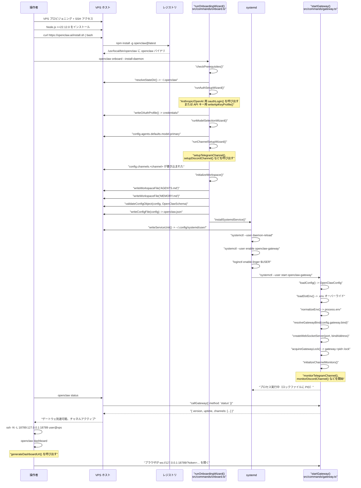
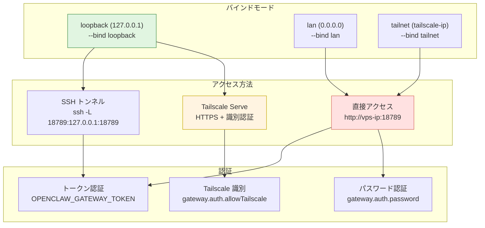
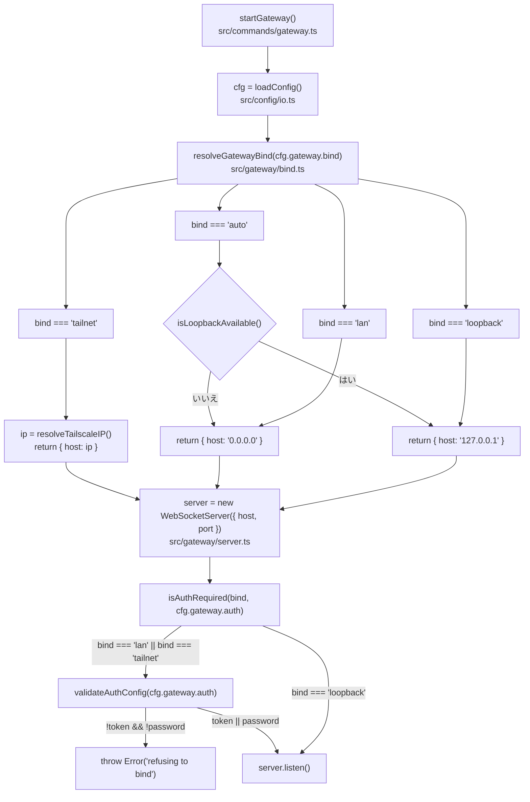
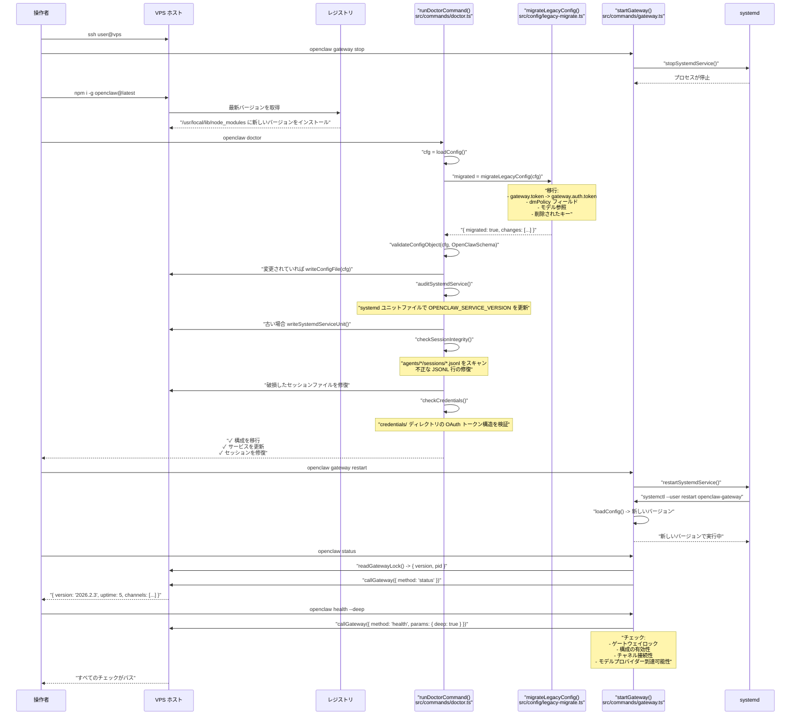

# VPS デプロイ

# VPS デプロイ

<details>
<summary>関連するソースファイル</summary>

このWikiページの生成に使用されたコンテキストとして、以下のファイルが使用されました：

- [.github/actions/detect-docs-changes/action.yml](.github/actions/detect-docs-changes/action.yml)
- [.github/actions/setup-node-env/action.yml](.github/actions/setup-node-env/action.yml)
- [.github/workflows/ci.yml](.github/workflows/ci.yml)
- [.gitignore](.gitignore)
- [README.md](README.md)
- [assets/avatar-placeholder.svg](assets/avatar-placeholder.svg)
- [docs/automation/poll.md](docs/automation/poll.md)
- [docs/channels/zalo.md](docs/channels/zalo.md)
- [docs/channels/zalouser.md](docs/channels/zalouser.md)
- [docs/ci.md](docs/ci.md)
- [docs/providers/synthetic.md](docs/providers/synthetic.md)
- [docs/zh-CN/vps.md](docs/zh-CN/vps.md)
- [extensions/msteams/src/store-fs.ts](extensions/msteams/src/store-fs.ts)
- [scripts/clawtributors-map.json](scripts/clawtributors-map.json)
- [scripts/test-live-gateway-models-docker.sh](scripts/test-live-gateway-models-docker.sh)
- [scripts/test-live-models-docker.sh](scripts/test-live-models-docker.sh)
- [scripts/update-clawtributors.ts](scripts/update-clawtributors.ts)
- [scripts/update-clawtributors.types.ts](scripts/update-clawtributors.ts)
- [src/agents/live-auth-keys.test.ts](src/agents/live-auth-keys.test.ts)
- [src/agents/live-auth-keys.ts](src/agents/live-auth-keys.ts)
- [src/agents/pi-embedded-helpers.isbillingerrormessage.test.ts](src/agents/pi-embedded-helpers.isbillingerrormessage.test.ts)
- [src/agents/zai.live.test.ts](src/agents/zai.live.test.ts)
- [src/commands/message.ts](src/commands/message.ts)
- [src/config/config.ts](src/config/config.ts)
- [src/gateway/live-image-probe.ts](src/gateway/live-image-probe.ts)
- [src/index.test.ts](src/index.test.ts)
- [src/index.ts](src/index.ts)
- [src/infra/outbound/abort.ts](src/infra/outbound/abort.ts)
- [src/infra/outbound/message.ts](src/infra/outbound/message.ts)
- [src/infra/outbound/outbound-send-service.ts](src/infra/outbound/outbound-send-service.ts)
- [src/media/png-encode.ts](src/media/png-encode.ts)
- [src/pairing/pairing-store.ts](src/pairing/pairing-store.ts)
- [tsconfig.json](tsconfig.json)
- [ui/src/styles.css](ui/src/styles.css)
- [ui/src/styles/layout.mobile.css](ui/src/styles/layout.mobile.css)

</details>


このページでは、DigitalOcean、Oracle Cloud、Hetzner、exe.dev などのプロバイダーの従来の仮想プライベートサーバー（VPS）での OpenClaw のデプロイ方法を扱います。これらのデプロイでは、OpenClaw が npm または git を使用して Linux VM に直接インストールされ、状態はホストファイルシステムで管理され、systemd がゲートウェイプロセスを監視します。

コンテナ化されたクラウドプラットフォーム（Fly.io、Railway、Northflank、GCP での Docker）については [クラウドデプロイ](#13.3) を参照してください。ローカルマシンで OpenClaw を実行する場合は [ローカルでのデプロイ](#13.1) を参照してください。

---

## VPS vs クラウドプラットフォーム

| 項目 | VPS（このページ） | クラウドプラットフォーム（#13.3） |
|--------|-----------------|-------------------------|
| **インストール** | npm/git インストール + systemd | Docker イメージ + オーケストレーション |
| **状態永続性** | ホストファイルシステム（`~/.openclaw/`） | 永続ボリューム + マウント |
| **プロセス監視** | systemd ユーザーサービス | プラットフォーム再起動ポリシー |
| **更新** | `npm i -g openclaw@latest` | `fly deploy` / イメージ再ビルド |
| **例** | DigitalOcean、Oracle Cloud、exe.dev | Fly.io、Railway、Northflank |

---

## プロバイダーの比較

| プロバイダー | 最安プラン | 仕様 | 月額 | 備考 |
|----------|---------------|-------|----------|-------|
| Oracle Cloud | Always Free ARM | 4 OCPU、24GB RAM | $0 | ARM のみ、サインアップが不安定な場合あり |
| Hetzner | CX22 | 2 vCPU、4GB RAM | ~$4 | EU/US リージョン、Docker ガイドあり |
| DigitalOcean | Basic | 1 vCPU、1GB RAM | $6 | UI が簡単、設定が予測可能 |
| Vultr | Cloud Compute | 1 vCPU、1GB RAM | $6 | 多数のグローバルロケーション |
| exe.dev | VM | 可変 | 可変 | HTTPS プロキシ含む、Web ベースのエージェント |

**ソース:** [docs/platforms/digitalocean.md:16-24](), [docs/platforms/oracle.md:20-28](), [docs/vps.md:13-22]()

---

## VPS デプロイアーキテクチャ

**図: VPS コンポーネントデプロイ**

```mermaid
graph TB
    subgraph Laptop["ローカルマシン"]
        Browser["ブラウザ"]
        CLIClient["openclaw CLI"]
        SSHTunnel["ssh -L 18789:127.0.0.1:18789"]
    end

    subgraph VPS["VPS ホスト"]
        SystemdUnit["~/.config/systemd/user/<br/>openclaw-gateway.service"]
        GatewayProc["startGateway()<br/>src/commands/gateway.ts"]

        subgraph ConfigLayer["構成"]
            ConfigFile["openclaw.json<br/>loadConfig() は<br/>OpenClawSchema で検証"]
            EnvFile[".env<br/>loadDotEnv()"]
            CredStore["credentials/<br/>readOAuthProfile()"]
        end

        subgraph StateLayer["ランタイム状態"]
            SessionStore["agents/main/sessions/<br/>loadSessionStore()"]
            ChannelState["channels/<br/>Baileys auth_info_multi.json"]
            LockFile["gateway.*.lock<br/>acquireGatewayLock()"]
        end

        subgraph WorkspaceLayer["エージェントワークスペース"]
            AgentsMD["workspace/AGENTS.md<br/>loadWorkspaceBootstrapFiles()"]
            MemoryMD["workspace/MEMORY.md<br/>MemoryIndexManager"]
            SkillsDir["workspace/skills/<br/>loadSkillsFromDir()"]
        end

        subgraph NetworkLayer["ネットワークバインディング"]
            BindResolver["resolveGatewayBind()<br/>src/gateway/bind.ts"]
            WSServer["WebSocket サーバー<br/>ポート 18789"]
            LoopbackMode["loopback: 127.0.0.1"]
            LANMode["lan: 0.0.0.0"]
            TailnetMode["tailnet: <ts-ip>"]
        end

        subgraph ChannelMonitors["チャネルモニター"]
            TelegramMon["monitorTelegramChannel()<br/>src/channel-telegram.ts"]
            DiscordMon["monitorDiscordChannel()<br/>src/channel-discord.ts"]
            WhatsAppMon["monitorWhatsAppChannel()<br/>src/channel-whatsapp.ts"]
        end

        SystemdUnit -->|"systemctl --user start"| GatewayProc
        GatewayProc -->|loadConfig| ConfigFile
        GatewayProc -->|loadDotEnv| EnvFile
        GatewayProc -->|readOAuthProfile| CredStore
        GatewayProc -->|loadSessionStore| SessionStore
        GatewayProc -->|channel state| ChannelState
        GatewayProc -->|acquireGatewayLock| LockFile
        GatewayProc -->|loadWorkspaceBootstrapFiles| AgentsMD
        GatewayProc -->|MemoryIndexManager.init| MemoryMD

        GatewayProc --> BindResolver
        BindResolver --> WSServer
        BindResolver --> LoopbackMode
        BindResolver --> LANMode
        BindResolver --> TailnetMode

        GatewayProc --> TelegramMon
        GatewayProc --> DiscordMon
        GatewayProc --> WhatsAppMon
    end

    SSHTunnel -.->|ポート転送| LoopbackMode
    Browser -->|"WebSocket 接続"| SSHTunnel
    CLIClient -->|"callGateway()"| SSHTunnel
```



**主要コードエントリーポイント：**

- **ゲートウェイ起動**: [src/commands/gateway.ts:1-200]() - `startGateway()` はすべてのサブシステムを初期化
- **構成読み込み**: [src/config/io.ts:1-100]() - `loadConfig()` は `OpenClawSchema` で検証
- **バインド解決**: [src/gateway/bind.ts:1-150]() - `resolveGatewayBind()` はバインドアドレスを決定
- **セッション永続性**: [src/config/sessions.ts:1-300]() - `loadSessionStore()` は JSONL 転送を管理
- **ワークスペースブートストラップ**: [src/agents/workspace.ts:1-400]() - `loadWorkspaceBootstrapFiles()` は AGENTS.md を読み込み
- **ゲートウェイロック**: [src/gateway/lock.ts:1-200]() - `acquireGatewayLock()` は複数インスタンスを防止
- **チャネルモニター**: [src/channel-telegram.ts:1-500](), [src/channel-discord.ts:1-500](), [src/channel-whatsapp.ts:1-500]()

**構成階層（解決順序）：**

1. 環境変数（`OPENCLAW_*`、`ANTHROPIC_API_KEY` など） - 最優先
2. `~/.openclaw/.env` ファイル - `loadDotEnv()` で読み込む [src/infra/dotenv.ts:1-50]()
3. `~/.openclaw/openclaw.json` - メイン構成、Zod スキーマで検証 [src/config/zod-schema.ts:1-1000]()
4. デフォルト値 - `OpenClawSchema` のデフォルトに埋め込まれる

**状態ディレクトリ構造**（`resolveStateDir()` で解決）：

| パス | 作成者 | 形式 | 永続化？ |
|------|------------|--------|-----------|
| `~/.openclaw/openclaw.json` | オンボーディングウィザード | JSON5 | はい |
| `~/.openclaw/.env` | ユーザー/ウィザード | dotenv | はい |
| `~/.openclaw/credentials/<provider>.<profile>.json` | OAuth フロー | JSON | はい |
| `~/.openclaw/agents/<agentId>/sessions/<key>.jsonl` | セッションランタイム | JSONL | はい |
| `~/.openclaw/channels/<channel>/` | チャネルモニター | 可変 | はい |
| `~/.openclaw/workspace/` | ワークスペースセットアップ | Markdown | はい |
| `~/.openclaw/gateway.<pid>.lock` | ゲートウェイ起動 | JSON | いいえ（一時的） |

**ソース:** [src/commands/gateway.ts:1-200](), [src/config/io.ts:1-100](), [src/gateway/bind.ts:1-150](), [src/config/sessions.ts:1-300](), [src/agents/workspace.ts:1-400]()

---

## インストールフロー

**図: VPS インストールシーケンス（コードレベル）**



**インストールコマンド**（VPS で実行）：

```bash
# Node.js 22 をインストール（Debian/Ubuntu）
curl -fsSL https://deb.nodesource.com/setup_22.x | bash -
sudo apt install -y nodejs

# Node バージョンを確認
node --version  # >=22.12.0 である必要がある

# OpenClaw をインストールスクリプトでインストール
curl -fsSL https://openclaw.ai/install.sh | bash

# 代替: npm で直接インストール
npm install -g openclaw@latest

# オンボーディングウィザード + デーモンをインストール
openclaw onboard --install-daemon

# lingering を有効に（ログアウト後もユーザーサービスを実行）
sudo loginctl enable-linger $USER

# ゲートウェイサービスを確認
systemctl --user status openclaw-gateway

# ゲートウェイの到達可能性を確認
openclaw status
```

**作成されるもの：**

| パス | 目的 | 作成者 |
|------|---------|------------|
| `/usr/local/bin/openclaw` | CLI バイナリシンボリックリンク | npm install |
| `~/.openclaw/openclaw.json` | メイン構成（Zod 検証済み） | openclaw onboard |
| `~/.openclaw/.env` | 環境変数オーバーライド | openclaw onboard |
| `~/.openclaw/credentials/` | 暗号化された OAuth トークン + API キー | openclaw models auth |
| `~/.openclaw/workspace/` | エージェントファイル（AGENTS.md、MEMORY.md、skills/） | openclaw onboard |
| `~/.openclaw/agents/main/sessions/` | セッション履歴（JSONL） | gateway ランタイム |
| `~/.openclaw/channels/` | チャネル状態（例: WhatsApp 認証） | チャネルモニター |
| `~/.config/systemd/user/openclaw-gateway.service` | systemd ユニットファイル | openclaw gateway install |

**ソース:** [README.md:48-72](), [CHANGELOG.md:100-124](), [package.json:8-10]()

---

## サービス管理

VPS 上の OpenClaw はプロセス監視に **systemd ユーザーサービス** を使用します。サービスユニットはオンボーディング中または `openclaw gateway install` で作成されます。

### サービスファイルの場所

**デフォルトプロファイル：**
```
~/.config/systemd/user/openclaw-gateway.service
```

**名前付きプロファイル**（例: `--profile dev`）：
```
~/.config/systemd/user/openclaw-gateway-<profile>.service
```

### サービスユニット構造

systemd ユニットファイルは [src/infra/supervisor.ts:100-200]() で `writeSystemdServiceUnit()` を介して生成されます：

```ini
[Unit]
Description=OpenClaw Gateway (openclaw@<version>)
After=network-online.target
Wants=network-online.target

[Service]
Type=simple
ExecStart=/usr/local/bin/openclaw gateway --port 18789
Restart=always
RestartSec=5
StandardOutput=journal
StandardError=journal
Environment="PATH=/usr/local/bin:/usr/bin:/bin"
Environment="OPENCLAW_SERVICE_MARKER=openclaw"
Environment="OPENCLAW_SERVICE_KIND=gateway"
Environment="OPENCLAW_SERVICE_VERSION=<version>"
Environment="NODE_OPTIONS=--max-old-space-size=2048"

[Install]
WantedBy=default.target
```

**サービスインストールフロー：**

1. [src/commands/gateway.ts:150-200]() - `installService()` コマンドハンドラー
2. [src/infra/supervisor.ts:50-100]() - `detectSupervisor()` は Linux で `"systemd"` を返す
3. [src/infra/supervisor.ts:100-200]() - `writeSystemdServiceUnit()` はユニットファイルを生成
4. [src/process/exec.ts:1-100]() を介して `systemctl --user daemon-reload` を実行
5. `systemctl --user enable openclaw-gateway` を実行
6. `loginctl enable-linger $USER` を実行してログアウト後もユーザーサービスを保持

**サービスメタデータ**（ユニットファイルに埋め込まれる）：

- `OPENCLAW_SERVICE_MARKER=openclaw` - これが OpenClaw サービスであることを識別
- `OPENCLAW_SERVICE_KIND=gateway` - サービスタイプ（gateway/node/etc）
- `OPENCLAW_SERVICE_VERSION=<version>` - インストールされたバージョンを追跡

**環境変数**（サービスユニットまたは `~/.openclaw/.env` で設定）：

| 変数 | 目的 | デフォルト | 必須？ |
|----------|---------|---------|-----------|
| `OPENCLAW_STATE_DIR` | 状態ディレクトリパス | `~/.openclaw` | いいえ |
| `OPENCLAW_CONFIG_PATH` | 構成ファイルパス | `~/.openclaw/openclaw.json` | いいえ |
| `OPENCLAW_GATEWAY_PORT` | ゲートウェイ WebSocket ポート | `18789` | いいえ |
| `OPENCLAW_GATEWAY_TOKEN` | 認証トークン（ループバック以外のみ） | (なし) | lan/tailnet バインド用 |
| `ANTHROPIC_API_KEY` | Anthropic API キー | (なし) | Anthropic 使用時 |
| `OPENAI_API_KEY` | OpenAI API キー | (なし) | OpenAI 使用時 |
| `NODE_OPTIONS` | Node.js ランタイムフラグ | `--max-old-space-size=2048` | いいえ |

**パス解決**（セキュリティのため最小 PATH）：

- macOS: `/opt/homebrew/bin:/usr/local/bin:/usr/bin:/bin`
- Linux: `/usr/local/bin:/usr/bin:/bin`

これにより意図的にバージョン管理（nvm/fnm）とシェル固有のパスが除外されます。Node.js はグローバルにインストールされる必要があります。

**ソース:** [src/infra/supervisor.ts:1-300](), [src/commands/gateway.ts:1-200](), [src/process/exec.ts:1-100]()

### 一般的なサービスコマンド

```bash
# 状態確認
systemctl --user status openclaw-gateway

# 起動
systemctl --user start openclaw-gateway

# 停止
systemctl --user stop openclaw-gateway

# 再起動
systemctl --user restart openclaw-gateway

# ブート時自動起動を有効化
systemctl --user enable openclaw-gateway

# ログを表示
journalctl --user -u openclaw-gateway -f
```

**CLI ショートカット：**

```bash
# CLI で起動
openclaw gateway start

# CLI で停止
openclaw gateway stop

# CLI で再起動
openclaw gateway restart

# CLI で状態確認
openclaw gateway status
```

**ソース:** [docs/platforms/linux.md:61-90](), [AGENTS.md:28-36]()

---

## 状態とワークスペース管理

### ディレクトリ構造

**図: 状態ディレクトリレイアウト**

```mermaid
graph TB
    StateRoot["~/.openclaw/<br/>(OPENCLAW_STATE_DIR)"]

    subgraph Config["構成レイヤー"]
        ConfigJSON["openclaw.json<br/>(ZodSchema 検証済み)"]
        EnvFile[".env<br/>(KEY=value ペア)"]
        AuthProfiles["credentials/<br/>(OAuth トークン、API キー)"]
    end

    subgraph AgentState["エージェントランタイム状態"]
        AgentsDir["agents/"]
        MainAgent["agents/main/"]
        MainSessions["agents/main/sessions/"]
        MainSessionFile["agents/main/sessions/main.jsonl"]
        DMSessionFile["agents/main/sessions/dm:telegram:123.jsonl"]
    end

    subgraph ChannelState["チャネル永続性"]
        ChannelsDir["channels/"]
        WADir["channels/whatsapp/"]
        WAAuth["channels/whatsapp/auth_info_multi.json"]
        TGDir["channels/telegram/"]
    end

    subgraph WorkspaceFiles["エージェントワークスペース"]
        WorkspaceRoot["workspace/<br/>(agents.defaults.workspace)"]
        AgentsMD["workspace/AGENTS.md"]
        SoulMD["workspace/SOUL.md"]
        MemoryMD["workspace/MEMORY.md"]
        SkillsDir["workspace/skills/"]
    end

    subgraph RuntimeArtifacts["ランタイムファイル"]
        LockFile["gateway.*.lock<br/>(PID ファイル)"]
        LogFile["/tmp/openclaw/openclaw-YYYY-MM-DD.log"]
    end

    StateRoot --> ConfigJSON
    StateRoot --> EnvFile
    StateRoot --> AuthProfiles
    StateRoot --> AgentsDir
    AgentsDir --> MainAgent
    MainAgent --> MainSessions
    MainSessions --> MainSessionFile
    MainSessions --> DMSessionFile
    StateRoot --> ChannelsDir
    ChannelsDir --> WADir
    WADir --> WAAuth
    ChannelsDir --> TGDir
    StateRoot --> WorkspaceRoot
    WorkspaceRoot --> AgentsMD
    WorkspaceRoot --> SoulMD
    WorkspaceRoot --> MemoryMD
    WorkspaceRoot --> SkillsDir
    StateRoot --> LockFile
```



**ファイルごとの詳細：**

| パス | 目的 | 形式 | 永続化？ |
|------|---------|--------|-----------|
| `openclaw.json` | メイン構成、ZodSchema で検証 | JSON5 | はい |
| `.env` | 環境変数オーバーライド（KEY=value） | Dotenv | はい |
| `credentials/<provider>.<profile>.json` | 暗号化された OAuth トークン、API キー | JSON | はい |
| `agents/<agentId>/sessions/<sessionKey>.jsonl` | セッション履歴（メッセージ、ツール呼び出し） | JSONL | はい |
| `channels/whatsapp/auth_info_multi.json` | WhatsApp Baileys 認証状態 | JSON | はい |
| `channels/telegram/pairing.json` | Telegram DM ペアリング許可リスト | JSON | はい |
| `workspace/AGENTS.md` | エージェントシステムプロンプトテンプレート | Markdown | はい |
| `workspace/MEMORY.md` | エージェント長期記憶 | Markdown | はい |
| `workspace/skills/<skill>/SKILL.md` | スキル定義ファイル | Markdown | はい |
| `gateway.*.lock` | ゲートウェイ PID ファイル（ロック） | JSON | いいえ（一時的） |
| `/tmp/openclaw/openclaw-*.log` | ゲートウェイ JSONL ログ | JSONL | いいえ（毎日ローテーション） |

**状態永続性保証：**

- 構成、資格情報、セッション、ワークスペースファイルはすべてゲートウェイ再起動を生存
- チャネル状態（例: WhatsApp 認証）は再起動間で永続化
- セッションは時間とともに累積（`sessions_reset` または手動削除でプルーニング可能）
- ロックファイルは各ゲートウェイ起動時に再作成
- ログは毎日ローテーション; 古いログは別にアーカイブする必要がある

**ソース:** [README.md:306-322](), [docs/gateway/index.md:1-165](), [docs/start/wizard.md:62-71]()

### バックアップ戦略

```bash
# まずゲートウェイを停止
openclaw gateway stop

# 状態 + ワークスペースをアーカイブ
tar -czf openclaw-state-$(date +%Y%m%d).tgz ~/.openclaw

# ゲートウェイを再起動
openclaw gateway start
```

**バックアップ対象：**

- `~/.openclaw/` - 状態ディレクトリ全体
- `~/.openclaw/workspace/` - ワークスペース（状態ディレクトリにない場合）

**一時的なもの：**

- PID ファイル: `~/.openclaw/gateway.*.lock`
- ログ: `/tmp/openclaw/openclaw-*.log`（設定によっては除く）
- キャッシュ: プロバイダーによって可変

**ソース:** [docs/platforms/digitalocean.md:182-189](), [docs/install/migrating.md:68-86]()

---

## ネットワーク構成



### バインドモード

**図: ゲートウェイバインド解決（コードフロー）**



**バインド解決のコード参照：**

- **バインドモードパース**: [src/gateway/bind.ts:1-50]() - `resolveGatewayBind()` は `gateway.bind` 値を正規化
- **Tailscale IP 解決**: [src/gateway/bind.ts:50-100]() - `resolveTailscaleIP()` は `tailscale status --json` を呼び出す
- **認証要件チェック**: [src/gateway/bind.ts:100-150]() - `isAuthRequired()` は非ループバック用トークンを強制
- **WebSocket サーバー作成**: [src/gateway/server.ts:1-100]() - バインドアドレスで WS サーバーを作成
- **認証検証**: [src/gateway/auth.ts:1-100]() - `validateAuthConfig()` はトークン/パスワード存在をチェック

**バインドモード解決ロジック** ([src/gateway/bind.ts:1-150]() から):

```typescript
// 実装から簡略化
export function resolveGatewayBind(mode: string): { host: string } {
  switch (mode) {
    case 'loopback':
      return { host: '127.0.0.1' };
    case 'lan':
      return { host: '0.0.0.0' };
    case 'tailnet':
      const tsIP = resolveTailscaleIP();
      return { host: tsIP };
    case 'auto':
      return isLoopbackAvailable()
        ? { host: '127.0.0.1' }
        : { host: '0.0.0.0' };
    default:
      return { host: '127.0.0.1' };
  }
}
```

**バインドモード構成：**

| モード | 構成値 | バインドアドレス | 認証必須？ | 使用例 |
|------|--------------|--------------|----------------|----------|
| ループバック | `gateway.bind: "loopback"` | `127.0.0.1:<port>` | いいえ（ただし推奨） | SSH トンネルまたは Tailscale Serve 経由のローカルアクセス |
| LAN | `gateway.bind: "lan"` | `0.0.0.0:<port>` | はい（強制） | 直接 LAN/インターネットアクセス |
| Tailnet | `gateway.bind: "tailnet"` | `<ts-ip>:<port>` | はい（強制） | Tailscale メッシュネットワーク |
| Auto | `gateway.bind: "auto"` | 利用可能ならループバック、それ以外は LAN | 条件付き | フォールバックモード（推奨しない）

**ループバックバインディング（デフォルト、最も安全）：**

```bash
openclaw config set gateway.bind loopback
openclaw gateway restart
```

- ゲートウェイは `127.0.0.1:18789` でのみリッスン
- ネットワークインターフェース（LAN/インターネット）からは到達不能
- SSH トンネル経由でのアクセス: `ssh -L 18789:127.0.0.1:18789 user@vps`
- または Tailscale Serve 経由: `gateway.tailscale.mode: "serve"`
- 認証は推奨されるが強制されない（ウィザードはデフォルトでトークンを生成）

**LAN バインディング（認証必須）：**

```bash
# LAN バインディングを設定
openclaw config set gateway.bind lan

# 認証トークンを生成して設定（必須）
TOKEN=$(openssl rand -hex 32)
openclaw config set gateway.auth.token "$TOKEN"

# クライアントアクセス用にトークンを保存
echo "$TOKEN" > ~/.openclaw-gateway-token

# ゲートウェイを再起動
openclaw gateway restart

# リモートクライアントから接続
export OPENCLAW_GATEWAY_TOKEN="$TOKEN"
openclaw --url "ws://<vps-ip>:18789" status
```

- ゲートウェイは `0.0.0.0:18789`（すべてのインターフェース）でリッスン
- LAN とインターネットから到達可能（VPS にパブリック IP がある場合）
- `gateway.auth.token` または `gateway.auth.password` が **必須**（起動時に強制）
- クライアントは `connect.params.auth.token` にトークンを提供する必要がある

**Tailnet バインディング（Tailscale メッシュ）：**

```bash
# VPS に Tailscale をインストール
curl -fsSL https://tailscale.com/install.sh | sh
tailscale up

# tailnet バインディングを設定
openclaw config set gateway.bind tailnet
openclaw config set gateway.auth.token "$(openssl rand -hex 32)"
openclaw gateway restart

# tailnet クライアントからアクセス
openclaw --url "ws://<hostname>.<tailnet>.ts.net:18789" status
```

- ゲートウェイは Tailscale IP アドレス（100.64.0.0/10 範囲）でリッスン
- 同じ tailnet 上のデバイスからのみアクセス可能
- Tailscale Serve と識別子を使用していない限り、認証トークンが必要
- ネットワークレベルのアクセス制御をアプリケーションレベル認証と組み合わせる

**ソース:** [src/gateway/bind.ts:1-150](), [src/gateway/server.ts:1-100](), [src/gateway/auth.ts:1-100](), [src/commands/gateway.ts:1-200]()

### SSH トンネルアクセス

**ラップトップから：**

```bash
# ローカルポート 18789 を VPS ループバックに転送
ssh -N -L 18789:127.0.0.1:18789 user@vps-host

# その後開く: http://127.0.0.1:18789/
```

**トークン付きダッシュボード URL を取得：**

```bash
# VPS で
openclaw dashboard

# 出力:
# http://127.0.0.1:18789/?token=abc123...
```

**ソース:** [docs/platforms/digitalocean.md:99-110](), [docs/platforms/exe-dev.md:104-109]()

### Tailscale Serve アクセス

**VPS でのセットアップ：**

```bash
# Tailscale をインストール
curl -fsSL https://tailscale.com/install.sh | sh
tailscale up

# Serve 用にゲートウェイを構成
openclaw config set gateway.tailscale.mode serve
openclaw config set gateway.bind loopback
openclaw config set gateway.auth.allowTailscale true
openclaw gateway restart
```

**アクセス：**

```
https://<hostname>.<tailnet>.ts.net/
```

**主な機能：**

- 自動証明書を使用した HTTPS
- Tailscale 識別ベース認証（`allowTailscale: true` の場合はトークン不要）
- VPS 上でゲートウェイはループバックのみに保持
- パブリック IP の公開なし

**ソース:** [docs/platforms/oracle.md:108-125](), [docs/gateway/tailscale.md:1-200]()

---

## プロバイダー固有の注意点

### exe.dev

**主な特性：**
- 組み込み HTTPS プロキシ（ポート 8000 → インターネット）で事前構成された VM
- 自動化セットアップのための Shelley AI エージェント
- WebSocket アップグレードには nginx リバースプロキシが必要

**Shelley 用インストールプロンプト（AI アシストセットアップ）：**

```
この VM で OpenClaw (https://docs.openclaw.ai/install) をセットアップします。
Node.js 22 を NodeSource リポジトリからインストールします（存在しない場合）。
OpenClaw インストーラーを実行: curl -fsSL https://openclaw.ai/install.sh | bash
非インタラクティブフラグでオンボーディングを実行: openclaw onboard --non-interactive --accept-risk
gateway.bind=loopback と gateway.auth.mode=token を生成されたトークンで使用。
nginx でポート 8000 から 127.0.0.1:18789 へのリクエストを WebSocket アップグレードサポート付きでプロキシするように設定します。
サイトを有効にして nginx を再起動します。
gateway service を openclaw gateway install && systemctl --user start openclaw-gateway で起動します。
ゲートウェイが実行されていることを openclaw status で確認します。
```

**手動 nginx 構成** (`/etc/nginx/sites-available/default`):

```nginx
server {
    listen 8000;
    server_name _;

    location / {
        proxy_pass http://127.0.0.1:18789;
        proxy_http_version 1.1;

        # WebSocket アップグレードヘッダー
        proxy_set_header Upgrade $http_upgrade;
        proxy_set_header Connection "upgrade";

        # 標準プロキシヘッダー
        proxy_set_header Host $host;
        proxy_set_header X-Real-IP $remote_addr;
        proxy_set_header X-Forwarded-For $proxy_add_x_forwarded_for;
        proxy_set_header X-Forwarded-Proto $scheme;

        # 長時間接続用のタイムアウト
        proxy_read_timeout 3600s;
        proxy_send_timeout 3600s;
    }
}
```

**有効化とテスト：**

```bash
# サイト設定を有効化
sudo ln -sf /etc/nginx/sites-available/default /etc/nginx/sites-enabled/

# nginx 構成をテスト
sudo nginx -t

# nginx をリロード
sudo systemctl reload nginx

# ゲートウェイがリッスンしていることを確認
ss -tlnp | grep 18789

# アクセスをテスト
curl -i http://127.0.0.1:8000/
```

**アクセスパターン：**

- 外部 URL: `https://<vm-name>.exe.xyz/`
- nginx は HTTPS → HTTP 8000 → HTTP 127.0.0.1:18789（ゲートウェイ）にプロキシ
- ゲートウェイ認証トークンはクエリパラメータ経由で渡す必要あり: `?token=<token>`
- コントロール UI: `https://<vm-name>.exe.xyz/?token=<token>`

**ソース:** [docs/platforms/exe-dev.md:28-109](), [README.md:209-222]()

### Oracle Cloud (Always Free ARM)

**主な特性：**
- ARM アーキテクチャ（aarch64 / ARM64）
- Ampere A1 プロセッサー（最大 4 OCPU、24GB RAM）
- Always Free ティア: 4 OCPU + 24GB RAM + 200GB ストレージ
- 容量が制限されていることが多い; サインアップには再試行が必要な場合がある
- VCN（仮想クラウドネットワーク）ネットワークエッジでのファイアウォール

**インストール手順：**

```bash
# システムを更新
sudo apt update && sudo apt upgrade -y

# ビルドツールをインストール（ネイティブ Node.js モジュールに必要）
sudo apt install -y build-essential python3 make g++

# Node.js 22 をインストール（ARM64 バイナリ）
curl -fsSL https://deb.nodesource.com/setup_22.x | sudo -E bash -
sudo apt install -y nodejs

# Node + npm を確認
node --version  # >=22.12.0
npm --version

# OpenClaw をインストール
curl -fsSL https://openclaw.ai/install.sh | bash

# オンボーディングを実行
openclaw onboard --install-daemon

# systemd ユーザーサービス用に lingering を有効化
sudo loginctl enable-linger $USER
```

**セキュリティパターン: VCN + Tailscale ロックダウン**

このパターンは Tailscale を除くすべてのパブリックアクセスをブロックし、SSH ブルートフォース攻撃のリスクを排除します：

```bash
# 1. OCI インスタンスに Tailscale をインストール
curl -fsSL https://tailscale.com/install.sh | sh
tailscale up

# 2. Tailscale Serve 用にゲートウェイを構成
openclaw config set gateway.bind loopback
openclaw config set gateway.tailscale.mode serve
openclaw config set gateway.auth.allowTailscale true
openclaw gateway restart

# 3. OCI VCN Ingress ルールをロックダウン（OCI コンソール経由）：
# - ALLOW: 0.0.0.0/0, UDP, port 41641 (Tailscale)
# - BLOCK: その他すべてのポート（22、80、443 など）

# 4. Tailscale HTTPS 経由でゲートウェイにアクセス
# https://<hostname>.<tailnet>.ts.net/
```

**VCN セキュリティリストの例：**

| 方向 | プロトコル | 送信元/宛先 | ポート | 目的 |
|-----------|----------|-------------|------|---------|
| Ingress | UDP | 0.0.0.0/0 | 41641 | Tailscale メッシュ |
| Ingress | ALL | - | - | ❌ 削除（SSH ブルートフォースをブロック） |
| Egress | ALL | 0.0.0.0/0 | ALL | アウトバウンドを許可

**ロックダウン後のアクセス方法：**

- ❌ 直接 SSH: VCN エッジでブロック
- ✅ Tailscale 経由 SSH: `ssh user@<hostname>`
- ✅ Tailscale Serve 経由ゲートウェイ: `https://<hostname>.<tailnet>.ts.net/`
- ✅ Tailscale 経由 CLI: `openclaw --url wss://<hostname>.<tailnet>.ts.net status`

**コスト:** $0/月（Always Free ティア）

**パフォーマンス注意点：**
- ARM アーキテクチャには一部の npm パッケージ（`sharp`、`better-sqlite3` など）のネイティブビルドが必要
- 4 OCPU パフォーマンスはほとんどのワークロードで 2 vCPU x86 に相当
- 24GB RAM は複数エージェント + チャネルに十分

**ソース:** [docs/platforms/oracle.md:1-292](), [README.md:209-222]()

### DigitalOcean

**主な特性：**
- UI が簡単、設定が予測可能
- $6/月で 1GB RAM（最小限の実用的）
- 1GB インスタンスにはスワップを推奨

**スワップ設定（1GB インスタンス）：**

```bash
fallocate -l 2G /swapfile
chmod 600 /swapfile
mkswap /swapfile
swapon /swapfile
echo '/swapfile none swap sw 0 0' >> /etc/fstab
```

**コスト:** $6-12/月（インスタンスサイズに応じて）

**ソース:** [docs/platforms/digitalocean.md:1-243]()

---

## 更新

**図: 更新フロー（コードレベル）**



**更新コマンド**（VPS 上）：

```bash
# ゲートウェイを優雅に停止
openclaw gateway stop

# npm で OpenClaw を更新
npm i -g openclaw@latest

# 構成を移行し状態を修復する doctor を実行
openclaw doctor

# doctor の修復を確認
openclaw status

# ゲートウェイを再起動
openclaw gateway restart

# ゲートウェイが新しいバージョンで実行中か確認
openclaw status
openclaw health --deep
```

**`openclaw doctor` の機能：**

1. **構成移行**: レガシーキーを現在のスキーマに変換（例: `gateway.token` → `gateway.auth.token`）
2. **サービスメタデータ更新**: systemd ユニットで `OPENCLAW_SERVICE_VERSION` を更新
3. **セッション修復**: セッションファイル内の不正な JSONL エントリーを修正
4. **資格情報検証**: OAuth トークン構造と有効期限をチェック
5. **ワークスペース初期化**: 足りないワークスペースファイル（AGENTS.md、MEMORY.md）を作成
6. **セキュリティ監査**: 危険な構成について警告（例: `dmPolicy: "open"` が allowlist なしの場合）

**git インストールの場合**（開発/ソースから）：

```bash
# リポジトリに移動
cd ~/openclaw

# 最新の変更をプル
git pull origin main

# 依存関係をインストール
pnpm install

# TypeScript をビルド
pnpm build

# doctor を実行
pnpm openclaw doctor

# ゲートウェイを再起動
pnpm openclaw gateway restart

# 確認
pnpm openclaw status
```

**更新が壊れた場合のロールバック：**

```bash
# ゲートウェイを停止
openclaw gateway stop

# 特定バージョンをインストール
npm i -g openclaw@2026.2.3

# doctor を実行
openclaw doctor

# ゲートウェイを再起動
openclaw gateway restart
```

**ソース:** [docs/install/updating.md:1-200](), [README.md:75-84](), [CHANGELOG.md:1-100]()

---

## トラブルシューティング

### ゲートウェイが起動しない

**診断シーケンス：**

```bash
# 1. サービス状態を確認
systemctl --user status openclaw-gateway
# Active: failed (Result: exit-code) のようなものを探す

# 2. サービスログを確認
journalctl --user -u openclaw-gateway -n 50 --no-pager
# "refusing to bind", "EADDRINUSE", "config invalid" のようなものを探す

# 3. ゲートウェイ固有のログを確認
openclaw logs --tail 100
# 起動エラー、スキーマ検証失敗を探す

# 4. 構成検証 + 修復を実行
openclaw doctor
# 修復: レガシー構成キー、不正なセッション、破損した認証プロファイル

# 5. ポート競合を確認
ss -tlnp | grep 18789
# 18789 でリッスンしている他のプロセスを探す

# 6. ゲートウェイをフォアグラウンドで起動できるか確認
openclaw gateway --allow-unconfigured --verbose
# バインドエラー、構成エラー、チャネル失敗を監視
```

**一般的な失敗モード：**

| エラーパターン | 原因 | 修正方法 |
|---------------|-------|-----|
| `refusing to bind <mode> without auth` | `gateway.bind: "lan"` だがトークンなし | `gateway.auth.token` を設定または `loopback` に切り替え |
| `EADDRINUSE: address already in use` | ポート 18789 すでにバインドされている | 競合プロセスを停止またはポートを変更 |
| `Config validation failed` | 無効な `openclaw.json` スキーマ | `openclaw doctor` で移行を実行 |
| `No API key found for provider` | 資格情報なし | `openclaw models auth login` を実行 |
| `Failed to connect to WhatsApp` | WhatsApp 認証の有効期限切れ | 再ペアリングする `openclaw channels login` を実行 |
| `Service not installed` | systemd ユニットなし | `openclaw gateway install` を実行 |

**ソース:** [docs/gateway/troubleshooting.md:95-131](), [docs/help/troubleshooting.md:13-55](), [README.md:111-119]()

### ポートがすでに使用中

```bash
# プロセスを見つける
lsof -i :18789

# プロセスを強制終了
kill <PID>

# または gateway stop を使用
openclaw gateway stop
```

**ソース:** [docs/platforms/digitalocean.md:220-226]()

### メモリ不足（OOM）

**症状:** ゲートウェイクラッシュ、サイレントリスタート、ログに OOM

**修正方法：**

1. スワップを追加（迅速な修正）
2. インスタンスをアップグレード
3. より軽量なモデルを使用（API ベース vs ローカル）
4. `NODE_OPTIONS=--max-old-space-size=1536` を確認

**ソース:** [docs/platforms/digitalocean.md:154-177](), [docs/platforms/fly.md:248-263]()

### SSH トンネルが切断される

**継続的接続でトンネルを生かす：**

```bash
# keepalive 付き基本トンネル
ssh -o ServerAliveInterval=60 \
    -o ServerAliveCountMax=3 \
    -N -L 18789:127.0.0.1:18789 user@vps

# -o ServerAliveInterval=60: 60秒ごとに keepalive を送信
# -o ServerAliveCountMax=3: 3回の keepalive 失敗後に切断
# -N: リモートコマンドなし（純粋なトンネル）
# -L: ローカルポート転送
```

**`autossh` での自動再接続：**

```bash
# autossh をインストール
sudo apt install autossh  # Debian/Ubuntu
brew install autossh      # macOS

# 永続的トンネルを作成
autossh -M 0 \
    -o ServerAliveInterval=60 \
    -o ServerAliveCountMax=3 \
    -o ExitOnForwardFailure=yes \
    -N -L 18789:127.0.0.1:18789 user@vps

# -M 0: autossh モニタリングポートを無効化（SSH keepalive を使用）
# -o ExitOnForwardFailure=yes: ポート転送が失敗したら終了
```

**ローカルマシンでの永続的トンネル用 systemd サービス**:

```bash
# サービスファイルを作成
cat > ~/.config/systemd/user/openclaw-tunnel.service <<EOF
[Unit]
Description=OpenClaw SSH Tunnel to VPS
After=network-online.target

[Service]
ExecStart=/usr/bin/autossh -M 0 -o ServerAliveInterval=60 -N -L 18789:127.0.0.1:18789 user@vps
Restart=always
RestartSec=10

[Install]
WantedBy=default.target
EOF

# サービスを有効化して起動
systemctl --user enable openclaw-tunnel
systemctl --user start openclaw-tunnel

# 状態を確認
systemctl --user status openclaw-tunnel
```

**永続的設定用 SSH 設定** (`~/.ssh/config`):

```
Host openclaw-vps
    HostName <vps-ip-or-hostname>
    User <username>
    ServerAliveInterval 60
    ServerAliveCountMax 3
    LocalForward 18789 127.0.0.1:18789
    ExitOnForwardFailure yes
```

**その後接続：**

```bash
ssh -N openclaw-vps
# または autossh で:
autossh -M 0 -N openclaw-vps
```

**ソース:** [docs/gateway/remote.md:1-200](), [README.md:224-232]()

### 状態が永続化しない

**状態ディレクトリを確認：**

```bash
# 場所を確認
openclaw status | grep -i state

# パーミッションを確認
ls -la ~/.openclaw/

# 構成ファイルが存在することを確認
cat ~/.openclaw/openclaw.json
```

**一般的な原因：**

- サービス環境で誤った `OPENCLAW_STATE_DIR`
- プロファイル不一致（サービスは CLI とは異なるプロファイルで実行）
- パーミッション問題（サービスユーザー != ログインユーザー）

**ソース:** [docs/install/migrating.md:130-166]()

---

## セキュリティベストプラクティス

### 推奨ベースライン

1. **ゲートウェイをループバックに保持:**
   ```bash
   openclaw config set gateway.bind loopback
   ```

2. **SSH トンネルまたは Tailscale Serve 経由でのアクセス**

3. **強力なトークン認証:**
   ```bash
   openssl rand -hex 32 > ~/.openclaw/gateway-token
   openclaw config set gateway.auth.token "$(cat ~/.openclaw/gateway-token)"
   ```

4. **定期的な更新:**
   ```bash
   sudo npm i -g openclaw@latest
   openclaw gateway restart
   ```

5. **定期的な状態バックアップ:**
   ```bash
   tar -czf openclaw-backup-$(date +%Y%m%d).tgz ~/.openclaw
   ```

### lan/tailnet へのバインド時

1. **トークンまたはパスワードを必須に:**
   ```bash
   openclaw config set gateway.auth.mode token
   openclaw config set gateway.auth.token "$(openssl rand -hex 32)"
   ```

2. **ポートをファイアウォール:**
   ```bash
   sudo ufw allow from <trusted-ip> to any port 18789
   ```

3. **パブリック IP の代わりに Tailscale を VPN アクセスに使用**

4. **HTTPS をリバースプロキシ（nginx/Tailscale Serve）で有効化**

**ソース:** [docs/gateway/security.md:1-200](), [docs/platforms/oracle.md:145-209]()

---

## 関連ページ

- [クラウドデプロイ](#13.3) - Docker ベースのクラウドプラットフォーム
- [ローカルでのデプロイ](#13.1) - ローカルマシンでの実行
- [ネットワーク構成](#13.4) - 詳細なネットワーク/Tailscale セットアップ
- [ゲートウェイ構成](#3.1) - すべてのゲートウェイ構成オプション
- [リモートアクセス](#3.4) - SSH トンネル、Tailscale パターン

---