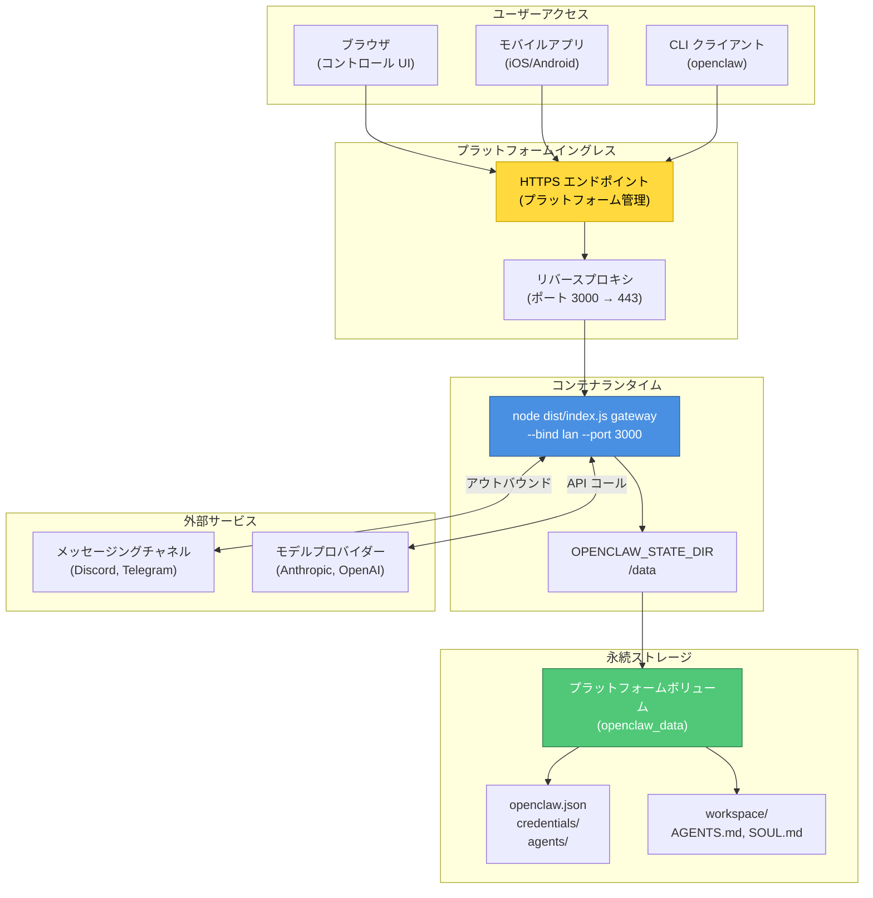
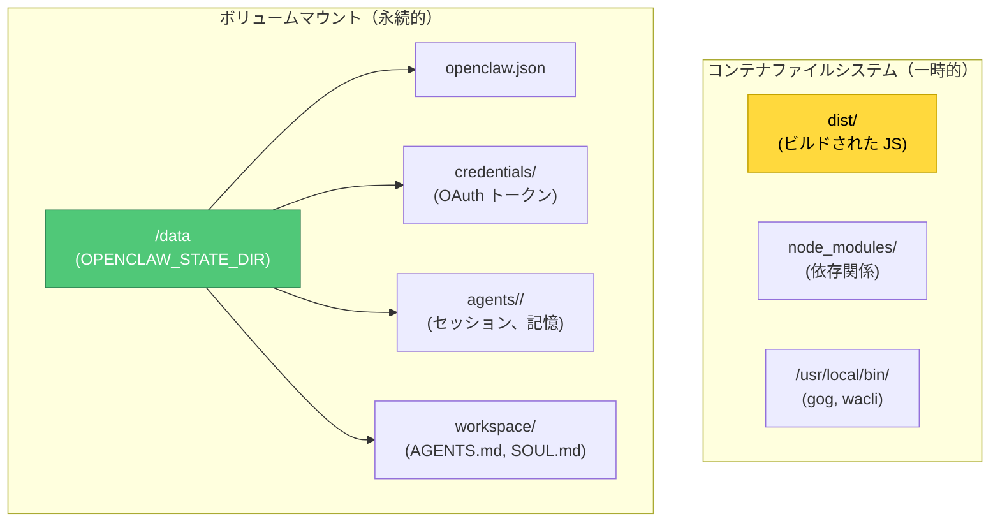
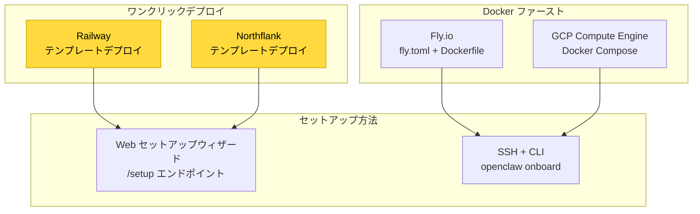
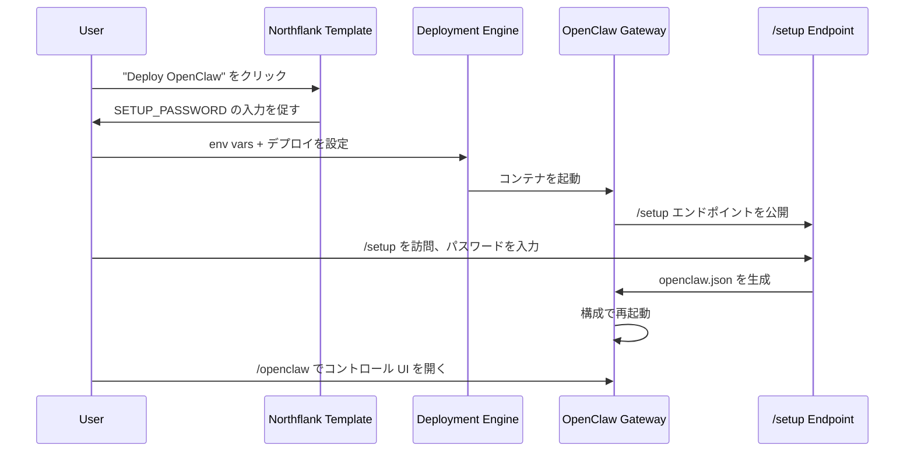
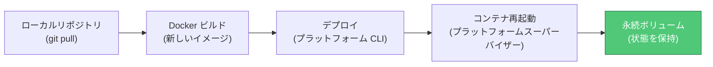

# クラウドデプロイ

# クラウドデプロイ

<details>
<summary>関連するソースファイル</summary>

このWikiページの生成に使用されたコンテキストとして、以下のファイルが使用されました：

- [.github/actions/detect-docs-changes/action.yml](.github/actions/detect-docs-changes/action.yml)
- [.github/actions/setup-node-env/action.yml](.github/actions/setup-node-env/action.yml)
- [.github/workflows/ci.yml](.github/workflows/ci.yml)
- [.gitignore](.gitignore)
- [CHANGELOG.md](CHANGELOG.md)
- [docs/automation/poll.md](docs/automation/poll.md)
- [docs/ci.md](docs/ci.md)
- [docs/cli/memory.md](docs/cli/memory.md)
- [docs/cli/sandbox.md](docs/cli/sandbox.md)
- [docs/concepts/memory.md](docs/concepts/memory.md)
- [docs/gateway/configuration.md](docs/gateway/configuration.md)
- [docs/gateway/sandbox-vs-tool-policy-vs-elevated.md](docs/gateway/sandbox-vs-tool-policy-vs-elevated.md)
- [docs/gateway/sandboxing.md](docs/gateway/sandboxing.md)
- [docs/platforms/mac/skills.md](docs/platforms/mac/skills.md)
- [docs/providers/synthetic.md](docs/providers/synthetic.md)
- [docs/tools/elevated.md](docs/tools/elevated.md)
- [docs/tools/index.md](docs/tools/index.md)
- [docs/tools/skills-config.md](docs/tools/skills-config.md)
- [docs/zh-CN/vps.md](docs/zh-CN/vps.md)
- [extensions/msteams/src/store-fs.ts](extensions/msteams/src/store-fs.ts)
- [scripts/test-live-gateway-models-docker.sh](scripts/test-live-gateway-models-docker.sh)
- [scripts/test-live-models-docker.sh](scripts/test-live-models-docker.sh)
- [src/agents/live-auth-keys.test.ts](src/agents/live-auth-keys.test.ts)
- [src/agents/live-auth-keys.ts](src/agents/live-auth-keys.ts)
- [src/agents/memory-search.test.ts](src/agents/memory-search.test.ts)
- [src/agents/memory-search.ts](src/agents/memory-search.ts)
- [src/agents/pi-embedded-helpers.isbillingerrormessage.test.ts](src/agents/pi-embedded-helpers.isbillingerrormessage.test.ts)
- [src/agents/sandbox-explain.test.ts](src/agents/sandbox-explain.test.ts)
- [src/agents/sandbox.ts](src/agents/sandbox.ts)
- [src/agents/zai.live.test.ts](src/agents/zai.live.test.ts)
- [src/cli/memory-cli.test.ts](src/cli/memory-cli.test.ts)
- [src/cli/memory-cli.ts](src/cli/memory-cli.ts)
- [src/cli/models-cli.test.ts](src/cli/models-cli.test.ts)
- [src/commands/message.ts](src/commands/message.ts)
- [src/config/schema.ts](src/config/schema.ts)
- [src/config/types.tools.ts](src/config/types.tools.ts)
- [src/config/types.ts](src/config/types.ts)
- [src/config/zod-schema.agent-runtime.ts](src/config/zod-schema.agent-runtime.ts)
- [src/config/zod-schema.ts](src/config/zod-schema.ts)
- [src/gateway/live-image-probe.ts](src/gateway/live-image-probe.ts)
- [src/infra/outbound/abort.ts](src/infra/outbound/abort.ts)
- [src/infra/outbound/message.ts](src/infra/outbound/message.ts)
- [src/infra/outbound/outbound-send-service.ts](src/infra/outbound/outbound-send-service.ts)
- [src/media/png-encode.ts](src/media/png-encode.ts)
- [src/memory/embeddings.test.ts](src/memory/embeddings.test.ts)
- [src/memory/embeddings.ts](src/memory/embeddings.ts)
- [src/memory/manager.ts](src/memory/manager.ts)
- [src/pairing/pairing-store.ts](src/pairing/pairing-store.ts)

</details>


このページでは、永続ボリュームを使用したコンテナ化されたデプロイで、Fly.io、Railway、Northflank、GCP などのクラウドプラットフォームへの OpenClaw ゲートウェイのデプロイ方法を扱います。従来の VPS デプロイ（DigitalOcean、Hetzner、Oracle Cloud）については [VPS デプロイ](#13.2) を参照してください。独自のハードウェアでのローカル開発と本番運用については [ローカルでのデプロイ](#13.1) を参照してください。ネットワークセキュリティとアクセスパターンについては [ネットワーク構成](#13.4) を参照してください。

## 目的と範囲

クラウドデプロイとは、以下を提供するプラットフォームとしてサービス（PaaS）オファリング上で OpenClaw ゲートウェイを実行することを指します：

- **コンテナ化**: Docker ベースのランタイム分離
- **永続ボリューム**: 再起動を生存する状態/ワークスペースの永続ストレージ
- **マネージドイングレス**: HTTPS エンドポイントとロードバランシング
- **環境ベースの構成**: 環境変数によるシークレット
- **自動再起動**: クラッシュからの回復を監視するプロセス

このデプロイモデルは、プラットフォームがコンテナライフサイクル、ネットワーキング、TLS 終端を管理し、アプリケーションイメージと構成を提供する点で VPS デプロイとは異なります。

## クラウドプラットフォームアーキテクチャ



**ソース:** [docs/platforms/fly.md:1-466](), [fly.toml:1-35]()

---

## デプロイパターン

### コンテナ構成

すべてのクラウドプラットフォームは、類似したコンテナ起動パターンを使用します。ゲートウェイプロセスはコンテナ内の高ポートにバインドし、プラットフォームのリバースプロキシが HTTPS トラフィックを転送します。


**Fly.io 構成** ([fly.toml:17-26]()):

```toml
[processes]
  app = "node dist/index.js gateway --allow-unconfigured --port 3000 --bind lan"

[http_service]
  internal_port = 3000
  force_https = true
  auto_stop_machines = false
  auto_start_machines = true
  min_machines_running = 1
```

**GCP Docker Compose** ([docs/platforms/gcp.md:242-280]()):

```yaml
services:
  openclaw-gateway:
    ports:
      - "127.0.0.1:${OPENCLAW_GATEWAY_PORT}:18789"
    command:
      [
        "node",
        "dist/index.js",
        "gateway",
        "--bind",
        "${OPENCLAW_GATEWAY_BIND}",
        "--port",
        "${OPENCLAW_GATEWAY_PORT}"
      ]
```

`--bind lan` フラグはゲートウェイが `0.0.0.0` でリッスンするように指示し、プラットフォームのプロキシが到達できるようにします。これがないと、ゲートウェイは `127.0.0.1` のみにバインドし、コンテナ外部から到達不能になります。

**ソース:** [fly.toml:17-26](), [docs/platforms/gcp.md:242-280]()

### 状態永続性

クラウドデプロイはコンテナ再起動間で状態を永続化するために **ボリュームマウント** を使用します。コンテナの一時的なファイルシステムは再構築時に破棄されるため、すべての重要なデータはボリューム上に存在する必要があります。



**Fly.io ボリュームマウント** ([fly.toml:32-34]()):

```toml
[mounts]
  source = "openclaw_data"
  destination = "/data"
```

`OPENCLAW_STATE_DIR=/data` 環境変数 ([fly.toml:14]()) は、ゲートウェイがすべての永続状態をボリュームに書き込むように指示します。

**GCP ボリュームマウント** ([docs/platforms/gcp.md:261-263]()):

```yaml
volumes:
  - ${OPENCLAW_CONFIG_DIR}:/home/node/.openclaw
  - ${OPENCLAW_WORKSPACE_DIR}:/home/node/.openclaw/workspace
```

GCP は構成とワークスペースのために2つの独立したマウントを使用し、両方ともホストディレクトリを指します。

**ソース:** [fly.toml:14-34](), [docs/platforms/gcp.md:261-263]()

### 永続化マッピングテーブル

| コンポーネント | コンテナパス | ボリュームソース | 再構築安全？ |
|-----------|---------------|---------------|---------------|
| ゲートウェイ構成 | `/data/openclaw.json` | プラットフォームボリューム | ✅ はい |
| OAuth トークン | `/data/credentials/` | プラットフォームボリューム | ✅ はい |
| セッション履歴 | `/data/agents/<agentId>/sessions/` | プラットフォームボリューム | ✅ はい |
| ワークスペースファイル | `/data/workspace/` | プラットフォームボリューム | ✅ はい |
| WhatsApp セッション | `/data/credentials/` | プラットフォームボリューム | ✅ はい |
| Node ランタイム | `/usr/local/bin/node` | コンテナイメージ | ❌ いいえ（再構築） |
| 外部バイナリ | `/usr/local/bin/gog` | コンテナイメージ | ❌ いいえ（焼き込む必要あり） |
| npm パッケージ | `/app/node_modules/` | コンテナイメージ | ❌ いいえ（再構築） |

**ソース:** [docs/platforms/gcp.md:406-418](), [docs/platforms/fly.md:77-89]()

---

## プラットフォーム比較



| プラットフォーム | 複雑さ | セットアップ方法 | コスト | 最適な用途 |
|----------|-----------|--------------|------|----------|
| Railway | 低 | ウィザード | $5+/月 | クイックスタート、ターミナル不要 |
| Northflank | 低 | ウィザード | $10+/月 | ブラウザのみのセットアップ |
| Fly.io | 中 | fly CLI + SSH | $10-15/月 | 本番、HTTPS |
| GCP | 高 | gcloud + Docker | $5-12/月 | カスタム制御、焼き込みバイナリ |

**ソース:** [docs/platforms/fly.md:461-465](), [docs/northflank.mdx:1-54]()

---

## Fly.io デプロイ

Fly.io はコードベースで最も文書化されたクラウドプラットフォームです。Dockerfile ビルド + 永続ボリューム + HTTPS イングレスを使用します。

### 構成ファイル

リポジトリには Fly.io 用の2つの構成が含まれます：

1. **標準** ([fly.toml:1-35]()): パブリック HTTPS イングレス
2. **プライベート** ([fly.private.toml:1-40]()): パブリック IP なし、プロキシのみアクセス

**標準構成** ([fly.toml:1-35]()):

```toml
app = "openclaw"
primary_region = "iad"

[build]
  dockerfile = "Dockerfile"

[env]
  NODE_ENV = "production"
  OPENCLAW_PREFER_PNPM = "1"
  OPENCLAW_STATE_DIR = "/data"
  NODE_OPTIONS = "--max-old-space-size=1536"

[processes]
  app = "node dist/index.js gateway --allow-unconfigured --port 3000 --bind lan"

[http_service]
  internal_port = 3000
  force_https = true
  auto_stop_machines = false
  auto_start_machines = true
  min_machines_running = 1

[[vm]]
  size = "shared-cpu-2x"
  memory = "2048mb"

[mounts]
  source = "openclaw_data"
  destination = "/data"
```

**主要設定：**

- `--allow-unconfigured`: `openclaw.json` なしで起動し、デプロイ後の SSH 構成を許可
- `internal_port = 3000`: ヘルスチェックで `--port 3000` と一致させる必要あり
- `memory = "2048mb"`: 512MB は小さすぎる; 2GB を推奨 ([docs/platforms/fly.md:252-264]())
- `OPENCLAW_STATE_DIR = "/data"`: 永続ボリュームを指す

**ソース:** [fly.toml:1-35](), [docs/platforms/fly.md:40-89]()

### プライベートデプロイ

プライベート構成 ([fly.private.toml:1-40]()) は `[http_service]` ブロックを完全に削除し、パブリック IP 割り当てを防止します。これは以下のデプロイに適しています：

- アウトバウンドコールのみ（インバウンド webhook なし）
- `fly proxy` または WireGuard を使用したアクセス
- インターネットスキャナーからの発見を回避

**アクセス方法** ([docs/platforms/fly.md:391-408]()):

```bash
# ローカルプロキシ（最も簡単）
fly proxy 3000:3000 -a my-openclaw

# WireGuard VPN
fly wireguard create

# SSH のみ
fly ssh console -a my-openclaw
```

**ソース:** [fly.private.toml:1-40](), [docs/platforms/fly.md:349-441]()

### デプロイコマンド

```bash
# アプリとボリュームを作成
fly apps create my-openclaw
fly volumes create openclaw_data --size 1 --region iad

# シークレットを設定（fly.toml には含めない）
fly secrets set OPENCLAW_GATEWAY_TOKEN=$(openssl rand -hex 32)
fly secrets set ANTHROPIC_API_KEY=sk-ant-...
fly secrets set DISCORD_BOT_TOKEN=MTQ...

# デプロイ
fly deploy

# 構成するために SSH
fly ssh console
cat > /data/openclaw.json << 'EOF'
{...}
EOF

# 再起動
fly machine restart <machine-id>
```

**ソース:** [docs/platforms/fly.md:24-207]()

### 一般的な問題

**1. メモリ問題** ([docs/platforms/fly.md:248-264]()):

512MB は小さすぎます。症状: `SIGABRT`、`v8::internal::Runtime_AllocateInYoungGeneration`、サイレントリスタート。

修正:
```bash
fly machine update <machine-id> --vm-memory 2048 -y
```

**2. ゲートウェイロック問題** ([docs/platforms/fly.md:265-278]()):

PID ロックファイルが再起動間でボリューム上に残り、"既に実行中" エラーを引き起こします。

修正:
```bash
fly ssh console --command "rm -f /data/gateway.*.lock"
fly machine restart <machine-id>
```

**3. ポートバインディング** ([docs/platforms/fly.md:235-247]()):

ゲートウェイが `127.0.0.1` ではなく `0.0.0.0` にバインドした場合、Fly のプロキシが到達できません。

修正: `--bind lan` をプロセスコマンドに追加 ([fly.toml:18]())。

**ソース:** [docs/platforms/fly.md:234-305]()

---

## Northflank デプロイ

Northflank はブラウザベースのセットアップを備えたワンクリックテンプレートを提供します。ターミナルアクセスは不要です。

### セットアップフロー



**構成** ([docs/northflank.mdx:14-18]()):

1. `SETUP_PASSWORD` 環境変数を設定
2. スタックをデプロイ
3. `https://<your-domain>/setup` にアクセス
4. Web フォームでモデル認証とチャネルを構成
5. `https://<your-domain>/openclaw` でコントロール UI にアクセス

セットアップウィザードはブラウザから直接 Telegram ペアリングコードを承認できます ([docs/northflank.mdx:35]())。

**ソース:** [docs/northflank.mdx:1-54]()

---

## GCP Compute Engine デプロイ

GCP ガイド ([docs/platforms/gcp.md:1-499]()) は、焼き込みバイナリ付きの本番対応 Docker Compose セットアップを示しています。

### バイナリ永続化パターン

ランタイムでのバイナリインストールは危険です。実行中のコンテナ内にインストールされたものは再起動時に失われます。外部バイナリはビルド時にイメージに焼き込む必要があります。

**例 Dockerfile** ([docs/platforms/gcp.md:307-337]()):

```dockerfile
FROM node:22-bookworm

# 例: Gmail CLI
RUN curl -L https://github.com/steipete/gog/releases/latest/download/gog_Linux_x86_64.tar.gz \
  | tar -xz -C /usr/local/bin && chmod +x /usr/local/bin/gog

# 例: Google Places CLI
RUN curl -L https://github.com/steipete/goplaces/releases/latest/download/goplaces_Linux_x86_64.tar.gz \
  | tar -xz -C /usr/local/bin && chmod +x /usr/local/bin/goplaces

# 例: WhatsApp CLI
RUN curl -L https://github.com/steipete/wacli/releases/latest/download/wacli_Linux_x86_64.tar.gz \
  | tar -xz -C /usr/local/bin && chmod +x /usr/local/bin/wacli
```

新しいバイナリを追加した後、再ビルドと再起動：

```bash
docker compose build
docker compose up -d
```

**検証**：

```bash
docker compose exec openclaw-gateway which gog
docker compose exec openclaw-gateway which wacli
```

**ソース:** [docs/platforms/gcp.md:285-368]()

### ボリュームマウント

GCP は明示的なホストディレクトリマウントを使用します ([docs/platforms/gcp.md:200-208]())：

```bash
mkdir -p ~/.openclaw
mkdir -p ~/.openclaw/workspace
```

Docker Compose 構成 ([docs/platforms/gcp.md:261-263]()):

```yaml
volumes:
  - ${OPENCLAW_CONFIG_DIR}:/home/node/.openclaw
  - ${OPENCLAW_WORKSPACE_DIR}:/home/node/.openclaw/workspace
```

この2マウントパターンは構成/資格情報をワークスペースファイルから分離し、バックアップを容易にします。

**ソース:** [docs/platforms/gcp.md:200-280]()

---

## 環境変数

クラウドデプロイは、シークレットに構成ファイルではなく環境変数を優先します。これにより、敏感なデータを `openclaw.json` とログから除外できます。

### 必須変数

| 変数 | 目的 | 例 |
|----------|---------|---------|
| `OPENCLAW_GATEWAY_TOKEN` | コントロール UI 認証 | `openssl rand -hex 32` |
| `OPENCLAW_STATE_DIR` | 状態/ワークスペースの場所 | `/data` (Fly.io), `~/.openclaw` (GCP) |
| `OPENCLAW_GATEWAY_PORT` | 内部リッスンポート | `3000` (Fly.io), `18789` (GCP) |
| `OPENCLAW_GATEWAY_BIND` | バインドアドレス | `lan` (パブリックプロキシ), `loopback` (トンネルのみ) |

### プロバイダー資格情報

| 変数 | プロバイダー | 形式 |
|----------|----------|--------|
| `ANTHROPIC_API_KEY` | Anthropic | `sk-ant-...` |
| `OPENAI_API_KEY` | OpenAI | `sk-...` |
| `GOOGLE_API_KEY` | Google | API キー文字列 |
| `DISCORD_BOT_TOKEN` | Discord | `MTQ...` |

**Fly.io シークレット** ([docs/platforms/fly.md:89-105]()):

```bash
fly secrets set OPENCLAW_GATEWAY_TOKEN=$(openssl rand -hex 32)
fly secrets set ANTHROPIC_API_KEY=sk-ant-...
fly secrets set DISCORD_BOT_TOKEN=MTQ...
```

**GCP .env ファイル** ([docs/platforms/gcp.md:215-228]()):

```bash
OPENCLAW_GATEWAY_TOKEN=change-me-now
OPENCLAW_GATEWAY_BIND=lan
OPENCLAW_CONFIG_DIR=/home/$USER/.openclaw
GOG_KEYRING_PASSWORD=change-me-now
```

Discord トークンは環境変数または構成ファイルのいずれかから来ることができます ([docs/platforms/fly.md:196-200]())：

- 環境変数: `DISCORD_BOT_TOKEN` (推奨)
- 構成: `channels.discord.token`

env var を使用する場合は、`openclaw.json` に追加する必要はありません。

**ソース:** [docs/platforms/fly.md:89-105](), [docs/platforms/gcp.md:215-228](), [fly.toml:10-15]()

---

## セキュリティ上の考慮事項

### バインドモード

`--bind` フラグはゲートウェイのリッスン場所を制御します：

| モード | アドレス | 使用例 | 認証必須？ |
|------|---------|----------|----------------|
| `loopback` | `127.0.0.1` | SSH トンネル、プロキシ | トークン/パスワード |
| `lan` | `0.0.0.0` | プラットフォームプロキシ、パブリック | トークン/パスワード |
| `tailnet` | Tailscale IP | Tailscale のみ | オプション |

**Fly.io 標準** ([fly.toml:18]()): `--bind lan` 付きトークン認証
**Fly.io プライベート** ([fly.private.toml:25]()): `--bind lan` だがパブリック IP なし
**GCP デフォルト** ([docs/platforms/gcp.md:266]()): `127.0.0.1:18789` (SSH 経由のループバック)

### パブリック公開のトレードオフ

**標準デプロイ** ([docs/platforms/fly.md:40-89]())：

- パブリック HTTPS URL（便利）
- インターネットスキャナー（Shodan、Censys）に発見可能
- 強力な `OPENCLAW_GATEWAY_TOKEN` が必要

**プライベートデプロイ** ([docs/platforms/fly.md:343-441]())：

- パブリック IP 割り当てなし
- スキャナーから非表示
- `fly proxy` または WireGuard 経由でのアクセスのみ
- アウトバウンド専用のユースケースに適合

**セキュリティ上の利点** ([docs/platforms/fly.md:443-450]())：

| 項目 | パブリック | プライベート |
|--------|--------|---------|
| インターネットスキャナー | 発見可能 | 非表示 |
| 直接攻撃 | 可能 | ブロック |
| コントロール UI アクセス | ブラウザ | プロキシ/VPN |
| Webhook 配信 | 直接 | トンネル経由

**ソース:** [fly.toml:20-26](), [fly.private.toml:24-31](), [docs/platforms/fly.md:343-450]()

### Webhook コールバック

プライベートデプロイでもトンネル経由で webhook を受信できます ([docs/platforms/fly.md:416-439]())：

1. **ngrok トンネル**: コンテナ内またはサイドカとして ngrok を実行
2. **Tailscale Funnel**: 特定のパスを Tailscale 経由で公開
3. **アウトバウンド専用**: 一部のプロバイダー（Twilio）は webhook なしで動作

ngrok を使用した音声通話構成の例：

```json
{
  "plugins": {
    "entries": {
      "voice-call": {
        "enabled": true,
        "config": {
          "provider": "twilio",
          "tunnel": { "provider": "ngrok" }
        }
      }
    }
  }
}
```

ngrok トンネルは Fly アプリ自体を公開せずにパブリック webhook URL を提供します。

**ソース:** [docs/platforms/fly.md:416-439]()

---

## 更新戦略



### Fly.io

```bash
git pull
fly deploy
fly status
fly logs
```

**ソース:** [docs/platforms/fly.md:313-324]()

### GCP

```bash
cd ~/openclaw
git pull
docker compose build
docker compose up -d
```

**ソース:** [docs/platforms/gcp.md:423-430]()

### 更新の安全性

永続ボリュームマウントは以下を保証します：

- 構成はイメージ再構築を生存
- OAuth トークンは有効性を保持
- セッション履歴は保存される
- WhatsApp ログインは保持される

コンテナ自体はステートレスであり、再構築/再起動は安全です。

---

## トラブルシューティング

### ポート競合

**症状**: "App is not listening on expected address"

**原因**: ゲートウェイが `127.0.0.1` ではなく `0.0.0.0` にバインド

**修正**: スタートアップコマンドに `--bind lan` を追加 ([docs/platforms/fly.md:235-240]())

### ヘルスチェック失敗

**症状**: 接続拒否、サービス再起動

**原因**: `internal_port` が `--port` と一致しない

**修正**: `internal_port = 3000` が `--port 3000` と一致することを確認 ([docs/platforms/fly.md:241-247]())

### メモリ問題

**症状**: サイレントリスタート、`SIGABRT`、v8 割り当てエラー

**原因**: 512MB は本番ワークロードには小さすぎる

**修正**: 2GB に増やす ([docs/platforms/fly.md:252-264]())

```bash
# Fly.io
fly machine update <machine-id> --vm-memory 2048 -y

# GCP
# 停止、マシンタイプを変更、再起動
```

### ロックファイルの古い状態

**症状**: "Another gateway instance is already listening"

**原因**: クラッシュ後に PID ロックファイルがボリュームに残る

**修正**: ロックファイルを削除 ([docs/platforms/fly.md:265-278]())

```bash
# Fly.io
fly ssh console --command "rm -f /data/gateway.*.lock"

# GCP
docker compose exec openclaw-gateway rm -f /home/node/.openclaw/gateway.*.lock
```

### 構成が読み込まれない

**症状**: `openclaw.json` の変更が反映されない

**原因**: 構成が誤った場所に書き込まれ、ボリューム上ではない

**検証**：

```bash
# Fly.io
fly ssh console --command "cat /data/openclaw.json"

# GCP
docker compose exec openclaw-gateway cat /home/node/.openclaw/openclaw.json"
```

**ソース:** [docs/platforms/fly.md:234-305]()

---

## コスト見積もり（2026年）

| プラットフォーム | ティア | 仕様 | 月額 | 備考 |
|----------|------|-------|---------|-------|
| Fly.io | shared-cpu-2x | 2 vCPU、2GB RAM | $10-15 | ボリューム含む |
| Railway | Starter | 0.5 vCPU、512MB RAM | $5+ | 使用量ベース |
| Northflank | Basic | 1 vCPU、1GB RAM | $10+ | マネージド |
| GCP Compute | e2-small | 2 vCPU、2GB RAM | ~$12 | さらに egress |
| GCP Compute | e2-micro | 2 vCPU、1GB RAM | Free ティア対象 | OOM の可能性あり |

**ソース:** [docs/platforms/fly.md:461-465](), [docs/platforms/gcp.md:115-119]()

---

## 関連ドキュメント

- VPS デプロイパターン: [VPS デプロイ](#13.2)
- ネットワークバインディングとセキュリティ: [ネットワーク構成](#13.4)
- ゲートウェイ構成リファレンス: [ゲートウェイ構成](#3.1)
- リモートアクセスパターン: [リモートアクセス](#3.4)
- Docker インストール: [Docker インストール](/install/docker)

---