# ページ: ネットワーク設定

# ネットワーク設定

<details>
<summary>関連ソースファイル</summary>

この wiki ページの作成コンテキストとして使用されたファイル:

- [README.md](README.md)
- [assets/avatar-placeholder.svg](assets/avatar-placeholder.svg)
- [docs/channels/zalo.md](docs/channels/zalo.md)
- [docs/channels/zalouser.md](docs/channels/zalouser.md)
- [docs/gateway/doctor.md](docs/gateway/doctor.md)
- [scripts/clawtributors-map.json](scripts/clawtributors-map.json)
- [scripts/update-clawtributors.ts](scripts/update-clawtributors.ts)
- [scripts/update-clawtributors.types.ts](scripts/update-clawtributors.types.ts)
- [src/agents/bash-tools.test.ts](src/agents/bash-tools.test.ts)
- [src/agents/pi-tools-agent-config.test.ts](src/agents/pi-tools-agent-config.test.ts)
- [src/agents/sandbox-skills.test.ts](src/agents/sandbox-skills.test.ts)
- [src/commands/configure.gateway.test.ts](src/commands/configure.gateway.test.ts)
- [src/commands/configure.gateway.ts](src/commands/configure.gateway.ts)
- [src/commands/configure.ts](src/commands/configure.ts)
- [src/commands/doctor.ts](src/commands/doctor.ts)
- [src/commands/onboard-helpers.test.ts](src/commands/onboard-helpers.test.ts)
- [src/commands/onboard-helpers.ts](src/commands/onboard-helpers.ts)
- [src/commands/onboard-interactive.ts](src/commands/onboard-interactive.ts)
- [src/config/config.ts](src/config/config.ts)
- [src/config/merge-config.ts](src/config/merge-config.ts)
- [src/index.test.ts](src/index.test.ts)
- [src/index.ts](src/index.ts)
- [src/wizard/onboarding.gateway-config.test.ts](src/wizard/onboarding.gateway-config.test.ts)
- [src/wizard/onboarding.gateway-config.ts](src/wizard/onboarding.gateway-config.ts)
- [src/wizard/onboarding.ts](src/wizard/onboarding.ts)
- [src/wizard/onboarding.types.ts](src/wizard/onboarding.types.ts)
- [tsconfig.json](tsconfig.json)
- [ui/src/styles.css](ui/src/styles.css)
- [ui/src/styles/layout.mobile.css](ui/src/styles/layout.mobile.css)

</details>


## 目的と範囲

このドキュメントでは、バインドモード、ポート管理、認証、Tailscale 統合、webhook 設定を含む OpenClaw ゲートウェイのネットワーク設定について説明します。ネットワーク設定は、ゲートウェイがどのように接続をリッスンし、外部サービスがそれにどのように到達するかを決定します。

ゲートウェイサービス管理（インストール、開始/停止）については、[ゲートウェイサービス管理](#3.3) を参照してください。リモートアクセスのパターンについては、[リモートアクセス](#3.4) を参照してください。セキュリティポリシーについては、`README.md` で参照されているセキュリティドキュメントを確認してください。

---

## ゲートウェイのバインドモード

ゲートウェイは、どのネットワークインターフェースが接続を受け付けるかを制御する 5 つのバインドモードをサポートしています:

| バインドモード | ホストアドレス | 使用ケース |
|---------------|---------------|----------|
| `loopback` | `127.0.0.1` | ローカル専用アクセス（Tailscale のデフォルト） |
| `lan` | `0.0.0.0` | すべてのネットワークインターフェース |
| `tailnet` | Tailscale IP | Tailscale ネットワークインターフェースのみにバインド |
| `auto` | `127.0.0.1` → `0.0.0.0` | loopback を優先、利用不可の場合は LAN にフォールバック |
| `custom` | ユーザー指定の IP | 指定された IP にバインド、`0.0.0.0` にフォールバック |

### バインドモードの解決

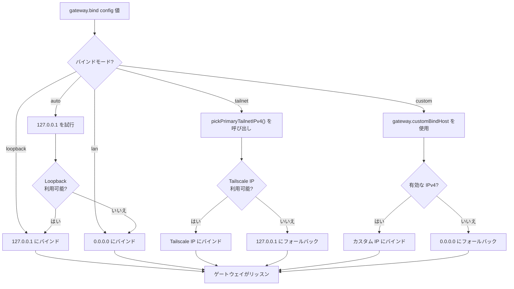

**ソース:**
- [src/wizard/onboarding.gateway-config.ts:42-286]()
- [src/commands/onboard-helpers.ts:437-466]()
- [src/gateway/net.js]() (インポート経由で参照)
- [src/infra/tailnet.js]() (`pickPrimaryTailnetIPv4` 経由で参照)

### カスタム IP の検証

カスタムバインドモードには有効な IPv4 アドレスが必要です。検証は設定の際に行われます:

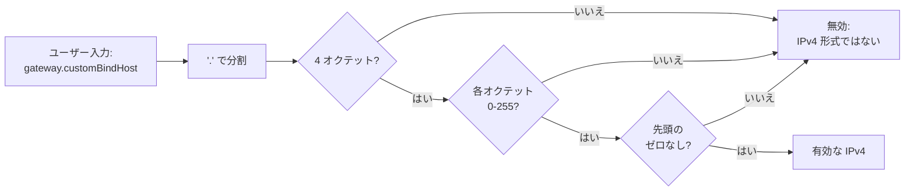

**ソース:**
- [src/wizard/onboarding.gateway-config.ts:73-106]()
- [src/commands/configure.gateway.ts:69-91]()

---

## ポート設定

ゲートウェイは、HTTP/WebSocket 接続のために単一の TCP ポートでリッスンします。デフォルトは `18789` です。

### ポート解決チェーン

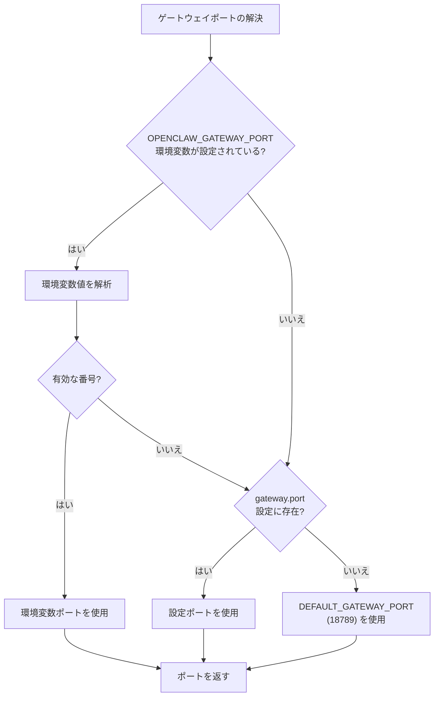

**ソース:**
- [src/config/config.ts] (`DEFAULT_GATEWAY_PORT`, `resolveGatewayPort` をエクスポート)
- [src/wizard/onboarding.ts:294]()

### ポート競合の検出

ゲートウェイは開始前にポートの利用可能性を確認します。ポートが使用されている場合、可能性の所有者を特定します:

| ポートの所有者 | 検出方法 |
|---------------|------------------|
| もう一つのゲートウェイインスタンス | アクティブな WebSocket エンドポイントを確認 |
| SSH トンネル | `-L` フラグを持つ `ssh` プロセスを確認 |
| その他のプロセス | `lsof` (Unix) または `netstat` (Windows) で PID を報告 |

**ソース:**
- [src/infra/ports.ts] (`ensurePortAvailable`, `handlePortError`, `describePortOwner` 経由で参照)
- [src/index.ts:26-28]()
- [docs/gateway/doctor.md:256-261]()

---

## 認証

ゲートウェイは、Tailscale Serve を使用して loopback モードで実行されている場合を除き、すべての接続に認証を要求します。

### 認証モード

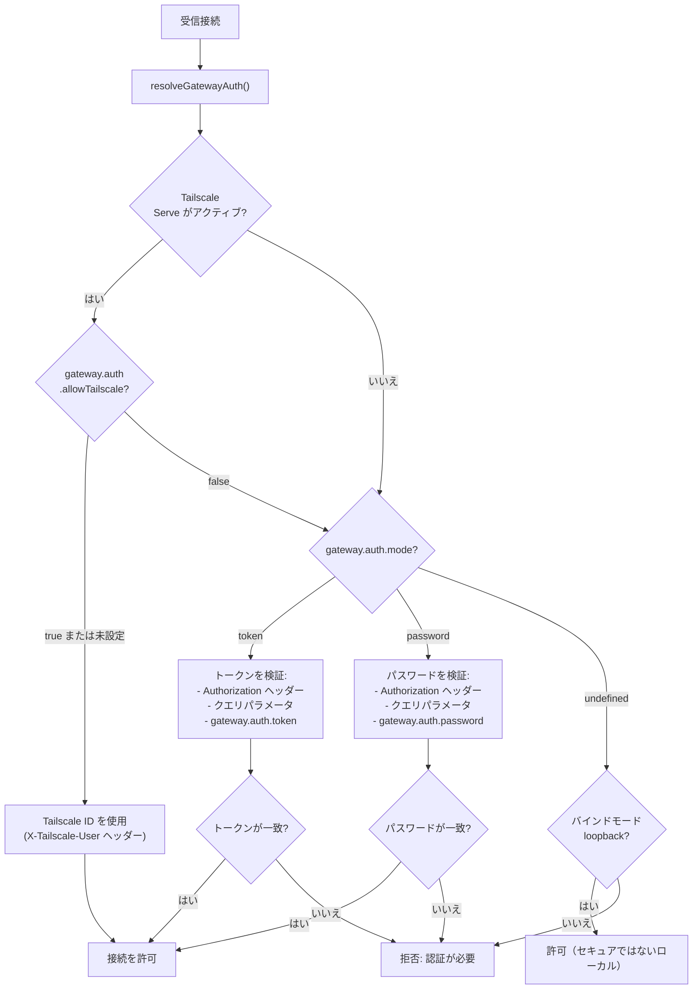

**ソース:**
- [src/gateway/auth.js] (`resolveGatewayAuth` 経由で参照)
- [src/commands/doctor.ts:125-159]()
- [src/wizard/onboarding.gateway-config.ts:108-236]()

### トークンの生成

`authMode` が `token` でトークンが提供されていない場合、システムはランダムな 48 文字の 16 進数トークンを生成します:

**ソース:**
- [src/commands/onboard-helpers.ts:68-70]()
- [src/wizard/onboarding.gateway-config.ts:194-202]()

---

## Tailscale 統合

Tailscale は、ゲートウェイへのゼロ構成 VPN アクセスを提供します。2 つのモードがサポートされています:

| モード | アクセス | HTTPS | 認証 |
|--------|--------|-------|----------------|
| `serve` | Tailnet 専用 | Tailscale 証明書経由 | Tailscale ID（オプションのパスワード上書きあり） |
| `funnel` | パブリックインターネット | Tailscale 証明書経由 | パスワード必須 |

### Tailscale アーキテクチャ

```mermaid
flowchart TB
    subgraph Gateway["ゲートウェイプロセス"]
        GatewayBind["ゲートウェイは<br/>127.0.0.1:18789 にバインド"]
    end

    subgraph Tailscale["Tailscale デーモン"]
        TailscaleServe["tailscale serve<br/>または<br/>tailscale funnel"]
        TailscaleProxy["リバースプロキシ<br/>(HTTPS を終端)"]
    end

    subgraph Clients["クライアント"]
        TailnetClient["Tailnet デバイス<br/>(https://machine-name.ts.net)"]
        InternetClient["インターネットユーザー<br/>(Funnel 経由)"]
    end

    TailnetClient -->|HTTPS リクエスト| TailscaleProxy
    InternetClient -->|HTTPS リクエスト<br/>(Funnel のみ)| TailscaleProxy

    TailscaleProxy -->|localhost:18789 への HTTP| GatewayBind

    TailscaleServe -.->|設定| TailscaleProxy

    GatewayBind -->|Tailscale がアクティブな場合<br/>bind=loopback を強制| GatewayBind
```

**ソース:**
- [README.md:208-223]()
- [src/wizard/onboarding.gateway-config.ts:124-189]()
- [src/infra/tailscale.ts] (`findTailscaleBinary` 経由で参照)

### Tailscale の制約

ゲートウェイは Tailscale が有効な場合に制約を適用します:

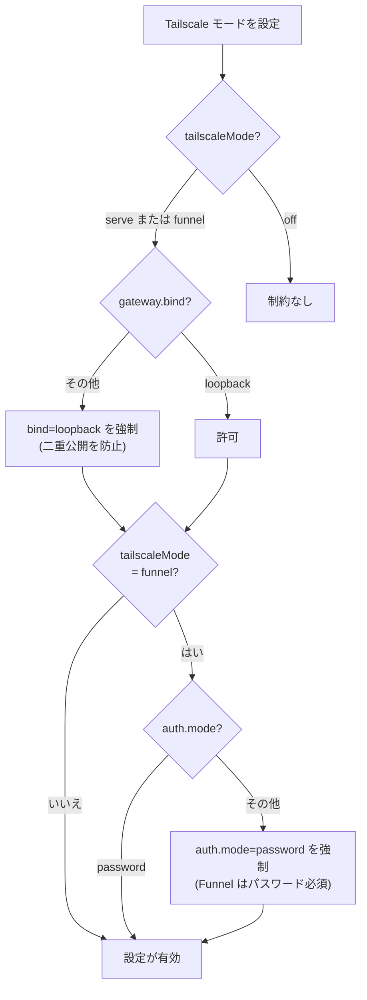

**ソース:**
- [src/wizard/onboarding.gateway-config.ts:180-189]()
- [README.md:216-221]()

---

## Webhook 設定

Webhook をサポートするチャネル（Telegram、Zalo、BlueBubbles）は、ポーリングの代わりに HTTP でイベントを受信できます。

### Webhook ルーティング

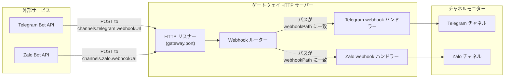

**ソース:**
- [docs/channels/zalo.md:113-119]()
- [src/commands/onboard-helpers.ts] (webhook URL 処理)

### Webhook セキュリティ

Webhook はシークレットを使用してリクエストを検証します:

| チャネル | ヘッダー | 設定キー |
|---------|--------|------------|
| Telegram | `X-Telegram-Bot-Api-Secret-Token` | `channels.telegram.webhookSecret` |
| Zalo | `X-Bot-Api-Secret-Token` | `channels.zalo.webhookSecret` |
| BlueBubbles | `bluebubbles-auth` | `channels.bluebubbles.password` |

**ソース:**
- [docs/channels/zalo.md:170-175]()

### Webhook vs ポーリング

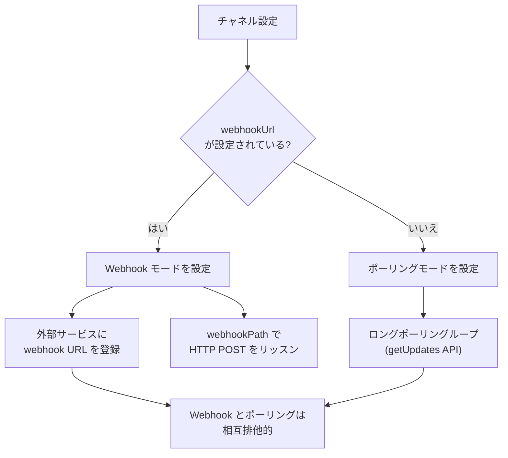

**ソース:**
- [docs/channels/zalo.md:111-119]()
- [README.md:343-344]()

---

## ネットワーク診断

### ゲートウェイのヘルスチェック

ゲートウェイは監視用にヘルスエンドポイントを公開しています:

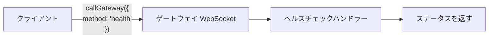

**ソース:**
- [src/commands/onboard-helpers.ts:360-382]()
- [src/gateway/call.js] (`callGateway` 経由で参照)
- [docs/gateway/doctor.md:268-280]()

### 到達性のプロービング

`probeGatewayReachable` 関数はゲートウェイの接続性をテストします:

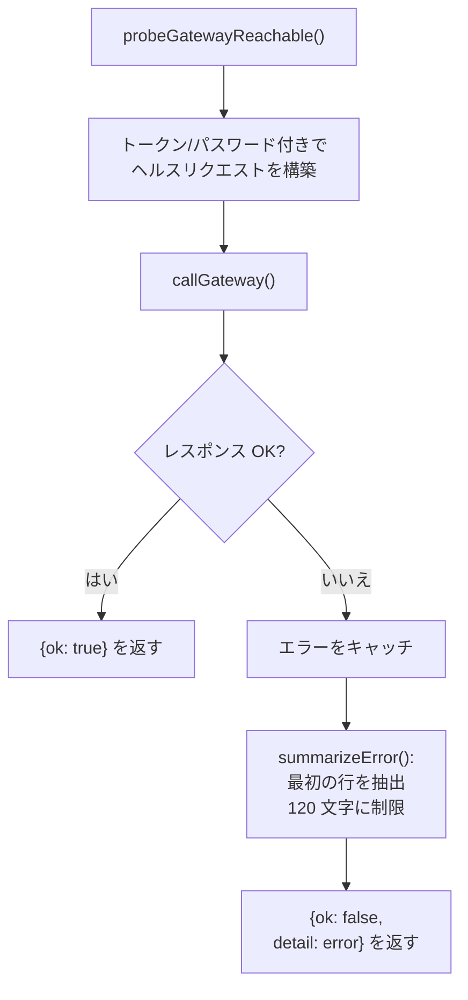

**ソース:**
- [src/commands/onboard-helpers.ts:360-433]()

---

## ファイアウォールの考慮事項

### 必要なポート

| ポート | プロトコル | 用途 | 必要な用途 |
|--------|----------|---------|--------------|
| `gateway.port` (デフォルト 18789) | TCP | ゲートウェイ HTTP/WebSocket | すべてのモード |
| 443 | TCP | Tailscale Serve/Funnel (アウトバウンド) | Tailscale モード |
| 可変 | UDP | Tailscale WireGuard | Tailscale モード |

### バインドモードのセキュリティ

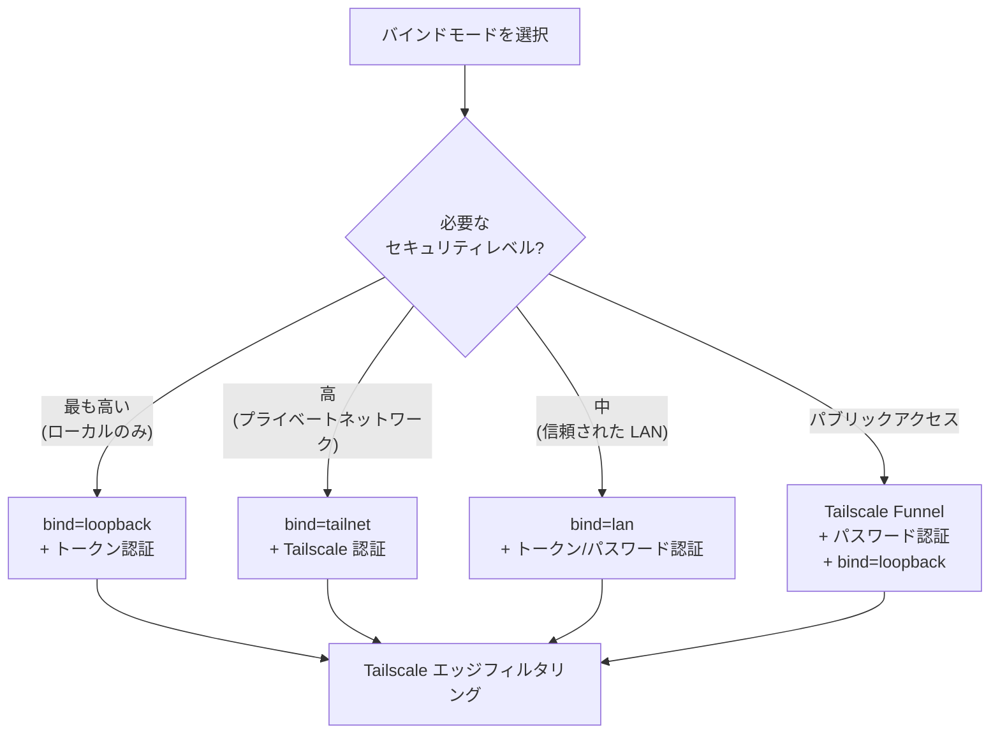

**ソース:**
- [README.md:107-120]()
- [src/wizard/onboarding.gateway-config.ts:180-189]()
- [src/wizard/onboarding.ts:47-88]()

---

## 設定リファレンス

### コアネットワーク設定

```typescript
{
  gateway: {
    port: 18789,                    // ゲートウェイの TCP ポート
    bind: "loopback",               // loopback | lan | tailnet | auto | custom
    customBindHost?: "192.168.1.100", // bind=custom の場合必須

    auth: {
      mode: "token",                // token | password
      token?: "...",                // mode=token の場合必須
      password?: "...",             // mode=password の場合必須
      allowTailscale?: true,        // Tailscale ID 認証を許可
    },

    tailscale: {
      mode: "off",                  // off | serve | funnel
      resetOnExit: false,           // シャットダウン時に Tailscale 設定をリセット
    },
  }
}
```

**ソース:**
- [src/config/types.ts] (型定義)
- [src/wizard/onboarding.gateway-config.ts:237-286]()

### Webhook 設定の例

```typescript
{
  channels: {
    telegram: {
      webhookUrl: "https://example.com/telegram",
      webhookSecret: "secure-secret-token",
      webhookPath: "/telegram",  // URL パスがデフォルト
    },

    zalo: {
      webhookUrl: "https://example.com/zalo",
      webhookSecret: "8-to-256-char-secret",
      webhookPath: "/zalo",
    },
  }
}
```

**ソース:**
- [docs/channels/zalo.md:170-176]()
- [README.md:343-354]()

---

## コントロール UI アクセス

コントロール UI は、ゲートウェイのバインドアドレス経由で HTTP でアクセスできます:

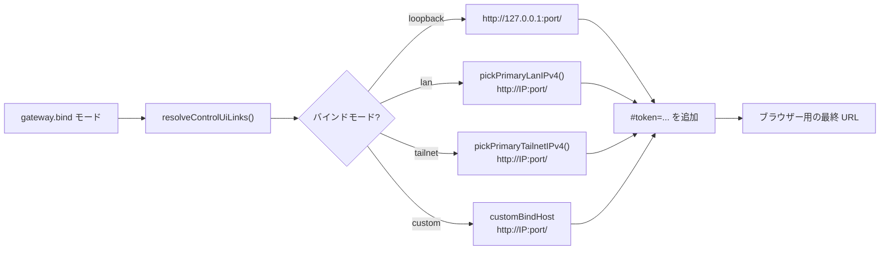

**ソース:**
- [src/commands/onboard-helpers.ts:437-466]()
- [README.md:208-223]()

---