# オペレーションとトラブルシューティング

<details>
<summary>関連するソースファイル</summary>

このウィキページの生成に使用されたコンテキストとして、以下のファイルが利用されました：

- [README.md](README.md)
- [assets/avatar-placeholder.svg](assets/avatar-placeholder.svg)
- [docs/channels/zalo.md](docs/channels/zalo.md)
- [docs/channels/zalouser.md](docs/channels/zalouser.md)
- [docs/gateway/doctor.md](docs/gateway/doctor.md)
- [scripts/clawtributors-map.json](scripts/clawtributors-map.json)
- [scripts/update-clawtributors.ts](scripts/update-clawtributors.ts)
- [scripts/update-clawtributors.types.ts](scripts/update-clawtributors.types.ts)
- [src/agents/bash-tools.test.ts](src/agents/bash-tools.test.ts)
- [src/agents/pi-tools-agent-config.test.ts](src/agents/pi-tools-agent-config.test.ts)
- [src/agents/sandbox-skills.test.ts](src/agents/sandbox-skills.test.ts)
- [src/commands/configure.gateway.test.ts](src/commands/configure.gateway.test.ts)
- [src/commands/configure.gateway.ts](src/commands/configure.gateway.ts)
- [src/commands/configure.ts](src/commands/configure.ts)
- [src/commands/doctor.ts](src/commands/doctor.ts)
- [src/commands/onboard-helpers.test.ts](src/commands/onboard-helpers.test.ts)
- [src/commands/onboard-helpers.ts](src/commands/onboard-helpers.ts)
- [src/commands/onboard-interactive.ts](src/commands/onboard-interactive.ts)
- [src/config/config.ts](src/config/config.ts)
- [src/config/merge-config.ts](src/config/merge-config.ts)
- [src/index.test.ts](src/index.test.ts)
- [src/index.ts](src/index.ts)
- [src/wizard/onboarding.gateway-config.test.ts](src/wizard/onboarding.gateway-config.test.ts)
- [src/wizard/onboarding.gateway-config.ts](src/wizard/onboarding.gateway-config.ts)
- [src/wizard/onboarding.ts](src/wizard/onboarding.ts)
- [src/wizard/onboarding.types.ts](src/wizard/onboarding.types.ts)
- [tsconfig.json](tsconfig.json)
- [ui/src/styles.css](ui/src/styles.css)
- [ui/src/styles/layout.mobile.css](ui/src/styles/layout.mobile.css)

</details>

このページは、OpenClaw デプロイメントの実行と維持に関する運用ガイダンスを提供します。診断ワークフロー、サービスライフサイクル管理、ヘルスモニタリング、一般的なトラブルシューティングパターンをカバーしています。特定のトピックに関する詳細については、以下を参照してください：

- ヘルスモニタリングとステータスコマンド: [ヘルスモニタリング](#14.1)
- Doctor コマンドの使用方法とマイグレーション: [Doctor コマンドガイド](#14.2)
- 特定のエラーメッセージと修正方法: [一般的な問題](#14.3)
- インストールの移行とバックアップ戦略: [移行とバックアップ](#14.4)

ランタイムエラーとチャネル固有の問題については、[トラブルシューティング](/gateway/troubleshooting) を参照してください。

---

## 運用コンテキスト

OpenClaw は、メッセージングチャネル接続と WebSocket コントロールプレーンを所有する長寿命の Gateway プロセスとして実行されます。運用タスクは以下の中心にあります：

1. **モニタリング**: Gateway のヘルス、チャネル接続性、モデル認証ステータス
2. **診断**: メッセージが失敗する理由や Gateway が起動しない理由を特定する
3. **ライフサイクル**: 開始、停止、再起動、アップグレード
4. **回復**: 破損した状態の修復、レガシーデータの移行
5. **メンテナンス**: 設定更新、ログローテーション、バックアップ

CLI は階層化された診断サーフェスを提供します：高速なローカルチェック (`openclaw status`)、リモート Gateway プローブ (`openclaw health`)、修復自動化 (`openclaw doctor`)。

---

## 診断ワークフロー：最初の 60 秒

何かが壊れた場合、順番にこれらのコマンドを実行します。各コマンドは段階的に深い洞察を提供します。

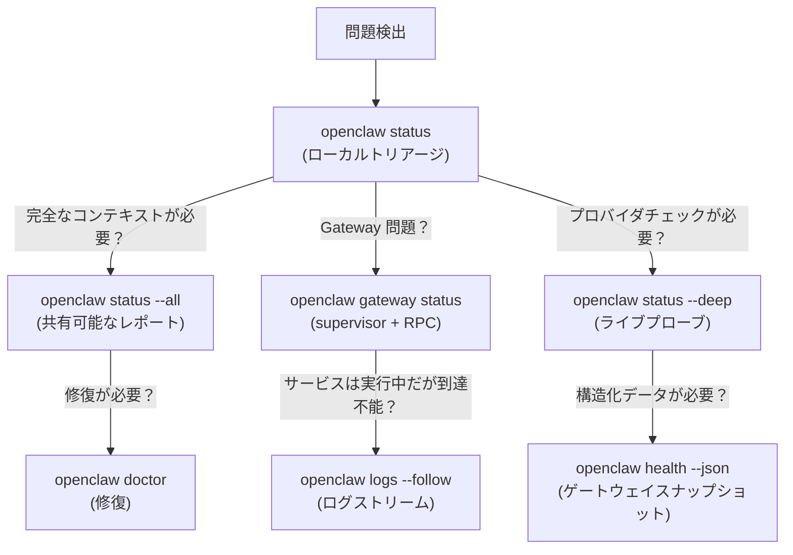

**クイックリファレンス：**

| コマンド | 何を表示するか | いつ使うか |
|---------|--------------|-------------|
| `openclaw status` | OS/更新、ゲートウェイ到達可能性、エージェント/セッション、プロバイダ設定 | 最初のチェック；高速なローカルサマリー |
| `openclaw status --all` | 完全な診断 + ログ末尾（トークンはマスキング） | デバッグ用に共有しても安全 |
| `openclaw gateway status` | Supervisor ランタイム、RPC プローブ、設定パスの不一致 | Gateway "実行中" だが何も反応しない |
| `openclaw status --deep` | Gateway ヘルス + プロバイダプローブ（到達可能な Gateway 必要） | 設定済みだが機能しない |
| `openclaw logs --follow` | ライブログストリーム | 実際の失敗理由が必要な場合 |
| `openclaw doctor` | 設定検証 + 修復自動化 | 古い設定/状態を修正 |
| `openclaw health --verbose` | エラー時にターゲット URL + 設定パスを含む Gateway スナップショット | 認証またはネットワーク問題をデバッグする |

**ソース:** [docs/help/faq.md:196-244](), [docs/gateway/troubleshooting.md:14-30]()

---

## 診断コマンドアーキテクチャ

CLI は 3 つの診断レイヤーを提供します：ローカルチェック、リモートプローブ、修復アクション。各コマンドがどのレイヤーで動作するかを理解することで、適切なツールを選択できます。

**診断コマンドアーキテクチャ**

```mermaid
graph TB
    subgraph LocalChecks["ローカルチェック（Gateway 不要）"]
        StatusLocal["openclaw status<br/>statusCommand()"]
        GatewayStatus["openclaw gateway status<br/>resolveGatewayService()"]
        ConfigSnapshot["readConfigFileSnapshot()<br/>src/config/io.ts"]
        ServiceProbe["Service supervisor チェック<br/>isLoaded(), isRunning()"]
    end

    subgraph RemoteProbes["リモートプローブ（Gateway RPC 必要）"]
        StatusDeep["openclaw status --deep<br/>checkGatewayHealth()"]
        Health["openclaw health<br/>callGateway('health')"]
        Logs["openclaw logs<br/>callGateway('logs.tail')"]
        ChannelsStatus["openclaw channels status<br/>callGateway('channels.status')"]
        SystemPresence["openclaw system presence<br/>callGateway('system-presence')"]
    end

    subgraph RepairActions["修復アクション"]
        Doctor["openclaw doctor<br/>doctorCommand()"]
        ConfigApply["openclaw config set<br/>writeConfigFile()"]
        GatewayRestart["openclaw gateway restart<br/>service.restart()"]
        SandboxRecreate["openclaw sandbox recreate<br/>maybeRepairSandboxImages()"]
    end

    subgraph GatewayRPC["Gateway WebSocket RPC :18789"]
        RPCServer["Gateway RPC ハンドラ<br/>src/gateway/server.ts"]
        HealthEndpoint["health メソッド"]
        LogsEndpoint["logs.tail メソッド"]
        ConfigEndpoint["config.get/set/apply メソッド"]
        PresenceEndpoint["system-presence メソッド"]
    end

    StatusLocal --> ConfigSnapshot
    StatusLocal --> ServiceProbe
    GatewayStatus --> ServiceProbe

    StatusDeep --> RPCServer
    Health --> RPCServer
    Logs --> RPCServer
    ChannelsStatus --> RPCServer
    SystemPresence --> RPCServer

    RPCServer --> HealthEndpoint
    RPCServer --> LogsEndpoint
    RPCServer --> ConfigEndpoint
    RPCServer --> PresenceEndpoint

    Doctor --> ConfigSnapshot
    Doctor --> RPCServer
    Doctor --> ServiceProbe
    ConfigApply --> RPCServer
    GatewayRestart --> ServiceProbe
```

**主要なコードエンティティとその役割：**

| コンポーネント | ファイルパス | 主要な関数 |
|-----------|-----------|---------------|
| Status コマンド | [src/commands/status.ts]() | `statusCommand()`, ローカル診断 |
| Gateway サービス | [src/daemon/service.ts]() | `resolveGatewayService()`, `isLoaded()`, `isRunning()` |
| 設定ローダー | [src/config/io.ts]() | `readConfigFileSnapshot()`, スキーマ検証 |
| 設定検証 | [src/config/validation.ts]() | `validateConfigObjectWithPlugins()` |
| RPC クライアント | [src/gateway/call.ts]() | `callGateway()`, `buildGatewayConnectionDetails()` |
| Gateway サーバー | [src/gateway/server.ts]() | WebSocket RPC ハンドラ、メソッドディスパッチ |
| Doctor フロー | [src/commands/doctor.ts:65-313]() | `doctorCommand()`, すべてのチェックを調整 |
| Gateway プローブ | [src/commands/onboard-helpers.ts:360-382]() | `probeGatewayReachable()`, 接続テスト |

**ソース:** [src/gateway/server.ts](), [src/commands/doctor.ts](), [src/gateway/call.ts](), [src/daemon/service.ts](), [src/config/io.ts](), [src/config/validation.ts](), [src/commands/onboard-helpers.ts:360-382]()

---

## Gateway ライフサイクル管理

Gateway は監視されるバックグラウンドサービスとして実行されます（macOS では launchd、Linux では systemd、Windows では schtasks）。CLI は統一インターフェースを通じてサービスを管理します。

### サービス状態

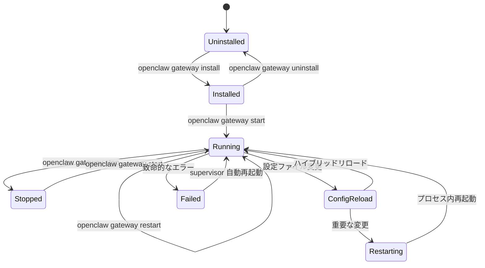

### サービス管理コマンド

```bash
# サービスインストール（supervisor 設定を作成）
openclaw gateway install --runtime node

# ステータス確認（supervisor + RPC プローブ）
openclaw gateway status

# ライフサイクル制御
openclaw gateway start
openclaw gateway stop
openclaw gateway restart

# 手動実行（フォアグラウンド、デバッグ用）
openclaw gateway --port 18789 --verbose

# 強制再起動（既存のリスナーを最初にキル）
openclaw gateway --force
```

**サービス設定パス：**

- macOS: `~/Library/LaunchAgents/bot.molt.openclaw.plist`（またはプロファイル固有の `bot.molt.dev.plist` など）
- Linux: `~/.config/systemd/user/openclaw-gateway.service`（またはプロファイル固有の `openclaw-gateway-dev.service`）
- Windows: タススクスケジューラタスク `OpenClaw Gateway`（またはプロファイル固有）

**コード参照：**

- サービス解決: [src/daemon/service.ts](), `resolveGatewayService()`
- サービスインターフェース: [src/daemon/service.ts](), 抽象サービスメソッド `install()`, `start()`, `stop()`, `isLoaded()`, `isRunning()`
- macOS launchd 実装: [src/daemon/service.macos.ts](), ラベル形式 `bot.molt.{profile}`
- Linux systemd 実装: [src/daemon/service.linux.ts](), ユニット名 `openclaw-gateway{-profile}.service`
- Windows schtasks 実装: [src/daemon/service.windows.ts](), タスク名 `OpenClaw Gateway{(profile)}`

**ソース:** [src/daemon/service.ts](), [src/daemon/service.macos.ts](), [src/daemon/service.linux.ts](), [src/daemon/service.windows.ts](), [src/commands/gateway.ts]()

---

## 設定ホットリロード

Gateway は `openclaw.json` を監視し、可能であればダウンタイムなしで変更を適用します。リロードモードは `gateway.reload.mode` によって制御されます。

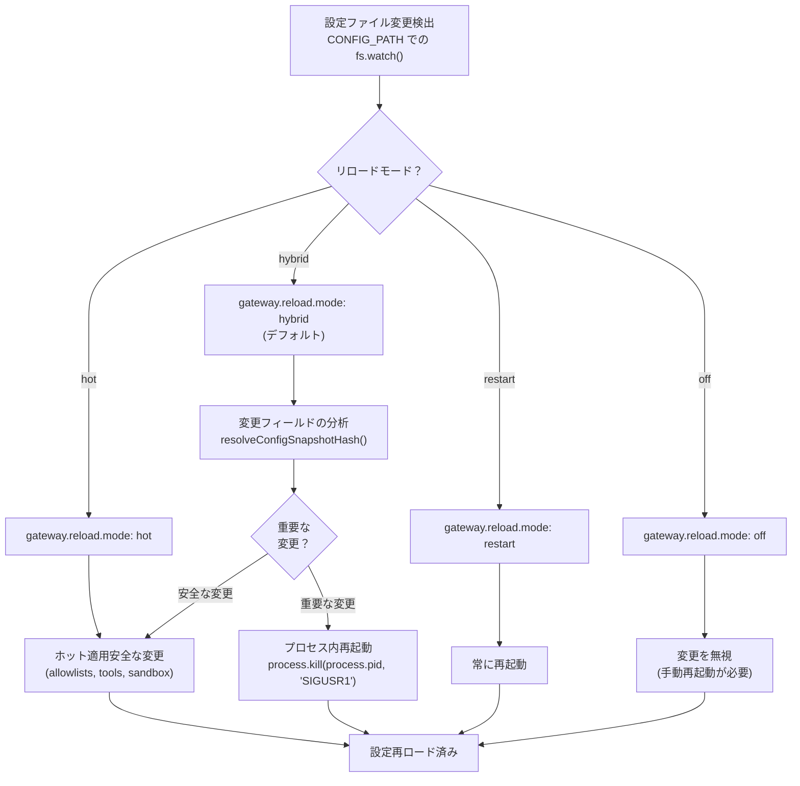

**リロードモード：**

- `hybrid`（デフォルト）：安全な変更はホット適用、重要な変更は再起動
- `hot`：常にホット適用、非安全な変更には警告
- `restart`：設定変更で常に再起動
- `off`：手動再起動が必要

**重要な変更（ハイブリッドモードで再起動をトリガー）：**

- `gateway.port`, `gateway.bind`, `gateway.customBindHost`
- `gateway.auth.mode`, `gateway.auth.token`, `gateway.auth.password`
- チャネル認証情報と Webhook URL
- モデルプロバイダベース URL と API エンドポイント
- エージェントワークスペースディレクトリパス
- Sandbox Docker イメージ設定

**安全なホット適用変更：**

- `channels.*.allowFrom`, `channels.*.groups`
- `tools.allow`, `tools.deny`, `tools.byProvider`
- `agents.*.tools`, sandbox ツールポリシー
- `cron.jobs`, 自動化設定
- フィーチャーフラグと非重要な設定

**コード参照：**

- 設定ウォッチャー: Gateway サーバー設定ファイルウォッチ実装
- ハッシュ比較: [src/config/io.ts](), `resolveConfigSnapshotHash()`
- リロードロジック: サーバー起動時の Gateway リロード決定ツリー
- SIGUSR1 ハンドラー: プロセス内再起動のためのプロセスシグナルハンドラー

**ソース:** [src/gateway/server.ts](), [src/config/io.ts](), [src/config/config.ts]()

---

## ヘルスモニタリングサーフェス

OpenClaw は複数のサーフェスを通じてヘルスステータスを公開します。各サーフェスは異なる運用コンテキストを対象としています。

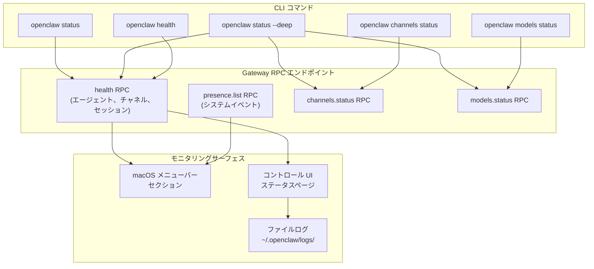

**主要なステータスフィールド：**

- Gateway 到達可能性: `openclaw gateway status` は RPC プローブをチェック
- チャネルヘルス: `openclaw channels status --probe`（WhatsApp/Telegram/Discord 状態）
- モデル認証: `openclaw models status --probe`（OAuth 有効期限、API キー有効性）
- セッション数: `openclaw status` はアクティブセッションを表示
- システムイベント: `openclaw system presence` は最近のイベントを表示

**ソース:** [docs/cli/index.md:515-541](), [docs/gateway/troubleshooting.md:14-30]()

---

## Doctor コマンドワークフロー

`openclaw doctor` コマンドは一般的な修復タスクを自動化します。一連のチェックを実行し、検出された問題に対する修正を提供します。このコマンドは [src/commands/doctor.ts:65-313]() に実装され、複数のサブモジュールを調整します。

**Doctor コマンド実行フロー**

```mermaid
graph TB
    Start["doctorCommand()<br/>src/commands/doctor.ts:65"]

    UpdateCheck["maybeOfferUpdateBeforeDoctor()<br/>src/commands/doctor-update.ts"]
    UIProtocol["maybeRepairUiProtocolFreshness()<br/>src/commands/doctor-ui.ts"]
    ConfigLoad["loadAndMaybeMigrateDoctorConfig()<br/>src/commands/doctor-config-flow.ts"]

    AuthCheck["noteAuthProfileHealth()<br/>src/commands/doctor-auth.ts:28-119"]
    LegacyState["detectLegacyStateMigrations()<br/>src/commands/doctor-state-migrations.ts:48-50"]
    StateIntegrity["noteStateIntegrity()<br/>src/commands/doctor-state-integrity.ts"]

    SandboxCheck["maybeRepairSandboxImages()<br/>src/commands/doctor-sandbox.ts:44"]
    ServiceCheck["maybeRepairGatewayServiceConfig()<br/>src/commands/doctor-gateway-services.ts:34-36"]
    SecurityCheck["noteSecurityWarnings()<br/>src/commands/doctor-security.ts"]

    GatewayHealth["checkGatewayHealth()<br/>src/commands/doctor-gateway-health.ts"]
    GatewayRepair["maybeRepairGatewayDaemon()<br/>src/commands/doctor-gateway-daemon-flow.ts"]

    SystemdLinger["ensureSystemdUserLingerInteractive()<br/>src/commands/systemd-linger.ts:56"]

    WriteConfig["writeConfigFile()<br/>applyWizardMetadata()"]
    WorkspaceCheck["noteWorkspaceBackupTip()<br/>src/commands/doctor-state-integrity.ts:46"]

    Start --> UpdateCheck
    UpdateCheck --> UIProtocol
    UIProtocol --> ConfigLoad

    ConfigLoad --> AuthCheck
    AuthCheck --> LegacyState
    LegacyState --> StateIntegrity

    StateIntegrity --> SandboxCheck
    SandboxCheck --> ServiceCheck
    ServiceCheck --> SecurityCheck

    SecurityCheck --> GatewayHealth
    GatewayHealth --> GatewayRepair

    GatewayRepair --> SystemdLinger
    SystemdLinger --> WriteConfig
    WriteConfig --> WorkspaceCheck

    WorkspaceCheck --> Done["Doctor 完了"]
```

**Doctor プロンプターモード：**

```typescript
// src/commands/doctor-prompter.ts
type DoctorOptions = {
  nonInteractive?: boolean;  // すべてのプロンプトをスキップ、安全なマイグレーションのみ
  yes?: boolean;             // すべてのデフォルトを受け入れる
  repair?: boolean;          // 推奨される修正をプロンプトなしで適用
  force?: boolean;           // 攻撃的な修復を適用（カスタム設定を上書き）
  deep?: boolean;            // 追加の Gateway インストールについてシステムサービスをスキャン
  generateGatewayToken?: boolean;  // 自動化でのトークン生成を強制
  workspaceSuggestions?: boolean;  // ワークスペースバックアップ/メモリのヒントを表示
};
```

**一般的な修復機能：**

| 関数 | ファイル | 目的 |
|----------|------|---------|
| `maybeRepairAnthropicOAuthProfileId()` | [src/commands/doctor-auth.ts:26]() | OAuth プロファイル ID を正規化 |
| `maybeRemoveDeprecatedCliAuthProfiles()` | [src/commands/doctor-auth.ts:25]() | 古い CLI 認証プロファイルを削除 |
| `runLegacyStateMigrations()` | [src/commands/doctor-state-migrations.ts:49]() | セッション/エージェントディレクトリ/WhatsApp 認証の移行 |
| `maybeRepairGatewayServiceConfig()` | [src/commands/doctor-gateway-services.ts:34]() | Supervisor 設定を更新（launchd/systemd/schtasks） |
| `maybeRepairSandboxImages()` | [src/commands/doctor-sandbox.ts:44]() | Sandbox Docker イメージを再作成または切り替え |
| `maybeRepairGatewayDaemon()` | [src/commands/doctor-gateway-daemon-flow.ts]() | サービスランタイムの問題を修正 |
| `ensureSystemdUserLingerInteractive()` | [src/commands/systemd-linger.ts:56]() | Linux で systemd lingering を有効化 |

**ソース:** [src/commands/doctor.ts:65-313](), [src/commands/doctor-auth.ts](), [src/commands/doctor-state-migrations.ts](), [src/commands/doctor-gateway-services.ts](), [src/commands/doctor-sandbox.ts](), [src/commands/systemd-linger.ts](), [docs/gateway/doctor.md:1-279]()

---

## 設定管理

設定は `~/.openclaw/openclaw.json`（または `OPENCLAW_CONFIG_PATH`）に保存されます。CLI は安全な設定編集用のヘルパーを提供します。

### 設定優先順位

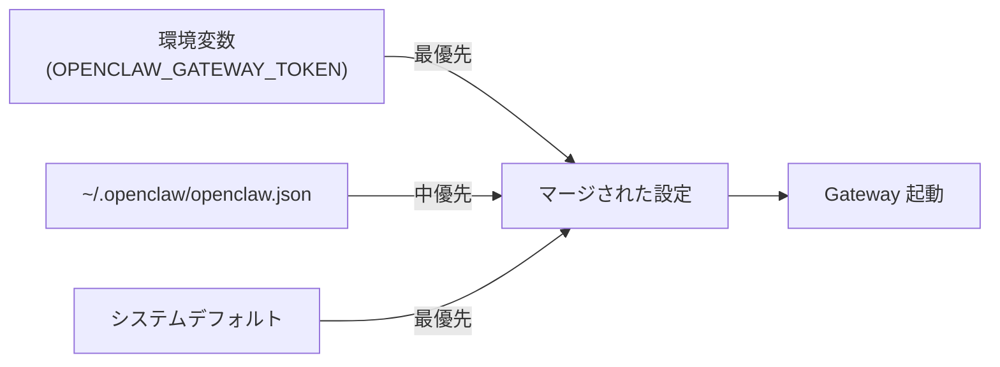

### 設定コマンド

```bash
# 現在の値を表示
openclaw config get gateway.port

# 値を設定（JSON5 構文）
openclaw config set agents.defaults.model "openai/gpt-4"
openclaw config set tools.allow '["read", "write", "exec"]'

# 値を削除
openclaw config unset tools.exec.requireApproval

# 対話型ウィザード
openclaw configure

# 検証と RPC 経由で適用（リロードをトリガー）
openclaw gateway call config.apply --params '{"config": {...}, "baseHash": "..."}'
```

**設定検証：**

- スキーマ: [src/config/schema.ts](), Zod スキーマ
- ローダー: [src/config/config.ts](), `readConfigFileSnapshot()`
- マイグレーション: [src/commands/doctor-config-flow.ts](), `loadAndMaybeMigrateDoctorConfig()`

**ソース:** [src/config/config.ts](), [src/commands/configure.ts](), [docs/gateway/configuration.md]()

---

## ログアクセスパターン

OpenClaw は Gateway の実行方法に応じて複数の宛先にログを出力します。ログの場所を理解することはトラブルシューティングに不可欠です。

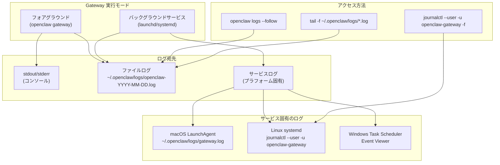

**ログコマンド：**

```bash
# 推奨（RPC ベース、実行中の Gateway 必要）
openclaw logs --follow
openclaw logs --limit 200 --json

# 直接ファイルアクセス（常に動作）
tail -f "$(ls -t ~/.openclaw/logs/openclaw-*.log | head -1)"

# macOS LaunchAgent ログ
tail -f ~/.openclaw/logs/gateway.log
tail -f ~/.openclaw/logs/gateway.err.log

# Linux systemd ログ
journalctl --user -u openclaw-gateway.service -f -n 200

# Windows Task Scheduler
# Event Viewer → Task Scheduler History を確認
```

**ログ設定：**

```json
{
  "logging": {
    "level": "info",
    "file": "~/.openclaw/logs/openclaw-{date}.log",
    "consoleLevel": "warn",
    "consoleStyle": "pretty"
  }
}
```

**ソース:** [docs/gateway/troubleshooting.md:95-124](), [docs/gateway/index.md:35-36]()

---

## 一般的な運用パターン

### パターン：Gateway が起動しない

**症状：** `openclaw gateway status` はサービスがロードされているが RPC プローブが失敗していることを示す。

**トリアージ：**

```bash
# 1. supervisor 状態を確認
openclaw gateway status

# 2. ログで最後の gateway エラーを確認
openclaw logs --limit 50 | grep -i error

# 3. doctor を実行
openclaw doctor
```

**一般的な原因：**

- `gateway.mode` が `"local"` に設定されていない: `openclaw config set gateway.mode local` で修正
- ループバックバインドなしで認証なし: `openclaw config set gateway.auth.token "..."` で修正
- ポートが使用中: `openclaw gateway --force` またはポート変更で修正
- 無効な設定: `openclaw doctor` で修正

**ソース:** [docs/gateway/troubleshooting.md:122-215]()

---

### パターン：モデル認証の有効期限切れ

**症状：** メッセージに返信がない；ログに "No credentials found for profile" と表示される。

**トリアージ：**

```bash
# 認証状況を確認
openclaw models status

# 有効期限を確認
openclaw models status --probe
```

**修正（Anthropic setup-token）：**

```bash
# Gateway ホスト上で
openclaw models auth setup-token --provider anthropic
openclaw models status
```

**修正（OAuth リフレッシュ失敗）：**

```bash
# オンボーディングを再実行または新しいトークンを貼り付け
openclaw onboard
# または
openclaw models auth paste-token --provider anthropic
```

**ソース:** [docs/gateway/troubleshooting.md:39-73]()

---

### パターン：サービスは実行中だが設定不一致

**症状：** `openclaw gateway status` が CLI とサービスで異なる設定パスを表示する。

**説明：** CLI とサービスは異なる設定解決を使用します。これは以下の場合に発生します：

- `--profile` で CLI を実行しているが、サービスはプロファイルなしでインストールされている
- `OPENCLAW_STATE_DIR` を設定して CLI を実行しているが、サービスはデフォルトを使用している
- サービスインストール後に設定を編集

**診断フロー：**

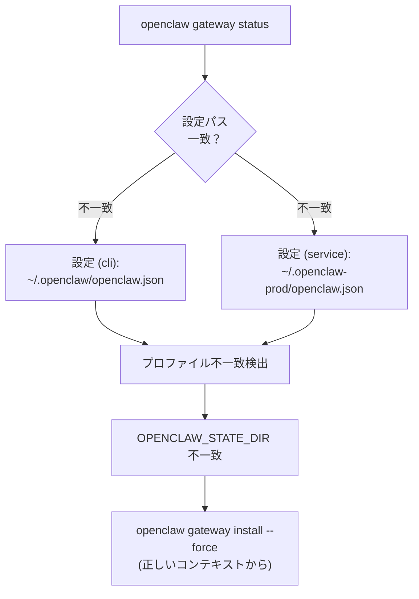

**修正：**

```bash
# 同じプロファイル/状態ディレクトリコンテキストからサービスを再インストール
openclaw gateway install --force

# または正しいコンテキストから再起動
OPENCLAW_STATE_DIR=~/.openclaw-prod openclaw gateway restart
```

**コード参照：**

- 設定パス解決: [src/config/paths.ts](), `CONFIG_PATH` 定数は `CONFIG_DIR` から派生
- プロファイル状態ディレクトリ: [src/runtime.ts](), プロファイル固有の状態ディレクトリ解決
- サービスインストール: [src/daemon/service.ts](), `install()` メソッドはプロファイルパラメータ付き
- Gateway ステータス: [src/commands/gateway.ts](), 設定パス比較付きステータスコマンド

**ソース:** [docs/gateway/troubleshooting.md:162-214](), [src/config/paths.ts](), [src/runtime.ts](), [src/daemon/service.ts](), [src/commands/gateway.ts]()

---

### パターン：Control UI が HTTP で "Unauthorized"

**症状：** `http://<lan-ip>:18789/` を開くと "device identity required" または接続失敗が表示される。

**説明：** HTTPS 以外のコンテキストでは WebCrypto がブロックされるため、デバイス識別子を生成できません。

**修正オプション：**

1. Tailscale Serve を介して HTTPS を使用:
   ```bash
   openclaw gateway --bind tailnet --tailscale serve
   # https://<magicdns>/ を開く
   ```

2. ループバックを使用（常に HTTP 安全）:
   ```bash
   # Gateway ホスト上で
   open http://127.0.0.1:18789/
   ```

3. 不安全な認証を許可（トークンのみ）:
   ```json
   {
     "gateway": {
       "controlUi": {
         "allowInsecureAuth": true
       }
     }
   }
   ```

**ソース:** [docs/gateway/troubleshooting.md:76-87]()

---

## セッションと状態の整合性

OpenClaw は、一貫性を保つ必要がある複数のタイプの状態を維持しています。`noteStateIntegrity()` 関数は [src/commands/doctor-state-integrity.ts]() でこれらの不変条件を検証します。

**状態ディレクトリ構造と整合性チェック**

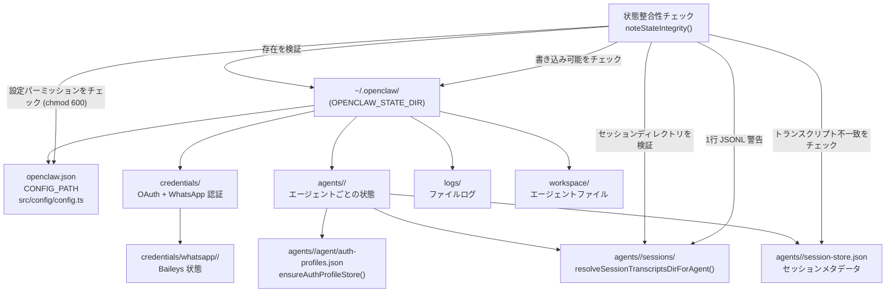

**Doctor によって実行される状態整合性チェック：**

| チェック | 関数 | 目的 |
|-------|----------|---------|
| 状態ディレクトリ存在 | `noteStateIntegrity()` | 重大な状態損失について警告 |
| 状態ディレクトリ書き込み可能 | `noteStateIntegrity()` | パーミッションを検証、`chown` ヒントを提供 |
| セッションディレクトリ存在 | `resolveSessionTranscriptsDirForAgent()` | 履歴永続性を保証 |
| トランスクリプト不一致 | セッションストア検証 | 最近のエントリにファイルがない場合に警告 |
| 1行メイントランスクリプト | JSONL 行数 | メインセッションが蓄積されていない場合にフラグ |
| 複数の状態ディレクトリ | ディレクトリスキャン | `~/openclaw` と `~/.openclaw` が共存する場合に警告 |
| 設定ファイルパーミッション | `fs.stat()` チェック | グループ/世界から読み取り可能な場合に警告、`chmod 600` を提供 |

**状態管理のコード参照：**

- 状態ディレクトリ解決: [src/utils.ts](), `CONFIG_DIR` 定数は設定パスからエクスポート
- セッショントランスクリプト: [src/config/sessions.ts](), `resolveSessionTranscriptsDirForAgent()`, `resolveStorePath()`
- セッションストア: [src/config/sessions.ts](), `loadSessionStore()`, `saveSessionStore()`
- 認証プロファイルストア: [src/agents/auth-profiles.ts](), `ensureAuthProfileStore()`
- 設定ロード: [src/config/io.ts](), `readConfigFileSnapshot()`, `writeConfigFile()`
- 設定検証: [src/config/validation.ts](), `validateConfigObjectWithPlugins()`
- 状態整合性チェック: [src/commands/doctor-state-integrity.ts](), `noteStateIntegrity()`

**ソース:** [src/commands/doctor-state-integrity.ts](), [src/config/sessions.ts](), [src/agents/auth-profiles.ts](), [src/config/io.ts](), [src/config/validation.ts](), [src/utils.ts](), [docs/gateway/doctor.md:143-177]()

---

## バックアップと状態管理

**最小バックアップ（設定 + 認証のみ）：**

```bash
tar czf openclaw-backup.tar.gz \
  ~/.openclaw/openclaw.json \
  ~/.openclaw/credentials/ \
  ~/.openclaw/agents/*/agent/auth-profiles.json
```

**フルバックアップ（セッション + ワークスペース含む）：**

```bash
tar czf openclaw-full-backup.tar.gz \
  ~/.openclaw/openclaw.json \
  ~/.openclaw/credentials/ \
  ~/.openclaw/agents/ \
  ~/.openclaw/workspace/
```

**復元：**

```bash
tar xzf openclaw-backup.tar.gz -C ~/
openclaw doctor
openclaw gateway restart
```

**ソース:** [docs/help/faq.md:386-406]()

---

## マシン間の移行

セッション、認証、メモリを保持して OpenClaw を新しいマシンに移行するには：

1. 新しいマシンに OpenClaw をインストール
2. 状態ディレクトリをコピー:
   ```bash
   # 古いマシン上で
   tar czf openclaw-state.tar.gz ~/.openclaw/

   # 新しいマシン上で
   tar xzf openclaw-state.tar.gz -C ~/
   ```
3. 検証用に doctor を実行:
   ```bash
   openclaw doctor
   ```
4. サービスを再起動:
   ```bash
   openclaw gateway restart
   ```

**重要な注意点：**

- ワークスペースファイルにはメモリが含まれるので、エージェントメモリを保持するためにコピーする
- セッションはエージェントごとのため、`~/.openclaw/agents/<agentId>/sessions/` をコピーする
- WhatsApp 認証は `~/.openclaw/credentials/whatsapp/` の下にある
- OAuth トークンは各エージェントの `auth-profiles.json` にある

**ソース:** [docs/help/faq.md:386-406]()

---

## マルチGateway 運用パターン

複数の分離された Gateway（レスキューボット、dev/prod 分離）を実行する場合、各プロファイルは独自の状態ディレクトリ、設定ファイル、および supervisor サービスを持ちます。

**マルチGateway 分離アーキテクチャ**

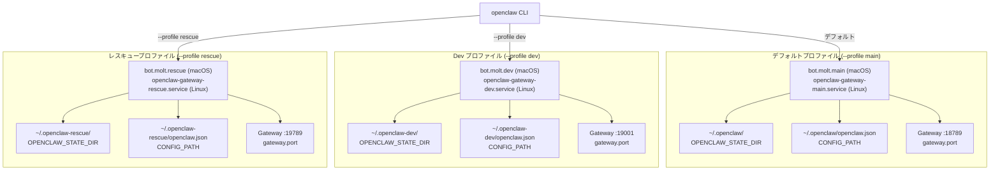

**プロファイル分離コマンド：**

```bash
# Prod ゲートウェイ（デフォルトプロファイル）
openclaw gateway start

# Dev ゲートウェイ（分離プロファイル、自動導出ポート）
openclaw --dev gateway --allow-unconfigured
# デフォルト: ポート 19001、状態ディレクトリ ~/.openclaw-dev

# カスタムプロファイル（レスキューボット）
openclaw --profile rescue gateway --port 19789

# プロファイルごとのサービスインストール
openclaw --profile prod gateway install --port 18789
openclaw --profile dev gateway install --port 19001
openclaw --profile rescue gateway install --port 19789

# どのプロファイルがアクティブか確認
openclaw status  # --dev または --profile を使用中には "Profile: dev" を表示
```

**プロファイルによるサービス名：**

| プラットフォーム | サービス名パターン | 例（プロファイル: rescue） |
|----------|---------------------|---------------------------|
| macOS launchd | `bot.molt.<profile>` | `bot.molt.rescue` |
| Linux systemd | `openclaw-gateway-<profile>.service` | `openclaw-gateway-rescue.service` |
| Windows schtasks | `OpenClaw Gateway (<profile>)` | `OpenClaw Gateway (rescue)` |

**プロファイル用のポート間隔：**

`--dev` フラグはデフォルトプロファイルとの競合を避けるために自動導出ポートを使用します：

| ポートタイプ | デフォルトプロファイル | Dev プロファイル（`--dev`） |
|-----------|----------------|---------------------|
| Gateway | 18789 | 19001 |
| ブラウザ | 18791 | 19003 |
| Canvas | 18793 | 19005 |

**コード参照：**

- プロファイル解決: [src/runtime.ts](), `defaultRuntime` はプロパティ付きプロファイル
- プロファイルごとの状態ディレクトリ: [src/utils.ts](), `CONFIG_DIR` は `OPENCLAW_STATE_DIR` または `~/.openclaw{-profile}` を使用
- サービス名生成: プラフォーム固有のサービス実装は [src/daemon/()] 内
- ポート自動インクリメント: [src/config/config.ts](), `resolveGatewayPort()` は dev オフセットロジック付き

**ソース:** [docs/gateway/multiple-gateways.md](), [src/daemon/service.ts](), [src/daemon/service.macos.ts](), [src/daemon/service.linux.ts](), [src/daemon/service.windows.ts](), [src/runtime.ts](), [src/utils.ts](), [src/config/config.ts]()

---

## セキュリティ監査と警告

CLI は一般的な設定ミスをチェックするセキュリティ監査コマンドを提供します。Doctor も自動的に `noteSecurityWarnings()` を介してセキュリティチェックを実行します。

**セキュリティ監査コマンド**

```bash
# ローカル監査（設定 + 状態）
openclaw security audit

# ディープ監査（実行中の Gateway をプローブ）
openclaw security audit --deep

# 安全な問題を自動修正
openclaw security audit --fix
```

**実行されるセキュリティチェック：**

| チェック | 関数 | 修正方法 |
|-------|----------|-----|
| 認証なしで Gateway が公開されている | [src/gateway/auth.ts]() の `resolveGatewayAuth()` | `gateway.auth.token` または `gateway.auth.password` を設定 |
| 弱い DM ポリシー | [src/commands/doctor-security.ts]() の `noteSecurityWarnings()` | `dmPolicy` を `"pairing"` または `"allowlist"` に変更 |
| Sandbox 設定なし | [src/commands/doctor-sandbox.ts]() の `noteSandboxScopeWarnings()` | `agents.defaults.sandbox.mode: "non-main"` または `"all"` を有効化 |
| 世界から読み取り可能な設定 | [src/commands/doctor-state-integrity.ts]() の `noteStateIntegrity()` | `chmod 600 ~/.openclaw/openclaw.json` を実行 |
| 非推奨の認証方法 | [src/commands/doctor-auth.ts]() の認証プロファイルチェック | `openclaw models auth add` で OAuth に移行 |
| オープングループポリシー | [src/commands/doctor-security.ts]() の `noteSecurityWarnings()` | `requireMention: true` またはグループ allowlist を有効化 |
| 制限なしの昇格実行 | セキュリティ警告 | `tools.exec.elevated.allowFrom` 制限を追加 |

**一般的なセキュリティ警告：**

セキュリティ監査はこれらの危険な設定をチェックします：

- `channels.*.dmPolicy === "open"` が allowlist なし（ボットをスパムに暴露）
- `gateway.auth.mode === "off"` がループバックバインドなし（保護されていないネットワーク公開）
- `gateway.bind === "lan"` が認証なし（LAN からアクセス可能）
- `tools.exec.elevated.enabled === true` が `allowFrom` 制限なし（無制限の root アクセス）
- グループポリシーが `"open"` がメンション要件なし（ボットがすべてのグループメッセージに応答）

**コード参照：**

- セキュリティ警告: [src/commands/doctor-security.ts](), `noteSecurityWarnings()` は DM/グループポリシーをチェック
- スコープ警告: [src/commands/doctor-sandbox.ts](), `noteSandboxScopeWarnings()` は Sandbox 設定をチェック
- 状態整合性: [src/commands/doctor-state-integrity.ts](), `noteStateIntegrity()` はファイルパーミッションをチェック
- Gateway 認証解決: [src/gateway/auth.ts](), `resolveGatewayAuth()` は有効な認証モードを決定
- セキュリティ監査コマンド: [src/commands/security.ts](), セキュリティチェックを調整

**ソース:** [docs/gateway/security.md](), [src/commands/security.ts](), [src/commands/doctor-security.ts](), [src/commands/doctor-sandbox.ts](), [src/commands/doctor-state-integrity.ts](), [src/gateway/auth.ts]()

---

## プロダクション向け運用チェックリスト

**デプロイ前：**

- [ ] `openclaw security audit --deep` を実行
- [ ] `gateway.auth.token` を設定（ループバックでも）
- [ ] チャネル allowlist またはペアリングを設定
- [ ] 信頼されないセッション用に Sandbox を有効化
- [ ] ログローテーションを設定
- [ ] バックアップ自動化を設定

**デプロイ後：**

- [ ] `openclaw status --deep` が正常を表示することを確認
- [ ] `openclaw models status --probe` でフェイルオーバーをテスト
- [ ] サービス自動再起動を確認: `openclaw gateway stop && sleep 5 && openclaw gateway status`
- [ ] 設定ホットリロードをテスト: `openclaw.json` を編集、ログを確認
- [ ] テストマシンでバックアップ復元を検証

**継続的：**

- [ ] 週次: `openclaw status --all`（期限切れの OAuth をチェック）
- [ ] 月次: `openclaw doctor`（古い状態をキャッチ）
- [ ] 更新後: `openclaw doctor --deep`（サービス設定を検証）

**ソース:** [docs/gateway/security.md](), [docs/gateway/troubleshooting.md]()

---