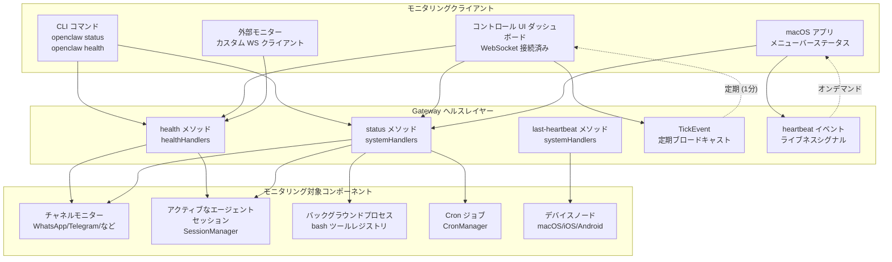
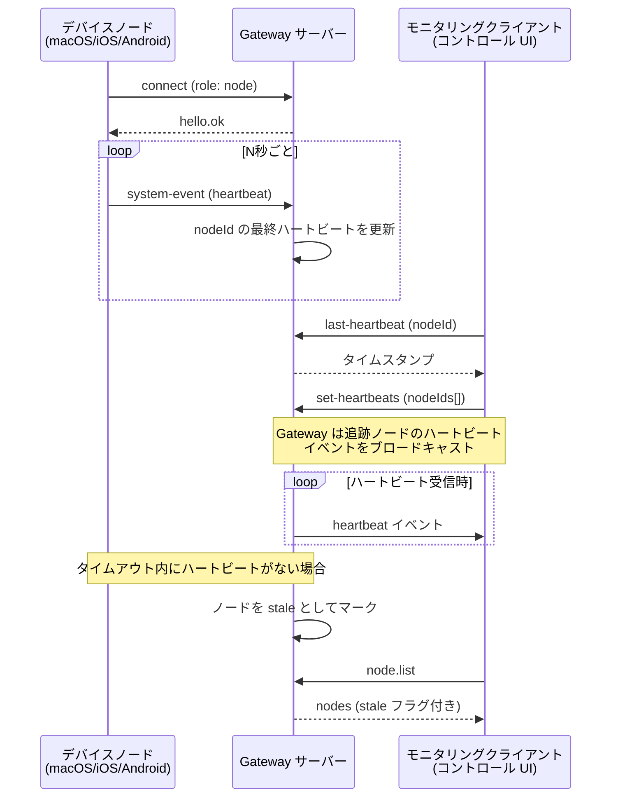
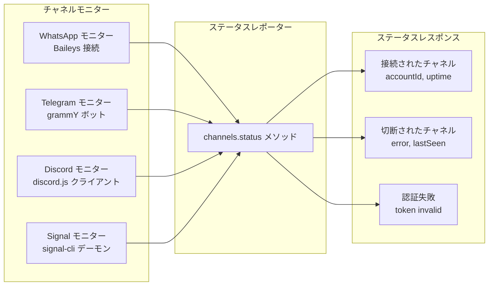
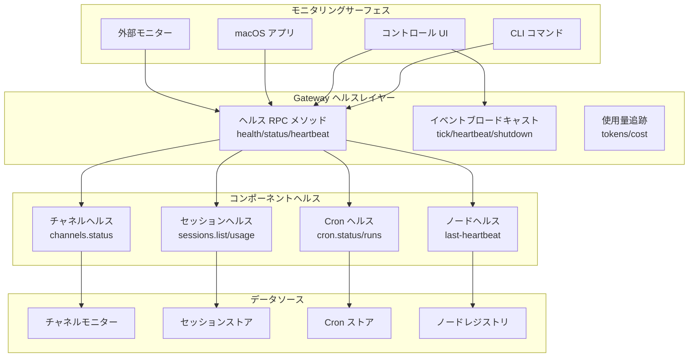

# ヘルスモニタリング

<details>
<summary>関連するソースファイル</summary>

このウィキページの生成に使用されたコンテキストとして、以下のファイルが利用されました：

- [README.md](README.md)
- [assets/avatar-placeholder.svg](assets/avatar-placeholder.svg)
- [docs/channels/zalo.md](docs/channels/zalo.md)
- [docs/channels/zalouser.md](docs/channels/zalouser.md)
- [scripts/clawtributors-map.json](scripts/clawtributors-map.json)
- [scripts/update-clawtributors.ts](scripts/update-clawtributors.ts)
- [scripts/update-clawtributors.types.ts](scripts/update-clawtributors.types.ts)
- [src/commands/agent.test.ts](src/commands/agent.test.ts)
- [src/commands/agent.ts](src/commands/agent.ts)
- [src/config/config.ts](src/config/config.ts)
- [src/cron/isolated-agent.ts](src/cron/isolated-agent.ts)
- [src/cron/run-log.test.ts](src/cron/run-log.test.ts)
- [src/cron/run-log.ts](src/cron/run-log.ts)
- [src/cron/store.ts](src/cron/store.ts)
- [src/gateway/protocol/index.ts](src/gateway/protocol/index.ts)
- [src/gateway/protocol/schema.ts](src/gateway/protocol/schema.ts)
- [src/gateway/protocol/schema/agents-models-skills.ts](src/gateway/protocol/schema/agents-models-skills.ts)
- [src/gateway/protocol/schema/protocol-schemas.ts](src/gateway/protocol/schema/protocol-schemas.ts)
- [src/gateway/protocol/schema/types.ts](src/gateway/protocol/schema/types.ts)
- [src/gateway/server-methods-list.ts](src/gateway/server-methods-list.ts)
- [src/gateway/server-methods.ts](src/gateway/server-methods.ts)
- [src/gateway/server-methods/agents.ts](src/gateway/server-methods/agents.ts)
- [src/gateway/server.ts](src/gateway/server.ts)
- [src/index.test.ts](src/index.test.ts)
- [src/index.ts](src/index.ts)
- [tsconfig.json](tsconfig.json)
- [ui/src/styles.css](ui/src/styles.css)
- [ui/src/styles/layout.mobile.css](ui/src/styles/layout.mobile.css)

</details>

OpenClaw のヘルスモニタリングは、Gateway、チャネル、セッション、エージェント実行に関する運用可視性を提供します。ライブチェック、ステータスエンドポイント、ハートビートメカニズム、WebSocket RPC および CLI コマンドを介して公開される使用量メトリクスを含みます。このシステムは、自動モニタリングと手動診断の両方を可能にします。

Gateway 自体の設定については、[Gateway 設定](#3.1) を参照してください。トラブルシューティング手順については、[一般的な問題](#14.3) を参照してください。

---

## ヘルスチェックアーキテクチャ

Gateway は WebSocket プロトコルを介して複数のヘルスとステータスメソッドを公開し、オペレータークライアントがアクセスできます。これらのメソッドは読み取りスコープです（管理権限は不要）であり、システム状態のリアルタイム可視性を提供します。



**ソース:** [src/gateway/server-methods.ts:13-14](), [src/gateway/server-methods.ts:52-76](), [src/gateway/server-methods-list.ts:3-91](), [src/gateway/protocol/schema.ts:1-17]()

---

## Gateway ヘルスメソッド

`health` メソッドは主なヘルスチェックエンドポイントです。Gateway が実行可能であり、リクエストを受け入れる準備ができているかどうかを示す軽量のステータス応答を返します。

### リクエストスキーマ

```typescript
// パラメータは不要
method: "health"
params: {}
```

### レスポンススキーマ

ヘルスハンドラーはオペレーションステータスを応答し、オプションでコンポーネントの準備状態を含みます：

| フィールド | タイプ | 説明 |
|----------------|-----------|------------------------------------------|
| `ok` | `boolean` | Gateway は実行可能です |
| `timestamp` | `number` | サーバータイムスタンプ（エポックミリ秒） |
| `version` | `string` | Gateway バージョン（オプション） |
| `uptime` | `number` | プロセス稼働時間（秒、オプション） |

### 承認

- **スコープ**: `operator.read`（または `operator.write`/`operator.admin`）
- **ロール**: `operator`（`node` ロールでは利用不可）
- すべての認証されたオペレーター接続からアクセス可能

**ソース:** [src/gateway/server-methods.ts:52-76](), [src/gateway/server-methods.ts:93-163](), [src/gateway/server-methods-list.ts:4]()

---

## ハートビートシステム

ハートビートシステムは接続されたノードのライブネスを追跡し、モニタリングクライアントに定期的なライブネスシグナルを提供します。



### 最終ハートビートメソッド

特定のノードの最終ハートビートタイムスタンプをクエリします：

```json5
{
  method: "last-heartbeat",
  params: {
    nodeId: "macbook-pro-m1"
  }
}
```

レスポンス：
```json5
{
  timestamp: 1704067200000,  // エポックミリ秒
  age: 30000  // 最終ハートビートからのミリ秒
}
```

### ハートビートイベント

クライアントが `set-heartbeats` を介して購読すると、Gateway は `heartbeat` イベントを発行します：

```json5
{
  event: "heartbeat",
  data: {
    nodeId: "macbook-pro-m1",
    timestamp: 1704067200000
  }
}
```

**ソース:** [src/gateway/server-methods.ts:54-56](), [src/gateway/server-methods-list.ts:107](), [src/gateway/protocol/schema/frames.ts:89-90]()

---

## ステータスメソッド

`status` メソッドはチャネル接続性、アクティブセッション、リソース使用量を含む、Gateway 状態の包括的なスナップショットを提供します。

### リクエスト

```json5
{
  method: "status",
  params: {}  // または { verbose: true }
}
```

### レスポンス構造

| フィールド | タイプ | 説明 |
|--------------------|----------|---------------------------------------|
| `gateway` | `object` | Gateway メタデータ |
| `gateway.version` | `string` | OpenClaw バージョン |
| `gateway.uptime` | `number` | プロセス稼働時間（秒） |
| `gateway.pid` | `number` | プロセス ID |
| `channels` | `object` | チャネルステータスマップ |
| `sessions` | `object` | セッション統計 |
| `sessions.active` | `number` | アクティブなエージェントセッション |
| `sessions.total` | `number` | ストア内のセッション総数 |
| `usage` | `object` | トークン/コスト使用量（利用可能な場合） |
| `cron` | `object` | Cron ジョブ統計 |
| `nodes` | `array` | 接続されたデバイスノード |

### レスポンス例

```json5
{
  gateway: {
    version: "2025.1.15",
    uptime: 86400,
    pid: 12345,
    bind: "loopback",
    port: 18789
  },
  channels: {
    whatsapp: { status: "connected", accountId: "default" },
    telegram: { status: "connected", accountId: "bot-token-123" },
    discord: { status: "disconnected", error: "token invalid" }
  },
  sessions: {
    active: 3,
    total: 47
  },
  cron: {
    jobs: 5,
    nextRun: 1704067800000
  },
  nodes: [
    { nodeId: "macbook-pro-m1", connected: true, capabilities: ["system.run", "camera.snap"] }
  ]
}
```

**ソース:** [src/gateway/server-methods.ts:55](), [src/gateway/server-methods-list.ts:8]()

---

## 使用量追跡

Gateway はセッションとモデル間でトークン使用量とコストを追跡します。使用量データは専用メソッドを介して利用可能です。

### 使用量ステータスメソッド

```json5
{
  method: "usage.status",
  params: {
    sessionKey: "agent:main:main",  // オプション: セッションでフィルタ
    since: 1704067200000  // オプション: タイムスタンプフィルタ
  }
}
```

レスポンスには含まれます：
- 入力/出力トークン合計
- モデル/プロバイダ別コスト内訳
- セッションレベル集計

### 使用量コストメソッド

```json5
{
  method: "usage.cost",
  params: {
    provider: "anthropic",  // オプション: プロバイダでフィルタ
    model: "claude-opus-4-6"  // オプション: モデルでフィルタ
  }
}
```

**ソース:** [src/gateway/server-methods.ts:56-57](), [src/gateway/server-methods-list.ts:9-10]()

---

## チャネルステータスモニタリング

`channels.status` メソッドは、すべての設定されたチャネルの接続性とヘルスを報告します。



### リクエスト

```json5
{
  method: "channels.status",
  params: {
    probe: true  // オプション: 接続プローブをトリガー
  }
}
```

### レスポンス

```json5
{
  channels: [
    {
      id: "whatsapp",
      accountId: "default",
      status: "connected",
      connectedAt: 1704067200000,
      uptime: 86400,
      lastMessage: 1704067195000
    },
    {
      id: "telegram",
      accountId: "bot-token-123",
      status: "disconnected",
      error: "polling error: network timeout",
      lastSeen: 1704067100000
    }
  ]
}
```

**ソース:** [src/gateway/server-methods.ts:53](), [src/gateway/server-methods-list.ts:7](), [src/gateway/protocol/schema/channels.ts:40-51]()

---

## セッションヘルスモニタリング

Gateway はアクティブなエージェントセッションとそのリソース消費を追跡します。セッションヘルスには以下が含まれます：

- **アクティブセッション**: 進行中のエージェント実行
- **トークン使用量**: セッションごとのコンテキストウィンドウ消費
- **セッションロック**: 同時実行防止
- **コンパクションステータス**: セッションがコンテキスト制限に近づいているかどうか

### セッションリストメソッド

```json5
{
  method: "sessions.list",
  params: {
    active: true  // オプション: アクティブなセッションのみ
  }
}
```

レスポンスにはセッションごとに含まれます：
- `sessionId`, `sessionKey`
- `agentId`
- `model`, `provider`
- `tokenUsage` (入力/出力/合計)
- `contextUsage` (コンテキストウィンドウのパーセンテージ)
- `lastActivity` (タイムスタンプ)
- `locked` (ブール値、エージェントが実行中）

### セッション使用量メソッド

セッション全体でトークン使用量を集計：

```json5
{
  method: "sessions.usage",
  params: {
    agentId: "main",  // オプション: エージェントでフィルタ
    since: 1704000000000  // オプション: 時間範囲
  }
}
```

**ソース:** [src/gateway/server-methods.ts:65-69](), [src/gateway/server-methods-list.ts:47-52](), [src/gateway/protocol/schema/sessions.ts:1-130]()

---

## Tick イベント

Gateway はすべての接続されたクライアントに定期的な `tick` イベントをブロードキャストします。これらのイベントはライブネスシグナルとして機能し、モニタリングクライアント接続のハートビートを提供します。

### Tick イベントスキーマ

```json5
{
  event: "tick",
  data: {
    timestamp: 1704067200000,
    uptime: 86400,
    activeSessions: 3
  }
}
```

### Tick 間隔

- デフォルト: **60 秒**
- Gateway 実装で構成可能

Tick イベントはすべての接続されたオペレータークライアントにブロードキャストされ、以下を可能にします：
- 接続ライブネス検出
- 自動再接続トリガー
- ポーリングなしのダッシュボード更新

**ソース:** [src/gateway/protocol/schema/frames.ts:89-90](), [src/gateway/server-methods-list.ts:103-104]()

---

## シャットダウンイベント

Gateway が正常なシャットダウンを開始すると、すべての接続されたクライアントに `shutdown` イベントをブロードキャストします。これにより、クライアントはシャットダウン通知を表示し、再接続の準備をすることができます。

### シャットダウンイベントスキーマ

```json5
{
  event: "shutdown",
  data: {
    reason: "restart",  // または "manual", "signal", "error"
    timestamp: 1704067200000,
    gracePeriod: 5000  // 切断前のミリ秒
  }
}
```

シャットダウンイベントを受信したクライアントは以下を実行するべきです：
1. ユーザーに通知を表示
2. 新しいリクエストの送信を停止
3. `gracePeriod` を待ってから再接続
4. 再接続試行に対して指数バックオフを実装

**ソース:** [src/gateway/protocol/schema/frames.ts:89-90](), [src/gateway/server-methods-list.ts:105]()

---

## Cron ジョブヘルス

Cron ジョブは独自のヘルスモニタリングを持ち、`cron.status` および `cron.runs` メソッドを介してアクセス可能です。

### Cron ステータスメソッド

```json5
{
  method: "cron.status",
  params: {}
}
```

レスポンス：
```json5
{
  jobs: [
    {
      id: "daily-backup",
      schedule: "0 2 * * *",
      enabled: true,
      nextRun: 1704067200000,
      lastRun: {
        timestamp: 1703980800000,
        status: "ok",
        durationMs: 1234
      }
    }
  ]
}
```

### Cron 実行履歴メソッド

ジョブの実行履歴を取得：

```json5
{
  method: "cron.runs",
  params: {
    jobId: "daily-backup",
    limit: 10
  }
}
```

**ソース:** [src/gateway/server-methods.ts:72-79](), [src/gateway/server-methods-list.ts:73-79](), [src/cron/run-log.ts:1-122]()

---

## システムプレゼンス

`system-presence` メソッドは、接続された WebSocket クライアント（オペレーター、ノード）、アクティブなチャネルモニター、実行中のエージェントセッション、バックグラウンドプロセス（bash ツール）を含む、すべてのアクティブなシステムコンポーネントのスナップショットを提供します。

### リクエスト

```json5
{
  method: "system-presence",
  params: {}
}
```

### レスポンス

```json5
{
  clients: [
    { clientId: "client-abc", role: "operator", connectedAt: 1704067200000 },
    { clientId: "node-macbook", role: "node", connectedAt: 1704067100000 }
  ],
  channels: [
    { id: "whatsapp", accountId: "default", status: "connected" }
  ],
  sessions: [
    { sessionKey: "agent:main:main", locked: true, runId: "run-xyz" }
  ],
  processes: [
    { processId: "proc-1", sessionKey: "agent:main:main", command: "npm run dev" }
  ]
}
```

**ソース:** [src/gateway/server-methods.ts:80](), [src/gateway/server-methods-list.ts:80]()

---

## CLI ヘルスコマンド

OpenClaw CLI は手動のヘルスチェックと診断用のコマンドを提供します。

### openclaw status

```bash
openclaw status
```

表示内容：
- Gateway バージョンと稼働時間
- チャネル接続性（接続済み/切断済み）
- アクティブセッション数
- ノード接続
- Cron ジョブサマリー

### openclaw health

```bash
openclaw health
```

実行中の Gateway に対してヘルスチェックを実行：
- WebSocket に接続
- `health` メソッドを呼び出し
- レスポンスを検証
- コード 0（正常）または 1（異常）で終了

モニタリングスクリプトとヘルスチェックプローブに適しています。

### openclaw gateway status

```bash
openclaw gateway status
```

システムスーパーバイザー（launchd/systemd）からの Gateway プロセスステータスを報告：
- 実行中/停止状態
- PID
- 再起動回数
- 最終起動時間

**ソース:** [README.md:268-276](), [README.md:439]()

---

## コントロール UI ヘルスダッシュボード

コントロール UI（Web ダッシュボード）は WebSocket イベントを介してリアルタイムのヘルスステータスを表示：

- **Gateway ステータスバッジ**: 緑（接続済み）、黄（デグレード）、赤（エラー）
- **チャネルステータス**: チャネルごとの接続インジケーター
- **セッションアクティビティ**: アクティブセッション数と最近のアクティビティ
- **ハートビートインジケーター**: Tick イベント受信時の視覚的なパルス

UI は以下を購読します：
- `tick` イベント（ライブネス用）
- `presence` イベント（コンポーネント更新用）
- `health` イベント（オンデマンド用）

**ソース:** [README.md:175-176](), [README.md:201-207]()

---

## モニタリングのベストプラクティス

### 自動化ヘルスチェック

プロダクションデプロイメントでは、定期的なヘルスチェックを実装します：

```bash
#!/bin/bash
# health-check.sh
if openclaw health; then
  echo "Gateway 正常"
  exit 0
else
  echo "Gateway 異常"
  # オプション: gateway を再起動
  openclaw gateway restart
  exit 1
fi
```

cron または systemd タイマーで実行：
```bash
*/5 * * * * /path/to/health-check.sh
```

### ハートビートモニタリング

接続の stale を検出するためにノードハートビートを監視：

1. 重要なノードの `last-heartbeat` をクエリ
2. しきい値（例：5分）を超えている場合はアラート
3. オプションでノード再接続をトリガー

### 使用量アラート

リソース枯渇のアラートを設定：

- クォータに近づくトークン使用量（`usage.cost` 経由）
- セッションコンテキストオーバーフロー（`sessions.list` + `contextUsage` 経由）
- チャネル切断（`channels.status` 経由）

### ログストリーミング

`logs.tail` をリアルタイムログモニタリングに使用：

```json5
{
  method: "logs.tail",
  params: {
    follow: true,
    level: "error",  // レベルでフィルタ
    subsystem: "channel.whatsapp"  // サブシステムでフィルタ
  }
}
```

**ソース:** [src/gateway/server-methods.ts:53](), [src/gateway/server-methods-list.ts:5](), [src/gateway/protocol/schema/logs-chat.ts:1-104]()

---

## ヘルスモニタリングアーキテクチャサマリー



**ソース:** [src/gateway/server-methods.ts:1-220](), [src/gateway/server-methods-list.ts:1-118](), [src/gateway/protocol/index.ts:1-595]()

---