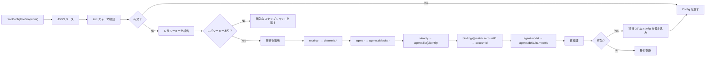
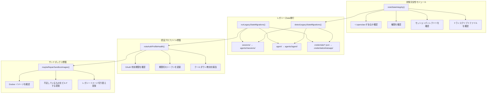
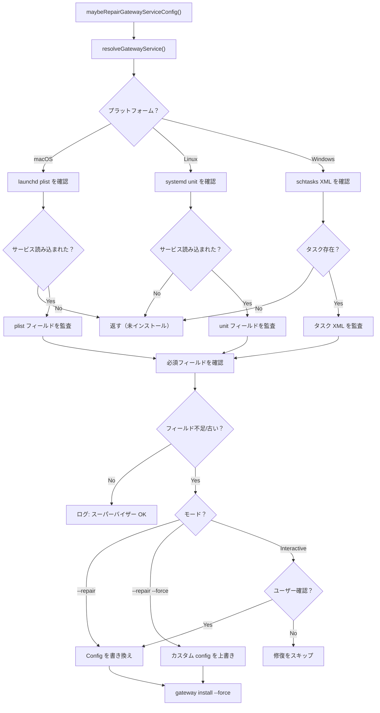
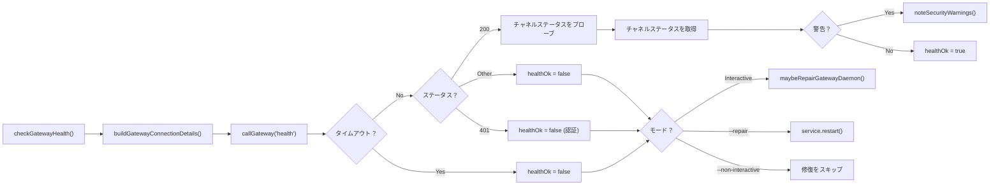
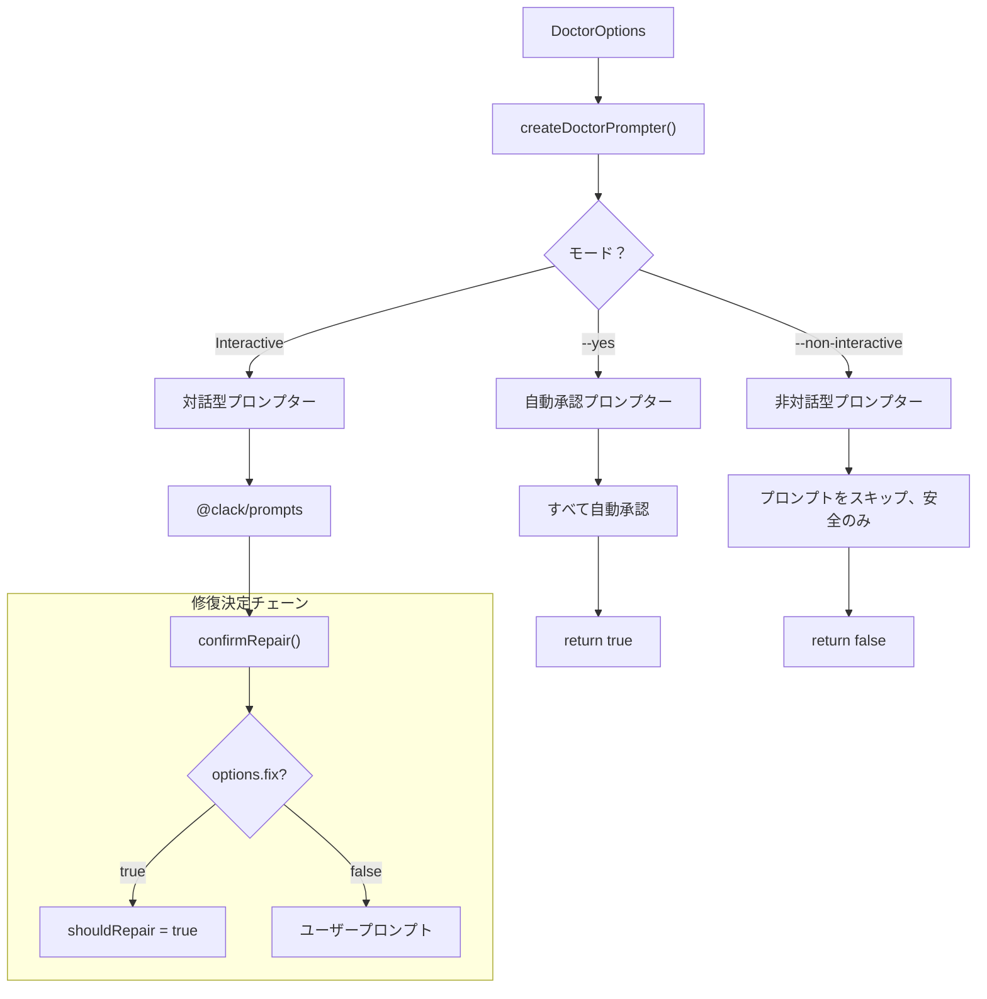
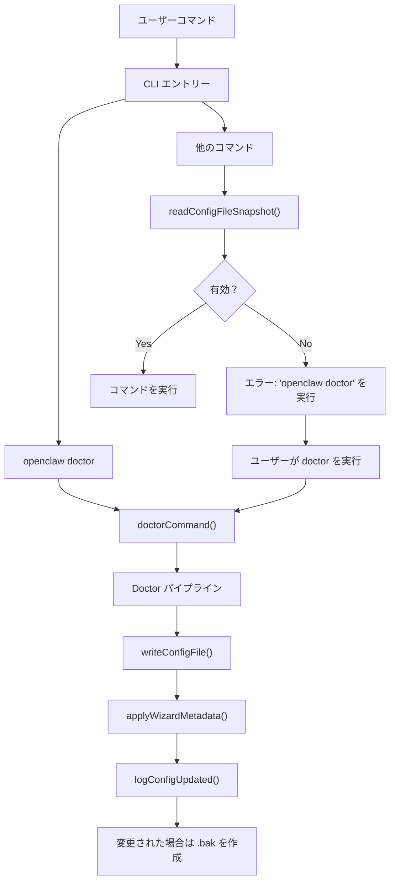

# ドクターコマンドガイド

関連ソースファイル

この Wiki ページの生成に使用されたファイル：

- [docs/gateway/doctor.md](docs/gateway/doctor.md)
- [src/agents/bash-tools.test.ts](src/agents/bash-tools.test.ts)
- [src/agents/pi-tools-agent-config.test.ts](src/agents/pi-tools-agent-config.test.ts)
- [src/agents/sandbox-skills.test.ts](src/agents/sandbox-skills.test.ts)
- [src/commands/configure.gateway.test.ts](src/commands/configure.gateway.test.ts)
- [src/commands/configure.gateway.ts](src/commands/configure.gateway.ts)
- [src/commands/configure.ts](src/commands/configure.ts)
- [src/commands/doctor.ts](src/commands/doctor.ts)
- [src/commands/onboard-helpers.test.ts](src/commands/onboard-helpers.test.ts)
- [src/commands/onboard-helpers.ts](src/commands/onboard-helpers.ts)
- [src/commands/onboard-interactive.ts](src/commands/onboard-interactive.ts)
- [src/config/merge-config.ts](src/config/merge-config.ts)
- [src/wizard/onboarding.gateway-config.test.ts](src/wizard/onboarding.gateway-config.test.ts)
- [src/wizard/onboarding.gateway-config.ts](src/wizard/onboarding.gateway-config.ts)
- [src/wizard/onboarding.ts](src/wizard/onboarding.ts)
- [src/wizard/onboarding.types.ts](src/wizard/onboarding.types.ts)

このページでは `openclaw doctor` コマンドの技術的アーキテクチャと操作について説明します。Doctor は OpenClaw の診断、修復、移行ツールで、自動的なヘルスチェック、設定正規化、状態移行、システム監査を実行します。

一般的なトラブルシューティングのガイドについては、[一般的な問題](#14.3) を参照してください。ヘルスモニタリングの概念については、[ヘルスモニタリング](#14.1) を参照してください。設定ファイルの構造については、[設定ファイルの構造](#4.1) を参照してください。

---

## 目的と範囲

Doctor コマンドは3つの主要機能を提供します：

1. **設定の移行**: レガシーな設定キーを自動的に移行し、設定スキーマを現在のバージョンに正規化します
2. **状態の修復**: ディスク上の状態の不整合（セッション、認証情報、ワークスペースの権限）を検出して修復します
3. **システム監査**: ゲートウェイサービス、サンドボックスイメージ、認証プロファイル、スーパーバイザー設定を検証します

Doctor はデフォルトで対話型ウィザードとして実行されますが、CI/CD や cron ジョブ向けの完全自動モードもサポートします。すべての修復は reversible で、ファイルを変更する前に Doctor はバックアップを作成します。

ソース: [src/commands/doctor.ts:1-313]()

---

## コマンドモードとオプション

Doctor は CLI フラグで制御される複数の実行モードをサポートします。モードはどのチェックを実行し、修復を自動的に適用するかを決定します。

### 実行モード

| モード | フラグ | 動作 |
|--------|--------|------|
| **対話型** | (なし) | 各修復の決定をプロンプト; 全チェックを実行 |
| **自動修復** | `--fix` | プロンプトなしで安全な修復を適用; 設定移行は自動実行 |
| **自動承認** | `--yes` | すべてのデフォルトの修復プロンプトを受け入れる; 再起動とサービス修復を含む |
| **すべて修復** | `--repair` | プロンプトなしで推奨される修復を適用; 攻撃的な修正はスキップ |
| **強制修復** | `--repair --force` | 攻撃的な修復を含めスーパーバイザー設定を上書き |
| **非対話型** | `--non-interactive` | プロンプトなしで実行; 安全な移行のみ; ユーザー確認ステップをスキップ |
| **ディープスキャン** | `--deep` | 追加のゲートウェイインストール（launchd/systemd/schtasks）をシステムサービスからスキャン |

### 追加オプション

| オプション | 目的 |
|-----------|------|
| `--generate-gateway-token` | 認証が不足している場合にゲートウェイトークンの生成を強制 |
| `--workspace-suggestions=false` | ワークスペースのバックアップとメモリシステムの提案をスキップ |

ソース: [src/commands/doctor.ts:65-313](), [src/commands/doctor-prompter.ts:1-100](), [docs/gateway/doctor.md:1-283]()

---

## Doctor 実行パイプライン

Doctor はチェックと修復操作の固定されたパイプラインに従います。パイプラインは依存関係を処理するように設計されています：設定が状態チェックの前に有効でなければならず、チャネルチェックの前にゲートウェイが健全である必要があります。

### 実行フローダイアグラム

```mermaid
flowchart TD
    Start["doctorCommand()"] --> Intro["intro('OpenClaw doctor')"]
    Intro --> Update["maybeOfferUpdateBeforeDoctor()"]

    Update --> UiProtocol["maybeRepairUiProtocolFreshness()"]
    UiProtocol --> SourceCheck["noteSourceInstallIssues()"]
    SourceCheck --> EnvCheck["noteDeprecatedLegacyEnvVars()"]

    EnvCheck --> LoadConfig["loadAndMaybeMigrateDoctorConfig()"]
    LoadConfig --> ConfigValid{Config 有効？}
    ConfigValid -->|No| Error["エラー: Doctor を実行して修復"]
    ConfigValid -->|Yes| AuthRepair["認証プロファイルの修復"]

    AuthRepair --> AuthOAuth["maybeRepairAnthropicOAuthProfileId()"]
    AuthOAuth --> AuthCli["maybeRemoveDeprecatedCliAuthProfiles()"]
    AuthCli --> AuthHealth["noteAuthProfileHealth()"]

    AuthHealth --> GatewayAuth["ゲートウェイ認証を確認"]
    GatewayAuth --> TokenMissing{トークン不足？}
    TokenMissing -->|Yes| GenerateToken["トークン生成 (--generate-gateway-token の場合)"]
    TokenMissing -->|No| StateMigration["レガシースtateの移行"]
    GenerateToken --> StateMigration

    StateMigration --> Detect["detectLegacyStateMigrations()"]
    Detect --> HasLegacy{レガシースtateあり？}
    HasLegacy -->|Yes| Migrate["runLegacyStateMigrations()"]
    HasLegacy -->|No| StateIntegrity["状態完全性チェック"]
    Migrate --> StateIntegrity

    StateIntegrity --> SandboxRepair["サンドボックスの修復"]
    SandboxRepair --> SandboxImages["maybeRepairSandboxImages()"]
    SandboxImages --> SandboxWarnings["noteSandboxScopeWarnings()"]

    SandboxWarnings --> ServiceScans["サービススキャン"]
    ServiceScans --> ExtraServices["maybeScanExtraGatewayServices()"]
    ExtraServices --> ServiceConfig["maybeRepairGatewayServiceConfig()"]

    ServiceConfig --> PlatformChecks["プラットフォーム固有チェック"]
    PlatformChecks --> MacOverrides["noteMacLaunchAgentOverrides()"]
    MacOverrides --> MacEnv["noteMacLaunchctlGatewayEnvOverrides()"]

    MacEnv --> Security["noteSecurityWarnings()"]
    Security --> HooksModel["hooks.gmail.model を検証"]
    HooksModel --> Linger["systemd linger チェック (Linux)"]

    Linger --> WorkspaceStatus["noteWorkspaceStatus()"]
    WorkspaceStatus --> ShellCompletion["doctorShellCompletion()"]

    ShellCompletion --> GatewayHealth["checkGatewayHealth()"]
    GatewayHealth --> HealthOk{ゲートウェイ健全？}
    HealthOk -->|No| DaemonRepair["maybeRepairGatewayDaemon()"]
    HealthOk -->|Yes| WriteDecision{Config を書き込むべき？}
    DaemonRepair --> WriteDecision

    WriteDecision -->|Yes| WriteConfig["writeConfigFile() + メタデータ"]
    WriteDecision -->|No| SkipWrite["ログ: 'doctor --fix' を実行"]

    WriteConfig --> WorkspaceTips["ワークスペースのヒント"]
    SkipWrite --> WorkspaceTips
    WorkspaceTips --> FinalValidation["最終設定検証"]
    FinalValidation --> Outro["outro('Doctor 完了。')"]
```

ソース: [src/commands/doctor.ts:65-313]()

---

## 設定移行システム

Doctor はレガシーな設定スキーマを更新するためのモジュラーな移行システムを使用します。移行はべき等で、何度でも安全に実行できます。

### 移行パイプライン

### 主な移行

移行システムはこれらのスキーマ変更を処理します：

| レガシーなキー | 現在のキー | 移行内容 |
|---------------|------------|----------|
| `routing.allowFrom` | `channels.whatsapp.allowFrom` | チャネル固有の設定に移動 |
| `routing.groupChat.*` | `channels.*.groups.*` | チャネルごとのグループ設定に移動 |
| `routing.queue` | `messages.queue` | セクション名を変更 |
| `routing.bindings` | `bindings` | トップレベルに昇格 |
| `identity` | `agents.list[].identity` | エージェント設定に移動 |
| `agent.*` | `agents.defaults.*` | 複数形に変更 + defaults |
| `agent.model` | `agents.defaults.model.primary` | モデル設定オブジェクトに再構造化 |
| `bindings[].match.accountID` | `bindings[].match.accountId` | キャメルケース修正 |

ソース: [src/commands/doctor-config-flow.ts:1-200](), [docs/gateway/doctor.md:93-128]()

---

## 状態修復メカニズム

Doctor は特殊な修復モジュールを通じてディスク上の状態の問題を検出して修復します。

### 状態修復アーキテクチャ

### 状態完全性チェック

Doctor はこれらの状態不変量を検証します：

1. **状態ディレクトリ**: `~/.openclaw` が存在し書き込み可能であること
2. **セッション永続性**: セッションディレクトリが存在しトランスクリプトにアクセス可能であること
3. **トランスクリプトの一貫性**: セッションストアのエントリがトランスクリプトファイルと一致すること
4. **設定権限**: `openclaw.json` が読み取り可能であること（グループ/ワールド可読の場合は警告）
5. **複数の状態ディレクトリ**: 複数の `~/.openclaw` または `OPENCLAW_STATE_DIR` 競合が検出された場合は警告
6. **リモートモード**: `gateway.mode=remote` の場合はリモートホストで doctor を実行するようユーザーに remind

ソース: [src/commands/doctor-state-integrity.ts:1-150](), [src/commands/doctor-state-migrations.ts:1-200](), [docs/gateway/doctor.md:154-178]()

---

## スーパーバイザー監査と修復

Doctor はプラットフォーム固有のサービススーパーバイザー（launchd、systemd、schtasks）を監査し、古いか欠落したサービス設定を修復できます。

### スーパーバイザー修復フロー

### 監査されるスーパーバイザー フィールド

**systemd** (`~/.config/systemd/user/openclaw-gateway.service`):
- `After=network-online.target`
- `Wants=network-online.target`
- `RestartSec=5`
- `WorkingDirectory` が正しく設定されている
- 環境変数（`OPENCLAW_STATE_DIR`、`NODE_OPTIONS`）

**launchd** (`~/Library/LaunchAgents/ai.openclaw.gateway.plist`):
- `RunAtLoad=true`
- `KeepAlive=true`
- `StandardOutPath` と `StandardErrorPath` が設定されている
- `WorkingDirectory` が現在のインストールと一致する
- 環境上書きを検出（`launchctl setenv` について警告）

**schtasks** (Windows タスケジューラ):
- トリガー: 起動時
- アクション: `openclaw gateway run` を実行
- ワーキングディレクトリが正しく設定されている

ソース: [src/commands/doctor-gateway-services.ts:1-250](), [src/daemon/service.ts:1-500](), [docs/gateway/doctor.md:240-276]()

---

## ヘルスチェックと診断

Doctor は動作時のヘルスチェックと診断を実行して運用上の問題を検出します。

### ヘルスチェックパイプライン

### ゲートウェイデーモン修復

ゲートウェイが健全でない場合、`maybeRepairGatewayDaemon()` は修復アクションを提供します：

1. **ポート競合チェック**: ゲートウェイポート（デフォルト `18789`）のプロセスを検出
2. **サービスステータス**: サービスがインストールされているが実行されていないか確認
3. **最終終了ステータス**: スーパーバイザーログからの非ゼロ終了を報告
4. **ランタイム検出**: Bun またはバージョンマネージャー Node パスについて警告
5. **再起動提案**: ゲートウェイの再起動をプロンプト（`--repair` モードでは自動再起動）

ソース: [src/commands/doctor-gateway-health.ts:1-100](), [src/commands/doctor-gateway-daemon-flow.ts:1-200]()

---

## 対話型と非対話型モード

Doctor は対話型プロンプトと完全自動の操作の両方をサポートします。モードはどの修復が自動的に適用されるかを決定します。

### プロンプターアーキテクチャ

### 修復決定行列

| チェック種類 | 対話型 | `--fix` | `--yes` | `--repair` | `--non-interactive` |
|-------------|--------|---------|---------|------------|---------------------|
| 設定移行 | プロンプト | 自動 | 自動 | 自動 | 自動 |
| レガシースtate移行 | プロンプト | 自動 | 自動 | 自動 | 自動 |
| 認証プロファイル更新 | プロンプト | スキップ | 自動 | 自動 | スキップ |
| ゲートウェイトークン生成 | プロンプト | スキップ | 自動 | スキップ | スキップ |
| サンドボックスイメージビルド | プロンプト | スキップ | 自動 | 自動 | スキップ |
| ゲートウェイ再起動 | プロンプト | スキップ | 自動 | 自動 | スキップ |
| スーパーバイザー設定書き換え | プロンプト | スキップ | 自動 | 自動 | スキップ |
| 攻撃的なスーパーバイザー書き換え | プロンプト | スキップ | 自動 | `--force` | スキップ |

ソース: [src/commands/doctor-prompter.ts:1-100](), [src/commands/doctor.ts:65-313]()

---

## CLI 統合

Doctor は CLI から呼び出され、他のコマンドが無効な設定を検出したときにトリガーされることがあります。

### 呼び出しパス

### ゲートウェイ自動修復

ゲートウェイは起動時に自動的に設定移行を実行します：

1. ゲートウェイ起動 → `loadAndMaybeMigrateDoctorConfig()`
2. レガシーキーが検出された場合 → 自動的に移行を適用
3. 移行された config を書き込み → 移行をログ
4. 移行された config で起動を継続

これは手動の `doctor` 呼び出しなしに古い config が修復されることを保証しますが、設定スキーマ移行のみで、state 修復は依然として明示的な `doctor` 実行が必要です。

ソース: [src/commands/doctor.ts:65-313](), [src/wizard/onboarding.ts:90-119](), [docs/gateway/doctor.md:93-128]()

---

## 終了条件とエラーハンドリング

Doctor は修復結果を伝達するために特定の終了コードとエラーメッセージを使用します。

### 終了シナリオ

| 条件 | アクション | 終了コード |
|------|----------|-----------|
| 移行前の設定が無効 | エラーメッセージ + doctor 実行を提案 | `1` |
| 移行後の設定が無効 | エラー詳細 + 移行失敗 | `1` |
| ユーザーが対話型プロンプトをキャンセル | キャンセルメッセージ | `0`（正常終了） |
| 修復が成功 | アウトルメッセージ | `0` |
| 非対話型 + 危険なアクション | アクションをスキップ、継続 | `0` |

### Config 書き込み決定

Doctor は以下に基づいて config を書き込むかどうかを決定します：

1. `prompter.shouldRepair` フラグ（`--fix`、`--repair`、またはユーザー確認で設定）
2. `configResult.shouldWriteConfig`（移行システムで設定）
3. 修復が適用されたかどうか（認証、サンドボックス、ゲートウェイなど）

`shouldWriteConfig = false` で修復が提案された場合：
- ログ: `変更を適用するには "openclaw doctor --fix" を実行します。`
- バックアップ作成: `~/.openclaw/openclaw.json.bak`

ソース: [src/commands/doctor.ts:282-312](), [src/commands/doctor-prompter.ts:1-100]()

---

## 関連コマンド

Doctor はいくつかの関連コマンドと統合されています：

- **`openclaw onboard`** ([2.3](#2.3)): 無効な設定の doctor 実行を、開始前の onboarding で提案可能
- **`openclaw configure`** ([4.2](#4.2)): 手動設定編集; doctor はその後のスキーマ問題を修復
- **`openclaw gateway install`** ([12.1](#12.1)): スーパーバイザー設定を再インストール; doctor はインストールされた設定を監査
- **`openclaw update`** ([開発](#15)): doctor は実行前に更新を提案（git インストールのみ）

ソース: [src/commands/doctor.ts:79-88](), [src/wizard/onboarding.ts:102-119]()

---