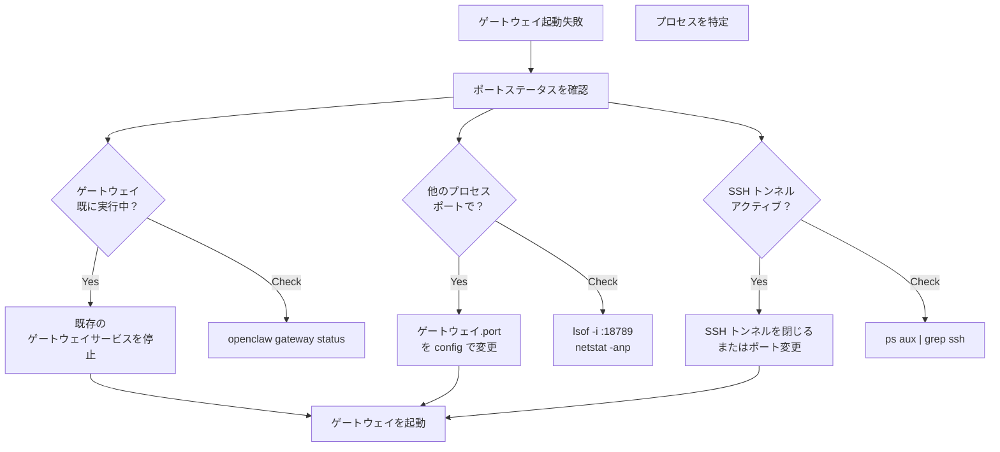
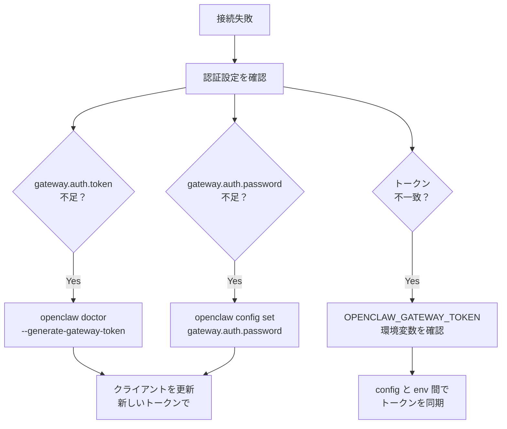
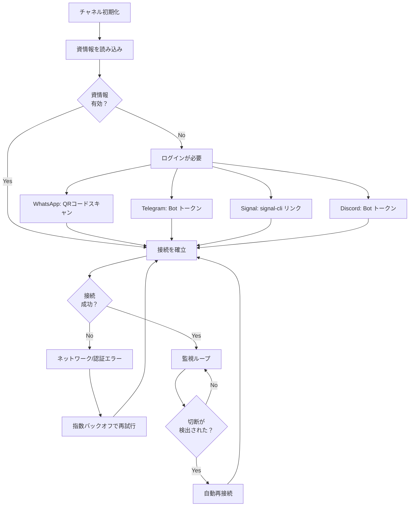
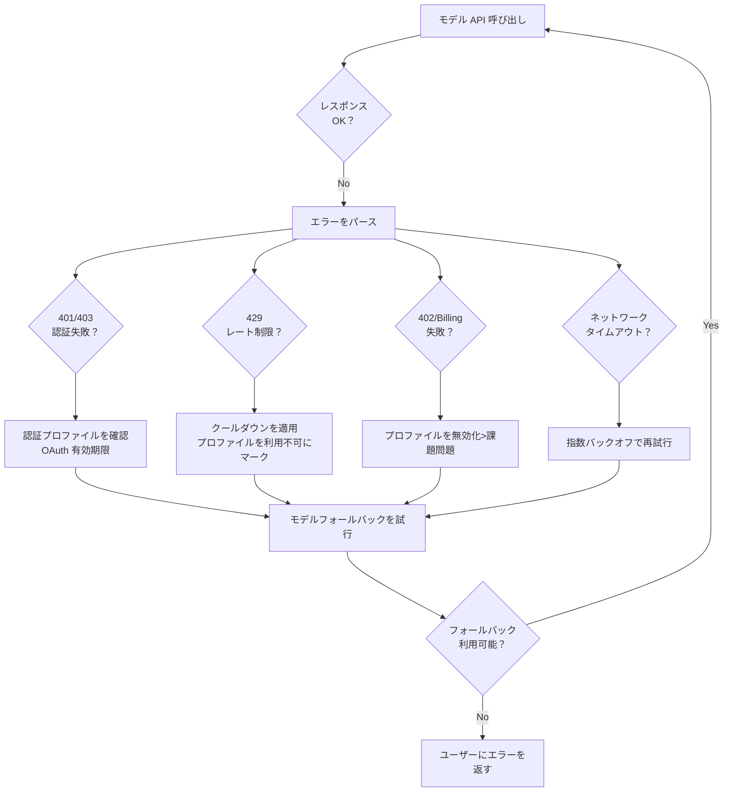
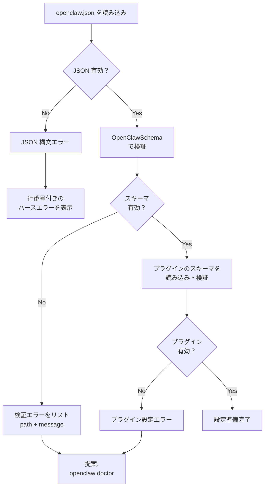
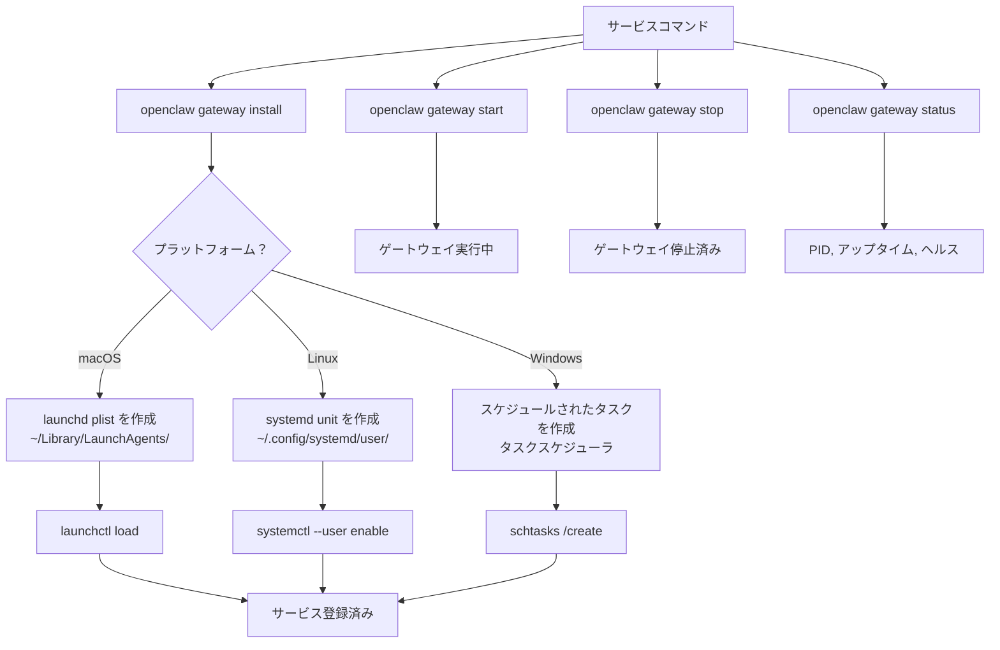
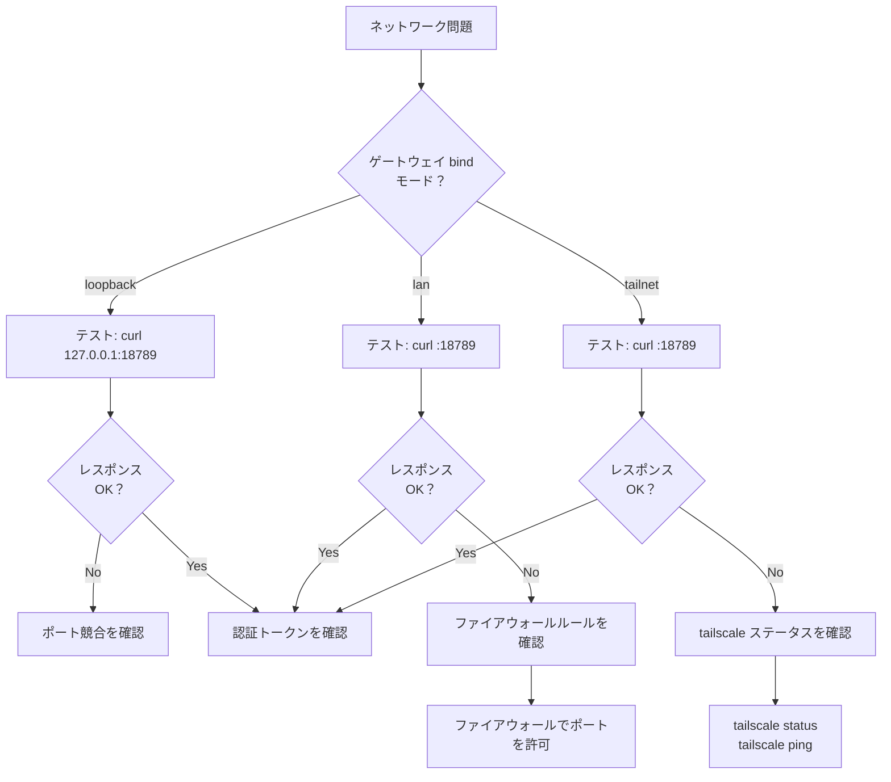
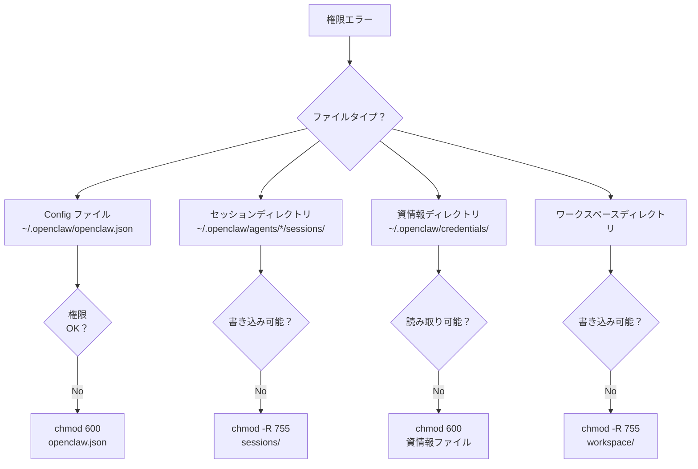

# 一般的な問題

<details>
<summary>関連ソースファイル</summary>

この Wiki ページの生成に使用されたファイル：

- [README.md](README.md)
- [assets/avatar-placeholder.svg](assets/avatar-placeholder.svg)
- [docs/channels/zalo.md](docs/channels/zalo.md)
- [docs/channels/zalouser.md](docs/channels/zalouser.md)
- [docs/gateway/doctor.md](docs/gateway/doctor.md)
- [scripts/clawtributors-map.json](scripts/clawtributors-map.json)
- [scripts/update-clawtributors.ts](scripts/update-clawtributors.ts)
- [scripts/update-clawtributors.types.ts](scripts/update-clawtributors.types.ts)
- [src/agents/bash-tools.test.ts](src/agents/bash-tools.test.ts)
- [src/agents/pi-tools-agent-config.test.ts](src/agents/pi-tools-agent-config.test.ts)
- [src/agents/sandbox-skills.test.ts](src/agents/sandbox-skills.test.ts)
- [src/commands/configure.gateway.test.ts](src/commands/configure.gateway.test.ts)
- [src/commands/configure.gateway.ts](src/commands/configure.gateway.ts)
- [src/commands/configure.ts](src/commands/configure.ts)
- [src/commands/doctor.ts](src/commands/doctor.ts)
- [src/commands/onboard-helpers.test.ts](src/commands/onboard-helpers.test.ts)
- [src/commands/onboard-helpers.ts](src/commands/onboard-helpers.ts)
- [src/commands/onboard-interactive.ts](src/commands/onboard-interactive.ts)
- [src/config/config.ts](src/config/config.ts)
- [src/config/merge-config.ts](src/config/merge-config.ts)
- [src/index.test.ts](src/index.test.ts)
- [src/index.ts](src/index.ts)
- [src/wizard/onboarding.gateway-config.test.ts](src/wizard/onboarding.gateway-config.test.ts)
- [src/wizard/onboarding.gateway-config.ts](src/wizard/onboarding.gateway-config.ts)
- [src/wizard/onboarding.ts](src/wizard/onboarding.ts)
- [src/wizard/onboarding.types.ts](src/wizard/onboarding.types.ts)
- [tsconfig.json](tsconfig.json)
- [ui/src/styles.css](ui/src/styles.css)
- [ui/src/styles/layout.mobile.css](ui/src/styles/layout.mobile.css)

</details>


このページではよく遭遇する問題とその解決策について説明します。ゲートウェイの起動時、ランタイム、チャネル通信中に発生する運用上の障害をカバーしています。

予防的なヘルスモニタリングについては、[ヘルスモニタリング](#14.1) を参照してください。自動修復ワークフローについては、[Doctor コマンドガイド](#14.2) を参照してください。データの保全とバージョンアップグレードについては、[移行とバックアップ](#14.4) を参照してください。

---

## ポート競合

### 症状

ゲートウェイの起動に失敗します：
```
エラー: ポート 18789 は既に使用されています
```

または：
```
EADDRINUSE: address already in use
```

### 診断フロー



**ソース:** [src/infra/ports.ts](), [src/index.ts:26-29]()

### ポート競合の解決

| シナリオ | 検出方法 | 解決策 |
|----------|----------|--------|
| **ゲートウェイが既に実行中** | `openclaw gateway status` が `running` を表示 | `openclaw gateway restart` |
| **複数のゲートウェイインスタンス** | プロセスリストに複数の PID | `openclaw doctor --deep` でサービスをスキャン、余分なものを削除 |
| **SSH トンネルの競合** | `ps aux \| grep "ssh.*18789"` が一致を表示 | トンネルを閉じるまたは別のローカルポートを使用 |
| **他のサービス** | `lsof -i :18789` が非ゲートウェイプロセスを表示 | config の `gateway.port` を変更または他のサービスを停止 |

### コード参照

ポートの可用性チェック：
```typescript
// src/infra/ports.ts
ensurePortAvailable(port: number)
handlePortError(error: unknown, port: number)
class PortInUseError extends Error
```

ポート所有者の検出：
```typescript
// src/infra/ports.ts
describePortOwner(port: number): Promise<string>
```

**ソース:** [src/infra/ports.ts](), [src/commands/doctor.ts:256-262]()

### プラットフォーム固有のコマンド

**macOS/Linux:**
```bash
# ポートを使用しているプロセスを検索
lsof -i :18789

# config でポートを変更
openclaw config set gateway.port 18790
```

**Windows:**
```powershell
# ポートを使用しているプロセスを検索
netstat -ano | findstr :18789

# config でポートを変更
openclaw config set gateway.port 18790
```

**ソース:** [src/infra/ports.ts](), [src/commands/onboard-helpers.ts:360-416]()

---

## 認証エラー

### ゲートウェイ接続の失敗



**ソース:** [src/commands/doctor.ts:125-159](), [src/gateway/auth.ts]()

### 一般的な認証シナリオ

| エラー | 原因 | 解決策 |
|--------|------|--------|
| `Unauthorized` | ゲートウェイとクライアント間のトークン不一致 | `gateway.auth.token` が `OPENCLAW_GATEWAY_TOKEN` と一致することを確認 |
| `Missing authentication` | `gateway.auth.mode` が `token` だがトークンが設定されていない | `openclaw doctor --generate-gateway-token` を実行 |
| `Invalid password` | パスワード不一致 | `gateway.auth.password` または `OPENCLAW_GATEWAY_PASSWORD` を確認 |
| `Token auth required` | ゲートウェイがトークン認証を期待しているのにクライアントがパスワード認証を試行 | 正しい `gateway.auth.mode` を設定 |

### 設定キー

```typescript
// Config スキーマキー
gateway.auth.mode: "token" | "password" | "off"
gateway.auth.token: string
gateway.auth.password: string
gateway.auth.allowTailscale: boolean
```

### Doctor 自動修復

Doctor コマンドは不足しているトークンを検出し、生成を提案します：

```typescript
// src/commands/doctor.ts:125-159
const needsToken = auth.mode !== "password" && (auth.mode !== "token" || !auth.token);
if (needsToken) {
  const nextToken = randomToken();
  cfg = {
    ...cfg,
    gateway: {
      ...cfg.gateway,
      auth: { mode: "token", token: nextToken }
    }
  };
}
```

**ソース:** [src/commands/doctor.ts:125-159](), [src/commands/onboard-helpers.ts:68-77](), [src/gateway/auth.ts]()

---

## チャネル接続の問題

### チャネル状態ダイアグラム



**ソース:** [src/channels/](), [src/wizard/onboarding.ts:434-450]()

### WhatsApp (Baileys) の問題

| 問題 | 症状 | 解決策 |
|------|------|--------|
| **QRコードの有効期限切れ** | スキャン後に接続なし | `openclaw channels login --channel whatsapp` を再実行 |
| **セッションが無効** | "Session closed" エラー | `~/.openclaw/credentials/whatsapp/` をクリアして再ログイン |
| **電話が切断された** | メッセージが停止 | 電話がインターネットに接続されていることを確認、必要に応じて再ペアリング |
| **マルチデバイス制限** | ログイン失敗 | WhatsApp 設定で古いデバイスのリンクを解除 |

資情報のパス：
```
~/.openclaw/credentials/whatsapp/<accountId>/
  ├── creds.json
  ├── keys.json
  └── ...
```

**ソース:** [README.md:335-339](), [src/commands/doctor.ts:142-153]()

### Telegram Bot の問題

| 問題 | 症状 | 解決策 |
|------|------|--------|
| **無効な bot トークン** | `401 Unauthorized` | `TELEGRAM_BOT_TOKEN` または `channels.telegram.botToken` を確認 |
| **Bot が応答しない** | メッセージが受信されない | Bot がユーザーによってブロックされていないことを確認、許可リストを確認 |
| **Webhook の競合** | ポーリング失敗 | Webhook をクリア：`channels.telegram.webhookUrl` を削除 |
| **レート制限** | `429 Too Many Requests` | メッセージ頻度を減らす、Telegram の制限を尊重 |

**ソース:** [README.md:341-354](), [src/channels/telegram.ts]()

### Signal の問題

| 問題 | 症状 | 解決策 |
|------|------|--------|
| **signal-cli が見つからない** | `ENOENT` エラー | signal-cli をインストール：`brew install signal-cli` または AUR から |
| **登録されていない** | "Not registered" エラー | `signal-cli -a +YOUR_NUMBER register` を実行 |
| **デーモンが実行されていない** | メッセージが受信されない | `signal-cli daemon` が実行されていることを確認 |
| **権限が拒否された** | ソケットを読み込めない | `~/.local/share/signal-cli/` の権限を確認 |

Signal はデーモンモードを必要とします：
```bash
signal-cli -a +YOUR_NUMBER daemon
```

**ソース:** [README.md:375-377](), [docs/channels/troubleshooting.md]()

### Discord Bot の問題

| 問題 | 症状 | 解決策 |
|------|------|--------|
| **無効なトークン** | `401 Unauthorized` | `DISCORD_BOT_TOKEN` または `channels.discord.token` を確認 |
| **インテントが不足** | メッセージイベントなし | Discord デベロッパーポータルで Message Content Intent を有効化 |
| **権限が不足** | メッセージを送信できない | チャネルで Bot に Send Messages 権限があることを確認 |
| **レート制限** | `429` レスポンス | Discord のレート制限を尊重、メッセージ頻度を減らす |

必要なインテント：
- `GUILDS`
- `GUILD_MESSAGES`
- `DIRECT_MESSAGES`
- `MESSAGE_CONTENT`

**ソース:** [README.md:360-373](), [src/channels/discord.ts]()

### チャネルのヘルスプローブ

Doctor コマンドはチャネルのヘルスをプローブします：

```typescript
// src/commands/doctor.ts:268-280
const { healthOk } = await checkGatewayHealth({
  runtime,
  cfg,
  timeoutMs: options.nonInteractive === true ? 3000 : 10_000,
});
```

**ソース:** [src/commands/doctor.ts:268-280](), [src/commands/doctor-gateway-health.ts]()

---

## モデルプロバイダーの障害

### モデル障害の解決



**ソース:** [src/agents/model-selection.ts](), [src/agents/model-catalog.ts]()

### 認証プロファイルの問題

| エラー | 原因 | 検出方法 | 解決策 |
|--------|------|----------|--------|
| **トークン期限切れ** | OAuth トークンの有効期限切れ | `openclaw doctor` が有効期限をチェック | トークンを更新または再認証 |
| **無効な API キー** | キーが取り消されたまたは不正 | `401 Unauthorized` | `models.providers.<provider>.apiKey` を更新 |
| **課金障害** | 支払い問題、クォータ超過 | `402`, `403` クォータエラー | プロバイダーの課金を確認、支払いを更新 |
| **レート制限** | 要求が多すぎる | `429 Too Many Requests` | クールダウンを待つ、レート制限を確認 |

### Doctor 認証ヘルスチェック

```typescript
// src/commands/doctor.ts:113-119
cfg = await maybeRepairAnthropicOAuthProfileId(cfg, prompter);
cfg = await maybeRemoveDeprecatedCliAuthProfiles(cfg, prompter);
await noteAuthProfileHealth({
  cfg,
  prompter,
  allowKeychainPrompt: options.nonInteractive !== true && Boolean(process.stdin.isTTY),
});
```

**ソース:** [src/commands/doctor.ts:113-119](), [src/commands/doctor-auth.ts]()

### モデルフォールバックチェーン

プライマリモデルが失敗した場合、OpenClaw はフォールバックを試みます：

```typescript
// モデル解決チェーン
agents.defaults.model.primary →
  agents.defaults.model.fallbacks[0] →
  agents.defaults.model.fallbacks[1] →
  ... →
  DEFAULT_MODEL
```

フォールバックを設定：
```json5
{
  agents: {
    defaults: {
      model: {
        primary: "anthropic/claude-opus-4-6",
        fallbacks: [
          "anthropic/claude-sonnet-4-6",
          "openai/gpt-4o"
        ]
      }
    }
  }
}
```

**ソース:** [src/agents/model-selection.ts](), [src/agents/defaults.ts:5-6]()

### モデルカタログの問題

| 問題 | 症状 | 解決策 |
|------|------|--------|
| **モデルがカタログにない** | "Model not found" | モデルキーを確認、カスタムモデルならカタログを更新 |
| **モデルが許可リストにない** | プライマリにフォールバック | `agents.defaults.models` 配列に追加 |
| **プロバイダーが未設定** | API エラー | `models.providers.<provider>.apiKey` に API キーを設定 |
| **無効なモデル参照** | パースエラー | `provider/model-id` 形式を使用 |

**ソース:** [src/agents/model-catalog.ts](), [src/commands/doctor.ts:197-233]()

---

## 設定の問題

### 設定検証フロー



**ソース:** [src/config/validation.ts](), [src/config/zod-schema.ts](), [src/wizard/onboarding.ts:99-119]()

### 一般的な設定エラー

| エラー | 原因 | 検出方法 | 解決策 |
|--------|------|----------|--------|
| **無効な JSON** | 構文エラー、末尾のカンマ | パース失敗 | JSON 構文を修正、コメントには JSON5 を使用 |
| **不明なキー** | タイプミスまたは非推奨キー | Zod 検証 | 不明なキーを削除、ドキュメントを確認 |
| **型の不一致** | 値の型が不正 | Zod 検証 | 値の型を修正（string と number など） |
| **必須項目不足** | 必須フィールドが省略 | Zod 検証 | 必須フィールドを追加 |
| **レガシー形式** | 古い設定スキーマ | Doctor が検出 | `openclaw doctor` を実行して移行 |

### 設定ファイルの場所

```
~/.openclaw/
  ├── openclaw.json          # メイン設定
  ├── openclaw.json.bak      # 最書き込み時のバックアップ
  └── credentials/           # 認証トークン
      ├── oauth.json
      ├── whatsapp/
      └── ...
```

**ソース:** [src/config/paths.ts](), [src/config/io.ts]()

### 検証エラー形式

```typescript
// src/config/validation.ts
type ConfigIssue = {
  path: string;           // 例: "gateway.port"
  message: string;        // エラー説明
  code?: string;          // Zod エラーコード
};
```

検証失敗時：
```
無効な設定:
- gateway.port: 数値を期待、文字列を受け取り
- channels.whatsapp.allowFrom: 必須
```

**ソース:** [src/config/validation.ts:1-14](), [src/wizard/onboarding.ts:103-112]()

### 設定の移行

レガシーな設定キーは自動的に移行されます：

| 旧キー | 新キー |
|--------|--------|
| `routing.allowFrom` | `channels.whatsapp.allowFrom` |
| `routing.queue` | `messages.queue` |
| `agent.model` | `agents.defaults.model.primary` |
| `agent.tools.*` | `tools.*` |
| `identity` | `agents.list[].identity` |

**ソース:** [src/config/legacy-migrate.ts](), [docs/gateway/doctor.md:112-128]()

### Doctor 設定修復

```typescript
// src/commands/doctor.ts:94-111
const configResult = await loadAndMaybeMigrateDoctorConfig({
  options,
  confirm: (p) => prompter.confirm(p),
});
let cfg: OpenClawConfig = configResult.cfg;

const configPath = configResult.path ?? CONFIG_PATH;
if (!cfg.gateway?.mode) {
  const lines = [
    "gateway.mode が設定されていません; ゲートウェイ起動がブロックされます。",
    `修正: ${formatCliCommand("openclaw configure")} を実行してゲートウェイモード（local/remote）を設定。`,
  ];
  note(lines.join("\n"), "Gateway");
}
```

**ソース:** [src/commands/doctor.ts:94-111](), [src/commands/doctor-config-flow.ts]()

---

## サービスとデーモンの問題

### サービス状態管理



**ソース:** [src/daemon/service.ts](), [src/commands/gateway-service.ts]()

### サービストラブルシューティング

| 問題 | プラットフォーム | 検出方法 | 解決策 |
|------|----------------|----------|--------|
| **サービスが見つからない** | 全て | `openclaw gateway status` が "not installed" を表示 | `openclaw gateway install` を実行 |
| **サービスが起動しない** | 全て | ステータスが "failed" を表示 | ログを確認：`openclaw logs --follow` |
| **権限拒否** | macOS | `launchctl load` が失敗 | plist 権限を確認 |
| **サービスがすぐに終了** | Linux | systemd が "inactive (dead)" を表示 | `journalctl --user -u openclaw-gateway` を確認 |
| **古い PID** | 全て | PID は存在するがプロセスは停止 | ロックファイルを削除、サービスを再起動 |

### プラットフォーム固有のコマンド

**macOS (launchd):**
```bash
# サービスステータスを確認
launchctl list | grep openclaw

# ログを表示
tail -f ~/Library/Logs/openclaw/gateway.log

# 設定変更後にサービスを再読み込み
launchctl kickstart gui/$UID/ai.openclaw.gateway
```

**Linux (systemd):**
```bash
# サービスステータスを確認
systemctl --user status openclaw-gateway

# ログを表示
journalctl --user -u openclaw-gateway -f

# サービスを再起動
systemctl --user restart openclaw-gateway
```

**Windows (タスケジューラ):**
```powershell
# タスクステータスを確認
Get-ScheduledTask -TaskName "OpenClaw Gateway"

# ログを表示
Get-EventLog -LogName Application -Source "OpenClaw" -Newest 50
```

**ソース:** [src/daemon/launchd.ts](), [src/daemon/systemd.ts](), [src/daemon/windows-task.ts]()

### systemd Linger (Linux)

ログアウト後にゲートウェイサービスが停止する場合：

```bash
# linger ステータスを確認
loginctl show-user $USER | grep Linger

# linger を有効化
sudo loginctl enable-linger $USER
```

Doctor はこれを自動チェックします：
```typescript
// src/commands/doctor.ts:236-259
if (process.platform === "linux" && resolveMode(cfg) === "local") {
  await ensureSystemdUserLingerInteractive({
    runtime,
    prompter: { confirm, note },
    reason: "Gateway は systemd ユーザーサービスとして実行されます...",
    requireConfirm: true,
  });
}
```

**ソース:** [src/commands/doctor.ts:236-259](), [src/commands/systemd-linger.ts]()

### サービスヘルスチェック

```typescript
// src/daemon/service.ts
interface GatewayService {
  install(params: { env?: NodeJS.ProcessEnv }): Promise<void>;
  uninstall(params: { env?: NodeJS.ProcessEnv }): Promise<void>;
  start(params: { env?: NodeJS.ProcessEnv }): Promise<void>;
  stop(params: { env?: NodeJS.ProcessEnv }): Promise<void>;
  restart(params: { env?: NodeJS.ProcessEnv }): Promise<void>;
  isLoaded(params: { env?: NodeJS.ProcessEnv }): Promise<boolean>;
  isRunning(params: { env?: NodeJS.ProcessEnv }): Promise<boolean>;
}
```

**ソース:** [src/daemon/service.ts](), [src/commands/doctor-gateway-daemon-flow.ts]()

---

## ネットワークとファイアウォールの問題

### ネットワーク診断フロー



**ソース:** [src/commands/onboard-helpers.ts:360-416](), [src/gateway/net.ts]()

### ファイアウォールルール

| プラットフォーム | デフォルトファイアウォール | 許可コマンド |
|----------------|--------------------------|--------------|
| **macOS** | アプリケーションファイアウォール | システム環境設定 → セキュリティとプライバシー → ファイアウォール |
| **Linux (ufw)** | UFW | `sudo ufw allow 18789/tcp` |
| **Linux (firewalld)** | firewalld | `sudo firewall-cmd --add-port=18789/tcp --permanent` |
| **Windows** | Windows Defender | PowerShell: `New-NetFirewallRule -DisplayName "OpenClaw" -Direction Inbound -LocalPort 18789 -Protocol TCP -Action Allow` |

**ソース:** [docs/gateway/configuration.md](), [src/commands/onboard-helpers.ts:436-466]()

### Tailscale の問題

| 問題 | 症状 | 解決策 |
|------|------|--------|
| **接続されていない** | `tailscale status` が未接続を表示 | `tailscale up` |
| **ファネルアクセスなし** | `tailscale funnel status` が失敗 | Tailscale サブスクリプションがファネルをサポートしていることを確認 |
| **Serve が動作しない** | tailnet 経由でゲートウェイに到達できない | serve 使用時には `gateway.bind = "loopback"` を確認 |
| **証明書エラー** | HTTPS エラー | Tailscale 証明書のプロビジョニングを待つ |

Tailscale 検出：
```typescript
// src/infra/tailscale.ts
async function findTailscaleBinary(): Promise<string | undefined>
function pickPrimaryTailnetIPv4(): string | undefined
```

**ソース:** [src/infra/tailscale.ts](), [src/wizard/onboarding.gateway-config.ts:124-159]()

### リモートゲートウェイプローブ

Doctor と onboard はゲートウェイ到達性をプローブします：

```typescript
// src/commands/onboard-helpers.ts:360-382
export async function probeGatewayReachable(params: {
  url: string;
  token?: string;
  password?: string;
  timeoutMs?: number;
}): Promise<{ ok: boolean; detail?: string }>
```

**ソース:** [src/commands/onboard-helpers.ts:360-416]()

---

## 権限とファイルシステムエラー

### 権限エラータイプ



**ソース:** [src/commands/doctor-state-integrity.ts](), [src/utils.ts]()

### 一般的な権限問題

| エラー | 原因 | 解決策 |
|--------|------|--------|
| **EACCES config** | Config ファイルが読み取れない | `chmod 600 ~/.openclaw/openclaw.json` |
| **EACCES sessions** | セッションディレクトリが書き込めない | `chmod -R 755 ~/.openclaw/agents/*/sessions/` |
| **ENOENT state dir** | 状態ディレクトリが存在しない | `mkdir -p ~/.openclaw` |
| **Group/world readable** | Config が他のユーザーに公開 | Doctor が警告、権限を厳格化する提案 |

### 状態ディレクトリ構造

```
~/.openclaw/                              # State ルート (OPENCLAW_STATE_DIR)
  ├── openclaw.json                       # メイン設定 (chmod 600)
  ├── openclaw.json.bak                   # バックアップ
  ├── credentials/                        # 認証ストレージ
  │   ├── oauth.json                      # OAuth トークン (chmod 600)
  │   ├── whatsapp/<accountId>/          # WhatsApp 資情報
  │   └── ...
  ├── agents/                             # エージェントごとの状態
  │   └── <agentId>/
  │       ├── sessions/                   # セッショントランスクリプト
  │       │   ├── sessions.jsonl
  │       │   └── transcripts/
  │       └── agent/                      # エージェント状態
  ├── workspace/                          # デフォルトワークスペース
  │   ├── IDENTITY.md
  │   ├── SKILLS.md
  │   └── skills/
  └── logs/                               # ゲートウェイログ
      └── gateway.log
```

**ソース:** [src/config/paths.ts](), [src/commands/doctor-state-integrity.ts]()

### Doctor 状態完全性チェック

```typescript
// src/commands/doctor.ts:185
await noteStateIntegrity(cfg, prompter, configResult.path ?? CONFIG_PATH);
```

チェック項目：
- 状態ディレクトリが存在し書き込み可能
- セッションストアファイルが存在
- Config ファイルの権限（グループ/ワールド可読の場合は警告）
- トランスクリプトファイルがセッションストアエントリと一致

**ソース:** [src/commands/doctor.ts:185](), [src/commands/doctor-state-integrity.ts]()

### ファイルシステムエラー

| エラー | 原因 | 解決策 |
|--------|------|--------|
| **ENOENT** | ファイル/ディレクトリが存在しない | 不足しているパスを作成、config パスを確認 |
| **EACCES** | 権限拒否 | ファイル/ディレクトリの権限を修正 |
| **ENOSPC** | ディスクフル | ディスクスペースを解放、ログローテーションを確認 |
| **EMFILE** | 開いているファイルが多すぎる | ulimit を増加、ファイルハンドルリークを確認 |

**ソース:** [src/utils.ts](), [src/config/io.ts]()

---

## クイックリファレンス：エラーから解決へのマッピング

| エラーパターン | セクション | 最初のステップ |
|---------------|------------|----------------|
| `EADDRINUSE`, `Port ... in use` | ポート競合 | `openclaw gateway status` |
| `Unauthorized`, `Invalid token` | 認証エラー | `gateway.auth.token` を確認 |
| `401 Unauthorized` (チャネル) | チャネル接続 | チャネル資情報を確認 |
| `429 Too Many Requests` | モデルプロバイダー障害 | レート制限リセットを待つ |
| `Expected ..., received ...` | 設定の問題 | `openclaw doctor` を実行 |
| `Service not found` | サービスとデーモン | `openclaw gateway install` |
| `Connection refused` | ネットワークとファイアウォール | `gateway.bind` モードを確認 |
| `EACCES`, `Permission denied` | 権限エラー | ファイル権限を確認 |

**ソース:** [README.md](), [docs/gateway/doctor.md]()

---

**ソース:** [README.md](), [src/index.ts](), [src/commands/doctor.ts](), [src/wizard/onboarding.ts](), [src/commands/onboard-helpers.ts](), [src/infra/ports.ts](), [src/gateway/auth.ts](), [src/config/validation.ts](), [src/daemon/service.ts](), [docs/gateway/doctor.md](), [docs/channels/troubleshooting.md]()

---