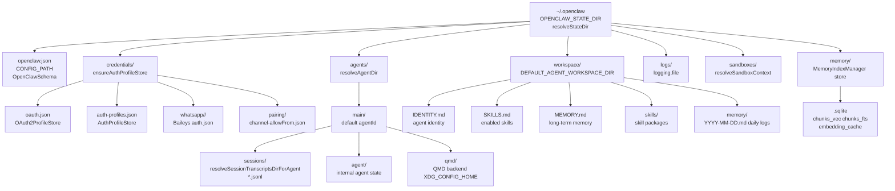
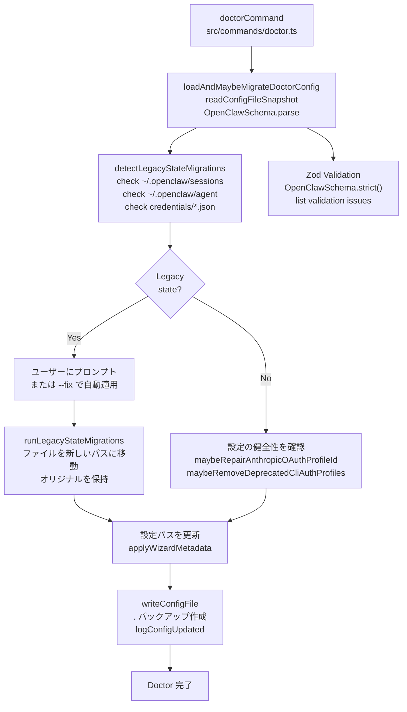
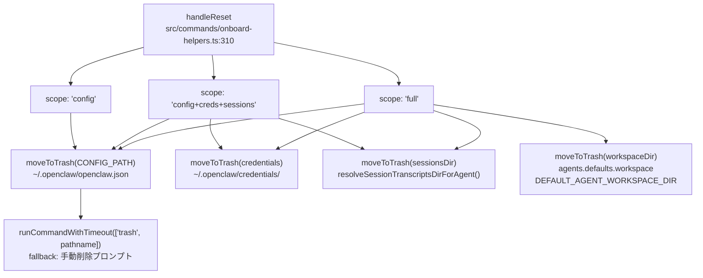

# 移行とバックアップ

<details>
<summary>関連ソースファイル</summary>

この Wiki ページの生成に使用されたファイル：

- [CHANGELOG.md](CHANGELOG.md)
- [docs/cli/memory.md](docs/cli/memory.md)
- [docs/cli/sandbox.md](docs/cli/sandbox.md)
- [docs/concepts/memory.md](docs/concepts/memory.md)
- [docs/gateway/configuration.md](docs/gateway/configuration.md)
- [docs/gateway/doctor.md](docs/gateway/doctor.md)
- [docs/gateway/sandbox-vs-tool-policy-vs-elevated.md](docs/gateway/sandbox-vs-tool-policy-vs-elevated.md)
- [docs/gateway/sandboxing.md](docs/gateway/sandboxing.md)
- [docs/platforms/mac/skills.md](docs/platforms/mac/skills.md)
- [docs/tools/elevated.md](docs/tools/elevated.md)
- [docs/tools/index.md](docs/tools/index.md)
- [docs/tools/skills-config.md](docs/tools/skills-config.md)
- [src/agents/bash-tools.test.ts](src/agents/bash-tools.test.ts)
- [src/agents/memory-search.test.ts](src/agents/memory-search.test.ts)
- [src/agents/memory-search.ts](src/agents/memory-search.ts)
- [src/agents/pi-tools-agent-config.test.ts](src/agents/pi-tools-agent-config.test.ts)
- [src/agents/sandbox-explain.test.ts](src/agents/sandbox-explain.test.ts)
- [src/agents/sandbox-skills.test.ts](src/agents/sandbox-skills.test.ts)
- [src/agents/sandbox.ts](src/agents/sandbox.ts)
- [src/cli/memory-cli.test.ts](src/cli/memory-cli.test.ts)
- [src/cli/memory-cli.ts](src/cli/memory-cli.ts)
- [src/cli/models-cli.test.ts](src/cli/models-cli.test.ts)
- [src/commands/configure.gateway.test.ts](src/commands/configure.gateway.test.ts)
- [src/commands/configure.gateway.ts](src/commands/configure.gateway.ts)
- [src/commands/configure.ts](src/commands/configure.ts)
- [src/commands/doctor.ts](src/commands/doctor.ts)
- [src/commands/onboard-helpers.test.ts](src/commands/onboard-helpers.test.ts)
- [src/commands/onboard-helpers.ts](src/commands/onboard-helpers.ts)
- [src/commands/onboard-interactive.ts](src/commands/onboard-interactive.ts)
- [src/config/merge-config.ts](src/config/merge-config.ts)
- [src/config/schema.ts](src/config/schema.ts)
- [src/config/types.tools.ts](src/config/types.tools.ts)
- [src/config/types.ts](src/config/types.ts)
- [src/config/zod-schema.agent-runtime.ts](src/config/zod-schema.agent-runtime.ts)
- [src/config/zod-schema.ts](src/config/zod-schema.ts)
- [src/memory/embeddings.test.ts](src/memory/embeddings.test.ts)
- [src/memory/embeddings.ts](src/memory/embeddings.ts)
- [src/memory/manager.ts](src/memory/manager.ts)
- [src/wizard/onboarding.gateway-config.test.ts](src/wizard/onboarding.gateway-config.test.ts)
- [src/wizard/onboarding.gateway-config.ts](src/wizard/onboarding.gateway-config.ts)
- [src/wizard/onboarding.ts](src/wizard/onboarding.ts)
- [src/wizard/onboarding.types.ts](src/wizard/onboarding.types.ts)

</details>


このページでは OpenClaw インストールのバックアップ戦略、バージョン移行手順、復旧ワークフローについて説明します。アップグレード時やマシン間の移行時にワークスペースファイル、セッション、資情報、設定を保持する方法に焦点を当てます。

一般的なトラブルシューティングとヘルスチェックについては、[14.1](#14.1) を参照してください。Doctor コマンドの移行機能については、[14.2](#14.2) を参照してください。

---

## 概要

OpenClaw は状態を `~/.openclaw/` （または `$OPENCLAW_STATE_DIR` ）に保存します。これには以下が含まれます：
- **設定** (`openclaw.json`)
- **資情報** (API キー、OAuth トークン、チャネル認証)
- **セッション** (エージェントごとの会話履歴)
- **ワークスペース** (エージェントファイル、スキル、メモリ)
- **エージェントディレクトリ** (内部エージェント状態)

バックアップはこの状態を保持します。移行はレガシーな構造を現在のスキーマに更新します。

**ソース:** [src/commands/onboard-helpers.ts:301-311](), [docs/gateway/doctor.md:1-278]()

---

## 状態ディレクトリ構造

タイトル：OpenClaw 状態ディレクトリレイアウト



**ソース:** [src/config/paths.ts:1-50](), [src/agents/workspace.ts:1-200](), [src/commands/onboard-helpers.ts:258-280](), [src/config/sessions/paths.ts:1-100](), [src/memory/manager.ts:68-248](), [docs/concepts/memory.md:17-29]()

---

## バックアップ対象

### 重要なファイル

| コンポーネント | パス | 内容 | 頻度 |
|--------------|------|------|------|
| **設定** | `~/.openclaw/openclaw.json` | ゲートウェイ設定、モデル設定、チャネルバインディング | 主な変更前 |
| **資情報** | `~/.openclaw/credentials/` | API キー、OAuth トークン、WhatsApp 認証 | ログイン/認証変更後 |
| **セッション** | `~/.openclaw/agents/<agentId>/sessions/` | 会話履歴 (JSONL) | 日次または週次 |
| **ワークスペース** | `~/.openclaw/workspace/` (またはカスタム) | エージェント ID、スキル、メモリ | カスタマイズ後 |
| **エージェントディレクトリ** | `~/.openclaw/agents/<agentId>/agent/` | 内部エージェント状態 | セッションと共に |

### 環境変数

環境変数経由で config を上書きしている場合は `.env` ファイルをバックアップします：
- `OPENCLAW_STATE_DIR`
- `OPENCLAW_GATEWAY_TOKEN`
- モデル API キー (`ANTHROPIC_API_KEY`, `OPENAI_API_KEY` など)

**ソース:** [docs/gateway/doctor.md:154-178](), [src/commands/onboard-helpers.ts:301-311]()

---

## バックアップ手順

### 手動バックアップ（推奨）

```bash
# タイムスタンプ付きバックアップを作成
BACKUP_DIR=~/openclaw-backup-$(date +%Y%m%d-%H%M%S)
mkdir -p "$BACKUP_DIR"

# 状態ディレクトリをコピー
cp -r ~/.openclaw "$BACKUP_DIR/state"

# 参考用に現在の config をエクスポート
openclaw config get > "$BACKUP_DIR/config.json"

# 圧縮
tar -czf "$BACKUP_DIR.tar.gz" -C "$BACKUP_DIR" .
rm -rf "$BACKUP_DIR"

echo "バックアップを $BACKUP_DIR.tar.gz に保存"
```

### 選択的バックアップ（高速）

重要なファイルのみが必要な場合：

```bash
BACKUP_DIR=~/openclaw-backup-$(date +%Y%m%d-%H%M%S)
mkdir -p "$BACKUP_DIR"

# コア状態のみ
cp ~/.openclaw/openclaw.json "$BACKUP_DIR/"
cp -r ~/.openclaw/credentials "$BACKUP_DIR/"
cp -r ~/.openclaw/agents/main/sessions "$BACKUP_DIR/"
cp -r ~/.openclaw/workspace "$BACKUP_DIR/"
```

### 自動バックアップ（Cron）

日次バックアップ用に crontab に追加：

```bash
# 午前3時に日次バックアップ
0 3 * * * /path/to/backup-openclaw.sh
```

`backup-openclaw.sh` の例：

```bash
#!/bin/bash
BACKUP_ROOT=~/openclaw-backups
BACKUP_DIR="$BACKUP_ROOT/openclaw-$(date +%Y%m%d)"
mkdir -p "$BACKUP_DIR"

# バックアップ（ローテーション：最後の7日間を保持）
cp -r ~/.openclaw "$BACKUP_DIR/state"
find "$BACKUP_ROOT" -type d -name "openclaw-*" -mtime +7 -exec rm -rf {} +
```

**ソース:** [docs/gateway/doctor.md:298-300](), [src/commands/onboard-helpers.ts:301-311]()

---

## バージョン間の移行

### 自動移行（経由：Doctor）

`openclaw doctor` コマンドは移行を自動的に検出して適用します：

```bash
# 移行を確認
openclaw doctor

# すべての推奨移行を適用
openclaw doctor --fix

# 非対話型（安全な移行のみ）
openclaw doctor --non-interactive
```

タイトル：Doctor 移行フロー



**ソース:** [src/commands/doctor.ts:65-313](), [src/commands/doctor-config-flow.ts:1-100](), [src/commands/doctor-state-migrations.ts:1-200](), [src/config/config.ts:1-100]()

### レガシースtate移行

Doctor は `detectLegacyStateMigrations` と `runLegacyStateMigrations` 経由でこれらのディスク上レイアウト変更を処理します：

| 旧パス | 新パス | 何 | 移行関数 |
|--------|--------|------|----------|
| `~/.openclaw/sessions/` | `~/.openclaw/agents/<agentId>/sessions/` | セッショントランスクリプト (JSONL) | `detectLegacyStateMigrations` |
| `~/.openclaw/agent/` | `~/.openclaw/agents/<agentId>/agent/` | エージェント状態ディレクトリ | `detectLegacyStateMigrations` |
| `~/.openclaw/credentials/*.json` | `~/.openclaw/credentials/whatsapp/<accountId>/` | WhatsApp Baileys 認証 | `detectLegacyStateMigrations` |
| `.clawdbot/` レガシーパス | `~/.openclaw/` | 完全な状態ディレクトリ移行 | インストール中のレガシー名前変更 |

**移行はべき等で、オリジナルを `.old` サフィックスまたは別のバックアップパスとして保持します。**

移行ロジック：
- 既知の古い場所で `fs.existsSync()` をチェックしてレガシーパスを検出
- ユーザーに対話的にプロンプトまたは `--fix` で自動適用
- `fs.rename()` を使用してディレクトリをアトミックに移動
- すべての変更を doctor 出力にログ
- 新しいパスを指すように設定参照を更新

**ソース:** [src/commands/doctor-state-migrations.ts:1-200](), [src/commands/doctor.ts:161-183](), [docs/gateway/doctor.md:96-147]()

### 設定キーの移行

Doctor は非推奨の設定キーを再マップします：

| レガシーキー | 現在のキー | 備考 |
|------------|------------|------|
| `routing.allowFrom` | `channels.whatsapp.allowFrom` | チャネルごとの許可リスト |
| `routing.groupChat.*` | `channels.<channel>.groups` + `messages.groupChat` | 設定を分割 |
| `routing.bindings` | トップレベルの `bindings` | マルチエージェントルーティング |
| `agent.*` | `agents.defaults.*` + `tools.*` | エージェントスコープ設定 |
| `identity` | `agents.list[].identity` | エージェントごとの ID |
| `agent.model` | `agents.defaults.model.primary` | モデル選択 |

**ソース:** [docs/gateway/doctor.md:112-128](), [src/commands/doctor.ts:94-120]()

### 手動移行手順

OpenClaw 自体をアップグレードする場合：

```bash
# 1. 現在の状態をバックアップ
tar -czf ~/openclaw-backup-pre-upgrade.tar.gz ~/.openclaw

# 2. OpenClaw を更新
npm install -g openclaw@latest
# git インストールの場合：
cd ~/openclaw && git pull && pnpm install && pnpm build

# 3. 移行のために doctor を実行
openclaw doctor --fix

# 4. ゲートウェイを再起動
openclaw gateway restart

# 5. 確認
openclaw status
openclaw health
```

**ソース:** [docs/install/updating.md](), [docs/gateway/troubleshooting.md:513-533]()

---

## バックアップからの復旧

### 完全な状態復元

```bash
# まずゲートウェイを停止
openclaw gateway stop

# バックアップを展開
cd ~
tar -xzf openclaw-backup-20250113.tar.gz

# 現在の状態を移動（安全のため）
mv ~/.openclaw ~/.openclaw.old

# バックアップから復元
mv state ~/.openclaw

# 権限を修正（config は 600 であるべき）
chmod 755 ~/.openclaw
chmod 600 ~/.openclaw/openclaw.json
chmod -R 755 ~/.openclaw/agents

# ゲートウェイを再起動
openclaw gateway start

# 復元を確認
openclaw status
openclaw health
```

### 選択的復元

特定のコンポーネントのみを復元：

```bash
# 設定のみを復元（ゲートウェイが実行中の場合はホットリロードをトリガー）
cp backup/openclaw.json ~/.openclaw/
# ゲートウェイは config ファイルウォッチャー経由でリロード（gateway.reload.mode）

# 資情報のみを復元
rm -rf ~/.openclaw/credentials
cp -r backup/credentials ~/.openclaw/

# 特定エージェントのセッションを復元
# （セッションファイル：resolveSessionTranscriptsDirForAgent）
cp -r backup/agents/main/sessions ~/.openclaw/agents/main/

# メモリインデックスを復元（MemoryIndexManager SQLite）
cp backup/memory/main.sqlite ~/.openclaw/memory/

# 必要な移行を適用
openclaw doctor --fix
```

**注意:** ゲートウェイは `CONFIG_PATH` の変更を監視し、`gateway.reload.mode` に基づいてホットリロードを適用します（デフォルト：`hybrid`）。ほとんどの設定変更は再起動なしで適用されますが、`gateway.port`、`gateway.bind`、インフラ設定は再起動が必要です。

**ソース:** [src/commands/onboard-helpers.ts:310-320](), [docs/gateway/doctor.md:154-178](), [docs/gateway/configuration.md:327-365](), [src/config/config.ts:1-100]()

---

## 新しいマシンへの移行

### 古いマシンからエクスポート

```bash
# 古いマシンで
EXPORT_DIR=~/openclaw-export
mkdir -p "$EXPORT_DIR"

# 完全な状態
cp -r ~/.openclaw "$EXPORT_DIR/state"

# サービス設定（デーモン使用の場合）
openclaw gateway status > "$EXPORT_DIR/service-status.txt"

# 圧縮
tar -czf ~/openclaw-export.tar.gz -C "$EXPORT_DIR" .
```

### 新しいマシンにインポート

```bash
# 新しいマシンで
# 1. OpenClaw をインストール
npm install -g openclaw@latest

# 2. バックアップを展開
tar -xzf openclaw-export.tar.gz
mv state ~/.openclaw

# 3. config のパスを更新（必要な場合）
openclaw configure

# 4. パス問題を修正するために doctor を実行
openclaw doctor --fix

# 5. サービスをインストール
openclaw gateway install

# 6. 起動
openclaw gateway start
```

**ソース:** [src/wizard/onboarding.ts:89-470](), [docs/start/wizard.md:1-103]()

---

## リセットとクリーンインストール

### スコープレベル

`onboard-helpers.ts` の `handleReset` 関数は3つのリセットスコープをサポートします：

タイトル：リセットスコープ階層（handleReset 関数）



リセットフローは、ユーザーが "Reset" アクションを選択したときの onboard ウィザード中に呼び出されます。`moveToTrash` 関数は利用可能な場合 `trash` CLI ユーティリティを使用してファイルをシステムのゴミ箱に移動し、復旧を可能にします。`trash` が利用できない場合、手動削除指示をログに記録します。

**ソース:** [src/commands/onboard-helpers.ts:293-320](), [src/wizard/onboarding.ts:168-186]()

### クリーンインストール手順

```bash
# 1. まずバックアップ（保持したい場合）
tar -czf ~/openclaw-backup-before-reset.tar.gz ~/.openclaw

# 2. ゲートウェイを停止
openclaw gateway stop

# 3. サービスをアンインストール
openclaw gateway uninstall

# 4. 状態を削除（または onboard 中にリセットを使用）
rm -rf ~/.openclaw

# 5. 再オンboarding
openclaw onboard

# 6. 必要に応じて選択的项目を復元
# （例：特定のセッションやワークスペースファイルをコピー戻す）
```

**ソース:** [src/commands/onboard-helpers.ts:301-311](), [docs/gateway/troubleshooting.md:262-298]()

---

## 一般的な移行シナリオ

### シナリオ 1：複数のワークスペース検出

**症状:** Doctor が余分なワークスペースフォルダについて警告（例：`~/openclaw` と `~/.openclaw/workspace`）

**修正：**

```bash
# 1. どのワークスペースがアクティブかを確認
openclaw status | grep workspace

# 2. 非アクティブなワークスペースをアーカイブ
mv ~/openclaw ~/openclaw.old

# 3. 確認
openclaw doctor
```

**ソース:** [docs/gateway/troubleshooting.md:253-263]()

### シナリオ 2：アップグレード後の設定無効

**症状:** ゲートウェイが起動を拒否、"configuration invalid"

**修正：**

```bash
# 1. 何が無効かを確認
openclaw doctor

# 2. 移行を適用
openclaw doctor --fix

# 3. それでも壊れている場合、手動で検証
cat ~/.openclaw/openclaw.json | jq .

# 4. 最悪の場合：設定をリセットしてバックアップから復元
mv ~/.openclaw/openclaw.json ~/.openclaw/openclaw.json.broken
openclaw onboard
# .broken ファイルから設定をマージ
```

**ソース:** [docs/gateway/troubleshooting.md:459-478]()

### シナリオ 3：移行後の WhatsApp 再認証

**症状:** 状態移行後に WhatsApp からログアウト

**修正：**

```bash
# 1. 資情報が存在することを確認
ls -la ~/.openclaw/credentials/whatsapp/

# 2. 不足している場合、再ログイン
openclaw channels logout whatsapp
openclaw channels login whatsapp

# 3. 確認
openclaw status
openclaw channels status --probe
```

**ソース:** [docs/gateway/troubleshooting.md:399-424](), [docs/channels/whatsapp.md]()

### シナリオ 4：セッション履歴の喪失

**症状:** エージェントが過去の会話を覚えていない

**修正：**

```bash
# 1. セッションファイルが存在することを確認（resolveSessionTranscriptsDirForAgent）
ls -la ~/.openclaw/agents/main/sessions/

# 2. セッションファイル形式を確認（JSONL であるべき）
head -n 1 ~/.openclaw/agents/main/sessions/*.jsonl

# 3. 不足している場合、バックアップから復元
cp -r ~/backup/agents/main/sessions ~/.openclaw/agents/main/

# 4. 権限を確認
chmod 755 ~/.openclaw/agents/main/sessions
chmod 644 ~/.openclaw/agents/main/sessions/*.jsonl

# 5. トランスクリプト破損を確認（SessionManager）
openclaw sessions list --agent main

# 6. ゲートウェイを再起動（メモリ内セッションキャッシュをクリア）
openclaw gateway restart
```

**注意:** セッションは `~/.openclaw/agents/<agentId>/sessions/<sessionKey>.jsonl` に JSONL ファイルとして保存されます（1行に1 JSONオブジェクト）。`SessionManager` はこれらをオンデマンドで読み込み、増分書き込みします。ファイルが破損している場合、セッションはリセットされて新しく始まります。

**ソース:** [docs/gateway/troubleshooting.md:361-384](), [docs/gateway/doctor.md:154-178](), [src/config/sessions/paths.ts:1-50](), [src/sessions/transcript.ts:1-100]()

---

## バックアップのベストプラクティス

### 定期的にバックアップすべきもの

| 項目 | パス | 頻度 | 優先度 | 備考 |
|------|------|------|--------|------|
| **セッション** | `agents/<agentId>/sessions/*.jsonl` | 日次 | 高 | 会話履歴（JSONL トランスクリプト） |
| **設定** | `openclaw.json` | 変更前 | 高 | `OpenClawSchema` で検証された設定 |
| **資情報** | `credentials/` | ログイン後 | 致命的 | `AuthProfileStore`、OAuth トークン、チャネル認証 |
| **ワークスペース** | `workspace/` またはカスタムパス | 週次 | 中 | `IDENTITY.md`、`SKILLS.md`、`MEMORY.md`、`skills/`、`memory/` |
| **メモリインデックス** | `memory/<agentId>.sqlite` | 週次 | 中 | `MemoryIndexManager` ベクトル + FTS インデックス |
| **エージェントディレクトリ** | `agents/<agentId>/agent/` | 週次 | 低 | 内部エージェント状態（一時的） |

### ストレージの推奨

- **ローカル:** 外付けドライブまたは NAS
- **クラウド:** S3/Dropbox/Google Drive への暗号化バックアップ
- **保持期間：** 最新7日間 + 4週間 + 3ヶ月

### セキュリティの考慮事項

バックアップには機密データが含まれます：
- API キーと OAuth トークン (`credentials/auth-profiles.json`, `credentials/oauth.json`)
- 会話履歴 (`agents/*/sessions/*.jsonl`)
- ゲートウェイトークン (`openclaw.json` 内の `gateway.auth.token`)
- WhatsApp セッションキー (`credentials/whatsapp/<accountId>/auth.json`)

**マシン外に保存する場合はバックアップを暗号化：**

```bash
# gpg で暗号化
tar -czf - ~/.openclaw | gpg --symmetric --cipher-algo AES256 > openclaw-backup.tar.gz.gpg

# 復号化
gpg --decrypt openclaw-backup.tar.gz.gpg | tar -xzf -
```

**注意:** `openclaw.json` 設定ファイルはローカルで `chmod 600` 権限を持つべきです。無許可の読み取りを防止します。Doctor はこれをチェックし、権限が開きすぎている場合に警告します。

**ソース:** [docs/gateway/security/index.md](), [docs/gateway/doctor.md:174-178](), [src/commands/doctor.ts:65-313](), [src/memory/manager.ts:68-170]()

---

## 移行のトラブルシューティング

### Doctor が移行しない

**確認：**

```bash
# 設定は有効か？（OpenClawSchema.parse が検証エラーを表示）
openclaw doctor

# 権限の問題？
ls -la ~/.openclaw/
ls -la ~/.openclaw/openclaw.json

# 権限を修正（doctor は fs.access でこれをチェック）
chmod 755 ~/.openclaw
chmod 600 ~/.openclaw/openclaw.json

# config ファイルが破損していないか確認（無効な JSON5）
cat ~/.openclaw/openclaw.json | jq .

# --fix で強制移行
openclaw doctor --fix

# それでもブロックされている場合、ログを確認
openclaw logs --follow
```

### 復元後の状態不一致

**症状:** セッションが読み込まれない、またはエージェントが間違ったワークスペースを使用

**修正：**

```bash
# 1. config 内のパスが実際の構造と一致することを確認
openclaw config get agents.defaults.workspace
# このパスと一致するべき：resolveAgentWorkspaceDir がこのパスを返す

# 2. セッションディレクトリが存在することを確認（resolveSessionTranscriptsDirForAgent）
ls -la ~/.openclaw/agents/main/sessions/

# 3. 完全性チェックを実行（doctor の noteStateIntegrity）
openclaw doctor

# 4. パス解決の問題を確認
openclaw status | grep -i workspace

# 5. パスが間違っている場合、config を更新（検証をトリガー）
openclaw configure

# 6. 移行が正しく適用されたことを確認
openclaw doctor | grep -i migration
```

**注意:** doctor コマンドは `noteStateIntegrity` を実行し、セッションディレクトリ権限、config ファイル権限（ローカルでは chmod 600 必須）、パス解決の一貫性をチェックします。

**ソース:** [docs/gateway/doctor.md:154-178](), [docs/gateway/troubleshooting.md:361-398](), [src/commands/doctor.ts:185-313](), [src/commands/doctor-state-integrity.ts:1-100]()

---

## 関連ドキュメント

- [14.1 ヘルスモニタリング](#14.1) - ステータスチェックとプローブ
- [14.2 Doctor コマンドガイド](#14.2) - 詳細な doctor 機能
- [14.3 一般的な問題](#14.3) - 特定問題のトラブルシューティング
- [4.2 設定管理](#4.2) - 設定の読み込みと検証
- [5.3 セッション管理](#5.3) - セッションファイル形式と永続化

**ソース:** [docs/gateway/doctor.md](), [docs/gateway/troubleshooting.md](), [src/commands/doctor.ts](), [src/commands/onboard-helpers.ts]()

---