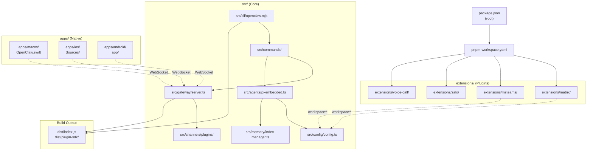
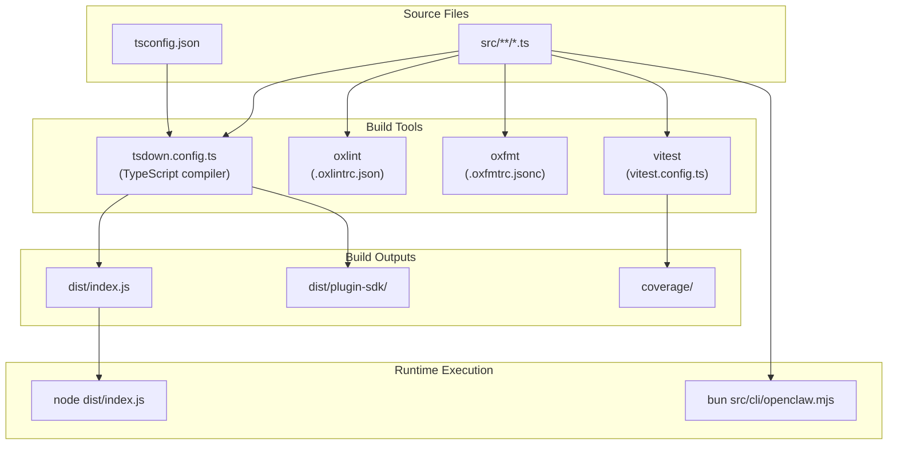
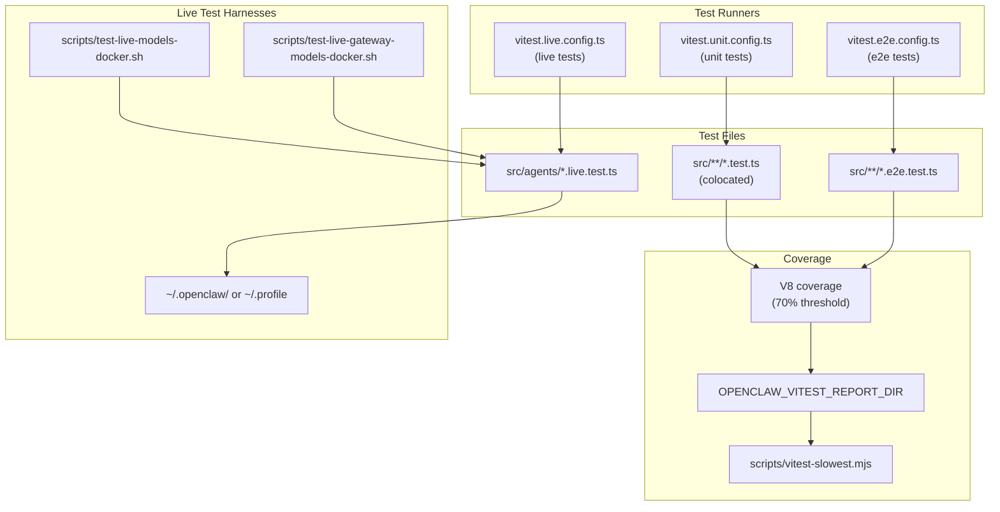
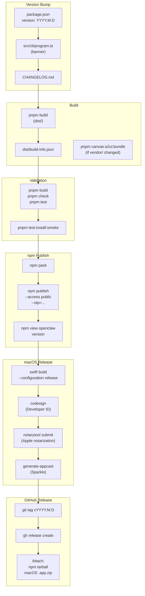
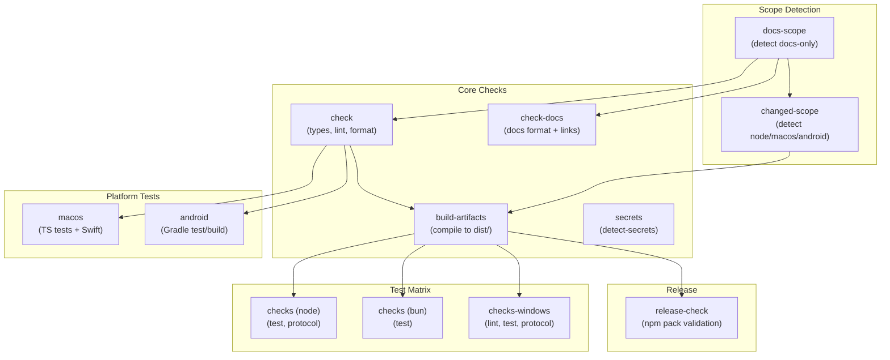

# Page: Development

# 開発

<details>
<summary>関連ソースファイル</summary>

この Wiki ページの生成に使用されたコンテキストファイル:

- [.agents/skills/mintlify/SKILL.md](.agents/skills/mintlify/SKILL.md)
- [.github/ISSUE_TEMPLATE/bug_report.md](.github/ISSUE_TEMPLATE/bug_report.md)
- [.github/ISSUE_TEMPLATE/config.yml](.github/ISSUE_TEMPLATE/config.yml)
- [.github/ISSUE_TEMPLATE/feature_request.md](.github/ISSUE_TEMPLATE/feature_request.md)
- [.github/actions/detect-docs-changes/action.yml](.github/actions/detect-docs-changes/action.yml)
- [.github/actions/setup-node-env/action.yml](.github/actions/setup-node-env/action.yml)
- [.github/labeler.yml](.github/labeler.yml)
- [.github/workflows/auto-response.yml](.github/workflows/auto-response.yml)
- [.github/workflows/ci.yml](.github/workflows/ci.yml)
- [.github/workflows/labeler.yml](.github/workflows/labeler.yml)
- [.github/workflows/stale.yml](.github/workflows/stale.yml)
- [.gitignore](.gitignore)
- [AGENTS.md](AGENTS.md)
- [docs/automation/poll.md](docs/automation/poll.md)
- [docs/channels/index.md](docs/channels/index.md)
- [docs/ci.md](docs/ci.md)
- [docs/providers/synthetic.md](docs/providers/synthetic.md)
- [docs/zh-CN/channels/index.md](docs/zh-CN/channels/index.md)
- [docs/zh-CN/vps.md](docs/zh-CN/vps.md)
- [extensions/msteams/src/store-fs.ts](extensions/msteams/src/store-fs.ts)
- [scripts/sync-labels.ts](scripts/sync-labels.ts)
- [scripts/test-live-gateway-models-docker.sh](scripts/test-live-gateway-models-docker.sh)
- [scripts/test-live-models-docker.sh](scripts/test-live-models-docker.sh)
- [src/agents/live-auth-keys.test.ts](src/agents/live-auth-keys.test.ts)
- [src/agents/live-auth-keys.ts](src/agents/live-auth-keys.ts)
- [src/agents/pi-embedded-helpers.isbillingerrormessage.test.ts](src/agents/pi-embedded-helpers.isbillingerrormessage.test.ts)
- [src/agents/zai.live.test.ts](src/agents/zai.live.test.ts)
- [src/commands/message.ts](src/commands/message.ts)
- [src/gateway/live-image-probe.ts](src/gateway/live-image-probe.ts)
- [src/infra/outbound/abort.ts](src/infra/outbound/abort.ts)
- [src/infra/outbound/message.ts](src/infra/outbound/message.ts)
- [src/infra/outbound/outbound-send-service.ts](src/infra/outbound/outbound-send-service.ts)
- [src/media/png-encode.ts](src/media/png-encode.ts)
- [src/pairing/pairing-store.ts](src/pairing/pairing-store.ts)

</details>


OpenClaw は pnpm ワークスペースで構築された TypeScript モノレポです。このセクションでは、開発環境、ビルドシステム、テストインフラ、コントリビューションワークフローについて説明します。コア機能、拡張機能、またはプラットフォームアプリに取り組む開発者は、変更をビルド、テスト、リリースするために必要な技術詳細を見つけることができます。

**主要な開発トピック:**

- **[アーキテクチャ詳細](#15.1):** コアモジュール、拡張システム、データフローパターン
- **[プロトコル仕様](#15.2):** ゲートウェイ WebSocket RPC プロトコルとスキーマ
- **[ソースからのビルド](#15.3):** ビルドプロセス、TypeScript コンパイル、開発ワークフロー
- **[リリースプロセス](#15.4):** バージョニング、npm 公開、macOS 公証、Sparkle 更新
- **[CI/CD パイプライン](#15.5):** GitHub Actions ワークフロー、テストマトリックス、プラットフォーム固有のジョブ
- **[コントリビューションガイドライン](#15.6):** コーディング標準、コミット規約、PR プロセス

## リポジトリ構成

OpenClaw は pnpm ワークスペースのモノレポです。ルートの `package.json` は `extensions/*` 配下にワークスペースパッケージを定義し、コアの TypeScript ソースは `src/` 配下にあります。ビルド出力は `dist/` に配置されます（Git から除外）。

**トップレベルディレクトリ構成:**

| パス | 説明 |
|------|------|
| `src/` | コア TypeScript ソース（CLI、ゲートウェイ、エージェント、チャネル、ツール） |
| `dist/` | コンパイル済み JavaScript（`pnpm build` で生成） |
| `extensions/` | プラグインパッケージ（workspace:* 依存関係） |
| `apps/` | ネイティブアプリ（macOS/iOS Swift、Android Kotlin） |
| `docs/` | Mintlify ドキュメントサイト |
| `scripts/` | ビルドスクリプト、ユーティリティ、Docker テストハーネス |
| `.github/` | CI ワークフロー、アクション、isssue テンプレート |

**コアソース構成（`src/`）:**

| パス | 目的 |
|------|------|
| `src/cli/` | CLI エントリポイント（[openclaw.mjs:1-6]()）、コマンド配線 |
| `src/commands/` | コマンド実装（agent、gateway、message など） |
| `src/infra/` | インフラストラクチャ: ゲートウェイサーバー、セッションストア、アウトバウンド配信 |
| `src/agents/` | エージェントランタイム（`runEmbeddedPiAgent`）、ワークスペース、認証プロファイル |
| `src/config/` | 設定スキーマ（Zod）、検証、ホットリロード |
| `src/channels/` | チャネルプラグインシステム、ルーティング、ペアリング |
| `src/telegram/`, `src/discord/`, `src/slack/`, `src/signal/`, `src/imessage/`, `src/web/` | 組み込みチャネル統合 |
| `src/memory/` | メモリインデックス（SQLite）、エンベディングプロバイダー |
| `src/media/` | メディアパイプライン（PNG エンコード、QR コード生成） |
| `src/gateway/` | ゲートウェイ RPC プロトコル、コントロール UI、ヘルスチェック |

**拡張パッケージ（`extensions/`）:**

拡張機能はコアへの `workspace:*` 依存関係を持つワークスペースパッケージです。プラグインメタデータは `package.json` の `openclaw.channel` で宣言されます。例:

- `extensions/matrix/` — Matrix プロトコルチャネル
- `extensions/msteams/` — Microsoft Teams ボット
- `extensions/zalo/`, `extensions/zalouser/` — Zalo 統合
- `extensions/voice-call/` — Twilio/Telnyx 音声通話プロバイダー
- `extensions/memory-lancedb/` — LanceDB メモリバックエンド
- `extensions/copilot-proxy/` — GitHub Copilot プロキシ

**プラットフォームアプリ（`apps/`）:**

ネイティブコンパニオンアプリは WebSocket RPC 経由でゲートウェイに接続します:

- `apps/macos/` — macOS メニューバーアプリ（Swift Package Manager、Sparkle 自動更新）
- `apps/ios/` — iOS ノードアプリ（カメラ、画面、通知）
- `apps/android/` — Android ノードアプリ（Gradle、Kotlin）

**図: モノレポモジュールグラフ**



**プラグインのインストール:**

プラグインは npm 経由でインストールするか、ローカルで開発できます:

```bash
# 公開されている拡張機能をインストール
pnpm add @openclaw/matrix

# 拡張機能をローカルで開発（すでにワークスペースにある場合）
cd extensions/matrix && pnpm install
```

プラグインの依存関係は拡張機能の `package.json` の `dependencies` に記載する必要があります（`devDependencies` ではありません）。コアの `openclaw` は npm インストールの問題を避けるため `peerDependencies` に配置します。

Sources: [AGENTS.md:6-18](), [.gitignore:1-86]()

## 開発環境

### 前提条件

- **Node.js:** 22+（ベースラインランタイム）
- **pnpm:** 10.23.0+（corepack で管理）
- **Bun:** 最新版（TypeScript スクリプトと開発実行用）
- **Docker:** オプション（サンドボックスと Docker テスト用）

### 初期セットアップ

```bash
# リポジトリをクローン
git clone https://github.com/openclaw/openclaw.git
cd openclaw

# 依存関係をインストール（pnpm ワークスペースインストール）
pnpm install

# pre-commit フックをインストール（ローカルで CI チェックを実行）
prek install
```

**pre-commit フック:** `prek install` コマンドはコミット前に `pnpm check` と `pnpm test` を実行する Git フックを設定し、CI 検証と一致させます。

Sources: [AGENTS.md:50-64]()

### ビルドと開発コマンド

**図: 開発ツールチェーン**



**コアコマンド:**

| コマンド | ツール | 目的 |
|---------|------|------|
| `pnpm build` | tsdown | TypeScript を `dist/` にコンパイル |
| `pnpm tsgo` | tsc | 型チェックのみ（出力なし） |
| `pnpm check` | oxlint + oxfmt | リントとフォーマットチェック |
| `pnpm format:fix` | oxfmt | フォーマットを自動修正 |
| `pnpm test` | vitest | ユニットテスト |
| `pnpm test:coverage` | vitest | V8 カバレッジ付きテスト |
| `pnpm test --watch` | vitest | ウォッチモード |
| `pnpm openclaw <args>` | bun | ビルドなしで CLI を実行 |
| `pnpm dev` | bun | `pnpm openclaw` のエイリアス |
| `pnpm gateway:watch` | nodemon | ゲートウェイを自動リロード |

**ライブ開発ワークフロー:**

1. **ソースを編集:** `src/**/*.ts` ファイルを変更
2. **ビルドなしで実行:** `pnpm openclaw <command>`（Bun が TypeScript を直接実行）
3. **型チェック:** `pnpm tsgo`（コミット前の高速チェック）
4. **リント/フォーマット:** `pnpm check`（pre-commit フックで自動実行）
5. **テスト:** `pnpm test`（カバレッジゲート付きユニットテスト）
6. **ビルド:** `pnpm build`（リリースまたは `dist/` 検証にのみ必要）

**ゲートウェイ開発:**

ゲートウェイの変更には `pnpm gateway:watch` を使用してファイル変更時に自動再起動します。ウォッチャーは Bun による TypeScript 実行で nodemon を使用します。

Sources: [AGENTS.md:50-67]()

## テスト

OpenClaw はユニットテストと統合テストに **Vitest** を使用します。カバレッジしきい値（行/分岐/関数/文 70%）は V8 カバレッジで強制されます。テストは `*.test.ts` と `*.e2e.test.ts` としてソースファイルと同じ場所に配置されます。

### テスト実行

**図: テストインフラ**



**テストコマンド:**

| コマンド | 設定 | 目的 |
|---------|------|------|
| `pnpm test` | `vitest.unit.config.ts` | ユニットテスト（同一場所の `*.test.ts`） |
| `pnpm test:coverage` | + V8 カバレッジ | カバレッジレポート付きユニットテスト |
| `pnpm test:live` | `vitest.live.config.ts` | ライブ API テスト（`OPENCLAW_LIVE_TEST=1` が必要） |
| `pnpm test:docker:live-models` | Docker + プロファイルキー | Docker でのライブモデルテスト |
| `pnpm test:docker:live-gateway` | Docker + プロファイルキー | Docker でのライブゲートウェイモデルテスト |
| `pnpm test:docker:onboard` | Docker + インストーラー | E2E オンボーディングテスト |

**ライブテスト実行（Docker）:**

ライブテストには実際の API キーが必要です。Docker ハーネスは認証情報を提供するために `~/.openclaw/` と `~/.profile` をマウントします:

```bash
# Docker でライブモデルテストを実行
OPENCLAW_LIVE_TEST=1 pnpm test:live

# Docker ベースのライブテストを実行（プロファイルキー）
pnpm test:docker:live-models
pnpm test:docker:live-gateway
```

[scripts/test-live-models-docker.sh:1-34]() と [scripts/test-live-gateway-models-docker.sh:1-33]() スクリプトは Docker イメージをビルドし、設定ディレクトリをマウントし、環境変数を指定してライブテストを実行します。

### カバレッジしきい値

Vitest は V8 カバレッジでカバレッジゲートを強制します:

- **行:** 70%
- **分岐:** 70%
- **関数:** 70%
- **文:** 70%

カバレッジがこれらのしきい値を下回ると CI が失敗します。カバレッジレポートは `OPENCLAW_VITEST_REPORT_DIR` に書き込まれます（CI では `$RUNNER_TEMP/vitest-reports` に設定）。[scripts/vitest-slowest.mjs:1-214]() スクリプトは JSON レポートからテストタイミングを分析します。

### テスト構成

**テストファイルパターン:**

| パターン | 目的 | 例 |
|---------|------|------|
| `*.test.ts` | ユニットテスト | [src/agents/pi-embedded-helpers.isbillingerrormessage.test.ts:1-68]() |
| `*.e2e.test.ts` | E2E 統合テスト | ゲートウェイインストーラー E2E |
| `*.live.test.ts` | ライブ API テスト | [src/agents/zai.live.test.ts:1-55]() |

**ライブテストゲーティング:**

ライブテストは環境変数で条件付きで実行されます:

```typescript
const LIVE = isTruthyEnvValue(process.env.ZAI_LIVE_TEST) || isTruthyEnvValue(process.env.LIVE);
const describeLive = LIVE && ZAI_KEY ? describe : describe.skip;
```

このパターンにより、標準的な CI ジョブでライブテストが実行されるのを防ぎます。ライブテストは `OPENCLAW_LIVE_TEST=1` またはプロバイダー固有のフラグが設定された場合にのみ実行されます。

**請求エラー検出:**

テストには請求/レート制限エラーによる誤検出を避けるためのセーフガードが含まれています。[src/agents/live-auth-keys.ts:76-101]() モジュールは `isAnthropicBillingError()` と `isAnthropicRateLimitError()` を提供し、プロバイダー固有のエラーパターンを検出します。テストはこれらを使用して請求制限に達した場合にスキップまたはリトライします。

Sources: [AGENTS.md:80-90](), [.github/workflows/ci.yml:177-224](), [scripts/test-live-models-docker.sh:1-34](), [scripts/test-live-gateway-models-docker.sh:1-33](), [src/agents/zai.live.test.ts:1-55](), [src/agents/live-auth-keys.ts:1-102]()

## コーディング標準と規約

### 言語と型

- **言語:** TypeScript（ESM）、厳格な型指定
- **`any` を避ける:** 明示的な型を使用、型が本当に動的な場合は `unknown` を使用
- **型インポート:** 型のみのインポートには `import type` を使用
- **ファイル長:** ~500-700 行を目指す（ガイドライン、厳密な制限ではない）。明確さが向上する場合は分割/リファクタリング

### コードスタイル

**フォーマットとリント:**

- **Oxfmt:** コードフォーマット（[.oxfmtrc.jsonc]()）
- **Oxlint:** リントルール（[.oxlintrc.json]()）
- **コミット前に実行:** `pnpm check`（pre-commit フックで強制）

**コードコメント:**

- トリッキーまたは自明でないロジックには簡潔なコメントを追加
- 自明なコードの過剰なコメントは避ける
- コンテキスト付きの TODO コメントを使用: `// TODO: Verify the default timeout value`

### 命名規則

**製品命名:**

- **製品/アプリ:** ドキュメントの見出しとユーザー向けテキストには **OpenClaw** を使用
- **CLI/パッケージ:** CLI コマンド、パッケージ名、設定キー、バイナリ名には `openclaw` を使用

**ファイル命名:**

| ファイルタイプ | パターン | 例 |
|-----------|---------|---------|
| ソース | `kebab-case.ts` | `src/config/config.ts` |
| テスト | `*.test.ts` | `src/agents/workspace.test.ts` |
| E2E テスト | `*.e2e.test.ts` | `src/gateway/install.e2e.test.ts` |
| ライブテスト | `*.live.test.ts` | `src/agents/zai.live.test.ts` |

### ツールスキーマガードレール

ツール入力スキーマは LLM プロバイダーの互換性問題を避けるため厳格な規約に従う必要があります:

**必須パターン:**

- **トップレベル:** 常に `properties` を持つ `type: "object"`
- **ユニオンを避ける:** `Type.Union`、`anyOf`、`oneOf`、`allOf` を避ける
- **列挙型:** 文字列リストには `Type.Unsafe` から `stringEnum()` または `optionalStringEnum()` を使用
- **オプションフィールド:** `Type.Optional(...)` を使用、`... | null` は使用しない
- **予約語:** 生の `format` プロパティ名を避ける（一部のバリデーターは予約語として扱う）

**良い例:**

```typescript
import { Type } from "@sinclair/typebox";
import { stringEnum } from "../utils/typebox.js";

const ToolInput = Type.Object({
  action: stringEnum(["send", "poll", "react"]),
  target: Type.String(),
  message: Type.Optional(Type.String()),
});
```

**悪い例:**

```typescript
// 避ける: ユニオン型は一部のプロバイダーで動作しない
const ToolInput = Type.Union([
  Type.Object({ action: Type.Literal("send") }),
  Type.Object({ action: Type.Literal("poll") }),
]);

// 避ける: null ユニオン
const ToolInput = Type.Object({
  message: Type.Union([Type.String(), Type.Null()]),
});
```

Sources: [AGENTS.md:65-72](), [AGENTS.md:169-170]()

## コントリビューションワークフロー

詳細なコントリビューションガイドラインについては、[コントリビューションガイドライン](#15.6) を参照してください。このセクションでは基本的なワークフローについて説明します。

### コミット規約

**スコープ付きコミットに `scripts/committer` を使用:**

`scripts/committer` スクリプトは適切にスコープされたコミットを作成し、ステージングの混入を防ぎます:

```bash
# 構文: scripts/committer "<message>" <file1> <file2> ...
scripts/committer "CLI: add verbose flag to send" src/commands/send.ts

# 複数ファイル
scripts/committer "Agent: fix session lock" src/agents/session.ts src/agents/session.test.ts
```

**コミットメッセージスタイル:**

- **スコーププレフィックス:** スコーププレフィックスを使用（例: `CLI:`、`Gateway:`、`Agent:`、`Docs:`）
- **アクション指向:** 動詞で始める（例: "add"、"fix"、"refactor"）
- **簡潔:** 可能な限り 72 文字以内に収める
- **関連する変更をグループ化:** 論理的に関連する変更をまとめる
- **バンドルを避ける:** 関連のないリファクタリングや機能を混ぜない

**例:**

```
CLI: add verbose flag to send command
Gateway: fix race condition in session lock
Docs: update onboarding wizard screenshots
Agent: refactor system prompt builder
```

Sources: [AGENTS.md:92-103]()

### プルリクエストプロセス

**PR の作成:**

1. **`main` からブランチ:** 常に `main` からフィーチャーブランチを作成
2. **pre-commit チェックを実行:** `pnpm build && pnpm check && pnpm test`
3. **PR 説明を記述:**
   - **概要:** PR が何をするか
   - **テスト:** どのようなテストを実行したか
   - **ユーザーへの影響:** 新しいフラグ、破壊的変更、動作変更
4. **チェンジログエントリを追加:** 純粋なテスト/ドキュメント変更でない限り

**PR レビューガイドライン:**

- **ブランチを切り替えずにレビュー:** `gh pr view` / `gh pr diff` を使用
- **コメントで変更を議論:** 明確化のために特定の行をタグ付け
- **GitHub レビューで変更をリクエスト:** ブロッキング問題には "Request changes" を使用

**PR のランディング（メンテナー）:**

1. **一時ブランチを作成:** `git checkout -b temp-pr-123 main`
2. **PR ブランチをマージ:**
   - クリーンな履歴のためリベースを優先: `git rebase pr-branch`
   - 雑然とした履歴にはスクワッシュ: `git merge --squash pr-branch`
3. **チェンジログエントリを追加:** PR 番号を含め、コントリビューターに感謝
4. **フルゲートを実行:** `pnpm build && pnpm check && pnpm test`
5. **main にマージ:** `git checkout main && git merge temp-pr-123`
6. **クリーンアップ:** `git branch -d temp-pr-123`
7. **clawtributors を更新:** 新しいコントリビューターには `bun scripts/update-clawtributors.ts` を実行

Sources: [AGENTS.md:97-109]()

## リリース概要

OpenClaw は日付ベースのセマンティックバージョニング（`YYYY.M.D`）を 3 つのリリースチャネルで使用します。完全なリリース手順については、[リリースプロセス](#15.4) を参照してください。

### リリースチャネル

| チャネル | タグ形式 | npm Dist-Tag | 目的 |
|---------|------------|--------------|---------|
| **stable** | `vYYYY.M.D` | `latest` | 本番リリース（macOS アプリを含む） |
| **beta** | `vYYYY.M.D-beta.N` | `beta` | プレリリース（macOS アプリをスキップする場合がある） |
| **dev** | (なし) | (なし) | main ブランチ HEAD（タグなし、公開なし） |

### バージョンの場所

バージョンは複数のファイルで同期する必要があります:

**コアバージョンファイル:**

- [package.json:2]() — `"version": "YYYY.M.D"`
- [src/cli/program.ts]() — CLI バナーのバージョン文字列
- [src/provider-web.ts]() — Baileys ユーザーエージェントバージョン

**プラットフォームアプリのバージョン:**

- [apps/android/app/build.gradle.kts]() — `versionName`、`versionCode`
- [apps/ios/Sources/Info.plist]() — `CFBundleShortVersionString`、`CFBundleVersion`
- [apps/macos/Sources/OpenClaw/Resources/Info.plist]() — `CFBundleShortVersionString`、`CFBundleVersion`

**ドキュメント:**

- [docs/install/updating.md]() — 例のピン留めされた npm バージョン
- [docs/platforms/mac/release.md]() — 例のバージョン文字列

**図: リリースアーティファクトフロー**



### 1Password OTP を使用した npm 公開

すべての npm 公開はセキュリティのため 1Password OTP を必要とします。[AGENTS.md:180-187]() セクションでワークフローを説明しています:

```bash
# 1Password にサインイン（tmux セッション内で）
eval "$(op signin --account my.1password.com)"

# OTP を取得
op read 'op://Private/Npmjs/one-time password?attribute=otp'

# 公開
npm publish --access public --otp="<otp>"

# 検証（副作用なし）
npm view openclaw version --userconfig "$(mktemp)"
```

**重要:** 環境の汚染を避けるため、常に新しい tmux セッション内で `op` コマンドを実行してください。

Sources: [AGENTS.md:74-79](), [AGENTS.md:148](), [AGENTS.md:180-187](), [docs/reference/RELEASING.md:1-121]()

## CI/CD パイプライン

詳細なパイプラインドキュメントについては、[CI/CD パイプライン](#15.5) を参照してください。このセクションでは GitHub Actions ワークフローの概要を説明します。

### ワークフロー概要

**メインワークフロー:**

| ワークフロー | トリガー | 目的 |
|----------|---------|---------|
| **ci.yml** | Push, PR | ビルド、リント、テスト、プラットフォームチェック |
| **install-smoke.yml** | Push to main, PR, manual | インストーラースモークテスト（Docker） |
| **auto-response.yml** | Issue/PR labeled | ラベル付きアイテムへの自動応答 |
| **labeler.yml** | PR opened/synced | 変更されたファイルによる PR の自動ラベル付け |
| **stale.yml** | Daily cron | 古い issue/PR のマーク/クローズ |

**図: CI ジョブ依存関係**



### スマートスコーピング

CI パイプラインはスマートスコーピングを使用して、可能な場合は高価なジョブをスキップします:

**docs-scope ジョブ ([.github/actions/detect-docs-changes/action.yml:1-54]()):**

ドキュメントのみの変更を検出します。すべての変更が `docs/` 以下または `*.md`/`*.mdx` ファイルの場合、`docs_only=true` を設定します。true の場合:

- スキップ: build-artifacts、checks、checks-windows、macos、android、release-check
- 実行: check（型/リント/フォーマット）、check-docs、secrets

**changed-scope ジョブ ([.github/workflows/ci.yml:33-124]()):**

どの重い領域が触れたかを検出します:

- `run_node`: `src/`、`extensions/`、`scripts/`、設定の変更 → Node チェックを実行
- `run_macos`: `apps/macos/`、`apps/ios/`、`apps/shared/` の変更 → Swift チェックを実行
- `run_android`: `apps/android/`、`apps/shared/` の変更 → Android チェックを実行

**フェイルセーフ:** 検出が失敗した場合、必要な検証をスキップしないようすべてのチェックが実行されます。

### ビルドアーティファクト共有

[.github/workflows/ci.yml:127-150]() の `build-artifacts` ジョブは TypeScript を一度コンパイルし、`dist/` をアーティファクトとしてアップロードします。下流のジョブ（checks、checks-windows、release-check）は再ビルドではなくアーティファクトをダウンロードします。

**アーティファクト保持:** 1 日（PR 検証には十分）

### プラットフォーム固有のジョブ

**macOS ジョブ ([.github/workflows/ci.yml:412-483]()):**

統合された macOS ジョブ（macOS ファイルが変更された PR で実行）:

1. **TS テスト:** macOS ランナーで `pnpm test`
2. **Xcode セットアップ:** Xcode 26.1 を選択、XcodeGen/SwiftLint/SwiftFormat をインストール
3. **Swift リント:** `swiftlint`、`swiftformat --lint`
4. **Swift ビルド:** `swift build --configuration release`（3 回リトライ）
5. **Swift テスト:** `swift test --parallel --enable-code-coverage`（3 回リトライ）

**Android ジョブ ([.github/workflows/ci.yml:645-689]()):**

Android ファイルが変更された場合に実行:

1. **セットアップ:** Java 21、Android SDK、Gradle 8.11.1
2. **テスト:** `./gradlew :app:testDebugUnitTest`
3. **ビルド:** `./gradlew :app:assembleDebug`

**Windows ジョブ ([.github/workflows/ci.yml:285-406]()):**

Node ファイルが変更された場合に実行:

1. **Windows Defender 除外:** プロセス傍受を避けるためベストエフォートで除外
2. **マトリックス:** lint、test、protocol タスク
3. **Vitest ワーカー:** 4 vCPU ランナーでのリソース枯渇を避けるため 2 に制限

### リトライ戦略

ネットワーク操作にはリトライロジックが含まれます:

**サブモジュールチェックアウト ([.github/actions/setup-node-env/action.yml:25-37]()):**

```bash
for attempt in 1 2 3 4 5; do
  if git -c protocol.version=2 submodule update --init --force --depth=1 --recursive; then
    exit 0
  fi
  echo "Submodule update failed (attempt $attempt/5). Retrying…"
  sleep $((attempt * 10))
done
exit 1
```

**Swift ビルド ([.github/workflows/ci.yml:461-471]()):**

```bash
for attempt in 1 2 3; do
  if swift build --configuration release; then
    exit 0
  fi
  echo "swift build failed (attempt $attempt/3). Retrying…"
  sleep $((attempt * 20))
done
exit 1
```

Sources: [.github/workflows/ci.yml:1-690](), [.github/actions/detect-docs-changes/action.yml:1-54](), [.github/actions/setup-node-env/action.yml:1-84](), [docs/ci.md:1-52]()

## セキュリティとベストプラクティス

### シークレットスキャン

OpenClaw は `detect-secrets` を使用して誤ってコミットされた認証情報の漏洩を防ぎます。ベースラインは [.secrets.baseline]() に保存されています。

**CI での強制 ([.github/workflows/ci.yml:260-283]()):**

`secrets` ジョブはすべてのプッシュと PR で実行されます:

```bash
detect-secrets scan --baseline .secrets.baseline
```

これが失敗した場合、シークレットが検出されています。[シークレットスキャンガイド](/gateway/security#secret-scanning-detect-secrets) に従ってください:

1. コミット履歴からシークレットを削除
2. 誤検出の場合はベースラインを更新

**ベースラインの更新:**

```bash
# スキャンしてベースラインを更新
detect-secrets scan > .secrets.baseline

# 誤検出を監査
detect-secrets audit .secrets.baseline
```

### 認証情報の保存

**ファイルの場所:**

| タイプ | パス | 目的 |
|------|------|------|
| 認証プロファイル | `~/.openclaw/credentials/` | OAuth トークン、API キー（OS キーチェーン） |
| 環境変数 | `~/.openclaw/.env` | 環境変数 |
| ペアリング許可リスト | `~/.openclaw/credentials/*-allowFrom.json` | チャネルペアリング承認 |
| ペアリングリクエスト | `~/.openclaw/credentials/*-pairing.json` | 保留中のペアリングコード |

**コミットしないこと:**

- 実際の電話番号、メールアドレス
- API キー、OAuth トークン
- 機密データを含むライブ設定値
- ビデオファイル、大きなメディアアセット

ドキュメント、テスト、例では明らかに偽のプレースホルダーを使用してください（例: `+15555550123`、`user@example.com`）。

Sources: [.github/workflows/ci.yml:260-283](), [AGENTS.md:119-125](), [src/pairing/pairing-store.ts:1-491]()

### マルチエージェントの安全性

複数のエージェントが同時にリポジトリで作業する場合:

**行わないこと:**

- `git stash` エントリの作成/適用/削除（明示的に要求された場合を除く）
- `git worktree` チェックアウトの作成/削除/変更
- ブランチの切り替え（明示的に要求された場合を除く）
- `git pull --rebase --autostash` の実行（他のエージェントの作業を破棄）

**行うこと:**

- スコープされたコミットに `scripts/committer` を使用（ステージングの混入を防止）
- 割り当てられたタスクと変更に集中
- `git pull --rebase` を使用して最新の変更を統合（他のエージェントの作業を保持）
- レポートで認識できないファイルを変更せずに記録

**フォーマットの変動:**

- フォーマットのみの差分を確認なしで自動解決
- コミットがすでに要求されている場合は同じコミットにフォーマット修正を含める
- セマンティックな変更（ロジック/データ/動作）の場合のみ確認を求める

Sources: [AGENTS.md:155-166]()

---

## 追加リソース

- **オンボーディング:** [オンボーディングウィザード](#2.3)（ガイド付きセットアップ）
- **ゲートウェイ:** [ゲートウェイ設定](#3.1) および [ゲートウェイランブック](/gateway)
- **ツール:** [ツールとスキル](#6)（組み込みツールと拡張性）
- **チャネル:** [チャネル統合ガイド](#8)
- **トラブルシューティング:** [よくある問題](/gateway/troubleshooting)

---

**Sources:**
- [AGENTS.md:1-189]()
- [.github/workflows/ci.yml:1-642]()
- [.github/workflows/install-smoke.yml:1-42]()
- [docs/reference/RELEASING.md:1-121]()
- [docs/gateway/index.md:1-329]()
- [scripts/docker/install-sh-e2e/run.sh:1-500]()
- [scripts/docker/install-sh-smoke/run.sh:1-74]()

---
