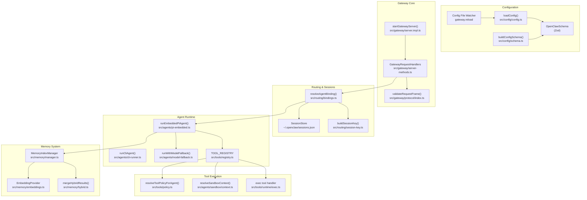
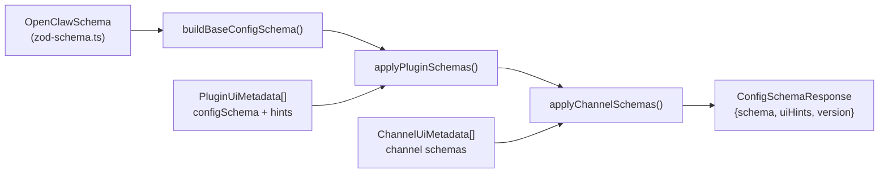
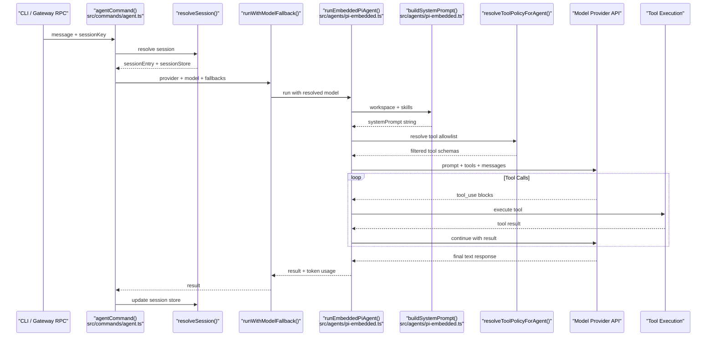
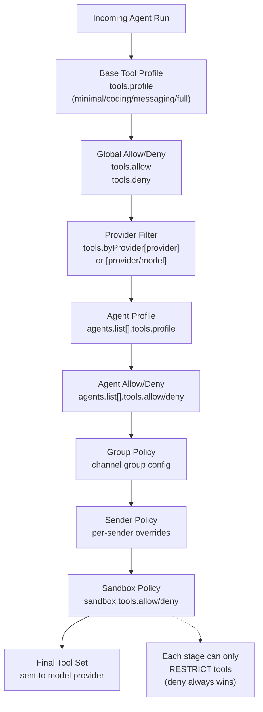
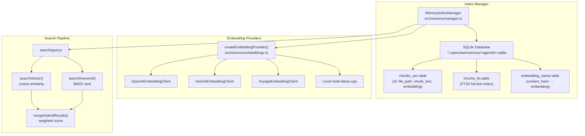
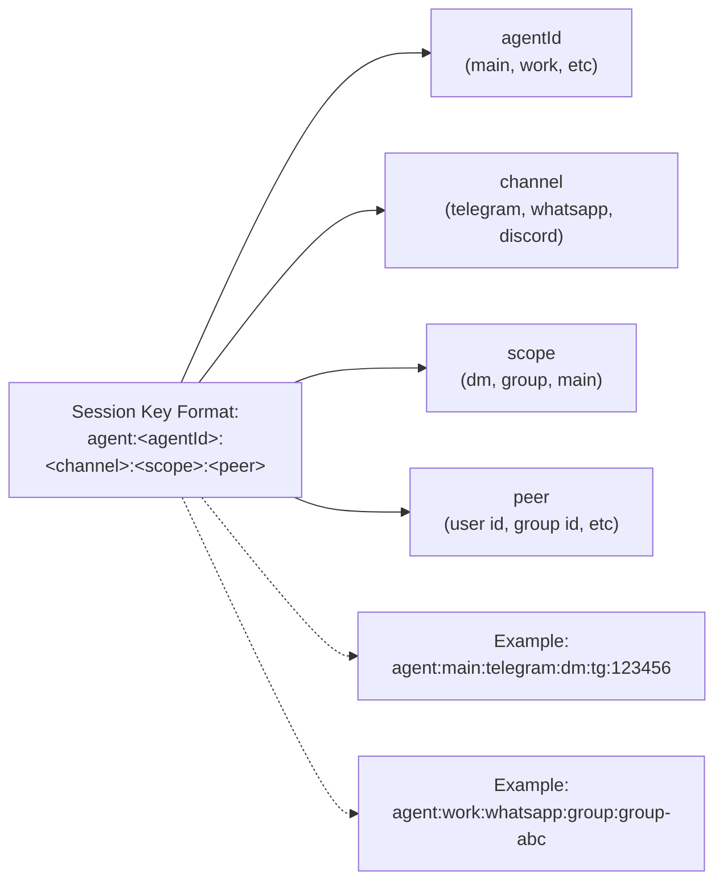
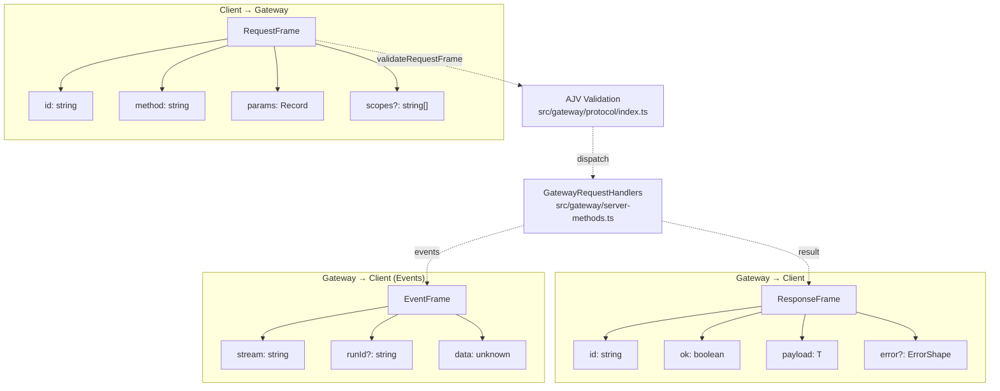
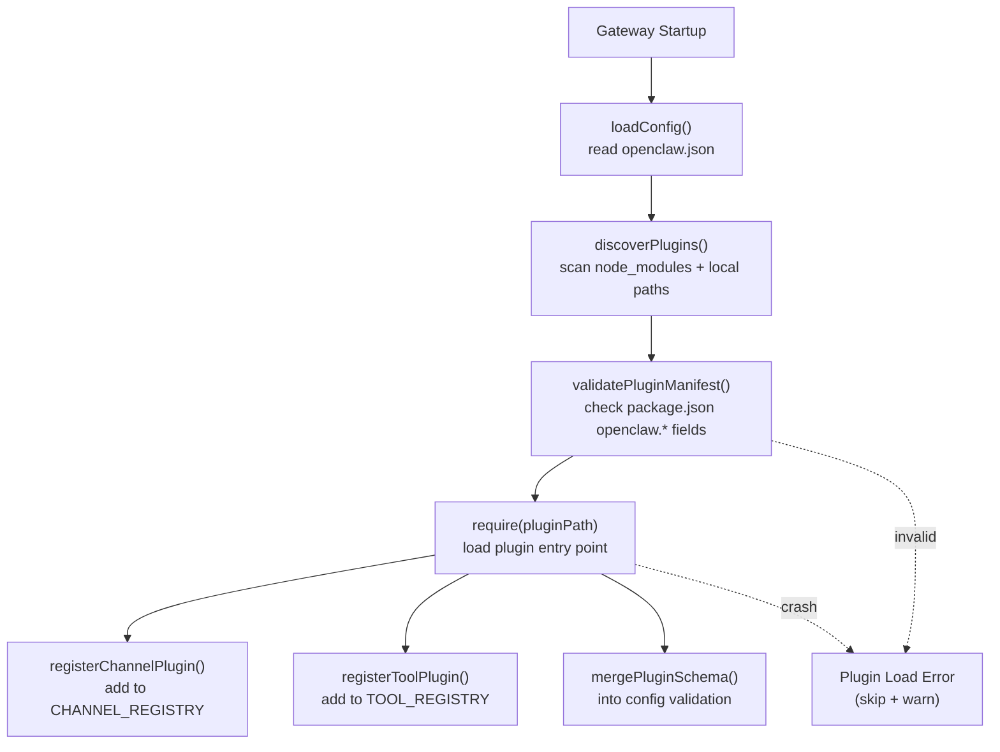
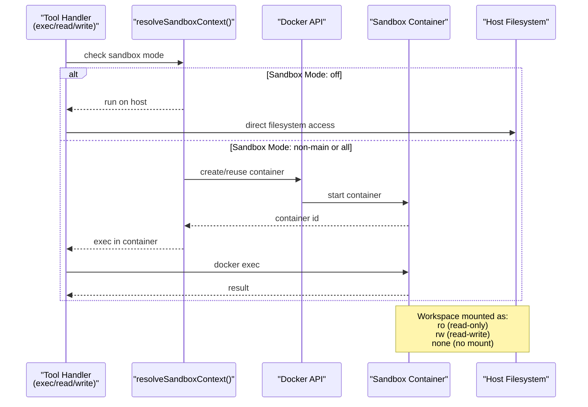
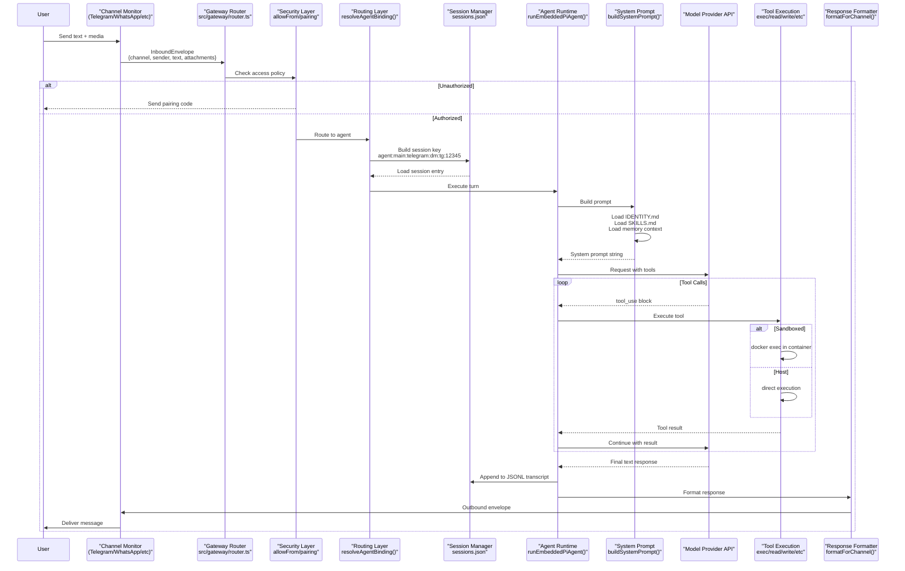

# Page: Architecture Deep Dive

# アーキテクチャ詳細

<details>
<summary>関連ソースファイル</summary>

この Wiki ページの生成に使用されたコンテキストファイル:

- [.agents/skills/mintlify/SKILL.md](.agents/skills/mintlify/SKILL.md)
- [.github/ISSUE_TEMPLATE/bug_report.md](.github/ISSUE_TEMPLATE/bug_report.md)
- [.github/ISSUE_TEMPLATE/config.yml](.github/ISSUE_TEMPLATE/config.yml)
- [.github/ISSUE_TEMPLATE/feature_request.md](.github/ISSUE_TEMPLATE/feature_request.md)
- [.github/labeler.yml](.github/labeler.yml)
- [.github/workflows/auto-response.yml](.github/workflows/auto-response.yml)
- [.github/workflows/labeler.yml](.github/workflows/labeler.yml)
- [.github/workflows/stale.yml](.github/workflows/stale.yml)
- [AGENTS.md](AGENTS.md)
- [CHANGELOG.md](CHANGELOG.md)
- [docs/channels/index.md](docs/channels/index.md)
- [docs/cli/memory.md](docs/cli/memory.md)
- [docs/cli/sandbox.md](docs/cli/sandbox.md)
- [docs/concepts/memory.md](docs/concepts/memory.md)
- [docs/gateway/configuration.md](docs/gateway/configuration.md)
- [docs/gateway/sandbox-vs-tool-policy-vs-elevated.md](docs/gateway/sandbox-vs-tool-policy-vs-elevated.md)
- [docs/gateway/sandboxing.md](docs/gateway/sandboxing.md)
- [docs/platforms/mac/skills.md](docs/platforms/mac/skills.md)
- [docs/tools/elevated.md](docs/tools/elevated.md)
- [docs/tools/index.md](docs/tools/index.md)
- [docs/tools/skills-config.md](docs/tools/skills-config.md)
- [docs/zh-CN/channels/index.md](docs/zh-CN/channels/index.md)
- [scripts/sync-labels.ts](scripts/sync-labels.ts)
- [src/agents/memory-search.test.ts](src/agents/memory-search.test.ts)
- [src/agents/memory-search.ts](src/agents/memory-search.ts)
- [src/agents/sandbox-explain.test.ts](src/agents/sandbox-explain.test.ts)
- [src/agents/sandbox.ts](src/agents/sandbox.ts)
- [src/cli/memory-cli.test.ts](src/cli/memory-cli.test.ts)
- [src/cli/memory-cli.ts](src/cli/memory-cli.ts)
- [src/cli/models-cli.test.ts](src/cli/models-cli.test.ts)
- [src/commands/agent.test.ts](src/commands/agent.test.ts)
- [src/commands/agent.ts](src/commands/agent.ts)
- [src/config/schema.ts](src/config/schema.ts)
- [src/config/types.tools.ts](src/config/types.tools.ts)
- [src/config/types.ts](src/config/types.ts)
- [src/config/zod-schema.agent-runtime.ts](src/config/zod-schema.agent-runtime.ts)
- [src/config/zod-schema.ts](src/config/zod-schema.ts)
- [src/cron/isolated-agent.ts](src/cron/isolated-agent.ts)
- [src/cron/run-log.test.ts](src/cron/run-log.test.ts)
- [src/cron/run-log.ts](src/cron/run-log.ts)
- [src/cron/store.ts](src/cron/store.ts)
- [src/gateway/protocol/index.ts](src/gateway/protocol/index.ts)
- [src/gateway/protocol/schema.ts](src/gateway/protocol/schema.ts)
- [src/gateway/protocol/schema/agents-models-skills.ts](src/gateway/protocol/schema/agents-models-skills.ts)
- [src/gateway/protocol/schema/protocol-schemas.ts](src/gateway/protocol/schema/protocol-schemas.ts)
- [src/gateway/protocol/schema/types.ts](src/gateway/protocol/schema/types.ts)
- [src/gateway/server-methods-list.ts](src/gateway/server-methods-list.ts)
- [src/gateway/server-methods.ts](src/gateway/server-methods.ts)
- [src/gateway/server-methods/agents.ts](src/gateway/server-methods/agents.ts)
- [src/gateway/server.ts](src/gateway/server.ts)
- [src/memory/embeddings.test.ts](src/memory/embeddings.test.ts)
- [src/memory/embeddings.ts](src/memory/embeddings.ts)
- [src/memory/manager.ts](src/memory/manager.ts)

</details>


このドキュメントは OpenClaw のシステムアーキテクチャの詳細な技術説明を提供し、コアモジュール、データフローパターン、拡張ポイントについて説明します。デプロイと設定の運用ガイダンスについては、[デプロイ](#13) と [設定](#4) を参照してください。

---

## システム概要

OpenClaw は **ハブアンドスポークアーキテクチャ** で構成されており、ゲートウェイサーバーが中央の制御プレーンです。ゲートウェイは以下を調整します:

- **インバウンドメッセージルーティング** 複数のチャネルから（WhatsApp、Telegram、Discord など）
- **エージェント実行** モデルプロバイダー統合、ツール呼び出し、セッション管理
- **アウトバウンド配信** 元のチャネルに戻す
- **設定管理** ホットリロードと検証
- **拡張機能の読み込み** チャネルと機能用

システムは 3 つの主要なレイヤーに関心を分離します:

1. **トランスポートレイヤー:** ゲートウェイ WebSocket RPC + HTTP エンドポイント
2. **オーケストレーションレイヤー:** エージェントランタイム、セッション管理、ルーティング
3. **実行レイヤー:** ツール実行（サンドボックスまたはホスト）、メモリ検索、モデル API 呼び出し

Sources: [src/gateway/server.ts:1-4](), [docs/gateway/configuration.md:1-480](), [AGENTS.md:1-180]()

---

## コアモジュール構成



Sources: [src/config/config.ts:1-100](), [src/gateway/server-methods.ts:1-33](), [src/agents/pi-embedded.ts:1-50](), [src/memory/manager.ts:1-100](), [src/tools/policy.ts:1-50]()

---

## 設定システムアーキテクチャ

OpenClaw の設定は **Zod スキーマパイプライン** を通じて検証され、実行時にコア定義とプラグイン/チャネルスキーマをマージします。

### スキーマ構築パイプライン



**主要な関数:**
- `buildConfigSchema()` ([src/config/schema.ts:313-335]()): ベース + プラグイン + チャネルスキーマをマージ
- `OpenClawSchema.toJSONSchema()` ([src/config/zod-schema.ts:95-632]()): Zod を JSON Schema（draft-07）に変換
- `validateConfigObjectWithPlugins()` ([src/config/config.ts]()): エラーレポート付きランタイム検証

**設定ホットリロード:**
ゲートウェイは `chokidar` 経由で `openclaw.json` を監視し、`gateway.reload.mode` に基づいて変更を適用します:
- **`hybrid`**（デフォルト）: 安全な変更はホット適用、インフラ変更は自動再起動
- **`hot`**: ホット適用のみ、安全でない変更は警告
- **`restart`**: 常に再起動
- **`off`**: ファイル監視なし

Sources: [src/config/schema.ts:276-335](), [src/config/zod-schema.ts:95-632](), [docs/gateway/configuration.md:327-365]()

---

## エージェント実行パイプライン

エージェント実行パイプラインはユーザーメッセージからモデル応答までのコアオーケストレーションフローです。

### 実行フロー図



**主要なパイプラインステージ:**

1. **セッション解決** ([src/commands/agent/session.ts]()): `--to`、`--session-id`、または `--session-key` から `sessionKey` を決定
2. **ワークスペースセットアップ** ([src/agents/workspace.ts]()): `IDENTITY.md`、`SKILLS.md`、ブートストラップファイルの存在確認
3. **モデル選択** ([src/agents/model-selection.ts]()): プライマリ + フォールバックの解決、許可リストのチェック
4. **システムプロンプト構築** ([src/agents/pi-embedded.ts:200-300]()): ID + スキル + メモリ + ツールセクションの組み立て
5. **ツールポリシー解決** ([src/tools/policy.ts]()): カスケードフィルターの適用（グローバル → プロバイダー → エージェント → グループ → サンドボックス）
6. **モデルプロンプト** ([src/agents/pi-embedded.ts:400-500]()): ストリーミング付きでプロバイダー API を呼び出し
7. **ツール実行ループ** ([src/tools/runtime/]()): ツールを実行、結果を返す、継続
8. **セッション永続化** ([src/config/sessions.ts]()): JSONL トランスクリプトに追加、トークン使用量を更新

Sources: [src/commands/agent.ts:64-528](), [src/agents/pi-embedded.ts:1-100](), [src/tools/policy.ts:1-50]()

---

## ツールポリシー解決チェーン

ツールの可用性は **カスケードポリシーチェーン** によって決定され、各ステージはツールセットを狭めることしかできません（拡大はできません）。

### ポリシー解決シーケンス



**解決アルゴリズム** ([src/tools/policy.ts:100-300]()):

```typescript
// 擬似コード表現
function resolveToolPolicy(context: AgentRunContext): Set<string> {
  let tools = ALL_TOOLS;

  // 1. ベースプロファイルを適用
  if (config.tools.profile) {
    tools = intersect(tools, PROFILE_TOOLS[config.tools.profile]);
  }

  // 2. グローバル許可/拒否を適用
  if (config.tools.allow) {
    tools = intersect(tools, config.tools.allow);
  }
  tools = subtract(tools, config.tools.deny);

  // 3. プロバイダー固有のフィルターを適用
  const providerKey = `${context.provider}/${context.model}`;
  if (config.tools.byProvider[providerKey]) {
    const providerPolicy = config.tools.byProvider[providerKey];
    if (providerPolicy.allow) {
      tools = intersect(tools, providerPolicy.allow);
    }
    tools = subtract(tools, providerPolicy.deny);
  }

  // 4-7. エージェント、グループ、送信者、サンドボックスフィルターを適用...
  // (各ステージは同じ intersect + subtract パターンに従う)

  return tools;
}
```

**ツールグループ** ([src/tools/registry.ts:50-100]()):

ツールポリシーは複数のツールに展開される `group:*` 構文をサポートします:
- `group:runtime` → `["exec", "bash", "process"]`
- `group:fs` → `["read", "write", "edit", "apply_patch"]`
- `group:sessions` → `["sessions_list", "sessions_history", "sessions_send", ...]`
- `group:openclaw` → すべての組み込みツール（プラグインツールを除く）

Sources: [src/tools/policy.ts:1-300](), [src/config/types.tools.ts:139-212](), [docs/tools/index.md:82-137]()

---

## メモリシステムアーキテクチャ

メモリシステムはワークスペースの Markdown ファイルとセッショントランスクリプトに対して **ハイブリッド検索**（ベクトル類似度 + BM25 キーワード）を提供します。

### メモリインデックスマネージャー構造



**主要なコンポーネント:**

- **`MemoryIndexManager`** ([src/memory/manager.ts:111-1000]()): インデックス作成、検索、プロバイダーライフサイクルを管理する中央クラス
- **チャンキング** ([src/memory/internal.ts:200-300]()): Markdown を ~400 トークンのチャンクに 80 トークンのオーバーラップで分割
- **エンベディングキャッシュ** ([src/memory/manager.ts:400-500]()): コンテンツハッシュをキーとしたキャッシュが重複 API 呼び出しを防止
- **ハイブリッド検索** ([src/memory/hybrid.ts:1-100]()): ベクトル（70%）+ BM25（30%）スコアを組み合わせ
- **sqlite-vec 拡張** ([src/memory/sqlite-vec.ts:1-50]()): 利用可能な場合のネイティブベクトル検索アクセラレーション

**検索フロー:**

1. **クエリエンベディング** ([src/memory/manager.ts:296]()): 検索クエリのエンベディングを生成
2. **ベクトル検索** ([src/memory/manager-search.ts:50-150]()): コサイン類似度でトップ K を検索
3. **キーワード検索** ([src/memory/manager-search.ts:200-300]()): BM25 ランクでトップ K を検索
4. **マージ & 再ランク** ([src/memory/hybrid.ts:50-100]()): 設定可能な重みでスコアを組み合わせ
5. **スニペットフォーマット** ([src/memory/manager.ts:300-350]()): ~700 文字に切り詰め、行範囲を含める

Sources: [src/memory/manager.ts:111-700](), [src/memory/hybrid.ts:1-100](), [docs/concepts/memory.md:78-442]()

---

## セッションとルーティングシステム

OpenClaw はルーティングコンテキストをエンコードする **セッションキー** を通じてメッセージをエージェントセッションにルーティングします。

### セッションキー構造



**セッションスコープモード** ([src/config/types.base.ts:200-250]()):

| スコープ | セッションキーパターン | ユースケース |
|-------|-------------------|----------|
| `main` | `agent:main:*:main` | すべてのチャネルで単一の共有セッション |
| `per-peer` | `agent:main:*:dm:<peer>` | ユーザーごとの個別セッション（チャネル非依存） |
| `per-channel-peer` | `agent:main:<channel>:dm:<peer>` | チャネルごとユーザーごとの個別セッション |
| `per-account-channel-peer` | `agent:main:<channel>:<account>:dm:<peer>` | アカウントごとチャネルごとユーザーごとの個別セッション |

**セッションストア構造:**

セッションストアは JSON ファイル（`~/.openclaw/sessions.json`）で、セッションキーをセッションエントリにマッピングします:

```typescript
// src/config/sessions.ts からの型定義
type SessionStore = Record<string, SessionEntry>;

type SessionEntry = {
  sessionId: string;
  updatedAt: number;
  channel?: string;
  chatType?: "direct" | "group";
  modelOverride?: string;
  providerOverride?: string;
  thinkingLevel?: ThinkLevel;
  verboseLevel?: VerboseLevel;
  authProfileOverride?: string;
  skillsSnapshot?: SkillsSnapshot;
  // ... 追加フィールド
};
```

**ルーティングアルゴリズム** ([src/routing/bindings.ts:100-300]()):

1. **バインディングのマッチ** ([src/routing/bindings.ts:150-200]()): `channel`、`accountId`、`chatType`、`sender` を `bindings[]` ルールに対してテスト
2. **エージェントの解決** ([src/routing/bindings.ts:250-300]()): 最初にマッチしたエージェントまたはデフォルトエージェントを選択
3. **セッションキーの構築** ([src/routing/session-key.ts:50-150]()): エージェント + チャネル + スコープ + ピアからキーを構築
4. **セッションの読み込み** ([src/config/sessions.ts:200-300]()): ストアからエントリを読み込むか新規作成

Sources: [src/routing/session-key.ts:1-200](), [src/config/sessions.ts:1-300](), [docs/concepts/session.md:1-100]()

---

## ゲートウェイ WebSocket プロトコル

ゲートウェイはすべてのコントロールプレーン操作に対して **TypeBox 検証付き WebSocket RPC** プロトコルを公開します。

### プロトコルフレーム構造



**メソッドレジストリ** ([src/gateway/server-methods.ts:29-100]()):

```typescript
const GATEWAY_METHODS: GatewayRequestHandlers = {
  // 認証
  connect: { handler: connectHandlers.connect, auth: false },

  // 設定管理（operator.admin スコープ）
  "config.get": { handler: configHandlers.get, scopes: [ADMIN_SCOPE] },
  "config.set": { handler: configHandlers.set, scopes: [ADMIN_SCOPE] },
  "config.apply": { handler: configHandlers.apply, scopes: [ADMIN_SCOPE] },
  "config.patch": { handler: configHandlers.patch, scopes: [ADMIN_SCOPE] },

  // エージェント操作（operator.write スコープ）
  "chat.send": { handler: chatHandlers.send, scopes: [WRITE_SCOPE] },
  "chat.history": { handler: chatHandlers.history, scopes: [READ_SCOPE] },
  "agent.wait": { handler: agentHandlers.wait, scopes: [WRITE_SCOPE] },

  // セッション管理
  "sessions.list": { handler: sessionsHandlers.list, scopes: [READ_SCOPE] },
  "sessions.compact": { handler: sessionsHandlers.compact, scopes: [WRITE_SCOPE] },

  // Cron ジョブ
  "cron.add": { handler: cronHandlers.add, scopes: [WRITE_SCOPE] },
  "cron.list": { handler: cronHandlers.list, scopes: [READ_SCOPE] },

  // ... 50 以上の追加メソッド
};
```

**スコープベースの認可:**

- `operator.admin`: 完全な設定アクセス、システムコマンド
- `operator.write`: エージェント実行、セッション管理、cron
- `operator.read`: ステータスクエリ、ログ、読み取り専用操作
- `operator.approvals`: exec 承認の許可/拒否

Sources: [src/gateway/protocol/schema/frames.ts:1-100](), [src/gateway/server-methods.ts:1-150](), [src/gateway/protocol/index.ts:223-400]()

---

## 拡張とプラグインシステム

OpenClaw は追加のチャネル、ツール、または機能を登録する **npm パッケージ拡張** をサポートしています。

### プラグイン読み込みパイプライン



**プラグインパッケージ構造:**

```json
{
  "name": "@openclaw/matrix",
  "openclaw": {
    "channel": {
      "id": "matrix",
      "label": "Matrix",
      "order": 50,
      "docs": "./docs/matrix.md"
    },
    "configSchema": { /* JSON Schema */ },
    "configUiHints": { /* UI metadata */ }
  },
  "exports": {
    "./channel": "./dist/channel.js"
  },
  "dependencies": {
    "matrix-js-sdk": "^x.y.z"
  },
  "devDependencies": {
    "openclaw": "workspace:*"
  }
}
```

**チャネルプラグインコントラクト:**

```typescript
// プラグイン SDK 型（dist/plugin-sdk）
export type ChannelPlugin = {
  id: string;
  label: string;

  // ライフサイクルフック
  init(context: ChannelContext): Promise<void>;
  shutdown(): Promise<void>;

  // メッセージハンドリング
  onInboundMessage(envelope: InboundEnvelope): Promise<void>;

  // ステータスプローブ
  probeStatus(): Promise<ChannelStatus>;
};
```

**プラグイン検出** ([src/plugins/loader.ts:50-200]()):

1. `openclaw.*` メタデータを持つパッケージの `node_modules/@openclaw/*` をスキャン
2. ローカルプラグインディレクトリの `plugins.load.paths` をチェック
3. `openclaw.channel` または `openclaw.tool` メタデータを検証
4. `require()` または `import()` でプラグインモジュールを読み込み
5. 適切なレジストリに登録（`CHANNEL_REGISTRY`、`TOOL_REGISTRY`）

Sources: [AGENTS.md:11-18](), [src/config/schema.ts:209-248](), [docs/tools/index.md:166-178]()

---

## サンドボックスと隔離

ツール実行は隔離のために **Docker コンテナ** で実行できます。サンドボックスはオプトインで、エージェントごとに設定されます。

### サンドボックス実行フロー



**サンドボックス設定** ([src/agents/sandbox/config.ts:50-200]()):

```typescript
// agents.defaults.sandbox から解決
type SandboxConfig = {
  mode: "off" | "non-main" | "all";  // いつサンドボックス化するか
  scope: "session" | "agent" | "shared";  // コンテナライフサイクル
  workspaceAccess: "none" | "ro" | "rw";  // ワークスペースマウント
  docker: {
    image: string;  // デフォルト: ghcr.io/openclaw/openclaw:sandbox
    containerPrefix: string;
    network: string;
    user: string;
    capDrop: string[];
    // ... リソース制限
  };
  tools: {
    allow?: string[];
    deny?: string[];
  };
};
```

**コンテナライフサイクル** ([src/agents/sandbox/manage.ts:1-200]()):

- **`session`**: セッションごとに 1 つのコンテナ（セッション終了時に破棄）
- **`agent`**: エージェントごとに 1 つのコンテナ（セッション間で再利用）
- **`shared`**: 単一の共有コンテナ（すべてのセッションで再利用）

**ワークスペースアクセス:**

- **`none`**: ワークスペースマウントなし（ツールはコンテナローカルの `/workspace` に読み書き）
- **`ro`**: 読み取り専用バインドマウント（ツールはワークスペースを読み取れる、書き込みは失敗）
- **`rw`**: 読み書きバインドマウント（ツールはワークスペースファイルを変更可能）

Sources: [src/agents/sandbox/context.ts:1-200](), [src/agents/sandbox/docker.ts:1-300](), [docs/gateway/sandboxing.md:1-100]()

---

## データフロー: インバウンドメッセージから応答まで

この図はチャネル取り込みからエージェント応答までの完全なメッセージフローを追跡します。



**主要な変換ポイント:**

1. **エンベロープ正規化** ([src/channels/envelope.ts]()): チャネル固有形式 → 標準 `InboundEnvelope`
2. **セキュリティゲーティング** ([src/routing/access-control.ts]()): `allowFrom` + ペアリングチェック
3. **セッションキー構築** ([src/routing/session-key.ts]()): チャネル + ピア + スコープから構築
4. **ツールポリシー解決** ([src/tools/policy.ts]()): カスケードフィルターを適用
5. **レスポンスフォーマット** ([src/channels/formatting.ts]()): 標準形式 → チャネル固有構文

Sources: [src/gateway/router.ts:1-200](), [src/routing/bindings.ts:1-300](), [src/agents/pi-embedded.ts:1-500]()

---

## まとめ

OpenClaw のアーキテクチャは以下を通じて **モジュラリティ** と **拡張性** を優先しています:

- **明確な分離** トランスポート（ゲートウェイ RPC）、オーケストレーション（ルーティング/セッション）、実行（エージェント/ツール）の間
- **Zod ベースの検証** プラグインスキーママージングによる型安全な設定
- **カスケードポリシー解決** 設定の重複なしで詳細な制御を可能にするツール用
- **ハイブリッドメモリ検索** セマンティック（ベクトル）とレキシカル（BM25）検索の組み合わせ
- **オプションのサンドボックス** 影響範囲を縮小するための Docker 経由
- **ホットリロード** ダウンタイムなしでほとんどの設定変更を適用
- **拡張 SDK** サードパーティのチャネルとツールを可能にする

このアーキテクチャにより、OpenClaw は単一ユーザーのローカルデプロイから、隔離されたサンドボックスとリモートチャネル統合を持つマルチエージェントゲートウェイホストまでスケールできます。

デプロイ固有のガイダンスについては、[デプロイ](#13) を参照してください。設定リファレンスについては、[設定リファレンス](#4) を参照してください。

---
