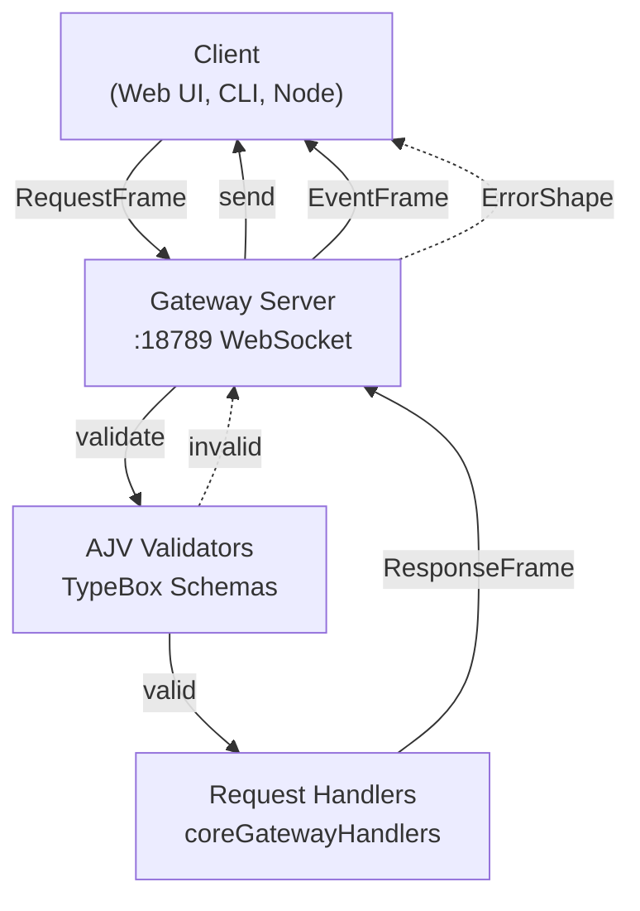
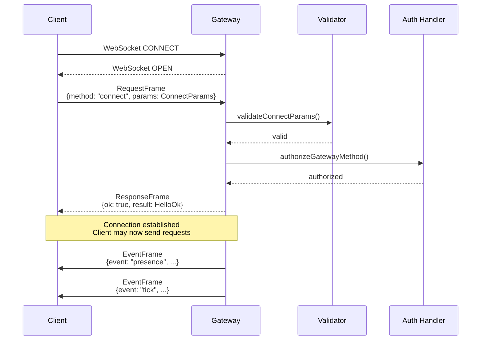
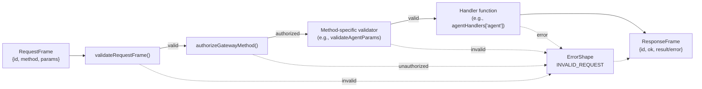
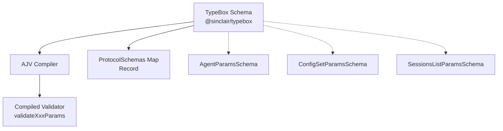
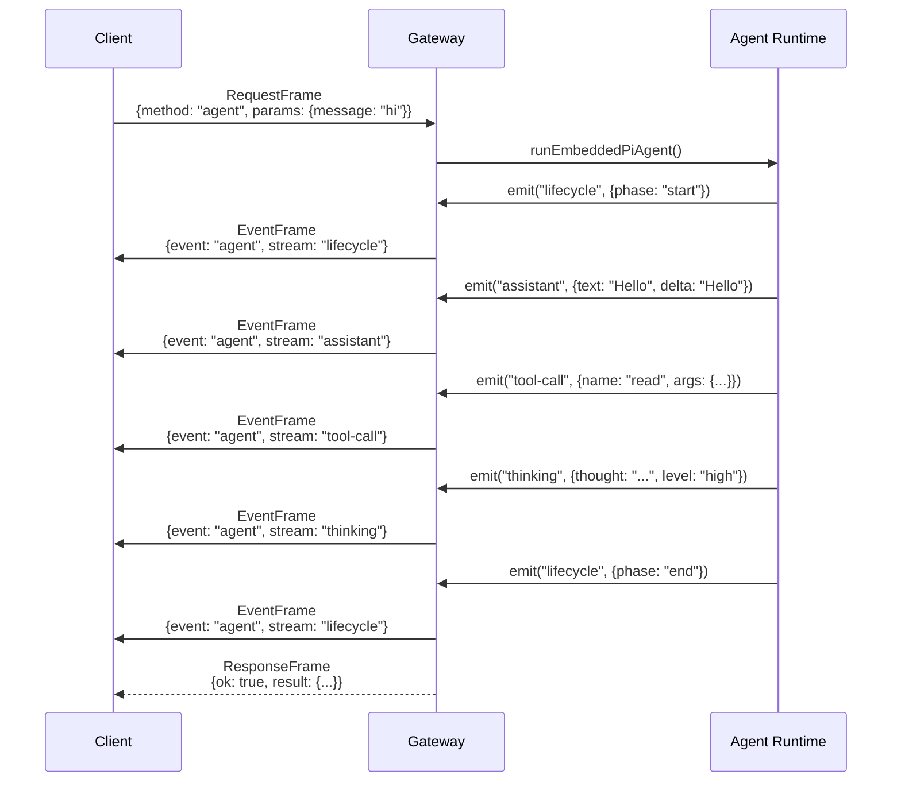
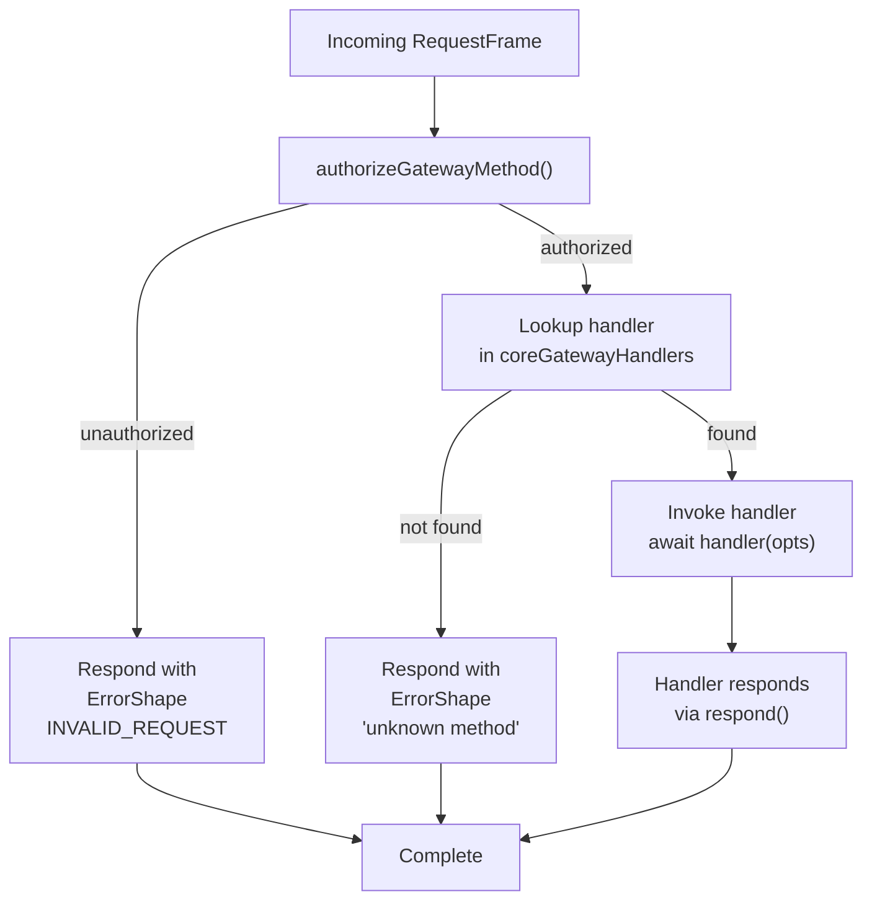

# Page: Protocol Specification

# プロトコル仕様

<details>
<summary>関連ソースファイル</summary>

この Wiki ページの生成に使用されたコンテキストファイル:

- [src/commands/agent.test.ts](src/commands/agent.test.ts)
- [src/commands/agent.ts](src/commands/agent.ts)
- [src/cron/isolated-agent.ts](src/cron/isolated-agent.ts)
- [src/cron/run-log.test.ts](src/cron/run-log.test.ts)
- [src/cron/run-log.ts](src/cron/run-log.ts)
- [src/cron/store.ts](src/cron/store.ts)
- [src/gateway/protocol/index.ts](src/gateway/protocol/index.ts)
- [src/gateway/protocol/schema.ts](src/gateway/protocol/schema.ts)
- [src/gateway/protocol/schema/agents-models-skills.ts](src/gateway/protocol/schema/agents-models-skills.ts)
- [src/gateway/protocol/schema/protocol-schemas.ts](src/gateway/protocol/schema/protocol-schemas.ts)
- [src/gateway/protocol/schema/types.ts](src/gateway/protocol/schema/types.ts)
- [src/gateway/server-methods-list.ts](src/gateway/server-methods-list.ts)
- [src/gateway/server-methods.ts](src/gateway/server-methods.ts)
- [src/gateway/server-methods/agents.ts](src/gateway/server-methods/agents.ts)
- [src/gateway/server.ts](src/gateway/server.ts)

</details>


このドキュメントは OpenClaw でのクライアントサーバー通信に使用されるゲートウェイ WebSocket RPC プロトコルを正式に仕様化します。フレームタイプ、検証スキーマ、認可スコープ、エラーハンドリングについて説明します。この仕様はゲートウェイと通信するクライアント、統合、または拡張機能を構築する開発者を対象としています。

ゲートウェイサーバーの実装とライフサイクルについては、[ゲートウェイサービス管理](#3.3) を参照してください。ゲートウェイがエージェントにメッセージをルーティングする方法の詳細については、[メッセージフロー](#8.3) を参照してください。

---

## プロトコル概要

ゲートウェイはポート 18789（`gateway.port` で設定可能）で **WebSocket RPC プロトコル** を公開します。すべての通信は TypeBox スキーマと AJV バリデーターで検証された構造化 JSON フレームを使用します。プロトコルはクライアント開始操作のリクエストレスポンスパターンに従い、プッシュ通知にはサーバー開始イベントを使用します。

**主な特徴:**
- JSON ペイロードを持つバイナリ WebSocket トランスポート
- AJV（Ajv パッケージ）を使用した厳格なスキーマ検証
- `PROTOCOL_VERSION` 経由のプロトコルバージョンネゴシエーション
- OAuth スタイルのスコープを持つロールベースの認可
- 長時間実行操作のストリーミングサポート



**Sources:** [src/gateway/protocol/index.ts:1-595](), [src/gateway/server-methods.ts:193-219]()

---

## フレームタイプ

プロトコルは AJV でコンパイルされた TypeBox スキーマに対して検証される 4 つの主要なフレームタイプを定義します。

### フレームタイプリファレンス

| フレームタイプ | 方向 | 目的 | スキーマ |
|------------|-----------|---------|--------|
| `GatewayFrame` | Server → Client | すべてのフレームのユニオン型 | `GatewayFrameSchema` |
| `RequestFrame` | Client → Server | パラメータ付きメソッド呼び出し | `RequestFrameSchema` |
| `ResponseFrame` | Server → Client | メソッド結果またはエラー | `ResponseFrameSchema` |
| `EventFrame` | Server → Client | サーバー開始通知 | `EventFrameSchema` |

### RequestFrame

クライアント開始の RPC 呼び出し。各リクエストには相関用の一意のリクエスト ID が含まれます。

```typescript
{
  id: number;           // Unique request identifier
  method: string;       // RPC method name (e.g., "agent", "config.set")
  params?: object;      // Method-specific parameters (validated per-method)
}
```

**Validation:** [src/gateway/protocol/index.ts:230]()

### ResponseFrame

クライアントリクエストに対するサーバーレスポンス。成功フラグと結果データまたはエラーシェイプのいずれかが含まれます。

```typescript
{
  id: number;           // Matches request ID
  ok: boolean;          // true = success, false = error
  result?: unknown;     // Present when ok=true
  error?: ErrorShape;   // Present when ok=false
}
```

**Validation:** [src/gateway/protocol/index.ts:231]()

### EventFrame

サーバー開始のプッシュ通知。イベントはレスポンスを期待しません。

```typescript
{
  event: string;        // Event type (e.g., "agent", "chat", "presence")
  data?: unknown;       // Event-specific payload
}
```

**Validation:** [src/gateway/protocol/index.ts:232]()

### ErrorShape

失敗したレスポンスで返される標準エラー形式。

```typescript
{
  code: number;         // ErrorCodes enum value
  message: string;      // Human-readable error description
  details?: unknown;    // Optional additional context
}
```

**Sources:** [src/gateway/protocol/schema/frames.ts:1-150](), [src/gateway/protocol/index.ts:229-233]()

---

## 接続ライフサイクル

### 1. 接続確立

クライアントは WebSocket 経由で接続し、認証資格情報を含む `connect` メソッドを送信します。



**ConnectParams Schema:**

```typescript
{
  version?: number;          // Protocol version (default: PROTOCOL_VERSION)
  role?: "operator" | "node"; // Connection role
  scopes?: string[];         // OAuth-style scopes
  token?: string;            // Authentication token
  password?: string;         // Password authentication
  deviceId?: string;         // Device pairing ID
}
```

**HelloOk Response:**

```typescript
{
  version: number;           // Server protocol version
  sessionId?: string;        // Assigned session identifier
  capabilities?: string[];   // Available features
}
```

**Sources:** [src/gateway/protocol/schema/frames.ts:1-50](), [src/gateway/server-methods/connect.ts:1-100]()

### 2. 認可とスコープ

すべてのメソッド（`connect` を除く）にはロールベースの認可が必要です。`authorizeGatewayMethod` 関数がアクセス制御を強制します。

#### 認可スコープ

| スコープ | アクセスレベル | 典型的なユースケース |
|-------|--------------|------------------|
| `operator.admin` | 完全な管理者アクセス | 設定変更、エージェント管理 |
| `operator.write` | 読み取り + 書き込み操作 | メッセージ送信、エージェント呼び出し |
| `operator.read` | 読み取り専用操作 | ステータスクエリ、セッションリスト |
| `operator.approvals` | exec 承認管理 | コマンド実行の承認/拒否 |
| `operator.pairing` | デバイスペアリング | ノードのペア、トークン管理 |

#### ロールベースアクセス

| ロール | デフォルトスコープ | メソッドアクセス |
|------|----------------|---------------|
| `operator` | `scopes` で設定可能 | すべての operator.* メソッド |
| `node` | なし（ノード固有メソッド） | `node.invoke.result`、`node.event`、`skills.bins` |

**メソッド認可の例:**

```typescript
// 読み取りメソッド（operator.read OR operator.write を必要）
READ_METHODS = [
  "health", "logs.tail", "channels.status",
  "models.list", "agents.list", "sessions.list"
]

// 書き込みメソッド（operator.write を必要）
WRITE_METHODS = [
  "send", "agent", "wake", "node.invoke", "chat.send"
]

// 管理者メソッド（operator.admin を必要）
ADMIN_METHODS = [
  "config.*", "wizard.*", "agents.create",
  "sessions.delete", "cron.add"
]
```

**Sources:** [src/gateway/server-methods.ts:29-163]()

### 3. リクエストレスポンスサイクル

標準的なメソッド呼び出しは厳格な検証を持つ RPC パターンに従います。



**Sources:** [src/gateway/server-methods.ts:193-219]()

---

## メソッドスキーマと検証

すべての RPC メソッドには対応する TypeBox スキーマとコンパイルされた AJV バリデーターがあります。検証パイプラインはタイプセーフを確保し、不正なリクエストを防ぎます。

### スキーマアーキテクチャ



### メソッドスキーマ例

#### エージェント実行（`agent` メソッド）

```typescript
// Schema: AgentParamsSchema
{
  message: string;           // Required: user prompt
  sessionId?: string;        // Optional: resume session
  to?: string;               // Optional: E.164 phone number
  thinking?: string;         // Optional: "low" | "high" | "off"
  verbose?: boolean;         // Optional: verbose mode
  images?: string[];         // Optional: image URLs
}

// Validator
validateAgentParams(params) // returns boolean
```

#### 設定更新（`config.set` メソッド）

```typescript
// Schema: ConfigSetParamsSchema
{
  key: string;               // Config path (e.g., "agents.defaults.model")
  value: unknown;            // New value (type-checked by config schema)
}

// Validator
validateConfigSetParams(params)
```

#### セッションリスト（`sessions.list` メソッド）

```typescript
// Schema: SessionsListParamsSchema
{
  limit?: number;            // Max results (default: 50)
  offset?: number;           // Pagination offset
  agentId?: string;          // Filter by agent
}

// Validator
validateSessionsListParams(params)
```

**Sources:** [src/gateway/protocol/index.ts:229-364](), [src/gateway/protocol/schema/protocol-schemas.ts:1-259]()

### 検証エラーフォーマット

失敗した検証は `formatValidationErrors` 経由で詳細なエラーメッセージを返します:

```typescript
// Input: AJV ErrorObject[]
[
  {
    keyword: "additionalProperties",
    instancePath: "",
    params: { additionalProperty: "unknownField" }
  }
]

// Output: Formatted string
"at root: unexpected property 'unknownField'"
```

**Sources:** [src/gateway/protocol/index.ts:366-400]()

---

## ゲートウェイメソッドリファレンス

ゲートウェイは複数の機能ドメインにわたる 90 以上の RPC メソッドを公開します。メソッドはプレフィックスで整理されています。

### コアメソッドカテゴリ

| プレフィックス | ドメイン | メソッド例 |
|--------|--------|-----------------|
| `agent*` | エージェント実行 | `agent`、`agent.wait`、`agent.identity.get` |
| `agents.*` | エージェント管理 | `agents.list`、`agents.create`、`agents.delete` |
| `config.*` | 設定 | `config.get`、`config.set`、`config.apply` |
| `channels.*` | チャネル制御 | `channels.status`、`channels.logout` |
| `sessions.*` | セッション管理 | `sessions.list`、`sessions.patch`、`sessions.compact` |
| `cron.*` | スケジュールジョブ | `cron.list`、`cron.add`、`cron.run` |
| `node.*` | デバイスノード | `node.invoke`、`node.list`、`node.pair.request` |
| `skills.*` | スキル管理 | `skills.status`、`skills.install` |
| `wizard.*` | オンボーディングウィザード | `wizard.start`、`wizard.next` |
| `chat.*` | WebSocket チャット | `chat.send`、`chat.history`、`chat.abort` |

### 完全なメソッドリスト

完全なメソッドレジストリは `BASE_METHODS` で維持され、チャネルプラグインによって拡張されます:

```typescript
// Base methods
const BASE_METHODS = [
  "health", "logs.tail", "channels.status",
  "config.get", "config.set", "agent",
  "sessions.list", "cron.add", ...
];

// Dynamic extension by plugins
function listGatewayMethods(): string[] {
  const channelMethods = listChannelPlugins()
    .flatMap(plugin => plugin.gatewayMethods ?? []);
  return [...BASE_METHODS, ...channelMethods];
}
```

**Sources:** [src/gateway/server-methods-list.ts:1-97]()

---

## イベントストリーミング

ゲートウェイはリアルタイム更新のために接続されたクライアントにイベントをプッシュします。イベントは確認応答を必要としません。

### イベントタイプ

| イベント | トリガー | ペイロードスキーマ |
|-------|---------|----------------|
| `agent` | エージェント実行更新 | `AgentEventSchema` |
| `chat` | WebSocket チャットメッセージ | `ChatEventSchema` |
| `presence` | クライアントプレゼンス変更 | `PresenceEntry[]` |
| `tick` | 定期的なハートビート | `TickEventSchema` |
| `shutdown` | ゲートウェイシャットダウン | `ShutdownEventSchema` |
| `cron` | Cron ジョブ実行 | `CronJob` |
| `node.invoke.request` | ノード機能呼び出し | `NodeInvokeParams` |
| `exec.approval.requested` | exec 承認が必要 | `ExecApprovalRequestParams` |

### エージェントイベントストリーミング

エージェント実行はライフサイクル、アシスタントレスポンス、ツール呼び出し、思考を追跡するイベントストリームを発行します:



**エージェントイベントストリーム:**

| ストリーム | 目的 | データフィールド |
|--------|---------|-------------|
| `lifecycle` | 実行フェーズ | `phase`、`startedAt`、`endedAt`、`aborted` |
| `assistant` | LLM レスポンス | `text`、`delta`（ストリーミング） |
| `tool-call` | ツール呼び出し | `name`、`args`、`id` |
| `tool-result` | ツール出力 | `result`、`id` |
| `thinking` | 推論トークン | `thought`、`level` |
| `error` | 実行エラー | `error`、`message` |

**Sources:** [src/gateway/protocol/schema/agent.ts:1-100](), [src/gateway/server-methods-list.ts:98-118]()

---

## エラーハンドリング

すべてのエラーは `ErrorCodes` 列挙型からの標準化されたエラーコードを持つ `ErrorShape` 形式に従います。

### エラーコードリファレンス

| コード | 定数 | 意味 | トリガー例 |
|------|----------|---------|-----------------|
| 1000 | `INVALID_REQUEST` | 不正なリクエストまたは未認可 | スキーマ検証失敗、スコープ不足 |
| 1001 | `INTERNAL_ERROR` | サーバーサイドエラー | ハンドラでの未処理例外 |
| 1002 | `NOT_FOUND` | リソースが見つからない | 不明なセッション ID |
| 1003 | `CONFLICT` | リソース競合 | エージェント ID が既に存在 |
| 1004 | `TIMEOUT` | 操作タイムアウト | エージェント実行が制限を超過 |
| 1005 | `RATE_LIMIT` | レート制限超過 | リクエスト過多 |

### エラーレスポンス形式

```typescript
// ResponseFrame with error
{
  id: 42,
  ok: false,
  error: {
    code: 1000,
    message: "invalid agents.create params: at root: unexpected property 'extra'",
    details: {
      validationErrors: [...]  // Optional: AJV error objects
    }
  }
}
```

### エラーヘルパー関数

`errorShape` ヘルパーは標準化されたエラーオブジェクトを構築します:

```typescript
function errorShape(
  code: number,
  message: string,
  details?: unknown
): ErrorShape {
  return { code, message, details };
}

// Usage in handlers
respond(false, undefined, errorShape(
  ErrorCodes.INVALID_REQUEST,
  "agent not found"
));
```

**Sources:** [src/gateway/protocol/schema/error-codes.ts:1-50](), [src/gateway/protocol/schema/frames.ts:50-100]()

---

## プロトコルバージョニング

プロトコルには互換性チェックと段階的な移行を可能にするバージョン定数が含まれています。

### バージョンネゴシエーション

```typescript
export const PROTOCOL_VERSION = 3 as const;

// Client sends version in connect
{
  method: "connect",
  params: {
    version: 3  // Client's supported version
  }
}

// Server responds with its version
{
  ok: true,
  result: {
    version: 3,  // Server's version
    ...
  }
}
```

バージョンが互換性がない場合、サーバーは接続を拒否するか互換モードを有効にする場合があります。バージョンの不一致はログに記録されますが、現在は接続をブロックしません。

**バージョン履歴:**
- **バージョン 1:** 初期 WebSocket RPC プロトコル
- **バージョン 2:** エージェントイベントストリーミング、ノードペアリングを追加
- **バージョン 3:** 現在のバージョン、チャット WebSocket メソッド、exec 承認付き

**Sources:** [src/gateway/protocol/schema/protocol-schemas.ts:258]()

---

## ハンドラ実装

ゲートウェイメソッドは機能ドメインごとにグループ化されたハンドラオブジェクトの非同期関数として実装されます。

### ハンドラ構造

```typescript
type GatewayRequestHandlers = Record<
  string,
  (opts: GatewayRequestOptions) => Promise<void>
>;

type GatewayRequestOptions = {
  req: RequestFrame;
  params: Record<string, unknown>;
  client: ConnectedClient;
  respond: (ok: boolean, result?: unknown, error?: ErrorShape) => void;
  context: ServerContext;
};
```

### ハンドラ例: `agents.list`

```typescript
export const agentsHandlers: GatewayRequestHandlers = {
  "agents.list": ({ params, respond }) => {
    // 1. Validate params
    if (!validateAgentsListParams(params)) {
      respond(false, undefined, errorShape(
        ErrorCodes.INVALID_REQUEST,
        `invalid agents.list params: ${formatValidationErrors(
          validateAgentsListParams.errors
        )}`
      ));
      return;
    }

    // 2. Load config
    const cfg = loadConfig();

    // 3. Execute business logic
    const result = listAgentsForGateway(cfg);

    // 4. Respond with result
    respond(true, result, undefined);
  }
};
```

### ハンドラレジストリ

すべてのハンドラは `coreGatewayHandlers` オブジェクトにマージされます:

```typescript
export const coreGatewayHandlers: GatewayRequestHandlers = {
  ...connectHandlers,
  ...agentHandlers,
  ...agentsHandlers,
  ...configHandlers,
  ...sessionsHandlers,
  ...channelsHandlers,
  // ... 15 以上のハンドラグループ
};
```

**Sources:** [src/gateway/server-methods.ts:165-191](), [src/gateway/server-methods/agents.ts:167-507]()

---

## リクエストルーティングとディスパッチ

`handleGatewayRequest` 関数は検証、認可、ハンドラディスパッチを調整します。



**実装:**

```typescript
export async function handleGatewayRequest(
  opts: GatewayRequestOptions & { extraHandlers?: GatewayRequestHandlers }
): Promise<void> {
  const { req, respond, client } = opts;

  // 1. Authorize method
  const authError = authorizeGatewayMethod(req.method, client);
  if (authError) {
    respond(false, undefined, authError);
    return;
  }

  // 2. Lookup handler
  const handler = opts.extraHandlers?.[req.method]
    ?? coreGatewayHandlers[req.method];
  if (!handler) {
    respond(false, undefined, errorShape(
      ErrorCodes.INVALID_REQUEST,
      `unknown method: ${req.method}`
    ));
    return;
  }

  // 3. Invoke handler
  await handler({
    req,
    params: req.params ?? {},
    client,
    respond,
    context: opts.context
  });
}
```

**Sources:** [src/gateway/server-methods.ts:193-219]()

---

## タイプセーフとコード生成

プロトコルスキーマは 2 つの目的を果たします:
1. **ランタイム検証** AJV コンパイル済みバリデーター経由
2. **TypeScript 型生成** `Static<typeof Schema>` 経由

### スキーマから型へのマッピング

```typescript
// Schema definition
export const AgentsListParamsSchema = Type.Object({}, {
  additionalProperties: false
});

// Generated type
export type AgentsListParams = Static<typeof AgentsListParamsSchema>;
// Result: {}

// Schema definition
export const AgentsCreateParamsSchema = Type.Object({
  name: NonEmptyString,
  workspace: NonEmptyString,
  emoji: Type.Optional(Type.String()),
  avatar: Type.Optional(Type.String())
}, { additionalProperties: false });

// Generated type
export type AgentsCreateParams = Static<typeof AgentsCreateParamsSchema>;
// Result: { name: string; workspace: string; emoji?: string; avatar?: string; }
```

すべてのプロトコル型はクライアントによる使用のためにメインプロトコルインデックスからエクスポートされます:

```typescript
export type {
  RequestFrame,
  ResponseFrame,
  EventFrame,
  AgentParams,
  ConfigSetParams,
  SessionsListParams,
  // ... 60 以上の型
}
```

**Sources:** [src/gateway/protocol/schema/types.ts:1-241](), [src/gateway/protocol/index.ts:496-594]()

---

## 拡張ポイント

プロトコルはプラグイン提供のメソッドを通じて拡張性をサポートします。

### プラグインゲートウェイメソッド

チャネルプラグインは追加の RPC メソッドを宣言できます:

```typescript
// In plugin definition
export const customChannelPlugin = {
  id: "custom-channel",
  gatewayMethods: [
    "custom.login",
    "custom.send",
    "custom.status"
  ],
  handlers: {
    "custom.login": async ({ params, respond }) => {
      // Custom login logic
      respond(true, { ok: true }, undefined);
    }
  }
};
```

ゲートウェイは起動時にプラグインハンドラをコアハンドラにマージします:

```typescript
const extraHandlers = loadPluginHandlers();
await handleGatewayRequest({
  req,
  respond,
  client,
  context,
  extraHandlers  // Merged with coreGatewayHandlers
});
```

**Sources:** [src/gateway/server-methods-list.ts:93-96]()

---

## まとめ

ゲートウェイ WebSocket RPC プロトコルは OpenClaw のために型付けられ、検証され、認可された通信レイヤーを提供します。主要な設計原則:

1. **スキーマファースト設計:** すべてのメソッドは AJV バリデーターにコンパイルされる TypeBox スキーマを持つ
2. **タイプセーフ:** スキーマから生成された TypeScript 型はコンパイル時の正確性を確保
3. **ロールベース認可:** OAuth スタイルのスコープがメソッドアクセスを制御
4. **構造化エラー:** 一貫したエラーハンドリングのための標準化されたエラーコードとフォーマット
5. **イベントストリーミング:** エージェント実行とシステムイベントのリアルタイムプッシュ通知
6. **拡張性:** プラグインシステムがコア変更なしで外部メソッドを許可

**主要なコンポーネント:**
- フレームバリデーター: `validateRequestFrame`、`validateResponseFrame`、`validateEventFrame` [src/gateway/protocol/index.ts:229-233]()
- ハンドラレジストリ: `coreGatewayHandlers` [src/gateway/server-methods.ts:165-191]()
- リクエストディスパッチャ: `handleGatewayRequest` [src/gateway/server-methods.ts:193-219]()
- エラーフォーマッター: `errorShape`、`formatValidationErrors` [src/gateway/protocol/index.ts:366-400]()
- メソッドリスト: `listGatewayMethods()` [src/gateway/server-methods-list.ts:93-96]()

**Sources:** [src/gateway/protocol/index.ts:1-595](), [src/gateway/server-methods.ts:1-220](), [src/gateway/protocol/schema/protocol-schemas.ts:1-259]()

---
