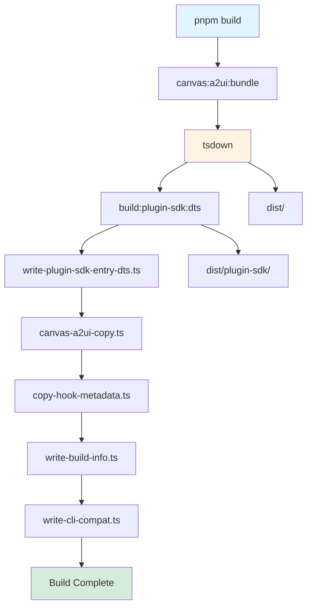
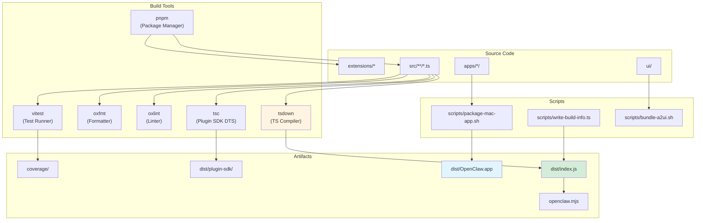

# Page: Building from Source

# ソースからのビルド

<details>
<summary>関連ソースファイル</summary>

この Wiki ページの生成に使用されたコンテキストファイル:

- [.agents/skills/mintlify/SKILL.md](.agents/skills/mintlify/SKILL.md)
- [.github/ISSUE_TEMPLATE/bug_report.md](.github/ISSUE_TEMPLATE/bug_report.md)
- [.github/ISSUE_TEMPLATE/config.yml](.github/ISSUE_TEMPLATE/config.yml)
- [.github/ISSUE_TEMPLATE/feature_request.md](.github/ISSUE_TEMPLATE/feature_request.md)
- [.github/labeler.yml](.github/labeler.yml)
- [.github/workflows/auto-response.yml](.github/workflows/auto-response.yml)
- [.github/workflows/labeler.yml](.github/workflows/labeler.yml)
- [.github/workflows/stale.yml](.github/workflows/stale.yml)
- [AGENTS.md](AGENTS.md)
- [docs/channels/index.md](docs/channels/index.md)
- [docs/zh-CN/channels/index.md](docs/zh-CN/channels/index.md)
- [extensions/copilot-proxy/package.json](extensions/copilot-proxy/package.json)
- [extensions/google-antigravity-auth/package.json](extensions/google-antigravity-auth/package.json)
- [extensions/google-gemini-cli-auth/package.json](extensions/google-gemini-cli-auth/package.json)
- [extensions/matrix/CHANGELOG.md](extensions/matrix/CHANGELOG.md)
- [extensions/matrix/package.json](extensions/matrix/package.json)
- [extensions/memory-lancedb/package.json](extensions/memory-lancedb/package.json)
- [extensions/msteams/CHANGELOG.md](extensions/msteams/CHANGELOG.md)
- [extensions/msteams/package.json](extensions/msteams/package.json)
- [extensions/voice-call/CHANGELOG.md](extensions/voice-call/CHANGELOG.md)
- [extensions/voice-call/package.json](extensions/voice-call/package.json)
- [extensions/zalo/CHANGELOG.md](extensions/zalo/CHANGELOG.md)
- [extensions/zalo/package.json](extensions/zalo/package.json)
- [extensions/zalouser/package.json](extensions/zalouser/package.json)
- [package.json](package.json)
- [pnpm-lock.yaml](pnpm-lock.yaml)
- [scripts/sync-labels.ts](scripts/sync-labels.ts)

</details>


このページは OpenClaw をソースコードからビルドするプロセスを文書化し、依存関係のインストール、TypeScript コンパイル、テスト、プラットフォーム固有のビルドについて説明します。これはコントリビューターとメンテナーが使用する開発ビルドワークフローをカバーします。

エンドユーザー向けのインストール方法については、[インストール](#2) を参照してください。リリースと公開プロセスについては、[リリースプロセス](#15.4) を参照してください。CI/CD 自動化については、[CI/CD パイプライン](#15.5) を参照してください。

---

## 前提条件

OpenClaw をソースからビルドするには以下のツールとランタイムが必要です:

| 要件 | バージョン | 目的 |
|-------------|---------|---------|
| **Node.js** | ≥22.12.0 | コンパイルと実行のための JavaScript ランタイム |
| **pnpm** | 10.23.0 | プライマリパッケージマネージャー（`packageManager` フィールドで指定） |
| **Bun** | 最新版 | TypeScript 実行のための代替ランタイム（オプションだが開発に推奨） |
| **Git** | 最新版 | バージョン管理とリポジトリ操作 |

**プラットフォーム固有の要件:**

- **macOS ビルド**: Xcode、Swift ツールチェーン、`xcodegen`
- **iOS ビルド**: Xcode、iOS SDK、シミュレーターまたはデバイス
- **Android ビルド**: Android SDK、Gradle、Java/Kotlin ツールチェーン
- **Docker ビルド**: Docker Engine（サンドボックスとコンテナテスト用）

Sources: [package.json:191-194]()

---

## リポジトリ構成

ビルドシステムは以下のディレクトリ構造で動作します:

```
openclaw/
├── src/                  # TypeScript source code
├── dist/                 # Compiled JavaScript output
├── extensions/           # Plugin packages (workspace packages)
├── apps/
│   ├── macos/           # macOS app (Swift/SwiftUI)
│   ├── ios/             # iOS app (Swift/SwiftUI)
│   └── android/         # Android app (Kotlin/Gradle)
├── ui/                  # Web UI (Lit components)
├── scripts/             # Build and automation scripts
├── package.json         # Root package manifest
├── pnpm-lock.yaml       # Dependency lockfile
├── pnpm-workspace.yaml  # Workspace configuration
└── tsconfig.json        # TypeScript configuration
```

リポジトリはモノレポ管理に pnpm ワークスペースを使用します。拡張機能は `extensions/*` 以下の個別パッケージで、開発時には `workspace:*` 経由でコアの `openclaw` パッケージに依存しますが、ランタイムでは異なる解決方法を使用します。

Sources: [package.json:11-22](), [AGENTS.md:6-13]()

---

## 開発セットアップ

### リポジトリをクローン

```bash
git clone https://github.com/openclaw/openclaw.git
cd openclaw
```

### 依存関係をインストール

```bash
pnpm install
```

このコマンドは以下を実行します:
- `package.json` で宣言されたすべての依存関係をインストール
- `extensions/*/package.json` の拡張機能の依存関係をインストール
- 存在する場合 `pnpm.patchedDependencies` からパッチを適用
- ワークスペースパッケージをリンク

**Bun を使用する場合:**

```bash
bun install
```

Bun は開発時の依存関係インストールと TypeScript 実行でサポートされています。依存関係を変更する際は `pnpm-lock.yaml` と Bun パッチングを同期させる必要があります。

### pre-commit フックをセットアップ

```bash
pnpm prek install
```

これは `prek` ツール経由で pre-commit フックをインストールし、各コミット前に CI と同じ検証チェック（リント、フォーマット、型チェック）を実行します。フック設定は `.git/hooks/` に保存されます。

Sources: [AGENTS.md:53-66](), [package.json:76]()

---

## ビルドシステム

### ビルドパイプライン

ビルドプロセスは複数のフェーズで順番に実行されます:



**フェーズの詳細:**

1. **`canvas:a2ui:bundle`** - Canvas A2UI コンポーネントライブラリをバンドル（スクリプト: [scripts/bundle-a2ui.sh]()）
2. **`tsdown`** - TypeScript ソースを `dist/` ディレクトリに JavaScript にコンパイル
3. **`build:plugin-sdk:dts`** - プラグイン SDK の TypeScript 宣言ファイルを生成
4. **`write-plugin-sdk-entry-dts.ts`** - プラグイン SDK のエントリポイント型定義を書き込み
5. **`canvas-a2ui-copy.ts`** - Canvas A2UI バンドルアーティファクトをコピー
6. **`copy-hook-metadata.ts`** - ランタイム検出用のフックメタデータをコピー
7. **`write-build-info.ts`** - ビルドメタデータ（バージョン、タイムスタンプ、コミットハッシュ）を書き込み
8. **`write-cli-compat.ts`** - CLI 互換性情報を書き込み

Sources: [package.json:38]()

### ビルドアーティファクト

ビルドは以下のアーティファクトを生成します:

| アーティファクト | 場所 | 目的 |
|----------|----------|---------|
| **コアライブラリ** | `dist/index.js` | メインエントリポイント（ESM） |
| **プラグイン SDK** | `dist/plugin-sdk/` | 拡張機能用の公開 API |
| **CLI バイナリ** | `openclaw.mjs` | CLI エントリポイント（shebang スクリプト） |
| **型定義** | `dist/**/*.d.ts` | TypeScript 宣言 |
| **Canvas バンドル** | `dist/canvas-a2ui/` | バンドルされた UI コンポーネント |
| **プロトコルスキーマ** | `dist/protocol.schema.json` | ゲートウェイプロトコルスキーマ |

`openclaw.mjs` ファイルは CLI エントリポイントとして機能し、`package.json` の `bin` フィールドで宣言されています。これはコンパイルされた `dist/` 出力を動的に読み込みます。

Sources: [package.json:8-10](), [package.json:24-31]()

### TypeScript コンパイル

TypeScript コンパイルは高速なバンドラー兼コンパイラである `tsdown` を使用します。設定は複数のファイルに分割されています:

- **`tsconfig.json`** - メインの TypeScript 設定（コンパイラオプション、include/exclude パターン）
- **`tsconfig.plugin-sdk.dts.json`** - プラグイン SDK 型生成の設定

コンパイラは `package.json` の `"type": "module"` で指定された ES モジュール（ESM）を生成します。出力は対応する `.d.ts` 型宣言ファイルとともに `dist/` に書き込まれます。

Sources: [package.json:23]()

---

## テスト

### テストアーキテクチャ

OpenClaw はテストランナーとして Vitest を使用し、V8 経由でカバレッジ追跡を行います:

```mermaid
graph TB
    subgraph "Test Types"
        Unit[Unit Tests<br/>*.test.ts]
        E2E[E2E Tests<br/>*.e2e.test.ts]
        Live[Live Tests<br/>vitest.live.config.ts]
        Docker[Docker Tests<br/>scripts/test-*-docker.sh]
    end

    subgraph "Test Execution"
        Vitest[Vitest Runner]
        Coverage["V8 Coverage<br/>(70% threshold)"]
        Parallel[Parallel Execution<br/>(max 16 workers)]
    end

    subgraph "CI Integration"
        GHActions[GitHub Actions]
        Jobs[Test Jobs<br/>(Node, Bun, Platform-specific)]
    end

    Unit --> Vitest
    E2E --> Vitest
    Live --> Vitest
    Docker --> GHActions

    Vitest --> Coverage
    Vitest --> Parallel

    GHActions --> Jobs

    style Vitest fill:#fff4e1
    style Coverage fill:#ffe1e1
    style GHActions fill:#e1f5ff
```

### テストコマンド

| コマンド | 目的 | 設定 |
|---------|---------|---------------|
| `pnpm test` | すべてのユニットテストを並列実行 | [scripts/test-parallel.mjs]() |
| `pnpm test:fast` | ユニットテストのみ実行 | [vitest.unit.config.ts]() |
| `pnpm test:e2e` | エンドツーエンドテストを実行 | [vitest.e2e.config.ts]() |
| `pnpm test:live` | 実際の API に対してテストを実行 | [vitest.live.config.ts]() |
| `pnpm test:coverage` | カバレッジレポートを生成 | [vitest.config.ts]() |
| `pnpm test:watch` | 開発用ウォッチモード | [vitest.config.ts]() |

**Docker ベースのテストスイート:**

```bash
pnpm test:docker:live-models        # コンテナでモデルプロバイダーをテスト
pnpm test:docker:live-gateway       # コンテナでゲートウェイをテスト
pnpm test:docker:onboard            # Docker でオンボーディングフローをテスト
pnpm test:docker:gateway-network    # ネットワーク設定をテスト
pnpm test:docker:plugins            # プラグイン読み込みをテスト
```

各 Docker テストはマウントされた API キーを持つ隔離されたコンテナで実行され、特定のシナリオを検証します。

Sources: [package.json:82-93](), [AGENTS.md:86-92]()

### カバレッジ要件

テストスイートは Vitest 経由で最小カバレッジしきい値を強制します:

- **行**: 70%
- **分岐**: 70%
- **関数**: 70%
- **文**: 70%

カバレッジは V8 の組み込みカバレッジ計測を使用して測定され、ファイルごとに追跡されます。カバレッジレポートは `coverage/` ディレクトリに生成されます。

Sources: [AGENTS.md:86]()

### ライブテスト

ライブテストは実際の API プロバイダー（Anthropic、OpenAI、Google など）に対して実行され、有効な API キーが必要です:

```bash
# OpenClaw 固有のライブテスト
CLAWDBOT_LIVE_TEST=1 pnpm test:live

# すべてのライブテスト（プロバイダーテストを含む）
LIVE=1 pnpm test:live
```

API キーは `~/.openclaw/openclaw.json` または環境変数から読み込まれます。テストは誤検出を防ぐため請求エラーとレート制限を検出します。

Sources: [package.json:101](), [AGENTS.md:89]()

---

## 開発ワークフロー

### 開発モードでの実行

```bash
# 開発モードで CLI を実行（Bun 経由）
pnpm openclaw <command>

# 代替: 直接 dev スクリプト
pnpm dev <command>

# dev モードでゲートウェイを実行
pnpm gateway:dev

# ファイル監視付きでゲートウェイを実行
pnpm gateway:watch
```

`pnpm openclaw` コマンドは Bun を使用してコンパイルなしで直接 TypeScript を実行します。これは開発イテレーションを高速化します。

### リントとフォーマット

OpenClaw は高速なリントとフォーマットに Oxlint と Oxfmt を使用します:

```bash
# すべてのチェックを実行（フォーマット + 型チェック + リント）
pnpm check

# フォーマットチェックのみ
pnpm format:check

# フォーマットして修正
pnpm format

# リント（型認識ルール付き）
pnpm lint

# リントして修正
pnpm lint:fix
```

`pnpm check` コマンドは CI の事前チェックと同じ検証を実行します。変更をプッシュする前にパスする必要があります。

**設定ファイル:**

- **Oxlint**: `oxlint.config.json` またはインラインルールで設定
- **Oxfmt**: プロジェクト固有のオーバーライドを持つデフォルト設定を使用
- **TSGo**: `oxlint-tsgolint` プラグイン経由で型チェック

Sources: [package.json:41-66](), [AGENTS.md:62-66]()

### 型チェック

```bash
# すべてのソースファイルを型チェック
pnpm tsgo

# テストファイルを型チェック
pnpm tsgo:test
```

`tsgo` コマンドはコンパイルなしで完全な TypeScript 型チェックを実行します。`tsc` より高速に型の正確性を検証します。

Sources: [package.json:104]()

---

## プラットフォーム固有のビルド

### macOS アプリ

macOS アプリは `apps/macos/` の Swift ソースからビルドされます:

```bash
# macOS アプリをパッケージ
pnpm mac:package

# Xcode で開く
pnpm mac:open

# アプリを再起動（開発用）
pnpm mac:restart
```

`mac:package` スクリプト（[scripts/package-mac-app.sh]()）は Swift コードをコンパイルし、依存関係をバンドルし、`dist/OpenClaw.app` を作成します。このスクリプトはデフォルトで現在のアーキテクチャ（arm64 または x86_64）を使用します。

**リリースチェックリスト**: [docs/platforms/mac/release.md]()

Sources: [package.json:68-70](), [AGENTS.md:60]()

### iOS アプリ

iOS アプリは `apps/ios/` の Swift ソースからビルドされます:

```bash
# Xcode プロジェクトを生成
pnpm ios:gen

# Xcode で開く
pnpm ios:open

# シミュレーター用にビルド
pnpm ios:build

# シミュレーターで実行
pnpm ios:run
```

プロジェクトは `xcodegen` を使用して `project.yml` から `OpenClaw.xcodeproj` を生成します。デフォルトのシミュレーターターゲットは "iPhone 17" ですが、`IOS_DEST` と `IOS_SIM` 環境変数でオーバーライドできます。

Sources: [package.json:58-61]()

### Android アプリ

Android アプリは `apps/android/` の Kotlin ソースからビルドされます:

```bash
# デバッグ APK をビルド
pnpm android:assemble

# 接続されたデバイスにインストール
pnpm android:install

# ビルド、インストール、実行
pnpm android:run

# ユニットテストを実行
pnpm android:test
```

Android ビルドは標準の Android プラグインで Gradle を使用します。バージョン情報は [apps/android/app/build.gradle.kts]() に保存されています。

Sources: [package.json:34-37]()

---

## プラグイン開発

拡張機能は `extensions/*` で別々のワークスペースパッケージとして開発されます。各拡張機能は `devDependencies` または `peerDependencies` で `openclaw` に依存します:

```json
{
  "devDependencies": {
    "openclaw": "workspace:*"
  }
}
```

**プラグイン構造:**

- **エントリポイント**: `index.ts`（`openclaw.extensions` フィールドで宣言）
- **メタデータ**: チャネルプラグイン用の `package.json` の `openclaw.channel` フィールド
- **依存関係**: `dependencies` に拡張機能固有の依存関係、`devDependencies` にコア

**プラグインのビルドプロセス:**

1. コア OpenClaw が最初にビルドされる（`pnpm build`）
2. プラグインコードはエイリアス解決付きで `jiti`（ランタイムローダー）経由で読み込まれる
3. プラグイン SDK 型は `openclaw/plugin-sdk` からインポートされる

Sources: [extensions/matrix/package.json:1-36](), [extensions/zalo/package.json:1-35](), [AGENTS.md:11-12]()

---

## トラブルシューティング

### よくあるビルド問題

| 問題 | 解決策 |
|---------|----------|
| **`pnpm install` が失敗する** | `node_modules/` と `pnpm-lock.yaml` を削除し、再度 `pnpm install` を実行 |
| **更新後の型エラー** | 型宣言を再生成するために `pnpm build` を実行 |
| **プラグインが見つからない** | プラグインが `pnpm-workspace.yaml` にリストされていることを確認し、`pnpm install` を実行 |
| **Canvas バンドルハッシュの不一致** | バンドルを再生成するために `pnpm canvas:a2ui:bundle` を実行 |
| **ビルド情報が古い** | ビルドメタデータを更新するために `pnpm build` を再実行 |

### 依存関係の競合

OpenClaw は推移的な依存関係の特定バージョンを強制するために `pnpm.overrides` を使用します:

- **fast-xml-parser**: 5.3.4（セキュリティ修正）
- **@sinclair/typebox**: 0.34.48（バージョン整合）
- **tar**: 7.5.7（セキュリティ修正）

これらのオーバーライドは [package.json:197-204]() で宣言されています。

### プラットフォーム固有の問題

**macOS ビルド:**

- Xcode コマンドラインツールがインストールされていることを確認: `xcode-select --install`
- 公証の場合、App Store Connect 認証情報が環境変数にあることを確認
- Team ID ルックアップ: `security find-identity -p codesigning -v`

**iOS ビルド:**

- 実行前にシミュレーターが起動している必要がある: `xcrun simctl boot "iPhone 17"`
- シミュレーターが失敗した場合、リセット: `xcrun simctl erase all`

**Android ビルド:**

- `ANDROID_HOME` が正しく設定されていることを確認
- デバイスデバッグの場合、USB デバッグを有効にしデバイスを認証
- 接続されたデバイスを確認: `adb devices`

Sources: [AGENTS.md:143-144]()

---

## ビルドシステム図



Sources: [package.json:38-109](), [AGENTS.md:53-66]()

---

## 関連ドキュメント

- **[アーキテクチャ詳細](#15.1)** - 詳細なシステムアーキテクチャと設計パターン
- **[プロトコル仕様](#15.2)** - ゲートウェイ WebSocket プロトコル正式仕様
- **[リリースプロセス](#15.4)** - 公開、バージョニング、デプロイ手順
- **[CI/CD パイプライン](#15.5)** - 自動テストとデプロイワークフロー
- **[コントリビューションガイドライン](#15.6)** - コーディング標準とコントリビューションプロセス

---
