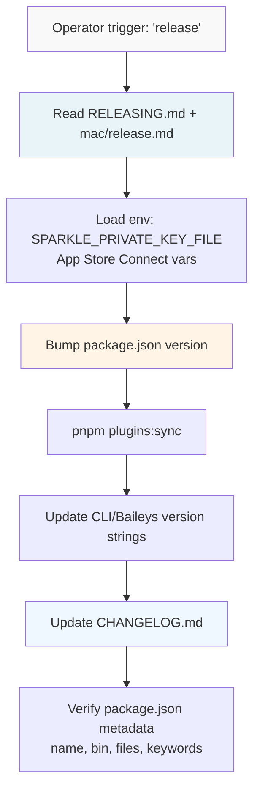
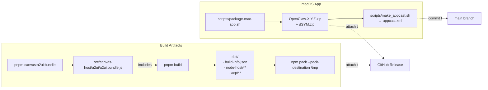
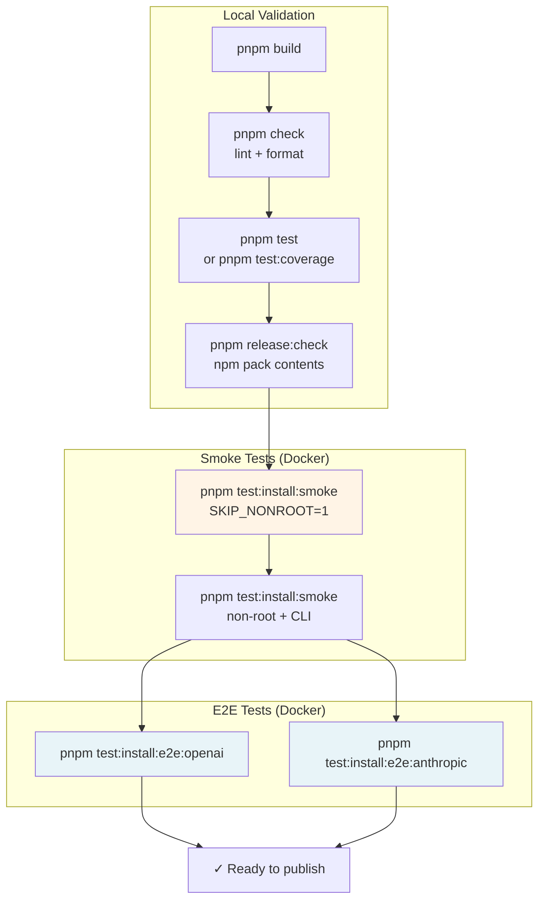
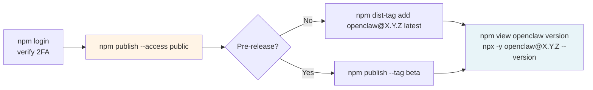
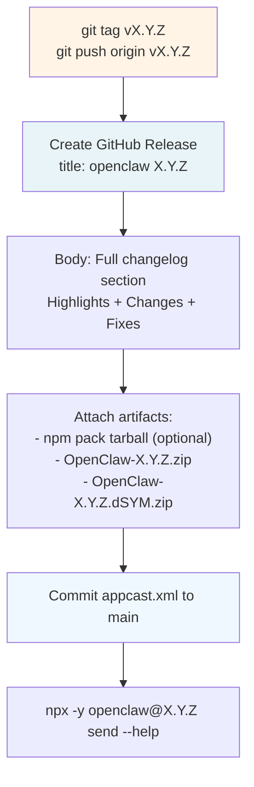
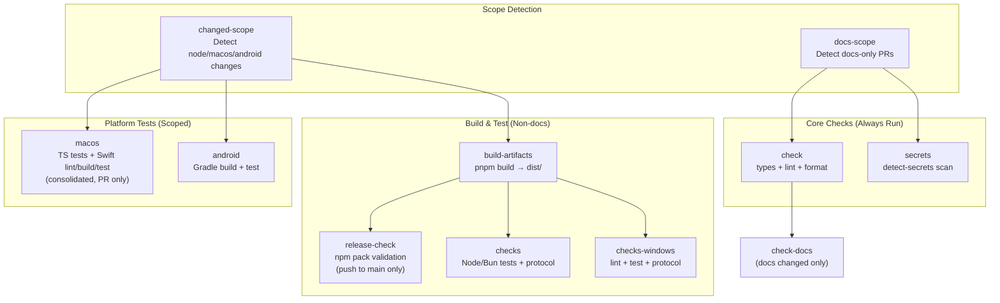
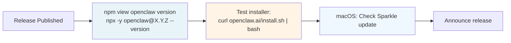

# Page: Release Process

# リリースプロセス

<details>
<summary>関連ソースファイル</summary>

この Wiki ページの生成に使用されたコンテキストファイル:

- [.agents/skills/mintlify/SKILL.md](.agents/skills/mintlify/SKILL.md)
- [.github/ISSUE_TEMPLATE/bug_report.md](.github/ISSUE_TEMPLATE/bug_report.md)
- [.github/ISSUE_TEMPLATE/config.yml](.github/ISSUE_TEMPLATE/config.yml)
- [.github/ISSUE_TEMPLATE/feature_request.md](.github/ISSUE_TEMPLATE/feature_request.md)
- [.github/actions/detect-docs-changes/action.yml](.github/actions/detect-docs-changes/action.yml)
- [.github/actions/setup-node-env/action.yml](.github/actions/setup-node-env/action.yml)
- [.github/labeler.yml](.github/labeler.yml)
- [.github/workflows/auto-response.yml](.github/workflows/auto-response.yml)
- [.github/workflows/ci.yml](.github/workflows/ci.yml)
- [.github/workflows/labeler.yml](.github/workflows/labeler.yml)
- [.github/workflows/stale.yml](.github/workflows/stale.yml)
- [.gitignore](.gitignore)
- [AGENTS.md](AGENTS.md)
- [docs/automation/poll.md](docs/automation/poll.md)
- [docs/channels/index.md](docs/channels/index.md)
- [docs/ci.md](docs/ci.md)
- [docs/providers/synthetic.md](docs/providers/synthetic.md)
- [docs/zh-CN/channels/index.md](docs/zh-CN/channels/index.md)
- [docs/zh-CN/vps.md](docs/zh-CN/vps.md)
- [extensions/msteams/src/store-fs.ts](extensions/msteams/src/store-fs.ts)
- [scripts/sync-labels.ts](scripts/sync-labels.ts)
- [scripts/test-live-gateway-models-docker.sh](scripts/test-live-gateway-models-docker.sh)
- [scripts/test-live-models-docker.sh](scripts/test-live-models-docker.sh)
- [src/agents/live-auth-keys.test.ts](src/agents/live-auth-keys.test.ts)
- [src/agents/live-auth-keys.ts](src/agents/live-auth-keys.ts)
- [src/agents/pi-embedded-helpers.isbillingerrormessage.test.ts](src/agents/pi-embedded-helpers.isbillingerrormessage.test.ts)
- [src/agents/zai.live.test.ts](src/agents/zai.live.test.ts)
- [src/commands/message.ts](src/commands/message.ts)
- [src/gateway/live-image-probe.ts](src/gateway/live-image-probe.ts)
- [src/infra/outbound/abort.ts](src/infra/outbound/abort.ts)
- [src/infra/outbound/message.ts](src/infra/outbound/message.ts)
- [src/infra/outbound/outbound-send-service.ts](src/infra/outbound/outbound-send-service.ts)
- [src/media/png-encode.ts](src/media/png-encode.ts)
- [src/pairing/pairing-store.ts](src/pairing/pairing-store.ts)

</details>


このドキュメントは OpenClaw の完全なリリースワークフローについて説明し、npm パッケージ公開、GitHub リリース作成、Sparkle 経由の macOS アプリ配布、検証テストを含みます。CI/CD パイプラインの詳細については、[15.5](#15.5) を参照してください。macOS アプリ固有のリリース手順については、[docs/platforms/mac/release.md]() のプラットフォーム固有ガイドを参照してください。

---

## リリースチャネル

OpenClaw は 3 つのリリースチャネルを使用します:

| チャネル | 説明 | npm タグ | バージョン形式 | GitHub タグ |
|---------|-------------|---------|----------------|------------|
| **stable** | 本番リリース | `latest` | `YYYY.M.D` | `vYYYY.M.D` |
| **beta** | プレリリースビルド | `beta` | `YYYY.M.D-beta.N` | `vYYYY.M.D-beta.N` |
| **dev** | 開発ヘッド | N/A | N/A | N/A（タグなし `main`） |

**Sources:** [AGENTS.md:74-79]()

---

## バージョン番号付け

OpenClaw は安定版リリースにカレンダーバージョニング（`YYYY.M.D`）を使用し、プレリリースには `-beta.N` を付加します。バージョン文字列は複数の場所で更新する必要があります:

| 場所 | 目的 | 例 |
|----------|---------|---------|
| [package.json]() | npm パッケージバージョン | `"version": "2026.1.29"` |
| [apps/android/app/build.gradle.kts]() | Android versionName/versionCode | `versionName = "2026.1.29"` |
| [apps/ios/Sources/Info.plist]() | iOS CFBundleShortVersionString/CFBundleVersion | `<string>2026.1.29</string>` |
| [apps/ios/Tests/Info.plist]() | iOS テストバンドルバージョン | `<string>2026.1.29</string>` |
| [apps/macos/Sources/OpenClaw/Resources/Info.plist]() | macOS CFBundleShortVersionString/CFBundleVersion | `<string>2026.1.29</string>` |
| [docs/install/updating.md]() | ピン留めされたバージョン例 | `npm install -g openclaw@2026.1.29` |
| [docs/platforms/mac/release.md]() | APP_VERSION/APP_BUILD の例 | `APP_VERSION="2026.1.29"` |
| Peekaboo Xcode projects/Info.plists | MARKETING_VERSION/CURRENT_PROJECT_VERSION | プロジェクトごとに異なる |

**注意:**
- macOS の `APP_BUILD` は Sparkle のバージョン比較のために数値かつ単調増加である必要があります（`-beta` サフィックスなし）
- プラグインバージョンは `pnpm plugins:sync` で自動的に同期されます
- バージョン文字列は [dist/build-info.json]()（ビルド時に生成）経由で CLI バナーにも埋め込まれます
- Baileys 統合で使用されるユーザーエージェントバージョンは [package.json]() から自動的に読み込まれます

**Sources:** [AGENTS.md:148]()

---

## リリース前チェックリスト



### バージョンとメタデータ

1. [package.json]() で **バージョンを更新**
2. **プラグインバージョンを同期**: `pnpm plugins:sync` は拡張機能の `package.json` とチェンジログを更新
3. **バージョン文字列を更新**:
   - [src/cli/program.ts](): `.version("X.Y.Z")`
   - [src/provider-web.ts](): Baileys ユーザーエージェント `openclaw/${version}`
4. **パッケージメタデータを検証**: `bin` が [openclaw.mjs]() を指し、`files` にすべての `dist/*` サブディレクトリが含まれることを確認

**Sources:** [docs/reference/RELEASING.md:21-27]()

### チェンジログ

ユーザー向けのハイライトで [CHANGELOG.md]() を更新します。形式:
- **バージョンで厳密に降順**（新しいものが先）
- `Unreleased` セクションなし（バージョン付きエントリのみ）
- セクション: Highlights、Changes、Fixes
- PR 番号を含め、コントリビューターに感謝

**Sources:** [docs/reference/RELEASING.md:37-40]()

---

## ビルドとアーティファクト



### npm パッケージビルド

1. **A2UI バンドルを再ビルド**（ベンダー依存関係が変更された場合）:
   ```bash
   pnpm canvas:a2ui:bundle
   ```
   - [vendor/a2ui/]() を [src/canvas-host/a2ui/a2ui.bundle.js]() にバンドル
   - [src/canvas-host/a2ui/.bundle.hash]() を更新（自動生成、別途コミット）

2. **TypeScript をビルド**:
   ```bash
   pnpm build
   ```
   - [tsdown.config.ts]() 経由で `dist/` にコンパイル
   - コミットハッシュを含む [dist/build-info.json]() を作成（npm インストール時の CLI バナーで使用）
   - [dist/node-host/](), [dist/acp/](), [dist/plugin-sdk/]() を出力

3. **パッケージ内容を検証**:
   ```bash
   pnpm release:check
   # または手動:
   npm pack --pack-destination /tmp
   tar -tzf /tmp/openclaw-*.tgz | grep -E '^package/dist/'
   ```
   - `dist/node-host/**`、`dist/acp/**`、`dist/plugin-sdk/**` が含まれることを確認
   - macOS アプリバンドル（`dist/OpenClaw.app`）が `package.json` の `files` ホワイトリストで **除外** されていることを確認
   - [openclaw.mjs]() シムが含まれることを確認

**Sources:** [docs/reference/RELEASING.md:29-36](), [AGENTS.md:151-152](), [.gitignore:49-53]()

### macOS アプリ（Sparkle）

macOS アプリの署名と公証の詳細については、[docs/platforms/mac/release.md]() を参照してください。概要:

1. **ビルドと署名**:
   ```bash
   scripts/package-mac-app.sh
   ```
   - 出力: `OpenClaw-X.Y.Z.zip`、オプションで `OpenClaw-X.Y.Z.dSYM.zip`

2. **appcast を生成**:
   ```bash
   scripts/make_appcast.sh
   ```
   - HTML リリースノートで [appcast.xml]() を更新
   - `SPARKLE_PRIVATE_KEY_FILE` 環境変数が必要（EdDSA 署名）

3. **公証**（該当する場合）:
   - `openclaw-notary` キーチェーンプロファイルを使用
   - `APP_STORE_CONNECT_ISSUER_ID`、`APP_STORE_CONNECT_KEY_ID`、`APP_STORE_CONNECT_API_KEY_P8` 環境変数が必要

**重要:** `APP_BUILD` は数値かつ単調増加である必要があります（例: `20260129`、`2026.1.29-beta` ではなく）。

**Sources:** [docs/reference/RELEASING.md:59-65](), [AGENTS.md:153-154]()

---

## 検証



### 必須検証

**すべての**リリース前に実行:

1. **ローカルチェック**:
   ```bash
   pnpm build && pnpm check && pnpm test
   pnpm release:check  # npm pack 経由で npm pack 内容を検証
   ```

2. **インストールスモークテスト**（高速パス、Docker）:
   ```bash
   OPENCLAW_INSTALL_SMOKE_SKIP_NONROOT=1 pnpm test:install:smoke
   ```
   - [scripts/test-install-sh-docker.sh]() を起動
   - 前のバージョン → 最新へのアップグレードパスをテスト
   - インストーラースクリプトを検証: `https://openclaw.ai/install.sh`
   - **リリース前に必須**

**Sources:** [docs/reference/RELEASING.md:43-50]()

### オプションの拡張検証

3. **フルスモークテスト**（非ルート + CLI カバレッジを追加）:
   ```bash
   pnpm test:install:smoke
   ```
   - [scripts/docker/install-sh-smoke/run.sh]() を実行（ルートアップグレード）
   - [scripts/docker/install-sh-nonroot/run.sh]() を実行（非ルートインストール、git 自動インストール）
   - CLI インストーラーテストを実行: `https://openclaw.ai/install-cli.sh`

4. **E2E インストーラーテスト**（実際のツール呼び出し）:
   ```bash
   # OPENAI_API_KEY + ANTHROPIC_API_KEY が必要
   pnpm test:install:e2e
   ```
   - [scripts/test-install-sh-e2e-docker.sh]() を起動
   - オンボーディング、モデル設定、ツール使用付きエージェントターンを実行
   - [scripts/docker/install-sh-e2e/run.sh]() 経由でセッショントランスクリプトツールを検証
   - ライブモデルキーを使用して実際のエージェント実行をテスト

**Sources:** [docs/reference/RELEASING.md:50-55](), [scripts/test-install-sh-docker.sh:1-33](), [scripts/test-install-sh-e2e-docker.sh:1-34]()

---

## npm 公開



### 公開手順

1. **クリーンな git 状態を確保**: すべての変更をコミットしてプッシュ
2. **npm にログイン**（必要な場合）: 2FA を有効にして `npm login`
3. **OTP に 1Password を使用**（必要な場合）:
   - すべての `op` コマンドは新しい tmux セッション内で実行する必要がある
   - サインイン: `eval "$(op signin --account my.1password.com)"`
   - OTP を取得: `op read 'op://Private/Npmjs/one-time password?attribute=otp'`
   - 公開後 tmux セッションを終了
4. **公開**:
   ```bash
   npm publish --access public --otp="<otp>"
   # プレリリースの場合:
   npm publish --access public --tag beta --otp="<otp>"
   ```

5. **検証**:
   ```bash
   npm view openclaw version
   npm view openclaw dist-tags
   # 必要に応じて新しいキャッシュを使用:
   NPM_CONFIG_CACHE=/tmp/npm-cache-$(date +%s) npx -y openclaw@X.Y.Z --version
   ```

### トラブルシューティング

| 問題 | 解決策 |
|-------|----------|
| **巨大な tarball（macOS アプリを含む）** | `package.json` の `files` 配列で公開内容をホワイトリスト |
| **npm auth web ループ（OTP）** | 1Password OTP を使用: `op read 'op://Private/Npmjs/one-time password?attribute=otp'` |
| **`npx` ECOMPROMISED** | 新しいキャッシュでリトライ: `NPM_CONFIG_CACHE=/tmp/npm-cache-$(date +%s) npx -y openclaw@X.Y.Z --version` |
| **タグの更新が必要** | 強制更新: `git tag -f vX.Y.Z && git push -f origin vX.Y.Z` |

**Sources:** [docs/reference/RELEASING.md:67-82](), [AGENTS.md:180-187]()

---

## GitHub リリース



### 手順

1. **タグ付けとプッシュ**:
   ```bash
   git tag vX.Y.Z
   git push origin vX.Y.Z
   ```

2. **GitHub リリースを作成**:
   - **タイトル**: `openclaw X.Y.Z`（タグだけでなく）
   - **本文**: このバージョンの完全なチェンジログセクション（インライン、裸のリンクなし、**タイトルを繰り返さない**）
   - **添付**:
     - `openclaw-X.Y.Z.tgz`（npm pack 出力、オプション）
     - `OpenClaw-X.Y.Z.zip`（macOS アプリ）
     - `OpenClaw-X.Y.Z.dSYM.zip`（生成された場合）

3. **appcast をコミット**: 更新された [appcast.xml]() を `main` にプッシュ（Sparkle は HEAD から読み込む）

4. **検証**:
   ```bash
   # クリーンな一時ディレクトリから（ローカルの package.json なし）
   npx -y openclaw@X.Y.Z send --help
   ```

**Sources:** [docs/reference/RELEASING.md:84-91]()

---

## プラグイン公開

OpenClaw は `@openclaw/*` スコープ下の **既存の npm プラグイン** のみを公開します。ディスクツリーのみ（npm にない）のバンドルプラグインは [extensions/]() に残りますが、公開 **されません**。

### 公開されているプラグイン

| パッケージ | 説明 |
|---------|-------------|
| `@openclaw/bluebubbles` | BlueBubbles 経由の iMessage |
| `@openclaw/diagnostics-otel` | OpenTelemetry 診断 |
| `@openclaw/discord` | Discord チャネル |
| `@openclaw/feishu` | Feishu/Lark チャネル |
| `@openclaw/lobster` | Lobster スキル |
| `@openclaw/matrix` | Matrix チャネル |
| `@openclaw/msteams` | Microsoft Teams チャネル |
| `@openclaw/nextcloud-talk` | Nextcloud Talk チャネル |
| `@openclaw/nostr` | Nostr 統合 |
| `@openclaw/voice-call` | 音声通話処理 |
| `@openclaw/zalo` | Zalo チャネル |
| `@openclaw/zalouser` | Zalo ユーザーモードチャネル |

**プロセス:**
1. リストを取得: `npm search @openclaw --json` → [extensions/*/package.json]() と交差
2. 交差したパッケージのみを公開
3. リリースノートで **新しいバンドルプラグイン**（公開されていない、デフォルトで有効になっていない、例: `tlon`）を呼び出す

**Sources:** [docs/reference/RELEASING.md:92-121]()

---

## CI/CD 統合

リリースプロセスは GitHub Actions ワークフローと統合されています。完全な CI/CD パイプラインドキュメントについては [15.5](#15.5) を参照してください。

### CI ワークフロー（[.github/workflows/ci.yml]()）



**ジョブの責任:**

| ジョブ | 目的 | 実行タイミング |
|-----|---------|------|
| `docs-scope` | ドキュメントのみの変更を検出して重いジョブをスキップ | 常に |
| `changed-scope` | どの領域が変更されたかを検出（node/macos/android） | 非ドキュメント PR |
| `check` | TypeScript 型、リント（oxlint）、フォーマット（oxfmt） | 非ドキュメント |
| `check-docs` | Markdown リント + リンク切れ検証 | ドキュメント変更時 |
| `secrets` | `detect-secrets` ベースラインスキャン | 常に |
| `build-artifacts` | dist を一度ビルド、アーティファクトとしてアップロード | 非ドキュメント、ノード変更 |
| `release-check` | `pnpm release:check` 経由で npm pack 内容を検証 | main へのプッシュのみ |
| `checks` | Node/Bun テスト + プロトコルチェック | 非ドキュメント、ノード変更 |
| `checks-windows` | Windows 固有のリント/テスト/プロトコル | 非ドキュメント、ノード変更 |
| `macos` | 統合された TS テスト + Swift リント/ビルド/テスト | macos 変更のある PR |
| `android` | Gradle assembleDebug + testDebugUnitTest | 非ドキュメント、Android 変更 |

**スマートスコーピング:**
- ドキュメントのみの PR はスキップ: `build-artifacts`、`checks`、`checks-windows`、`macos`、`android`
- changed-scope は関連のないプラットフォームジョブをスキップするためにプラットフォーム固有の変更を検出
- ビルドアーティファクトは一度作成され、依存するジョブ間で共有（ビルド時間を短縮）

**Sources:** [.github/workflows/ci.yml:1-690](), [docs/ci.md:1-52]()

---

## リリース後検証



### 検証チェックリスト

1. **npm レジストリ**:
   ```bash
   npm view openclaw version  # X.Y.Z が表示されるはず
   npm view openclaw dist-tags  # latest/beta タグを検証
   ```

2. **CLI エントリポイント**（クリーンな一時ディレクトリから）:
   ```bash
   npx -y openclaw@X.Y.Z send --help
   ```

3. **インストーラースクリプト**:
   ```bash
   curl -fsSL https://openclaw.ai/install.sh | bash
   ```

4. **macOS Sparkle 更新**: アプリを起動、更新通知が表示されることを確認

5. **アナウンス**: リリースノートと GitHub リリース URL を共有

**Sources:** [docs/reference/RELEASING.md:84-91]()

---

## リリースガードレール

### オペレーターの同意が必要

- **オペレーターの明示的な同意なしにバージョン番号を変更しない**
- **npm publish/release 手順を実行する前に常に許可を求める**
- **リリース作業の前にリリースドキュメントを読む**: [docs/reference/RELEASING.md]() と [docs/platforms/mac/release.md]()
- これらのドキュメントが回答しているルーチンの質問はしない

**Sources:** [AGENTS.md:123-124,178-179]()

### NPM + 1Password 統合

npm 公開中の安全な OTP 取得に 1Password CLI（`op`）を使用します:

```bash
# すべての op コマンドは新しい tmux セッション内で実行する必要がある
eval "$(op signin --account my.1password.com)"  # App unlocked + integration on
op read 'op://Private/Npmjs/one-time password?attribute=otp'
npm publish --access public --otp="<otp>"
# 公開後 tmux セッションを終了
```

ローカルの npmrc 副作用なしで検証:
```bash
npm view <pkg> version --userconfig "$(mktemp)"
```

**Sources:** [AGENTS.md:180-187]()

---

**Sources:** [docs/reference/RELEASING.md](), [AGENTS.md:74-79,148,153-154,178-187](), [.github/workflows/ci.yml](), [.github/workflows/install-smoke.yml](), [scripts/test-install-sh-docker.sh](), [scripts/test-install-sh-e2e-docker.sh](), [scripts/docker/install-sh-smoke/run.sh](), [scripts/docker/install-sh-e2e/run.sh]()

---
