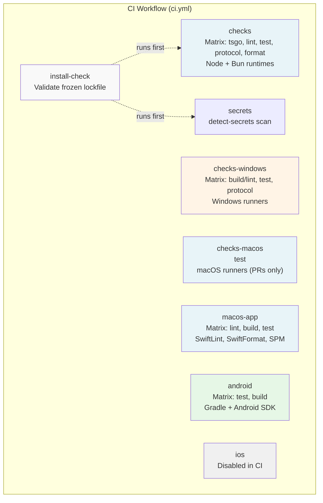
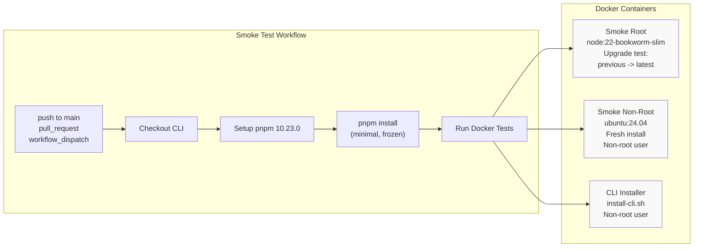

# Page: CI/CD Pipeline

# CI/CD パイプライン

<details>
<summary>関連ソースファイル</summary>

この Wiki ページの生成に使用されたコンテキストファイル:

- [.agents/skills/mintlify/SKILL.md](.agents/skills/mintlify/SKILL.md)
- [.github/ISSUE_TEMPLATE/bug_report.md](.github/ISSUE_TEMPLATE/bug_report.md)
- [.github/ISSUE_TEMPLATE/config.yml](.github/ISSUE_TEMPLATE/config.yml)
- [.github/ISSUE_TEMPLATE/feature_request.md](.github/ISSUE_TEMPLATE/feature_request.md)
- [.github/actions/detect-docs-changes/action.yml](.github/actions/detect-docs-changes/action.yml)
- [.github/actions/setup-node-env/action.yml](.github/actions/setup-node-env/action.yml)
- [.github/labeler.yml](.github/labeler.yml)
- [.github/workflows/auto-response.yml](.github/workflows/auto-response.yml)
- [.github/workflows/ci.yml](.github/workflows/ci.yml)
- [.github/workflows/labeler.yml](.github/workflows/labeler.yml)
- [.github/workflows/stale.yml](.github/workflows/stale.yml)
- [.gitignore](.gitignore)
- [AGENTS.md](AGENTS.md)
- [docs/automation/poll.md](docs/automation/poll.md)
- [docs/channels/index.md](docs/channels/index.md)
- [docs/ci.md](docs/ci.md)
- [docs/providers/synthetic.md](docs/providers/synthetic.md)
- [docs/zh-CN/channels/index.md](docs/zh-CN/channels/index.md)
- [docs/zh-CN/vps.md](docs/zh-CN/vps.md)
- [extensions/msteams/src/store-fs.ts](extensions/msteams/src/store-fs.ts)
- [scripts/sync-labels.ts](scripts/sync-labels.ts)
- [scripts/test-live-gateway-models-docker.sh](scripts/test-live-gateway-models-docker.sh)
- [scripts/test-live-models-docker.sh](scripts/test-live-models-docker.sh)
- [src/agents/live-auth-keys.test.ts](src/agents/live-auth-keys.test.ts)
- [src/agents/live-auth-keys.ts](src/agents/live-auth-keys.ts)
- [src/agents/pi-embedded-helpers.isbillingerrormessage.test.ts](src/agents/pi-embedded-helpers.isbillingerrormessage.test.ts)
- [src/agents/zai.live.test.ts](src/agents/zai.live.test.ts)
- [src/commands/message.ts](src/commands/message.ts)
- [src/gateway/live-image-probe.ts](src/gateway/live-image-probe.ts)
- [src/infra/outbound/abort.ts](src/infra/outbound/abort.ts)
- [src/infra/outbound/message.ts](src/infra/outbound/message.ts)
- [src/infra/outbound/outbound-send-service.ts](src/infra/outbound/outbound-send-service.ts)
- [src/media/png-encode.ts](src/media/png-encode.ts)
- [src/pairing/pairing-store.ts](src/pairing/pairing-store.ts)

</details>


このドキュメントは OpenClaw の継続的インテグレーションとデプロイパイプラインについて説明し、すべてのプッシュとプルリクエストで自動チェックを実行します。パイプラインは TypeScript コードを検証し、複数のプラットフォーム（Ubuntu、Windows、macOS、Android）でテストを実行し、配布アーティファクトが正しく動作することを確認するインストーラースモークテストを実行します。

リリースプロセス（バージョン更新、npm 公開、GitHub リリース）については、[リリースプロセス](#15.4) を参照してください。ビルドシステムの詳細（pnpm ワークスペース、TypeScript コンパイル）については、[ソースからのビルド](#15.3) を参照してください。

---

## ワークフロー概要

OpenClaw は CI/CD に GitHub Actions を使用し、ワークフローは `.github/workflows/` で定義されています。メインのワークフローはすべてのプッシュとプルリクエストで実行され、異なるプラットフォームとチェックタイプに対して並列ジョブを実行します。

### ワークフローファイル

| ファイル | トリガー | 目的 |
|------|---------|---------|
| `ci.yml` | push, pull_request | メイン CI パイプライン: リント、テスト、ビルド、プラットフォームチェック |
| `install-smoke.yml` | push to main, pull_request, manual dispatch | インストーラー検証（Docker ベース） |

**Sources:** [.github/workflows/ci.yml:1-642](), [.github/workflows/install-smoke.yml:1-42]()

---

## メイン CI ワークフロー構造

メインのワークフロー（`ci.yml`）は並列で実行される複数のジョブを定義します。ほとんどのジョブは Ubuntu ランナー（`blacksmith-4vcpu-ubuntu-2404`）を使用し、プラットフォーム固有のジョブは macOS または Windows ランナーを使用します。



**Sources:** [.github/workflows/ci.yml:7-642]()

---

## ジョブ詳細

### install-check

フリーズされたロックファイルからスクリプト実行エラーなしで依存関係をインストールできることを検証します。このジョブは pnpm-lock.yaml のドリフトを検出し、再現可能なビルドを確保します。

**主要なステップ:**
1. サブモジュールリトライロジックでリポジトリをチェックアウト（バックオフ付き 5 回試行）
2. 最新の更新を含む Node.js 22.x をセットアップ
3. corepack を有効にし、リトライロジックで pnpm 10.23.0 をアクティブ化（3 回試行）
4. `--frozen-lockfile --ignore-scripts=false` で依存関係をインストール

**Runner:** `blacksmith-4vcpu-ubuntu-2404`

**Sources:** [.github/workflows/ci.yml:8-67]()

---

### checks

Node.js と Bun ランタイムの両方でコード品質チェックとテストを実行するマトリックスジョブ。OpenClaw が両方の実行環境と互換性を保つことを確保します。

#### マトリックス設定

| ランタイム | タスク | コマンド |
|---------|------|---------|
| node | tsgo | `pnpm tsgo` |
| node | lint | `pnpm build && pnpm lint` |
| node | test | `pnpm canvas:a2ui:bundle && pnpm test` |
| node | protocol | `pnpm protocol:check` |
| node | format | `pnpm format` |
| bun | test | `pnpm canvas:a2ui:bundle && bunx vitest run` |

**リトライロジック:**
- サブモジュールチェックアウト: 10-50s バックオフで 5 回試行
- pnpm セットアップ: 10-30s バックオフで 3 回試行
- 依存関係インストール: 失敗時に 1 回自動リトライ

**テスト実行:**
- テストにはバンドルされた A2UI アセットが必要（`pnpm canvas:a2ui:bundle`）
- V8 カバレッジしきい値（行/分岐/関数/文 70%）を持つ Vitest
- Node と Bun の両方のテストスイートがパスする必要がある

**Runner:** `blacksmith-4vcpu-ubuntu-2404`

**Sources:** [.github/workflows/ci.yml:68-158](), [AGENTS.md:80-89]()

---

### secrets

`detect-secrets` 1.5.0 を使用してコードベースを誤ってコミットされたシークレットについてスキャンします。ベースラインファイルと比較して新しいリークを検出します。

**設定:**
- ベースライン: `.secrets.baseline`
- ツール: `detect-secrets==1.5.0`（Python パッケージ）
- ドキュメント: `docs/gateway/security.md#secret-scanning-detect-secrets`

**Runner:** `blacksmith-4vcpu-ubuntu-2404`

**Sources:** [.github/workflows/ci.yml:159-183]()

---

### checks-windows

Windows ランナーでビルド、リント、テスト、プロトコルチェックを実行し、プラットフォーム互換性を確保します。

#### マトリックス設定

| ランタイム | タスク | コマンド |
|---------|------|---------|
| node | build & lint | `pnpm build && pnpm lint` |
| node | test | `pnpm canvas:a2ui:bundle && pnpm test` |
| node | protocol | `pnpm protocol:check` |

**Windows 固有の設定:**
- `NODE_OPTIONS: --max-old-space-size=4096`（大きなワークスペース用にヒープを増加）
- `CLAWDBOT_TEST_WORKERS: 1`（並行性の問題を避けるためシングルワーカー）
- シェル: `bash`（Git Bash または WSL で実行）

**Runner:** `blacksmith-4vcpu-windows-2025`

**Sources:** [.github/workflows/ci.yml:184-271]()

---

### checks-macos

macOS ランナーでテストを実行しますが、プルリクエストのみ（main へのプッシュではない）。CI 分を過度に使用せずに macOS 固有の動作を検証します。

**設定:**
- トリガー: `if: github.event_name == 'pull_request'`
- `NODE_OPTIONS: --max-old-space-size=4096`
- コマンド: `pnpm test`

**Runner:** `macos-latest`

**Sources:** [.github/workflows/ci.yml:272-343]()

---

### macos-app

Swift Package Manager を使用して macOS ネイティブアプリをビルドしてテストします。プルリクエストでのみ実行されます。

#### マトリックス設定

| タスク | コマンド |
|------|---------|
| lint | `swiftlint --config .swiftlint.yml`<br/>`swiftformat --lint apps/macos/Sources --config .swiftformat` |
| build | `swift build --package-path apps/macos --configuration release`（リトライ付き） |
| test | `swift test --package-path apps/macos --parallel --enable-code-coverage`（リトライ付き） |

**ツールチェーンセットアップ:**
1. Xcode 26.1 を選択
2. Homebrew 経由で XcodeGen、SwiftLint、SwiftFormat をインストール
3. ツールチェーンバージョンを表示（`sw_vers`、`xcodebuild -version`、`swift --version`）

**リトライロジック:**
- Swift ビルド: 20-60s バックオフで 3 回試行
- Swift テスト: 20-60s バックオフで 3 回試行

**Runner:** `macos-latest`

**Sources:** [.github/workflows/ci.yml:344-412]()

---

### ios

iOS ビルドとテストジョブは現在無効化されています（`if: false`）で CI 分を節約。有効な場合:
1. XcodeGen で Xcode プロジェクトを生成
2. iOS シミュレーターでユニットテストを実行（iPhone 16 を優先、利用可能な最新にフォールバック）
3. `xccov` 経由でコードカバレッジをレポート
4. 43% 行カバレッジゲートを強制

**シミュレーター選択ロジック:**
- 既存の iPhone シミュレーターを優先（iPhone 16 を優先）
- 最新の iOS ランタイムで新しいシミュレーターを作成するためにフォールバック
- 利用可能なデバイスを照問するために Python スクリプトを使用

**Runner:** `macos-latest`（有効な場合）

**Sources:** [.github/workflows/ci.yml:413-585]()

---

### android

Gradle を使用して Android アプリをビルドしてテストします。

#### マトリックス設定

| タスク | コマンド |
|------|---------|
| test | `./gradlew --no-daemon :app:testDebugUnitTest` |
| build | `./gradlew --no-daemon :app:assembleDebug` |

**ツールチェーンセットアップ:**
1. Java 21 をセットアップ（Temurin ディストリビューション）
2. ライセンス承諾付きで Android SDK をセットアップ
3. Gradle 8.11.1 をセットアップ
4. SDK パッケージをインストール: `platform-tools`、`platforms;android-36`、`build-tools;36.0.0`

**作業ディレクトリ:** `apps/android`

**Runner:** `blacksmith-4vcpu-ubuntu-2404`

**Sources:** [.github/workflows/ci.yml:586-642]()

---

## インストーラースモークテスト

OpenClaw には、公開された npm パッケージまたは公式インストールスクリプトからユーザーが CLI をインストールして実行できることを確認する包括的なインストーラー検証が含まれています。



**Sources:** [.github/workflows/install-smoke.yml:1-42](), [scripts/test-install-sh-docker.sh:1-71]()

---

### スモークテストインフラ

OpenClaw はクリーンな環境でインストーラーを検証するために Docker ベースのスモークテストを使用します。これらのテストはイメージをビルドしテストランナーを実行するラッパースクリプト経由で実行されます。

#### テストスクリプト

| スクリプト | 目的 | コンテナベース |
|--------|---------|----------------|
| `scripts/test-install-sh-docker.sh` | ルート + 非ルートスモークテスト | `node:22-bookworm-slim`、`ubuntu:24.04` |
| `scripts/test-install-sh-e2e-docker.sh` | 実際のモデルプロバイダーで E2E | `node:22-bookworm-slim` |

#### スモークテストタイプ

**1. ルートインストーラースモークテスト**
- コンテナ: `openclaw-install-smoke:local`（`scripts/docker/install-sh-smoke/` からビルド）
- 最初に前のバージョンをインストール（アップグレードパスを強制）
- `curl -fsSL https://openclaw.ai/install.sh | bash` を実行
- インストールされたバージョンが最新の npm リリースと一致することを検証
- 健全性チェックとして `openclaw --help` を実行

**2. 非ルートインストーラースモークテスト**
- コンテナ: `openclaw-install-nonroot:local`（`scripts/docker/install-sh-nonroot/` からビルド）
- sudo 権限を持つ非ルート `app` ユーザーを使用
- git がインストールされることを確認（ベースイメージにプリインストールされていない）
- npm ユーザープレフィックスを `$HOME/.npm-global` に設定
- CLI が PATH にあり正しく動作することを検証

**3. CLI のみインストーラースモークテスト**
- 同じ非ルートコンテナを使用
- `curl -fsSL https://openclaw.ai/install-cli.sh | bash -s -- --set-npm-prefix --no-onboard` を実行
- ゲートウェイ/オンボーディングなしの最小インストールを検証

**環境変数:**

| 変数 | デフォルト | 目的 |
|----------|---------|------|
| `OPENCLAW_INSTALL_URL` | `https://openclaw.ai/install.sh` | インストーラースクリプト URL |
| `OPENCLAW_INSTALL_CLI_URL` | `https://openclaw.ai/install-cli.sh` | CLI のみインストーラー URL |
| `OPENCLAW_INSTALL_SMOKE_SKIP_NONROOT` | `0` | 非ルートテストをスキップ（PR ワークフローで `1` に設定） |
| `OPENCLAW_INSTALL_SMOKE_SKIP_CLI` | `0` | CLI インストーラーテストをスキップ |
| `OPENCLAW_INSTALL_SMOKE_SKIP_PREVIOUS` | `0` | 前のバージョンのプレインストールをスキップ |
| `OPENCLAW_INSTALL_SMOKE_PREVIOUS` | （自動検出） | 明示的な前のバージョン |
| `OPENCLAW_NO_ONBOARD` | （未設定） | オンボーディングウィザードをスキップ |

**Sources:** [scripts/test-install-sh-docker.sh:1-71](), [scripts/docker/install-sh-smoke/run.sh:1-74](), [scripts/docker/install-sh-nonroot/run.sh:1-52]()

---

### E2E インストーラーテスト

E2E テストは実際の AI モデルプロバイダーでインストールから実行までの完全なフローを検証します。これらのテストは標準の CI ワークフローの一部ではありませんが、手動またはリリース前検証で実行できます。

**テストフロー:**
1. 前のバージョンをインストール（オプション、`SKIP_PREVIOUS` で制御）
2. 公式インストーラーワンライナーを実行
3. インストールされたバージョンが期待値と一致することを検証
4. モデルプロバイダーでオンボード（OpenAI または Anthropic）
5. ゲートウェイを開始
6. 複数のツールでエージェントターンを実行
7. ツール実行とセッショントランスクリプトを検証

#### モデルプロバイダーサポート

E2E テストは 3 つのモードで実行できます:

| モード | 必要なキー | テスト対象プロバイダー |
|------|---------------|------------------|
| `both` | `OPENAI_API_KEY`、`ANTHROPIC_API_KEY`/`ANTHROPIC_API_TOKEN` | OpenAI + Anthropic |
| `openai` | `OPENAI_API_KEY` | OpenAI のみ |
| `anthropic` | `ANTHROPIC_API_KEY`/`ANTHROPIC_API_TOKEN` | Anthropic のみ |

**テストプロファイル:**
- 各プロバイダーは隔離されたプロファイルで実行（`e2e-openai`、`e2e-anthropic`）
- 個別のゲートウェイポート（18789、18799）
- 個別のワークスペース（`/tmp/openclaw-e2e-openai`、`/tmp/openclaw-e2e-anthropic`）

#### ツール検証テスト

各 E2E 実行はツール実行を検証するために 4 つのエージェントターンを実行します:

| ターン | プロンプト | 使用ツール | 検証 |
|------|--------|------------|------------|
| 1 | 正確な内容で proof.txt を読み込む | `read` | レスポンスがランダムな証明値と一致 |
| 2 | 証明値を copy.txt に書き込み、読み戻す | `write`、`read` | ファイル内容が一致、レスポンスが一致 |
| 3 | `cat /etc/hostname` を実行、hostname.txt に書き込む | `exec`、`write` | ファイルがコンテナのホスト名と一致 |
| 4 | 画像の色を分析、マーカーをファイルに書き込む | `image`、`write` | ファイルに "LEFT=RED RIGHT=GREEN" が含まれる |

すべてのターンの後、テストはセッショントランスクリプト（`.jsonl` ファイル）を検証し、期待されるすべてのツールが呼び出されたことを確認します。

**ヘルパー関数:**

- `run_agent_turn()`: `openclaw agent` CLI 経由でエージェントターンを実行
- `assert_agent_json_ok()`: レスポンスステータスを検証、エラー/レート制限をチェック
- `assert_session_used_tools()`: ツール使用を検証するためにセッション JSONL を走査
- `write_png_lr_rg()`: 左半分が赤、右半分が緑のテスト PNG を生成

**Sources:** [scripts/test-install-sh-e2e-docker.sh:1-30](), [scripts/docker/install-sh-e2e/run.sh:1-536]()

---

## プラットフォーム固有のビルド要件

### macOS の要件

**Xcode バージョン:** 26.1（`sudo xcode-select -s` 経由で選択）

**ツール:**
- XcodeGen（プロジェクト生成）
- SwiftLint（リント）
- SwiftFormat（フォーマット）

**ビルドコマンド:**
```bash
swift build --package-path apps/macos --configuration release
swift test --package-path apps/macos --parallel --enable-code-coverage
```

**カバレッジ:**
- `xcrun xccov view --report` 経由でレポート
- CI での強制ゲートなし（リリースプロセスではオプション）

**Sources:** [.github/workflows/ci.yml:396-412]()

---

### Windows の要件

**Node 設定:**
- `NODE_OPTIONS: --max-old-space-size=4096`（ヒープを増加）
- `CLAWDBOT_TEST_WORKERS: 1`（シングルワーカー）

**シェル:** Bash（Git Bash または WSL）

**ビルドプロセス:**
1. corepack 経由で pnpm をインストール
2. `pnpm build` でビルド（`dist/` を生成）
3. `pnpm lint` でリント（oxlint + oxfmt）
4. テスト前に A2UI アセットをバンドル
5. `pnpm test` でテストを実行

**Sources:** [.github/workflows/ci.yml:184-271]()

---

### Android の要件

**Java:** 21（Temurin ディストリビューション）

**Gradle:** 8.11.1

**Android SDK パッケージ:**
- `platform-tools`
- `platforms;android-36`
- `build-tools;36.0.0`

**ビルドコマンド:**
```bash
./gradlew --no-daemon :app:testDebugUnitTest  # ユニットテスト
./gradlew --no-daemon :app:assembleDebug      # デバッグ APK をビルド
```

**Sources:** [.github/workflows/ci.yml:586-642]()

---

## CI の信頼性機能

### リトライロジック

OpenClaw の CI には不安定な操作のためのリトライメカニズムが含まれています:

| 操作 | 試行回数 | バックオフ | 場所 |
|-----------|----------|---------|----------|
| サブモジュールチェックアウト | 5 | 10-50s | すべてのジョブ |
| pnpm セットアップ（corepack） | 3 | 10-30s | すべてのジョブ |
| 依存関係インストール | 2 | （自動） | すべてのジョブ |
| Swift ビルド | 3 | 20-60s | macos-app |
| Swift テスト | 3 | 20-60s | macos-app |
| apt-get update | 3 | 3s | Docker イメージ |

**リトライパターン:**
```bash
for attempt in 1 2 3; do
  if git -c protocol.version=2 submodule update --init --force --depth=1 --recursive; then
    exit 0
  fi
  echo "Submodule update failed (attempt $attempt/3). Retrying…"
  sleep $((attempt * 10))
done
exit 1
```

**Sources:** [.github/workflows/ci.yml:16-27](), [.github/workflows/ci.yml:35-47](), [.github/workflows/ci.yml:358-365]()

---

### 依存関係管理

**フリーズされたロックファイル:**
すべての CI ジョブは決定論的ビルドを確保するために `--frozen-lockfile` でインストールします。`pnpm-lock.yaml` への変更はコミットする必要があります。

**インストールフラグ:**
- `--frozen-lockfile`: ロックファイルが古い場合は失敗
- `--ignore-scripts=false`: ネイティブ依存関係に必要なインストールスクリプトを実行
- `--config.engine-strict=false`: Node バージョンの柔軟性を許可
- `--config.enable-pre-post-scripts=true`: ライフサイクルフックを実行

**自動リトライ:**
最初のインストール試行が失敗した場合、CI は同じコマンドで一度リトライします（一時的なネットワークエラーを処理）。

**Sources:** [.github/workflows/ci.yml:58-67](), [.github/workflows/ci.yml:146-155]()

---

## リリースプロセスとの統合

CI パイプラインはリリースの前提条件ですが、アーティファクトを自動的に公開しません。リリースワークフローは手動で、別途ドキュメント化されています。

### リリース前検証

`npm publish` を実行する前に、リリースプロセスには以下が必要です:

1. **フルゲートチェック:**
   ```bash
   pnpm build && pnpm check && pnpm test
   ```

2. **インストーラースモークテスト:**
   ```bash
   OPENCLAW_INSTALL_SMOKE_SKIP_NONROOT=1 pnpm test:install:smoke
   ```

3. **（オプション）フルインストーラースイート:**
   ```bash
   pnpm test:install:smoke              # 非ルート + CLI テストを含む
   pnpm test:install:e2e:openai         # OpenAI で E2E（キーが必要）
   pnpm test:install:e2e:anthropic      # Anthropic で E2E（キーが必要）
   pnpm test:install:e2e                # 両方のプロバイダー
   ```

これらのコマンドは CI で使用されるのと同じ Docker ベースのインフラをラップしますが、ローカルまたはリリース自動化で実行されます。

**Sources:** [docs/reference/RELEASING.md:42-56](), [AGENTS.md:85-89]()

---

## テストカバレッジゲート

### TypeScript カバレッジ（Vitest）

**しきい値:** 行、分岐、関数、文で 70%

**フレームワーク:** V8 カバレッジプロバイダー付き Vitest

**設定:** `vitest.config.ts`（提供されたファイルには表示されず）

**実行:**
```bash
pnpm test           # テストを実行
pnpm test:coverage  # カバレッジレポート付きで実行
```

**Sources:** [AGENTS.md:82-83]()

---

### iOS カバレッジ

**現在のゲート:** `Clawdis.app` ターゲットで 43% 行カバレッジ

**レポート:**
```bash
xcrun xccov view --report --only-targets "$RESULT_BUNDLE_PATH"
```

**ゲートロジック:**
iOS ジョブには以下を行う Python スクリプトが含まれます:
1. `xccov` からカバレッジ JSON を解析
2. `Clawdis.app` ターゲットの `lineCoverage` を抽出
3. カバレッジ < 43% の場合は失敗（1e-12 の許容値付き）

**注意:** iOS ビルドは現在 CI で無効化されています（`if: false`）でランナー分を節約。

**Sources:** [.github/workflows/ci.yml:551-584]()

---

## 手動ワークフロートリガー

### インストールスモークワークフロー

`install-smoke.yml` ワークフローは GitHub Actions UI（`workflow_dispatch`）から手動でトリガーできます。これは以下に役立ちます:
- マージ前にインストーラー変更をテスト
- リリース前ビルドを検証
- インストーラーの問題をデバッグ

**手動トリガー:**
1. GitHub の Actions タブに移動
2. "Install Smoke" ワークフローを選択
3. "Run workflow" をクリック
4. ブランチを選択

**Sources:** [.github/workflows/install-smoke.yml:7-8]()

---

## 環境設定

### CI 固有の環境変数

**インストーラーテスト:**
- `CLAWDBOT_INSTALL_URL`: インストーラースクリプト URL（`OPENCLAW_INSTALL_URL` のレガシーエイリアス）
- `CLAWDBOT_INSTALL_CLI_URL`: CLI インストーラー URL（`OPENCLAW_INSTALL_CLI_URL` のレガシーエイリアス）
- `CLAWDBOT_NO_ONBOARD`: オンボーディングウィザードをスキップ
- `OPENCLAW_INSTALL_SMOKE_SKIP_CLI`: CLI のみインストーラーテストをスキップ
- `OPENCLAW_INSTALL_SMOKE_SKIP_NONROOT`: 非ルートテストをスキップ（PR ワークフローで有効）
- `OPENCLAW_INSTALL_SMOKE_SKIP_PREVIOUS`: 前のバージョンのプレインストールをスキップ

**Windows テスト:**
- `NODE_OPTIONS: --max-old-space-size=4096`
- `CLAWDBOT_TEST_WORKERS: 1`

**macOS テスト:**
- `NODE_OPTIONS: --max-old-space-size=4096`

**npm 設定（Docker）:**
- `NPM_CONFIG_FUND=false`: 資金メッセージを無効化
- `NPM_CONFIG_AUDIT=false`: 監査警告を無効化

**Sources:** [.github/workflows/install-smoke.yml:34-41](), [.github/workflows/ci.yml:186-189](), [.github/workflows/ci.yml:340-342](), [scripts/docker/install-sh-nonroot/Dockerfile:23-24]()

---

## サマリーテーブル

| ジョブ | ランナー | プラットフォーム | 主要なチェック | トリガー |
|-----|--------|-----------|------------|---------|
| install-check | Ubuntu | Linux | フリーズされたロックファイルインストール | すべて |
| checks | Ubuntu | Linux | tsgo、lint、test、protocol、format（Node + Bun） | すべて |
| secrets | Ubuntu | Linux | detect-secrets スキャン | すべて |
| checks-windows | Windows | Windows | build、lint、test、protocol | すべて |
| checks-macos | macOS | macOS | test | PR のみ |
| macos-app | macOS | macOS | Swift lint、build、test | PR のみ |
| android | Ubuntu | Android | Gradle test、build | すべて |
| ios | macOS | iOS | （無効） | N/A |
| install-smoke | Ubuntu | Docker | インストーラー検証（root、non-root、CLI） | main、PR、manual |

**Sources:** [.github/workflows/ci.yml:7-642](), [.github/workflows/install-smoke.yml:10-42]()

---
