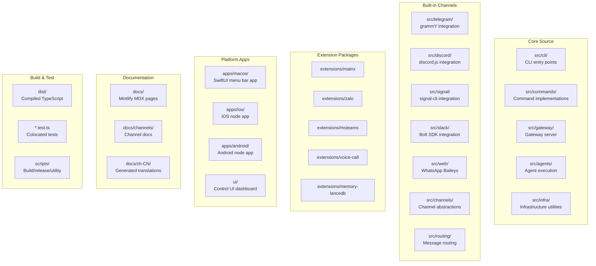
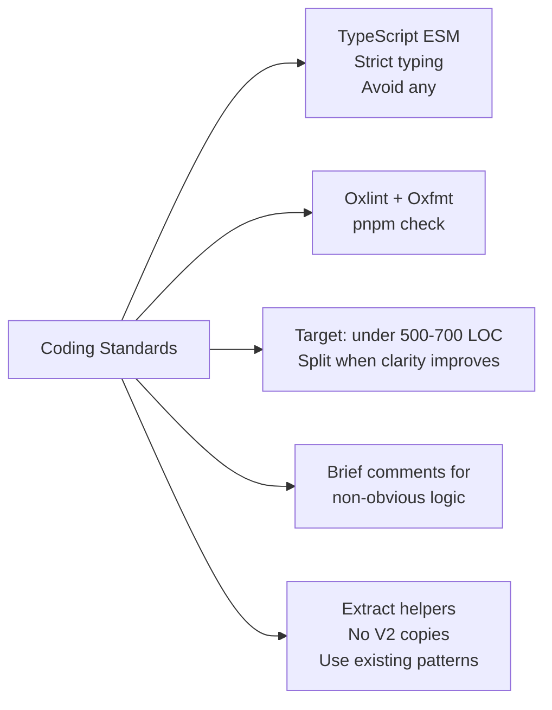
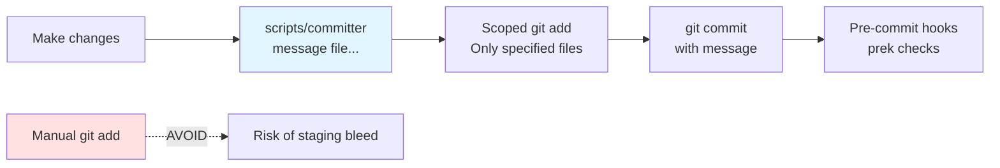
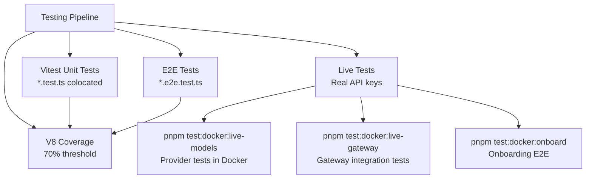
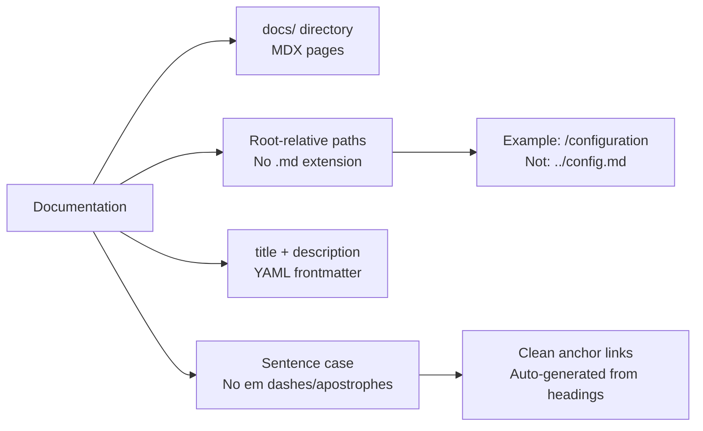
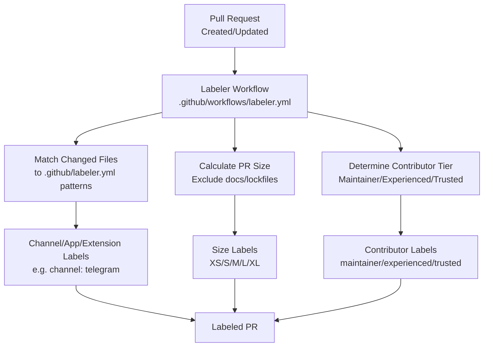
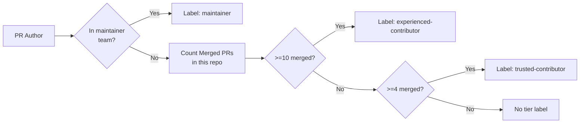
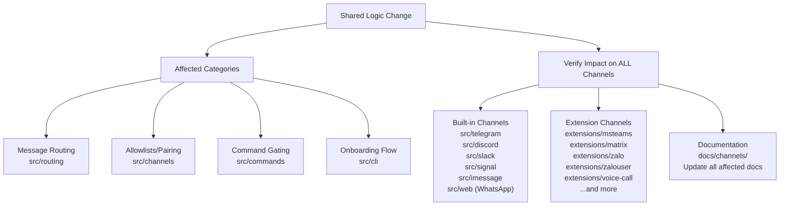
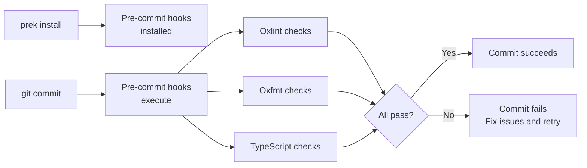

# Page: Contributing Guidelines

# コントリビューションガイドライン

<details>
<summary>関連ソースファイル</summary>

この Wiki ページの生成に使用されたコンテキストファイル:

- [.agents/skills/mintlify/SKILL.md](.agents/skills/mintlify/SKILL.md)
- [.github/ISSUE_TEMPLATE/bug_report.md](.github/ISSUE_TEMPLATE/bug_report.md)
- [.github/ISSUE_TEMPLATE/config.yml](.github/ISSUE_TEMPLATE/config.yml)
- [.github/ISSUE_TEMPLATE/feature_request.md](.github/ISSUE_TEMPLATE/feature_request.md)
- [.github/labeler.yml](.github/labeler.yml)
- [.github/workflows/auto-response.yml](.github/workflows/auto-response.yml)
- [.github/workflows/labeler.yml](.github/workflows/labeler.yml)
- [.github/workflows/stale.yml](.github/workflows/stale.yml)
- [AGENTS.md](AGENTS.md)
- [docs/channels/index.md](docs/channels/index.md)
- [docs/zh-CN/channels/index.md](docs/zh-CN/channels/index.md)
- [scripts/sync-labels.ts](scripts/sync-labels.ts)

</details>


このページは OpenClaw へのコントリビューションのためのコーディング標準、コミット規約、テスト要件、PR プロセスを文書化します。コードの作成、変更の提出、ドキュメント品質の維持のための実践的なガイドラインをカバーします。

システムアーキテクチャと設計パターンについては、[アーキテクチャ詳細](#15.1) を参照してください。CI/CD 自動化の詳細については、[CI/CD パイプライン](#15.5) を参照してください。リリースプロセスについては、[リリースプロセス](#15.4) を参照してください。

---

## リポジトリ構成

### プロジェクト構造

OpenClaw リポジトリは、コア機能、チャネル、拡張機能、プラットフォーム固有アプリケーションを明確に分離したモジュラー構成に従っています。



**Sources:** [AGENTS.md:6-19]()

### モジュール構成ルール

| 場所 | 目的 | 依存関係ポリシー |
|----------|---------|-------------------|
| `src/` | コア CLI とインフラストラクチャ | 外部プラグイン依存関係なし |
| `src/cli` | CLI エントリポイントとコマンド配線 | `src/commands` を使用 |
| `src/commands` | コマンド実装 | 任意の `src/` モジュールからインポート可能 |
| `src/gateway` | ゲートウェイサーバーと WebSocket RPC | コアランタイム、チャネル固有のインポートなし |
| `src/agents` | エージェント実行パイプライン | ツール、メモリ、セッションを調整 |
| `src/channels`, `src/routing` | チャネル抽象化とルーティング | すべてのチャネルで共有 |
| `src/telegram`, `src/discord`, etc | 組み込みチャネル実装 | チャネルインターフェースに従う必要がある |
| `extensions/*` | プラグインパッケージ | 開発には `workspace:*` を使用、ランタイム依存関係では避ける |
| `apps/` | プラットフォーム固有のネイティブアプリ | 独立したビルドシステム |
| `docs/` | Mintlify ドキュメントサイト | コードインポートなし |
| `scripts/` | ビルド、リリース、ユーティリティスクリプト | 任意のツールを使用可能 |

拡張機能はプラグインインストール中の `npm install --omit=dev` で生き残るために、ランタイム依存関係を `dependencies` で宣言する必要があります（`devDependencies` または `workspace:*` ではありません）。コア OpenClaw は重複を避けるために `peerDependencies` にあるべきです。

**Sources:** [AGENTS.md:6-12]()

---

## コーディング標準

### TypeScript スタイル



**コア原則:**

- **言語:** ESM インポート付きの TypeScript。厳格な型指定を優先、`any` 型を避ける。
- **フォーマット:** Oxlint と Oxfmt で自動化。コミット前に `pnpm check` を実行。
- **ファイルサイズ:** ファイルあたり 500-700 行以下を目指す。これはガイドラインであり厳密な制限ではないが、明確さやテスト容易性が向上する場合はファイルを分割する。
- **コメント:** トリッキーまたは自明でないロジックには簡潔なコメントを追加。自明なことを述べない。
- **パターン:** "V2" バージョンを作成する代わりにヘルパーを抽出。CLI オプションと依存性注入のために `createDefaultDeps` の既存パターンを使用。

**Sources:** [AGENTS.md:68-75]()

### 命名規則

| コンテキスト | 規約 | 例 |
|---------|-----------|----------|
| 製品/ブランド名（docs、UI） | **OpenClaw** | "OpenClaw is a multi-channel AI gateway" |
| CLI コマンド | `openclaw` | `openclaw gateway run` |
| パッケージ/バイナリ名 | `openclaw` | `npm install -g openclaw` |
| 設定キー | `openclaw` | `~/.openclaw/openclaw.json` |
| TypeScript モジュール | 関数/変数は camelCase、型は PascalCase | `createSession()`、`AgentConfig` |
| ファイル名 | 既存パターンに合わせる、kebab-case を優先 | `agent-execution.ts`、`memory-search.ts` |

**Sources:** [AGENTS.md:75]()

### ツールスキーマガードレール

AI モデルのツール入力スキーマを定義する場合:

- **`Type.Union` を避ける:** 一部のプロバイダーはツールスキーマで `anyOf`/`oneOf`/`allOf` を拒否する。
- **`stringEnum`/`optionalStringEnum` を使用:** 文字列リストには `Type.Unsafe` enum ラッパーを使用。
- **`Type.Optional` を使用:** オプションフィールドに `... | null` の代わりに使用。
- **トップレベルはオブジェクト:** ツールスキーマを `properties` を持つ `type: "object"` に保つ。
- **`format` をプロパティ名として避ける:** 一部のバリデーターは `format` を予約語として扱う。

**Sources:** [AGENTS.md:161-162]()

---

## コミットプロセス

### `scripts/committer` の使用

すべてのコミットは適切なスコーピングを確保し、関連のない変更間のステージングの混入を防ぐために `scripts/committer` ツールを使用して作成する必要があります。



**コマンド構文:**

```bash
scripts/committer "<message>" <file1> <file2> ...
```

**例:**

```bash
scripts/committer "Gateway: add health check endpoint" \
  src/gateway/health.ts \
  src/gateway/server.ts
```

ツールは指定されたファイルのみを自動的にステージングし、メッセージでコミットを作成し、pre-commit フックをトリガーします。

**Sources:** [AGENTS.md:99]()

### コミットメッセージ形式

Conventional Commits パターンに従った簡潔でアクション指向のコミットメッセージを使用します:

| スコープ | 用途 | 例 |
|-------|---------|---------|
| `CLI` | CLI コマンド変更 | `CLI: add verbose flag to send` |
| `Gateway` | ゲートウェイサーバー変更 | `Gateway: implement hot reload` |
| `Channels` | チャネル固有の変更 | `Channels: add Matrix pairing flow` |
| `Agents` | エージェント実行変更 | `Agents: fix session compaction retry` |
| `Docs` | ドキュメント更新 | `Docs: update memory configuration guide` |
| `Tests` | テスト追加/修正 | `Tests: add live gateway test` |
| `Refactor` | コード構造変更 | `Refactor: extract session lock helper` |

**関連する変更をグループ化する。** 関連のないリファクタリングを機能作業とバンドルしない。

**Sources:** [AGENTS.md:99-103]()

### マルチエージェントの安全性

複数のエージェントまたはコントリビューターが同時に作業している場合:

- **git stash エントリの作成/適用/削除をしない** 明示的に要求された場合を除く。
- **ブランチを切り替えない** 明示的に要求された場合を除く。
- **`.worktrees/` を変更しない** 明示的に要求された場合を除く。
- **コミットは自分の変更のみに集中する。** コミット時は、特定の変更にスコープする。
- **プッシュ前にプル:** `git pull --rebase` を実行して最新の変更を統合、他人の作業を破棄しない。
- **関連のない WIP をそのままにする:** 認識できないファイルを見た場合、自分の変更に集中し、それらのみをコミットする。

**Sources:** [AGENTS.md:147-152]()

---

## テスト要件

### テストフレームワークとカバレッジ



**カバレッジしきい値:**

- 行、分岐、関数、文で 70%
- V8 カバレッジプロバイダー付き Vitest で強制

**Sources:** [AGENTS.md:84-89]()

### テストの実行

| コマンド | 目的 |
|---------|---------|
| `pnpm test` | すべてのテストを実行 |
| `pnpm test:coverage` | カバレッジレポート付きでテストを実行 |
| `pnpm test:live` | 実際の API キーでライブテスト（`CLAWDBOT_LIVE_TEST=1` または `LIVE=1` が必要） |
| `pnpm test:docker:live-models` | Docker でモデルプロバイダーライブテスト |
| `pnpm test:docker:live-gateway` | Docker でゲートウェイ統合テスト |
| `pnpm test:docker:onboard` | Docker でオンボーディング E2E テスト |

**テストワーカー:** テストワーカーを 16 以上に設定しない。これはテスト済みで、より高い値は問題を引き起こす。

**Sources:** [AGENTS.md:66, 89]()

### テスト命名規則

- **ソース名に合わせる:** `agent-execution.ts` をテストする場合、テスト名は `agent-execution.test.ts`。
- **E2E テスト:** エンドツーエンドテストには `*.e2e.test.ts` サフィックスを使用。
- **コロケーション:** テストをテスト対象のコードの横に配置（別の `test/` ディレクトリには配置しない）。

**Sources:** [AGENTS.md:86]()

### チェンジログポリシー

- **ユーザー向けの変更のみ:** エンドユーザーまたはオペレーターに影響する変更を含める。
- **内部/メタノートを除外:** バージョン整合、appcast リマインダー、リリースプロセスノートは含めない。
- **テストのみの変更:** ユーザー向けの動作を変更する場合やユーザーが明示的に要求しない限り、純粋なテスト追加/修正は一般的にチェンジログエントリを **必要としない**。

**Sources:** [AGENTS.md:91-92]()

---

## ドキュメント標準

### Mintlify 規約

ドキュメントはレンダリングに Mintlify を使用します。以下の規約に従ってください:



**内部リンク:**

- `.md`/`.mdx` 拡張子なしのルート相対パスを使用: `[Config](/configuration)`
- ルート相対パスのセクションアンカー: `[Hooks](/configuration#hooks)`
- 内部ページに `../config.md` のような相対パスや絶対 URL を **使用しない**

**見出し:**

- 文ケースを使用: "Getting started"（"Getting Started" ではない）
- 見出しにエムダッシュとアポストロフィを避ける（Mintlify アンカーリンクを壊す）

**Sources:** [AGENTS.md:20-30](), [.agents/skills/mintlify/SKILL.md:106-152]()

### ドキュメントファイル構成

| 場所 | 内容 |
|----------|---------|
| `docs/` | 英語ドキュメント（Mintlify サイト） |
| `docs/channels/` | チャネル固有ドキュメント |
| `docs/gateway/` | ゲートウェイ設定と運用 |
| `docs/platforms/` | プラットフォーム固有ガイド（macOS、iOS、Android） |
| `docs/zh-CN/` | 生成された中国語翻訳（直接編集しない） |
| `docs/.i18n/` | 翻訳パイプライン設定 |
| `README.md` | GitHub ランディングページ（絶対 URL を使用） |

**Sources:** [AGENTS.md:10, 32-37]()

### i18n パイプライン

`docs/zh-CN/` の中国語翻訳は自動生成されます。明示的に要求された場合を除き編集しない。

**翻訳ワークフロー:**

1. 英語ドキュメントを更新
2. 用語集を調整: `docs/.i18n/glossary.zh-CN.json`
3. `scripts/docs-i18n` を実行
4. 指示された場合のみターゲット修正を適用

翻訳メモリは `docs/.i18n/zh-CN.tm.jsonl` に保存されています。

**Sources:** [AGENTS.md:32-38]()

---

## プルリクエストワークフロー

### 提出前チェックリスト

PR を提出する前に確認してください:

- [ ] pre-commit フックをインストール: `prek install`
- [ ] フォーマットとリントがパス: `pnpm check`
- [ ] テストがパス: `pnpm test`
- [ ] カバレッジが 70% しきい値を満たす（該当する場合）
- [ ] ユーザー向け変更のドキュメントを更新
- [ ] コミットがスコープ規約に従う（`scripts/committer` で作成）
- [ ] 同じコミットに関連のない変更をバンドルしない
- [ ] チャネル/拡張作業の場合、すべてのチャネルを考慮（以下を参照）

**読むべき主要ドキュメント:**

- [docs/help/submitting-a-pr.md]() PR 提出ガイドライン
- [docs/help/submitting-an-issue.md]() issue 提出ガイドライン
- `.agents/skills/PR_WORKFLOW.md` 完全なメンテナーワークフロー（オプション、指定された場合に使用）

**Sources:** [AGENTS.md:96-103]()

### 自動ラベリングシステム



**ラベルカテゴリ:**

| ラベルプレフィックス | 目的 | 自動適用 |
|--------------|---------|--------------|
| `channel:` | チャネル固有の変更（telegram、discord、whatsapp など） | はい、`.github/labeler.yml` パターンから |
| `app:` | プラットフォームアプリ変更（macos、ios、android、web-ui） | はい |
| `extensions:` | 拡張パッケージ変更（copilot-proxy、memory-lancedb など） | はい |
| `size:` | PR サイズ（XS < 50、S < 200、M < 500、L < 1000、XL ≥ 1000 変更行） | はい |
| `maintainer` | 著者がメンテナチームにいる | はい |
| `trusted-contributor` | 著者が 4+ のマージされた PR を持つ | はい |
| `experienced-contributor` | 著者が 10+ のマージされた PR を持つ | はい |

**サイズ計算の除外:**

- `docs.acp.md`
- `docs/**`（ドキュメントファイル）
- ロックファイル: `pnpm-lock.yaml`、`package-lock.json`、`yarn.lock`、`bun.lockb`

**Sources:** [.github/workflows/labeler.yml:38-126](), [.github/labeler.yml:1-255]()

### コントリビューター層

ラベリングシステムはコントリビューターを自動的に分類します:



**層のしきい値:**

- **Maintainer:** `openclaw/maintainer` チームのメンバー
- **Experienced:** リポジトリで 10+ のマージされた PR
- **Trusted:** リポジトリで 4+ のマージされた PR

**Sources:** [.github/workflows/labeler.yml:127-196]()

---

## チャネルと拡張のリファクタリング

### クロスチャネルの考慮事項

チャネルに影響する共有ロジックをリファクタリングする場合、**常にすべての組み込みチャネルと拡張チャネルを考慮する**:



**クロスチャネル検証が必要な重要な領域:**

- **ルーティングロジック:** `src/routing` のメッセージルーティング変更
- **許可リストとペアリング:** `src/channels` のセキュリティポリシー変更
- **コマンドゲーティング:** `src/commands` の認可変更
- **オンボーディングフロー:** `src/cli/onboard` のセットアップウィザード変更
- **ドキュメント:** チャネル概要と個別チャネルドキュメント

**チャネルの場所:**

- **コアチャネル:** `src/telegram`、`src/discord`、`src/slack`、`src/signal`、`src/imessage`、`src/web`
- **コア抽象化:** `src/channels`、`src/routing`
- **コアドキュメント:** `docs/channels/`
- **拡張チャネル:** `extensions/msteams`、`extensions/matrix`、`extensions/zalo`、`extensions/zalouser`、`extensions/voice-call` など

**Sources:** [AGENTS.md:14-17]()

### GitHub ラベルの更新

新しいチャネルまたは拡張を追加する場合、ラベル設定と GitHub 自体の両方を更新します:

1. 自動ラベリングのために `.github/labeler.yml` にパターンを追加
2. 不足している GitHub ラベルを作成するために `scripts/sync-labels.ts` を実行
3. `COLOR_BY_PREFIX` マップから既存のカラースキームを使用:
   - `channel:` → `1d76db`（青）
   - `app:` → `6f42c1`（紫）
   - `extensions:` → `0e8a16`（緑）

**Sources:** [AGENTS.md:18](), [scripts/sync-labels.ts:10-18]()

---

## 自動化システム

### pre-commit フック

`prek` 経由の pre-commit フックは CI と同じチェックを実行し、プッシュ前に問題を検出します。



**インストールコマンド:**

```bash
prek install
```

これにより、CI が実行される前にフォーマットとリントエラーがローカルで検出されます。

**Sources:** [AGENTS.md:55]()

### 自動応答ルール

特定のラベルは自動応答とアクションをトリガーします:

| ラベル | アクション | メッセージ |
|-------|--------|---------|
| `r: skill` | issue をクローズ | "New skills should be published to [Clawhub](https://clawhub.ai)" |
| `r: support` | issue をクローズ | "Please use [our support server](https://discord.gg/clawd)" |
| `r: testflight` | issue をクローズ | "Not available, build from source." |
| `r: third-party-extension` | issue をクローズ | "Better made as third-party extension with our SDK" |
| `r: moltbook` | クローズ + ロック | "OpenClaw is not affiliated with Moltbook" |

ルールを実行するには `trigger-response` ラベルが存在する必要があります（処理後に自動的に削除されます）。

**Sources:** [.github/workflows/auto-response.yml:29-61]()

### 古い Issue と PR の管理

stale ワークフローは自動的に非アクティブなアイテムをマークしてクローズします:

| アイテム | 古いとみなすまで | クローズまで | 除外ラベル |
|------|------------|-------------|---------------|
| Issues | 7 日 | さらに 5 日（合計 12 日） | `enhancement`、`maintainer`、`pinned`、`security`、`no-stale` |
| PRs | 5 日 | さらに 3 日（合計 8 日） | `maintainer`、`no-stale` |

**stale 管理機能:**

- 毎日 03:17 UTC に実行
- 1 回の実行で最大 500 操作を処理
- 割り当てられたすべての issue と PR を除外
- 更新時に stale ラベルを削除
- 理由: `not_planned` で issue をクローズ

**PR の脱出ハッチ:** 自動クローズされた高品質な PR は、Discord の `#pr-thunderdome-dangerzone` に投稿することで復活できます。

**Sources:** [.github/workflows/stale.yml:22-51]()

---

## 開発コマンドリファレンス

### ビルドとテストコマンド

| コマンド | 目的 |
|---------|---------|
| `pnpm install` | 依存関係をインストール |
| `prek install` | pre-commit フックをインストール |
| `pnpm build` | 型チェックと TypeScript コンパイル |
| `pnpm tsgo` | TypeScript 型チェックのみ |
| `pnpm check` | Oxlint と Oxfmt チェックを実行 |
| `pnpm format` | フォーマットチェック（Oxfmt --check） |
| `pnpm format:fix` | フォーマットを修正（Oxfmt --write） |
| `pnpm test` | すべてのテストを実行 |
| `pnpm test:coverage` | カバレッジレポート付きでテストを実行 |
| `pnpm openclaw ...` | 開発モードで CLI を実行（Bun 経由） |
| `pnpm dev` | `pnpm openclaw` の代替 |

### プラットフォーム固有のコマンド

| コマンド | 目的 |
|---------|---------|
| `scripts/package-mac-app.sh` | macOS アプリバンドルをビルド（現在のアーキテクチャ） |
| `scripts/clawlog.sh` | OpenClaw サブシステムの macOS 統合ログをクエリ |
| `scripts/restart-mac.sh` | macOS ゲートウェイを再起動 |

### ドキュメントコマンド

| コマンド | 目的 |
|---------|---------|
| `mint dev` | localhost:3000 でローカルプレビュー |
| `mint broken-links` | 内部リンクをチェック |
| `mint validate` | ドキュメントビルドを検証 |
| `scripts/docs-i18n` | 中国語翻訳を生成 |

**Sources:** [AGENTS.md:51-66](), [AGENTS.md:135]()

---

## 開発環境

### ランタイム要件

- **Node.js:** バージョン 22+（ベースラインランタイム）
- **Bun:** TypeScript 実行でサポート（スクリプト、開発、テスト）
- **パッケージマネージャー:** pnpm（`pnpm-lock.yaml` を同期に保つ）

**実行の優先順位:**

- TypeScript 実行には Bun を優先: `bun <file.ts>` または `bunx <tool>`
- ビルド出力（`dist/*`）と本番インストールでは Node が引き続きサポート
- pnpm と Bun インストールの両方をサポート; 依存関係を触る際はロックファイルを同期に保つ

**Sources:** [AGENTS.md:53-59]()

### マルチエージェントワークフロー

複数のエージェントまたはコントリビューターが作業している場合:

- **複数のエージェントを実行しても OK** 各エージェントが独自のセッションを持つ限り
- **レポートは自分の編集のみに集中** ; ブロックされていない限りガードレールの免責事項を避ける
- **複数のエージェントが同じファイルを触った場合** 、安全なら継続; 関連する場合は簡潔に "other files present" と記録
- **リント/フォーマットの変動:** 確認なしでフォーマットのみの差分を自動解決; 同じコミットまたは小さなフォローアップに含める

**Sources:** [AGENTS.md:151-158]()

---

## よくあるパターンと落とし穴

### Lobster Seam（ターミナルパレット）

すべてのターミナル UI 出力に `src/terminal/palette.ts` の共有 CLI パレットを使用。ハードコードされた色は使用しない。

オンボーディングプロンプト、設定プロンプト、その他の TTY UI にパレットを適用する。

**Sources:** [AGENTS.md:157]()

### CLI 進行状況レポート

`src/cli/progress.ts`（`osc-progress` と `@clack/prompts` スピナー上に構築）を使用。手作りのカスタムスピナーやプログレスバーを作成しない。

**Sources:** [AGENTS.md:132]()

### ステータス出力規約

- `src/terminal/table.ts` 経由でテーブルと ANSI セーフなラッピングを維持
- `status --all`: 読み取り専用、貼り付け可能な出力
- `status --deep`: プローブと詳細情報を含む

**Sources:** [AGENTS.md:133]()

### 依存関係パッチング

依存関係のパッチング（pnpm パッチ、オーバーライド、またはベンダー変更経由）には **明示的な承認が必要** 。デフォルトでこれを行わない。

`pnpm.patchedDependencies` を持つ依存関係は正確なバージョンを使用する必要がある（`^` または `~` なし）。

**Sources:** [AGENTS.md:130-131]()

### バージョンの場所

バージョンを更新する場合、これらすべての場所を更新する:

| ファイル | フィールド |
|------|--------|
| `package.json` | `version`（CLI バージョン） |
| `apps/android/app/build.gradle.kts` | `versionName`、`versionCode` |
| `apps/ios/Sources/Info.plist` | `CFBundleShortVersionString`、`CFBundleVersion` |
| `apps/ios/Tests/Info.plist` | `CFBundleShortVersionString`、`CFBundleVersion` |
| `apps/macos/Sources/OpenClaw/Resources/Info.plist` | `CFBundleShortVersionString`、`CFBundleVersion` |
| `docs/install/updating.md` | ピン留めされた npm バージョン例 |
| `docs/platforms/mac/release.md` | `APP_VERSION`、`APP_BUILD` 例 |

新しい macOS Sparkle リリースをカットする場合を除き、`appcast.xml` を **触らない**。

**Sources:** [AGENTS.md:139-140]()

---

## サマリーチェックリスト

コントリビューションを提出する前に:

- [ ] コードが TypeScript スタイルガイドラインに従う（厳格な型指定、`any` なし）
- [ ] フォーマットがパス: `pnpm check`
- [ ] テストがパス: `pnpm test`
- [ ] カバレッジが 70% しきい値を満たす（該当する場合）
- [ ] コミットが `scripts/committer "<msg>" <files...>` で作成されている
- [ ] コミットメッセージがスコープ規約に従う（例: "CLI: add feature"）
- [ ] ユーザー向け変更のドキュメントを更新
- [ ] 内部リンクが拡張子なしのルート相対パスを使用
- [ ] チャネル/拡張作業の場合、すべてのチャネルへの影響を検証
- [ ] 新しいチャネル/拡張/アプリを追加する場合、`.github/labeler.yml` を更新
- [ ] 関連のない変更を一緒にバンドルしない
- [ ] 提出前に [docs/help/submitting-a-pr.md]() を読む

**Sources:** [AGENTS.md:84-103](), [.github/labeler.yml:1-255]()

---
